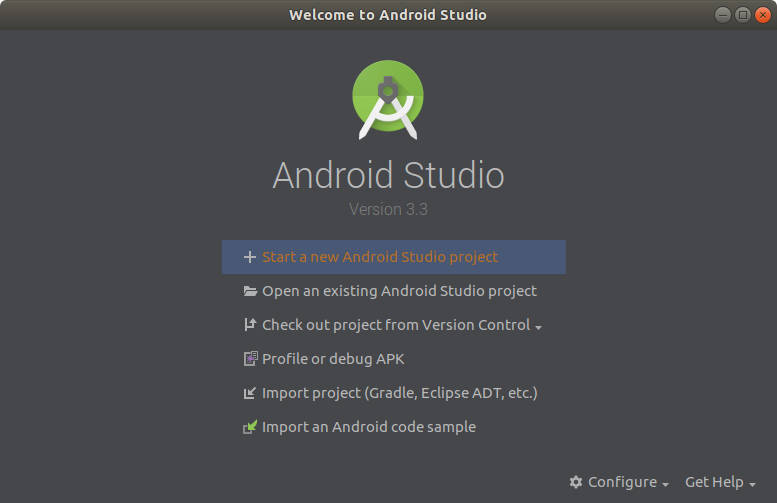
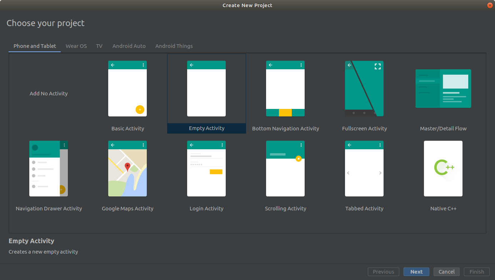
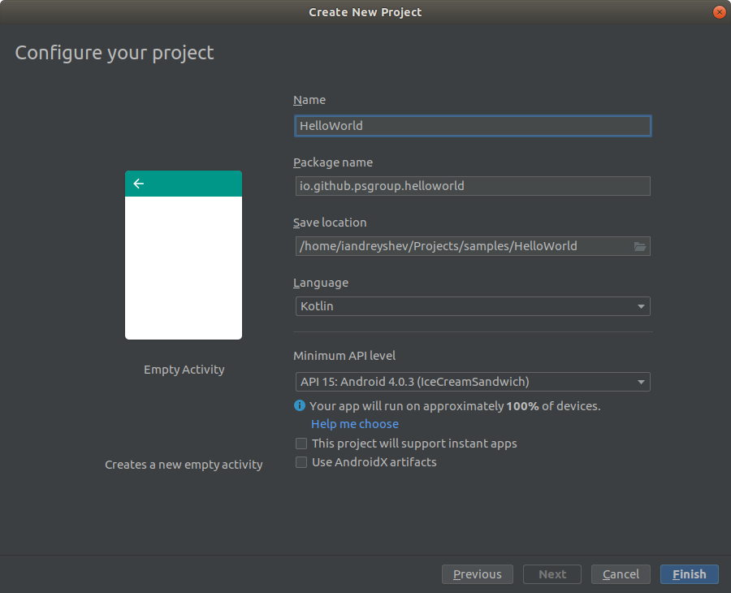
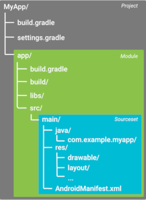
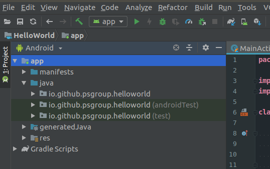

## Устанавливаем IDE

Разработку под ОС Android можно вести в:

* Консоли
* Среде разработки Eclipse
* IntellIj IDEA
* Android Studio

Android Studio является официальным IDE от Google. Хоть внутри себя она и содержит движок IntellIj, но дополнительно предоставляет все необходимые инструменты для разработки (интеграция с системой сборки, профайлер, менеджер виртуальных устройств, визуальный редактор верстки и т.д.). Будем рассматривать примеры именно в ней.

Скачать Android Studio можно с
[официального сайта](https://developer.android.com/studio/).

## Создание проекта
После запуска Android Studio, выбираем "Start a new Android Studio project"

### Выбор типа устройства
Следующим шагом будет выбор типа устройства, под которое будет вестись разработка. Для каждого устройства можно выбрать один из готовых шаблонов проектов. Шаблон подразумевает создание классов экранов, файлов разметки, подключение необходимых библиотек (для нестандартных элементов разметки), указание классов экранов в файле манифеста и т.д.

Например, для разработки на телефоны и планшеты (Phone amd Tablet) вы можете выбрать шаблон **Add No Activity**, в котором не будет ни одного экрана, или шаблон **Bottom Navigation Activity** с нижним навигационным меню и страницами для каждого пункта и т.д.

Любой из шаблонов несложно воспроизводится вручную и его выбор не ограничивает вас в дальнейшей разработке проекта.

Выберем шаблон **Empty Activity**, с ним в приложении сразу будет один пустой экран с соответствующим классом и xml файлом разметки.

### Конфигурация проекта
На следующем шаге Android Studio предложит настроить выбранный проект. Любые настройки, которые будут выбраны, могут быть изменены в будущем.

**Язык проекта**  
В этом пункет можно выбрать **Kotlin** или **Java**. При выборе Kotlin в скрипты сборки будут подключены дополнительные плагины и зависимости для компиляции кода на этом языке.

**Минимальная версия Android API**  
Каждая версия операционной системы Android, под которой будет запускаться приложение, имеет свою версию Android Framework с которым взаимодействует разработчик. Так как каждая версия ОС имеет свою версию API, выбирая минимальную версию API мы определяем, начиная с какой версии ОС будет устанавливаться и запускаться приложение.

На начало 2019 года, чтобы проект работал на 100% устройств по статистике Google, минимальной версией API должна быть 15-ая.

**Использование Instant Apps**  
Instant App - это приложение, которое способно запускаться не устанавливаясь на устройство. Эта функция может быть использована, например, для совершения, какой-то отдельной деятельности большого приложения, чтобы не заставлять пользователя устанавливать его полностью.
Например, имея приложение интернет-магазина, можно выделить оформление заказа в Instant App и тогда пользователю не придется скачивать приложение, чтобы купить товар.

В приложении HelloWorld нам не потребуется эта функциональность.

**Использование новой библиотки обратной совместимости - AndroidX**  
Для поддержки новых функций Android API в старых версиях, Google выпустили библиотеку Android Support Library, новая мажорная версия которой называется AndroidX. AndroidX включает в себя не только инструменты обратной совместимости, но и рекомендуемые Google библиотеки.

Подключение AndroidX для HelloWorld не критично.

Нажав **Finish** в выбранной директории будет создан проект

## Структура проекта
После создания проекта Android Studio автоматически сгенерирует директорию с такой структурой.

Смотреть структуру проекта через IDE можно открыв окно **Project** (Alt + 1 / View > Tool Windows > Project).

В выпадающем меню над окном можно выбрать режим просмотра проекта. Режим **Android**, например, удобно отделяет скрипты сборки от исходного кода, при этом исходный код тоже разделяется, на код приложения и тестов. Выбрав режим **Project Files** можно увидеть как файлы размещены в директории проекта на самом деле.

Для удобства мы будем пользоваться режимом **Android**.

## Задание  1.1
Установить Android Studio, создать проект по любому шаблону **кроме Native C++**, собрать в релизной конфигурации и найти получившийся .apk файл

[**Запускаем проект на эмуляторе реальном устройстве**](../android/run_project)
