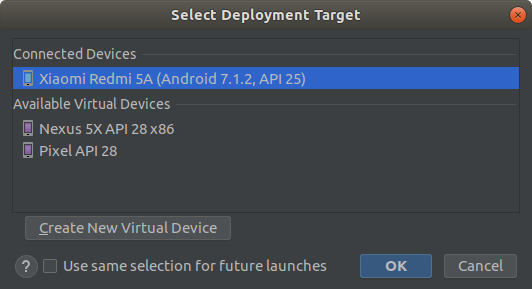
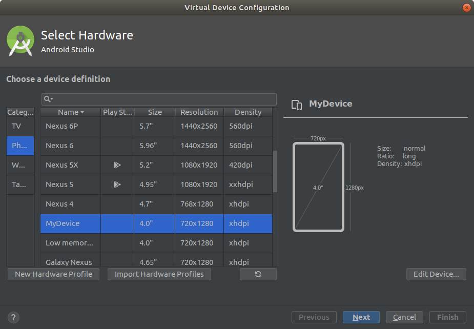
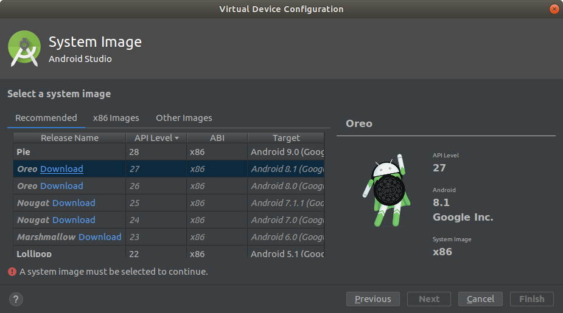
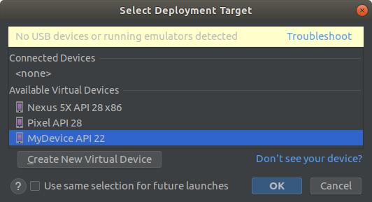
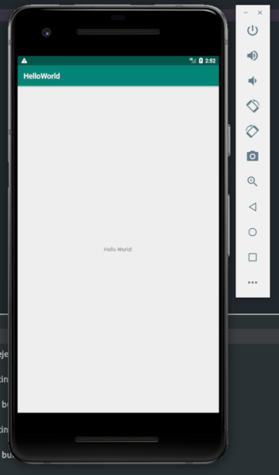

Получить .apk файл возможно не имея эмулятора или реального устройства. Однако, как правило, разработчику часто приходится запускать сборку на реальном устройстве или эмуляторе, чтобы проверить её работоспособность.

Android Studio имеет инструменты, позволяющие выбирать, куда установить приложение сразу после сборки.

## Запуск на реальном устройстве
Чтобы собрать и запустить приложение на устройстве необходимо нажать Run (Shift+F10 / Run->Run 'app'). Студия предложит выбрать устройство, на которое она установит приложение после сборки.

Так как в данный момент нет включенных эмуляторов или реальных устройств, в графе Connected Devices ничего нет.

Давайте подключим реальное устройство к машине через USB и посмотрим, что произойдет.

Если после подключения устройства оно не появилось в списке **Connected devices**, это может означать, что на нем не разрешена отладка по USB. Чтобы её включить, необходимо разблокировать режим разработчика и разрешить отладку на устройстве, как это сделать смотрите [здесь](https://developer.android.com/studio/debug/dev-options).

После разрешения отладки на устройстве, можно выбрать подключенное устройство и собрать на него приложение.

### Задание 2.1
Включить режим разработчика на реальном устройстве, собрать и запустить на нем HelloWorld

## Запуск на эмуляторе
В большинстве случаев отлаживать и проверять приложения можно на виртуальном устройстве. Однако, эмулятор требует свободное место на жестком диске и достаточно мощный процессор, чтобы работать без зависаний.

Эмулятор позволяет воспроизвести сложные кейсы при отладке, например, если нужно воссоздать **ограниченное количество памяти**, или **слабый сигнал сети**, или **редкие размеры экрана** и т.д.

С другой стороны, некоторые вендоры устройств на Android, изменяют операционную систему под свои нужды, например Samsung. Такие изменения могут повлиять на работу вашего приложения. Чтобы отлаживать его, придется иметь реальное устройство с измененной версией ОСи.

### Создание виртуального устройства
Из коробки может быть доступно несколько виртуальных устройств. Например на скриншоте видно, что уже можно выбрать **Nexus 5X** или **Pixel**. Мы создадим свое виртуальное устройство. Для этого нужно нажать **Create New Virtual Device** или **Tools-> AVD Manager -> Create New Virtual Device**.

В открывшемся окне можно выбрать готовые характеристики железа, которыми будет обладать эмулятор, импортировать их или создать свои нажав **New Hardware Profile**. После создания своего профиля, он появится в списке.

Следующим шагом станет выбор версии операционной системы, которая будет симулироваться. Некоторые версии может потребоваться скачать перед выбором.

Возможно выбранные вами характеристики железа не позволят установить ОС, например, если оперативной памяти будет меньше 128 MB. В таком случае Android Studio не позволит перейти к следующему шагу.

На заключительном шаге можно ввести название эмулятора, выбрать ориентацию, выбрать способ рендеринга графики (программно или на графической картой компютера) и показывать или не показывать скин устройства.

Теперь, запуская приложение на устройстве или эмуляторе, можно выбрать созданный нами эмулятор

Мы создали эмулятор с RAM 512 MB на Android 5.0 (Lollipop) и скином Pixel 2

## Полезные материалы

[Документация по Android эмуляторам](https://developer.android.com/studio/run/emulator)