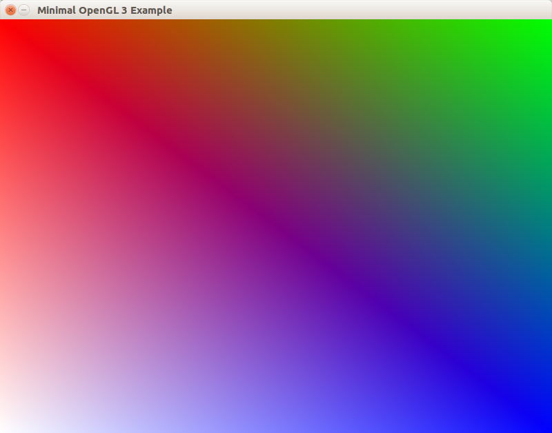

## Что такое OpenGL

OpenGL — это стандарт API для рисования трёхмерной графики. В нашем курсе будем использовать OpenGL 3.x — примерно то же самое, что GLES 2.x или WebGL 1. Между тем, классы для рисования в SFML используют очень старый OpenGL 1.x, поэтому в нашем курсе от них придётся отказаться.

Посмотрите на общую историю версий графических API, чтобы понять, где мы находимся:

За годы, прошедшие между OpenGL 1.x и OpenGL 3.x, представления программистов о 3D-графике изменились кардинально. Было обнаружено, что программный интерфейс, разработанный для OpenGL 1.0, имеет недостаточную гибкость и потворствует потерям производительности при рисовании графики. Начиная с OpenGL 3.0, была представлена полностью новая модель программирования с использованием OpenGL, а старый способ был объявлен устаревшим.

>В последующие годы появились очередные новшества, такие как OpenGL 4.x и Vulkan. Они нацелены на сверхбыстрый параллелизм при вычислениях и на нестандартные применения видеокарт (например, для выполнения расчётов общего назначения с помощью Computing Shaders). Если же вы хотите изучить именно графику, не стоит оглядываться на OpenGL 4 и Vulkan: их использование уже требует прекрасного понимания 3D-графики, а также умения качественно писать многопоточный и асинхронный код, глубих знаний в системном программировании.

## Как работает OpenGL

В основном OpenGL оперирует треугольниками, изображениями и состояниями драйвера рисования. Если упростить схему работы, останется пять ключевых шагов рисования каждого объекта на экране. Рассмотрим все эти шаги.

### Шаг №1 - загрузка вершин примитивов

Программист передаёт из управляющей программы массивы данных, описывающих вершины графических примитивов, то есть треугольников, линий или точек (чаще всего треугольников). Каждая фигура и каждая поверхность будет нарисована с помощью примитивов. На рисунке показано, как разбить сектор эллипса на треугольники:

### Шаг №2 - обработка вершин примитивов вершинным шейдером

На втором шаге выполняется *вершинный шейдер* (*англ.* vertex shader): он получает на вход все данные одной из вершин, а на выход обязан предоставить четырёхкомпонентный вектор с координатами вершины и набор любых других данных для фрагментного шейдера:

Программист заранее указывает свой вершинный шейдер. Его пишут на специальном языке GLSL, затем он компилируется видеодрайвером и выполняется прямо на видеокарте.

### Шаг №3 - интерполяция атрибутов вершин и фрагментация примитивов

Представьте, что вы рисуете треугольник на клетчатой бумаге. Какие-то клетки будут зарисованы полностью, другие — только частично, а оставшиеся не будут зарисованы вообще. Точно так же видеокарта должна определить, в какие пиксели попадает треугольник. Эти пиксели называются фрагментами.

Представьте, что вы захотели сделать треугольник разноцветным, с плавным переходом от жёлтого цвета по левому краю в красный цвет на правом. В OpenGL это выполняется автоматически:
 
 - вы указываете разные цвета для каждой из вершин треугольника
 - на шаге №3 видеокарта выполняет в каждом фрагменте линейную интерполяцию, вычисляя взвешенное значение цвета или любого другого атрибута

Линейная интерполяция — это интерполяция с линейным (равномерным) изменением свойства от вершины A к вершине B. Возьмём условный параметр `t ∈ [0..1]`, описанный следующим образом:
 
 - для фрагмента, содержащего вершину A, `t = 0`
 - для фрагмента, содержащего вершину B, `t = 1`
 - для фрагмента, лежащего между A и B ровно посередине, `t = 0.5`
 - и так далее для всех фрагментов между A и B

 Линейно интерполированное свойство фрагмента будет вычисляться по формуле: `p(t) = pA ∙ (1 - t) + pB ∙ t`. Легко заметить, что эта формула работает для самих вершин A и B:
 
 - для вершины A: `p(0) = pA ∙ (1 - 0) + pB ∙ 0 = pA`
 - для вершины B: `p(1) = pA ∙ (1 - 1) + pB ∙ 1 = pB`

 Конечный результат линейной интерполяции RGBA-цвета от вершин по всему треугольнику показан на рисунке:

 

### Шаг №4 - обработка фрагментов фрагментным шейдером

На данном шаге снова вызывается пользовательский код в составе *фрагментного шейдера* (*англ.* fragment shader). Его также пишут на языке GLSL. Фрагментный шейдер получает на вход всё, что вершинный шейдер ему передал, но в преобразованном виде. Допустим, вершинный шейдер сохранил для фрагментного цвет вершины — но фрагментный шейдер оперирует фрагментами, и поэтому переданные данные также проходят линейную интерполяцию.

### Шаг №5 - проверки, смешивание цвета и запись в буфер кадра

На последнем шаге фрагмент проходит ряд тестов — в каждом из них видеокарта проверяет, должен ли фрагмент попасть в кадр. Например, в 3D пространстве фрагмент может быть закрыт другим геометрическим телом, и это выявляется в *тесте глубины* (*англ.* depth test).

Если проверка пройдена (что в 2D графике случается почти всегда), то фрагмент записывается в пиксель кадра. Перед эти выполняется смешивание, позволяющее наложить полупрозрачный пиксель на существующий фон кадра.

### Конвейер в целом

Все шаги конвейера изображены на единой схеме, взятой из статьи [An intro to modern OpenGL. Chapter 1: The Graphics Pipeline](http://duriansoftware.com/joe/An-intro-to-modern-OpenGL.-Chapter-1:-The-Graphics-Pipeline.html):

## OpenGL спроектирован для видеокарт

Это означает, что в OpenGL приложениях изображение рисует не центральный процессор, а множество узкоспециализированных процессоров внутри видеокарты. В редких случаях используется медленная программная растеризация: в этом случае изображение рисует центральный процессор в несколько потоков.

Современные видеокарты предоставляют огромные вычислительные возможности благодаря параллельной обработке вершин и фрагментов. Это хорошо показано на видео "CPU vs GPU" от NVIDIA:

<iframe width="560" height="315" src="https://www.youtube.com/embed/-P28LKWTzrI" frameborder="0" allowfullscreen></iframe>

Возможности OpenGL на конкретном компьютере зависят от операционной системы и от производителя драйвера. OpenGL на Linux и на Windows имеют разные возможности. OpenGL в драйверах от NVIDIA и в драйверах от Intel также различаются. Тем не менее, можно писать код, одинаково качественно работающий на любой реализации OpenGL — для этого нужно соблюдать стандарты и внимательно читать документацию используемых функций OpenGL.

## Минимальный пример на SDL2

>Ищите пример в каталоге `chapter1/01-minimal` в репозитории [modern-gl-samples](https://github.com/ps-group/modern-gl-samples)

Пример является оконным приложением на C++, он использует библиотеки SDL2 и glbinding. В примере создаётся окно с контекстом OpenGL и выводится всего 4 вершины, расположенных в углах окна, с разными цветами. Благодаря интерполяции между вершинами получается такая картина:

В примере используется библиотека glbinding. Эта библиотека изолирует программиста от заголовков OpenGL, оформленных в стиле языка C. Дело в том, что в стандартный для OpenGL загловок `GL/gl.h` имеет недостатки:

- в нём находится множество макросов и функций, недоступных в современном OpenGL без включения режима обратной совместимости
- на Windows в этом заголовке есть только функции из OpenGL 1.1, и нет современной функциональности

Библиотека glbinding заворачивает интерфейс OpenGL в собственные пространства имён, соответствующие версиям OpenGL: `gl::gl32`, `gl::gl33core` и так далее. В каждом из пространств имён расположены только те функции OpenGL, которые действительно доступны в соответствующей версии OpenGL.

Порядок инициализации в примере следующий:

- сперва вызывается `SDL_Init` для инициализации SDL2
- затем создаётся объект `SDL_Window`, представляющий абстракцию над окном приложения
- затем в окне создаётся объект `SDL_GLContext`, представляющий абстракцию над контекстом OpenGL для данного окна
- затем инициализируется glbinding: `glbinding::Binding::initialize();`
- после этого происходит подготовка данных: двух шейдеров и одного вершинного буфера, содержащего отправляемые на видеокарту вершины цветного прямоугольника
- в конце запускается Event Loop (также известен как Game Loop, Message Loop или Render Loop)

Рисование в OpenGL происходит при вызовах функций семейства `glDraw*`: `glDrawArrays`, `glDrawElements` и так далее. В момент вызова таких функций текущий буфер данных с хранящимися в нём вершинами запускается в обработку на графическом конвейере.

## Минимальный пример на WebGL
