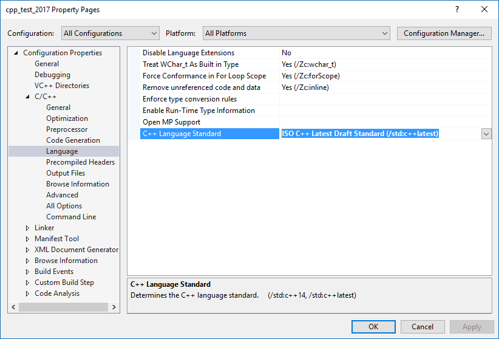
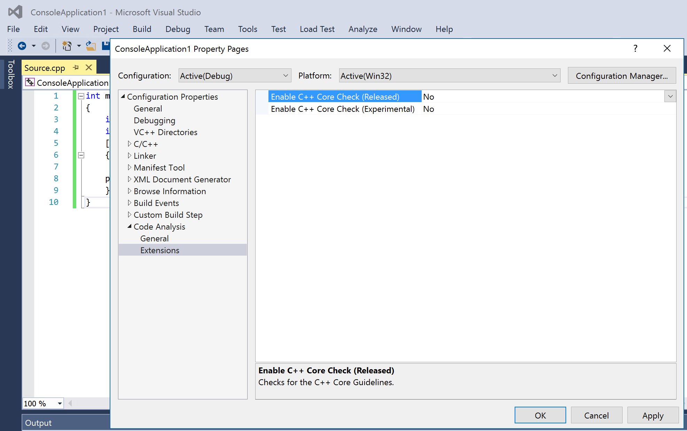

## Список отмазок

Отмазки из этого списка не будут приняты во внимание:

- "я забыл прочитать соглашения о кодировании"
- "я забыл настроить автоформатирование"
- "я забыл включить проверку C++ Core Guidelines"
- "я потом поменяю, вместе с другими замечаниями"
- "это не мой код, я его взял со stackoverflow / с Интернета / у товарища"
    - профессиональные программисты смотрят примеры в Интернете, но перепроверяют их и адаптируют под свой стиль
- "ах да, у меня тут плагин не установился, поэтому код не отформатирован"
    - ничто не мешает сообщить о технической проблеме заранее, до того, как преподаватель обнаружит последствия

## Стандарт C++

Мы используем последний актуальный стандарт — C++17. Если вы используете Visual Studio, выбирайте версию Visual Studio 2017 или выше и укажите в настройках проекта `/std=c++latest`:



Если вы не используете ни Visual Studio, ни XCode, то вы должны использовать систему сборки CMake.

- Ознакомиться с CMake можно в статье [Современный CMake: 10 советов по улучшению скриптов сборки](https://habrahabr.ru/post/330902/)
- Работать с CMake умеют среды разработки CLion и QtCreator, также подойдут редакторы Visual Studio Code и Sublime Text

Ознакомиться с новинками C++17 можно в следующих статьях:

- [Миграция на повседневный C++17](/cxx/cxx17)
- [Привет, std::filesystem!](https://medium.com/@sshambir/%D0%BF%D1%80%D0%B8%D0%B2%D0%B5%D1%82-std-filesystem-4c7ed50d5634)

## Форматирование кода

Мы используем автоматическое форматирование кода с помощью clang-format. Перед сдачей работы вы обязаны проверить, что ваш код отформатирован.

Наш стиль отличается от стандартного стиля ClangFormat. Чтобы включить этот стиль, скачайте [наш файл конфигурации .clang-format](https://gist.github.com/sergey-shambir/2615539b624758270ec70b1aa9a61bc2) и сохраните его под именем `.clang-format` в одном из каталогов выше каталога проекта.

- Для Visual Studio есть плагин [ClangFormat](https://marketplace.visualstudio.com/items?itemName=HansWennborg.ClangFormat)
    - этот плагин имеет удобную опцию "Format on Save" в настройках
- Для редактора Visual Studio Code есть плагин [Clang-Format](https://marketplace.visualstudio.com/items?itemName=xaver.clang-format)
- Если для вашего редактора плагина нет, вы должны запускать clang-format самостоятельно. На UNIX-системах можно использовать скрипт:

```bash
#!/usr/bin/env bash
# Скрипт вызывает clang-format для всех файлов *.cpp и *.h
filepaths=$(find . -type f \( -name "*.cpp" -or -name "*.h" \))
for filepath in $filepaths; do
    echo "Formatting ${filepath}..."
    clang-format -style=file -i "${filepath}"
done
```

Ниже показан правильно отформатированный код. Из него понятно, что

- мы используем табуляции для отступов
- символы указателя или ссылки прижимаются к имени типа, а не к имени переменной
- скобки ставятся на новой строке
- пробелы ставятся вокруг бинарных операторов и после инструкций `for`, `if` и т.д.

```cpp
void DoEventLoop(SDL_Window* window, const std::function<void()>& draw)
{
	for (;;)
	{
		SDL_Event event;
		while (SDL_PollEvent(&event))
		{
			switch (event.type)
			{
			case SDL_KEYUP:
				if (event.key.keysym.sym == SDLK_ESCAPE)
					return;
				break;
			case SDL_QUIT:
				return;
			}
		}

		glClear(GL_COLOR_BUFFER_BIT);

		draw();

		SDL_GL_SwapWindow(window);
		SDL_Delay(1);
	}
}
```

## Именование

Следующая таблица даст понимание стиля именования. Особенности:

- у классов нет префикса "C"
- мы не используем глобальные переменные
- мы не используем макросы

| Категория                | Требования                  | Пример            |
|--------------------------|-----------------------------|-------------------|
| тип данных (enum, using) | UpperCamelCase              | `Direction`       |
| класс или структура      | UpperCamelCase              | `TableGenerator`  |
| поле класса              | префикс m_ и lowerCamelCase | `m_frameNo`       |
| интерфейс                | префикс I и UpperCamelCase  | `ITableGenerator` |
| глобальная константа     | префикс k и UpperCamelCase  | `kColumnCount`    |
| переменная или параметр  | lowerCamelCase              | `signatureLength` |
| функция или метод        | UpperCamelCase              | `LinkProgram`     |
| константа enum class     | UpperCamelCase              | `Direction::Left` |

## Объектно-ориентированный стиль

Код на C++ пишется в объектно-ориентированном стиле с разумным использованием классов, инкапсуляции полиморфизма, наследования и композиции. Следует помнить о нескольких правилах.

Правила, касающиеся создания классов:

- [C.1:](https://isocpp.github.io/CppCoreGuidelines/CppCoreGuidelines#c1-organize-related-data-into-structures-structs-or-classes) схожие данные объединяйте в структуры или классы
- [C.2:](https://isocpp.github.io/CppCoreGuidelines/CppCoreGuidelines#c2-use-class-if-the-class-has-an-invariant-use-struct-if-the-data-members-can-vary-independently) используйте класс, если объект имеет инвариант, а в случае независимо изменяющихся полей используйте структуры
- [C.3:](https://isocpp.github.io/CppCoreGuidelines/CppCoreGuidelines#c3-represent-the-distinction-between-an-interface-and-an-implementation-using-a-class) разделяйте интерфейс и реализацию в классе, т.е. пользуйтесь инкапсуляцией данных
- [C.9:](https://isocpp.github.io/CppCoreGuidelines/CppCoreGuidelines#Rc-private) минимизируйте публичный доступ к полям класса
- [C.7:](https://isocpp.github.io/CppCoreGuidelines/CppCoreGuidelines#Rc-standalone) не объявляйте переменную в той же инструкции, в которой вы объявили структуру или `enum`
- [C.41:](https://isocpp.github.io/CppCoreGuidelines/CppCoreGuidelines#Rc-complete) созданный конструктором объект должен быть проинициализирован полностью
- [C.42:](https://isocpp.github.io/CppCoreGuidelines/CppCoreGuidelines#Rc-throw) если конструктор не может создать объект с корректным состоянием, он должен выбросить исключение
- [C.49](https://isocpp.github.io/CppCoreGuidelines/CppCoreGuidelines#Rc-initialize) старайтесь использовать списки инициализации конструктора вместо присваивания в теле конструктора
- [C.46:](https://isocpp.github.io/CppCoreGuidelines/CppCoreGuidelines#Rc-explicit) добавляйте ключевое слово `explicit` для конструкторов с одним параметром
- [C.31:](https://isocpp.github.io/CppCoreGuidelines/CppCoreGuidelines#Rc-dtor-release) все захваченные объектом класса ресурсы должны быть освобождены в деструкторе
- [C.82:](https://isocpp.github.io/CppCoreGuidelines/CppCoreGuidelines#Rc-ctor-virtual) не вызывайте виртуальные функции в конструкторах и деструкторах
- [C.127](https://isocpp.github.io/CppCoreGuidelines/CppCoreGuidelines#Rh-dtor) публичный деструктор класса с виртуальными функциями должен быть виртуальным, либо он должен быть защищённым (`protected`)

Правила, касающиеся иерархий классов

- [C.121:](https://isocpp.github.io/CppCoreGuidelines/CppCoreGuidelines#Rh-abstract) если базовый класс используется как интерфейс, то в нём не должно быть полей и все методы должны быть виртуальными
- [C.128:](https://isocpp.github.io/CppCoreGuidelines/CppCoreGuidelines#Rh-override) виртуальные функции должны быть помечены ровно одним из ключевых слов `virtual`, `override`, `final`
- [C.133:](https://isocpp.github.io/CppCoreGuidelines/CppCoreGuidelines#Rh-protected) избегайте protected полей класса
- [C.153:](https://isocpp.github.io/CppCoreGuidelines/CppCoreGuidelines#Rh-use-virtual) используйте полиморфизм вместо приведения базового класса к нужному типу

## Проверка C++ Core Guidelines в Visual Studio

Все указанные ранее правила входят в состав C++ Core Guidelines. Анализатор C++ Core Guidelines входит в состав Visual Studio 2017 и выше, и с его помощью вы можете настроить автоматическую проверку исходного кода проекта.



## Повседневный код на C++

Вам не нужно использовать сложные техники языка C++ при освоении курса. Запомните три правила простого, повседневного кода C++:

- избегайте низкоуровневой работы с памятью, поскольку это экспертная задача
    - [C.149:](https://isocpp.github.io/CppCoreGuidelines/CppCoreGuidelines#Rh-smart) используйте умные указатели `unique_ptr` и `shared_ptr`, чтобы избегать прямого вызова `new` и `delete`
    - [C.150:](https://isocpp.github.io/CppCoreGuidelines/CppCoreGuidelines#Rh-make_unique) используйте `make_unique()` для конструирования `unique_ptr<T>`
    - [C.151:](https://isocpp.github.io/CppCoreGuidelines/CppCoreGuidelines#Rh-make_shared) используйте `make_shared()` для конструирования `shared_ptr<T>`
- откажитесь от низкоуровневых циклов for и while в пользу алгоритмов STL/Boost, либо выносите их в отдельные функции
    - см. доклад Михаила Матросова [Повседневный С++: boost и STL](http://cpp-russia.ru/?page_id=999)
    - см. доклад Алексея Малова [Как современные возможности C++ облегчают повседневную разработку](http://cpp-russia.ru/?p=1352)
- изолируйте код, написанный в стиле языка C
    - см. статью [Повседневный C++: изолируем API в стиле C](https://habrahabr.ru/post/331100/)

Также в современном C++ не принято писать многопоточный код на низком уровне. Однако, вы едва ли с этим столкнётесь.
