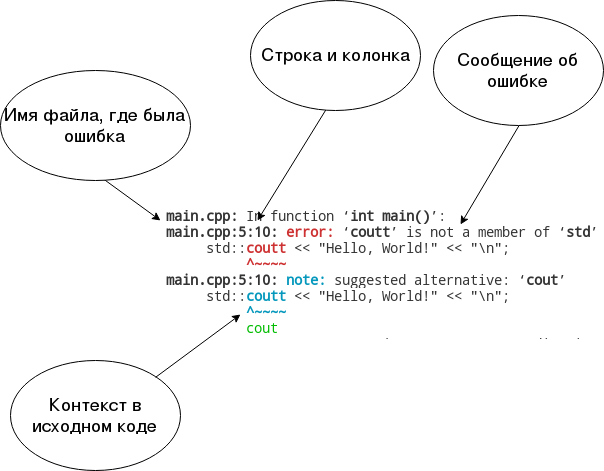
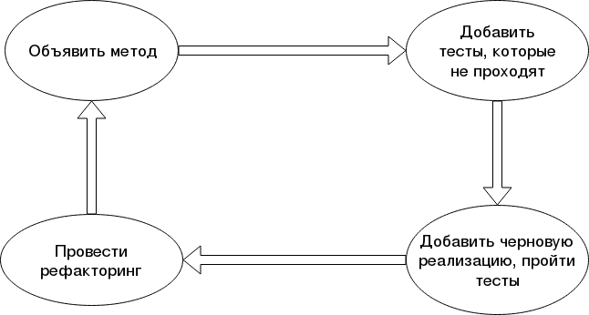
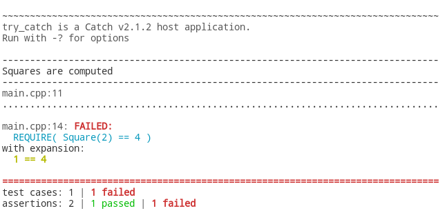
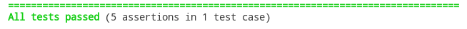

Следуйте инструкциям. В конце выполните задание, указанное в тексте.

## Создаём каталог проекта

Перейдите в каталог, в котором у вас есть права записи (желательно, чтобы в имени каталога не было пробелов и кириллических символов).

Создайте каталог, в котором вы будете размещать свои проекты. Его можно назвать, например, "lw1" (laboratory work 1)


В Visual Studio Code откройте этот каталог. Для этого используйте меню "File">"Open Folder...".


Теперь вы можете добавить новый файл в каталог прямо из Visual Studio Code. Попробуйте, это так просто!


## Пишем первую программу

Создайте каталог `try_catch` и в нём создайте файл `main.cpp`. Добавьте в файл код функции main.

```cpp
#include <iostream>

int main()
{
    std::cout << "Hello, World!" << "\n";
}
```

>Обратите внимание, что функция `main` возвращает тип `int` &mdash; она возвращает операционной системе целочисленный код (0 в случае успешного выполнения, ненулевой код в случае ошибки выполнения). Стандарт C++ разрешает ничего не возвращать из функции main, что мы и сделали.

Теперь надо скомпилировать код. Откройте встроенный терминал Visual Studio Code горячей клавишей "Ctrl+`" либо через меню:


Запустите команду `g++ --version`, чтобы проверить, что компилятор C++ доступен и функционирует. Результат будет выглядеть примерно так:

```
>gcc --version
gcc (Ubuntu 7.2.0-1ubuntu1~16.04) 7.2.0
Copyright (C) 2017 Free Software Foundation, Inc.
This is free software; see the source for copying conditions.  There is NO
warranty; not even for MERCHANTABILITY or FITNESS FOR A PARTICULAR PURPOSE
```

Перейдите в терминале в ранее созданный каталог `try_catch`. Это можно сделать командой `cd try_catch`. Если команду не удалось выполнить, введите команду `dir`, чтобы выяснить, какие подкаталоги находятся в текущем каталоге терминала. Сориентируйтесь и добейтесь, чтобы у вас был каталог `try_catch` с файлом `main.cpp`.

Тепер запустите сборку программы командой `g++ main.cpp -o try_catch`. Если всё в порядке, то компилятор ничего не напишет &mdash; а случае ошибки компилятор написал бы информацию о причине ошибки. 

Теперь вы можете запустить консольную команду `try_catch` &mdash; так вы запустите собранную вами программу.

```
>try_catch
Hello, World!
```

## Ошибки компилятора

Компилятор и отладчик &mdash; ваши верные друзья и товарищи: они могут многое рассказать о причинах ошибки в программе. Давайте спровоцируем ошибку и посмотрим, что компилятор скажет о ней!

Замените идентификатор `cout` на `coutt`:

```cpp
#include <iostream>

int main()
{
    std::coutt << "Hello, World!" << "\n";
}
```

Запустите команду компиляции `g++ main.cpp -o try_catch`

Теперь компилятор вывел сообщение: это список ошибок, возникших при компиляции

```
main.cpp: In function ‘int main()’:
main.cpp:5:10: error: ‘coutt’ is not a member of ‘std’
     std::coutt << "Hello, World!" << "\n";
          ^~~~~
main.cpp:5:10: note: suggested alternative: ‘cout’
     std::coutt << "Hello, World!" << "\n";
          ^~~~~
          cout
```

Давайте разберём текст ошибки подробно:



Вы можете заметить, что компилятор точно определил причину ошибки и даже предложил способ исправления для случая, если это была просто опечатка.

>Всегда читайте сообщения об ошибках, если только не научились определять ошибку с одного взгляда.

## Разработка через тестирование

TDD (Test Driven Development) - это подход к написанию кода, при котором перед реализацией какой-либо функциональности пишутся тесты для неё. При таком подходе разработка, например, нового класса происходит циклически, метод за методом:



Смысл подхода в том, что ещё до написания какого-либо кода реализации класса вы сразу создаёте подушку безопасности: модульные тесты, проверяющие работоспособность основных сценариев использования метода или класса. Под прикрытием тестов вы можете спокойно переписывать код класса &mdash; и не бояться его сломать: любое нарушение функциональности будет обнаружено уже написанными тестами.

Через TDD удобно разрабатывать код, который трудно протестировать вручную: обработку строк, математические вычисления, классы для организаии асинхронного кода и т.д.

Мы разработаем через тестирование класс для работы с вектором из двух элементов. Но перед этим освоим фреймворк модульного тестирования.

## Готовимся тестировать

Для тестирования мы будем использовать фреймворк Catch2, который можно загрузить в виде одного заголовочного файла: [github.com/catchorg/Catch2/blob/master/single_include/catch.hpp](https://github.com/catchorg/Catch2/blob/master/single_include/catch.hpp)

Загрузите этот файл. Создайте каталог `libs` и поместите туда загруженный файл `catch.hpp`.

Для старта протестируем простейшую функцию, вычисляющую квадрат целого числа:

```cpp
// Определение функции Square, возвращающей квадрат заданного целого числа.
int Square(int value)
{
    return value * value;
}
```

Добавьте в файл `main.cpp` объявление этой же функции, пока без определения:

```cpp
int Square(int value);
```

>Объявление не содержит кода, реализующего функцию, но уже резервирует (с точки зрения компилятора) заданное имя как имя функции. После объявления вы уже можете вызывать функцию &mdash; правда, программу не получится собрать, пока где-нибудь в вашем коде не появится определение функции, либо не появится внешняя библиотека, реализующая эту же функцию.

Теперь удалите функцию main и добавьте в начале файла подключение заголовка Catch2:

```cpp
// Макрос заставит Catch самостоятельно добавить определение функции main()
// Это можно сделать только в одном файле
#define CATCH_CONFIG_MAIN
#include "../libs/catch.hpp"
```

Снова соберите программу командой `g++ main.cpp -o try_catch` &mdash; сборка должна пройти успешно (без сообщений).

Теперь добавьте объявление тест-кейса.

```cpp
TEST_CASE("Squares are computed", "[Square]")
{
    REQUIRE(Square(1) == 1);
    REQUIRE(Square(2) == 4);
    REQUIRE(Square(3) == 9);
    REQUIRE(Square(7) == 49);
    REQUIRE(Square(10) == 100);
}
```

>Это объявление интенсивно использует макросы. Перед компиляцией компилятор заменит все макросы в соответствии с их объявлением, то есть макрос `TEST_CASE(...)` будет заменён, скорее всего, на объявление функции, реализующий тест кейс, и код регистрации этой функции в общем наборе тестов. Макрос `REQUIRE` будет заменён на проверяемое сравнение значений.

Попробуйте собрать программу &mdash; и у вас не получится! Посмотрите на текст ошибки. В нём сказано, что нет ссылки на `Square(int)`. Это значит, что *компоновщик*, автоматически вызванный *компилятором*, смог найти вызовы функции `Square`, но нигде не смог найти машинный код этой функции. Машинного кода нет, потому что нет и исходного кода &mdash; мы разместили только объявение функции без определения.

Давайте теперь реализуем функцию `Square` неправильно. Замените объявление функции на следующее определение:

```
int Square(int value)
{
    return 1;
}
```

Соберите программу. Затем запустите программу `try_catch` в терминале. Вы увидит сообщения об ошибке в тестах!



Давайте теперь напишем черновую, но работоспособную версию `Square`:

```cpp
int Square(int value)
{
    int square = value;
    square = square * value;
    return square;
}
```

Соберите программу и запустите её в терминале. Все тесты будут успешно пройдены:



Но разве это повод останавливаться? Конечно, нет: код функции Square пока ещё далёк от идеала. Его можно сократить, убрав явно излишнюю переменную square:

```cpp
int Square(int value)
{
    return value * value;
}
```

Снова соберите программу и запустите её в терминале. Все тесты будут успешно пройдены:


>Только что вы освоили ценный навык: рефакторить код под прикрытием тестов. Если тестов нет, то случайная опечатка или забывчивость в процессе правок могут сломать страшный на вид, но работоспособный код. Под прикрытием тестов поломка будет обнаружена. Этот эффект особенно заметен в динамических языках (вроде JavaScript или Python), но и в C++ вы можете избавиться от мучительной отладки, если просто будете писать автоматические тесты для некоторых задач &mdash; таких, как обработка строк, файлов или математические вычисления.

## Структура Vector2f

Создайте каталог `vector2`, и в нём два файла: `main.cpp` и `Vector2f.hpp`

Мы напишем структуру, которая будет хранить декартовы координаты вектора из двух элементов `(x, y)`. Мы могли бы объявить эту сущность как класс, а не структуру, тем более что в C++ между ключевыми словами `class` и `struct` практически нет разницы. Но [C++ Core Guidelines](https://isocpp.github.io/CppCoreGuidelines) не советуют так делать:

>[C.2: Use class if the class has an invariant; use struct if the data members can vary independently](https://isocpp.github.io/CppCoreGuidelines/CppCoreGuidelines#Rc-struct)

Вектор не имеет внутреннего инварианта: его элементы могут быть изменены независимо друг от друга. Поэтому мы объявим его как структуру. Поместите это объявление в файл "Vector2f.hpp":

```cpp
#pragma once
// pragma once защищает от проблемы двойного включения заголовка в файл
// подробнее: https://stackoverflow.com/questions/1143936/

// Подключаем заголовок cmath из стандартной библиотеки, он пригодится позже
// Документация заголовка: http://en.cppreference.com/w/cpp/header/cmath
#include <cmath>

// Объявляем новый тип данных - структуру с названием Vector2f
struct Vector2f
{
    // Два поля структуры имеют тип float
    // Мы явно указываем, что поля в любом случае надо инициализировать нулём.
    // Использование неинициализированной памяти - одна из самых страшных
    //  ошибок C++ программиста, и её надо всячески избегать.
    float x = 0;
    float y = 0;

    // Конструктор без аргументов инициализирует структуру в той
    //  инструкции, где она объявлена. Нас устраивает реализация
    //  конструктора, предлагаемая компилятором по умолчанию,
    //  поэтому мы написали "= default"
    Vector2f() = default;

    // Конструктор с двумя аргументами инициализирует структуру
    //  двумя значениями. Пример:
    //    Vector2 speed(10, 20);
    Vector2f(float x, float y)
        : x(x), y(y)
    {
    }
};
// После объявления структуры следует поставить точку с запятой.
// Если этого не сделать, возникнет ошибка компиляции.
// Некоторые компиляторы плохо обрабатывают эту ошибку и выдают
//  много индуцированных ошибок вместо одной правильной.
```

Теперь протестируем конструктор нашего класса &mdash; да, от этого мало пользы, но надо же с чего-то начать!

Перепишите этот код в `main.cpp`:

```cpp
// Макрос заставит Catch самостоятельно добавить определение функции main()
// Это можно сделать только в одном файле
#define CATCH_CONFIG_MAIN
#include "../libs/catch.hpp"

// Включаем заголовок, где мы описали структуру
#include "Vector2f.hpp"

// В C++ есть много способов вызвать один и тот же конструктор.
// Мы попробуем большинство из них.
TEST_CASE("Can be constructed", "[Vector2f]")
{
    // Обычное конструирование при объявлении.
    Vector2f v1(1, 2);
    REQUIRE(v1.x == 1);
    REQUIRE(v1.y == 2);

    // Явный вызов конструктора, затем присваивание.
    Vector2f v2 = Vector2f(-1, 29);
    REQUIRE(v2.x == -1);
    REQUIRE(v2.y == 29);

    // Конструирование списком инициализации (C++11) - более универсальный приём.
    Vector2f v3 = { 5, -11 };
    REQUIRE(v3.x == 5);
    REQUIRE(v3.y == -11);

    // Универсальное конструирование (C++11) - ещё более универсальное
    Vector2f v4 = { 18, -110 };
    REQUIRE(v4.x == 18);
    REQUIRE(v4.y == -110);
}
```

Для сборки программы достаточно собрать один только "main.cpp", заголовочные файлы сборке не подлежат, т.к. директива `#include` в любом случае на время компиляции включает содержимое указанного файла в текущий файл (в нашем случае "main.cpp").

Перейдите в терминале в каталог "vector2" командой `cd ..\vector2`

Затем соберите программу командой `g++ main.cpp -o vector2` и запустите её. Все тесты должны быть пройдены.

## Добавляем метод length

Метод &mdash; эта функция, связанная с объектом. В C++ объект, связанный с методом, передаётся при вызове неявно и доступен через ключевое слово `this`. Впрочем, оно нам пока не потребуется: все поля объекта также доступны в методе напрямую.

>Длина вектора, согласно теореме Пифагора, вычисляется как квадратный корень из суммы квадратов компонентов вектора. Это справедливо не только для вектора из 2 элементов, но и для векторов любых размерностей.

Для вычисления длины вектора нам нужно уметь извлекать квадратный корень. Это умеет делать функция [std::sqrt](http://en.cppreference.com/w/cpp/numeric/math/sqrt). Прочитайте её документацию, затем взгляните на реализацию метода length:

```cpp
    // ..внутри объявления Vector2f

    float length() const
    {
        return std::sqrt(x * x + y * y);
    }
```

Вы внимательно прочитали документацию sqrt? В каких случаях в sqrt возникает ошибка? Может ли такая ситуация произойти в функции length?

Теперь пора протестировать метод:

```cpp
TEST_CASE("Can compute length", "[Vector2f]")
{
    // Пифагоровы числа: 3, 4, 5
    Vector2f v1 = {3.f, 4.f};
    REQUIRE(v1.length() == 5.f);

    // Пифагоровы числа: 12, 35, 37
    Vector2f v2 = {12.f, 35.f};
    REQUIRE(v2.length() == 37.f);
}
```

Здесь мы использовали опасный приём: сравнение чисел типа `float`. Из-за погрешностей при работе с числами с плавающей запятой тесты вполне могут провалиться. Для сравнения чисел с плавающей точкой Catch2 предоставляет вспомогательный класс Approx, которым мы воспользуемся:

```cpp
TEST_CASE("Can compute length", "[Vector2f]")
{
    // Пифагоровы числа: 3, 4, 5
    Vector2f v1 = {3.f, 4.f};
    REQUIRE(v1.length() == Approx(5.f));

    // Пифагоровы числа: 12, 35, 37
    Vector2f v2 = {12.f, 35.f};
    REQUIRE(v2.length() == Approx(37.f));

    // Пифагоровы числа: 85 132 157
    Vector2f v3 = {85.f, -132.f};
    REQUIRE(v3.length() == Approx(157.f));

    // Пифагоровы числа: 799 960 1249
    Vector2f v4 = {799.f, -960.f};
    REQUIRE(v4.length() == Approx(1249.f));

    // Пифагоровы числа: 893 924 1285
    Vector2f v5 = {893.f, -924.f};
    REQUIRE(v5.length() == Approx(1285.f));
}
```

Теперь, когда мы протестировали метод "length", финальным штрихом будет рефакторинг. Иногда стандартная библиотека C++ предоставляет не только базовые средства вроде sqrt, но и продвинутые, подходящие для более конкретных случаев. Функция [std::hypot](http://en.cppreference.com/w/cpp/numeric/math/hypot) может вычислить гипотенузу по двум катетам, то есть тот же самый корень из суммы квадратов компонентов вектора.

Замените реализацию `Vector2f::length()` на предложенную ниже, соберите программу и запустите её, чтобы повторить все тесты и убедиться, что старая и новая реализации работают одинаково.

```cpp
float length() const
{
    return std::hypot(x, y);
}
```

## Добавляем оператор сложения

## Добавляем операторы сравнения

## Добавляем функцию для скалярного произведения

TODO: почему не метод, а функция? Почему не оператор?
