Следуйте инструкциям. В конце выполните задание, указанное в тексте.

## Окно с нарисованным кругом на Qt

>Основано на примере [Raster Window Example](http://doc.qt.io/qt-5/qtgui-rasterwindow-example.html) из документации Qt

Наша первая цель — получить окно, в котором нарисовано статичное изображение круга. Рисование будет выполнятся средствами Qt с программной отрисовкой (без участия видеокарты).

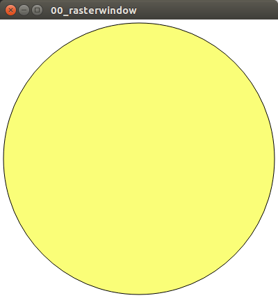

### Создание проекта

Откройте Visual Studio 2017 и создайте новый проект типа Qt Gui Application (для этого у вас должны быть установлены Qt SDK и Qt Visual Studio Add-In). Укажите название проекта AnimatedBall. Выберите путь размещения проекта так, чтобы в нём не было пробелов и кириллических символов (некоторые инструменты Qt плохо поддерживают Unicode в путях).

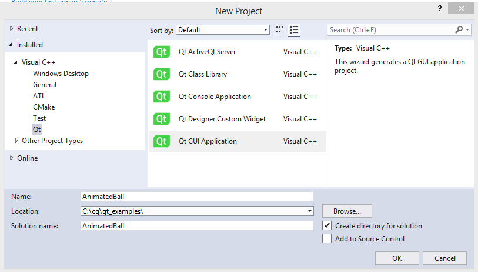

В процессе вы можете получить следующую ошибку:

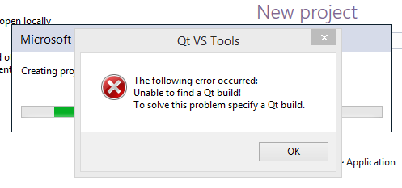

Проблема в том, что Qt SDK может быть установлен в произвольный каталог на диске и Qt Add-in (плагин для Visual Studio) не может его найти. Можно зарегистрировать установленный Qt SDK вручную.

Перейдите к меню "Qt VS Tools" и выберите действие "Qt Options"

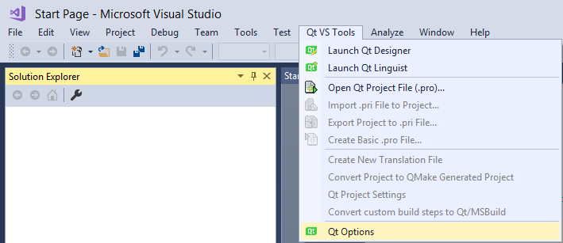

В появившемся диалоге вам нужно добавить версию Qt (кнопка Add)

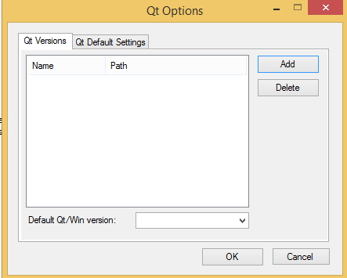

В диалоге выбора пути нужно выбрать путь к каталогу версии Qt (это должен быть каталог на уровень выше каталога bin)

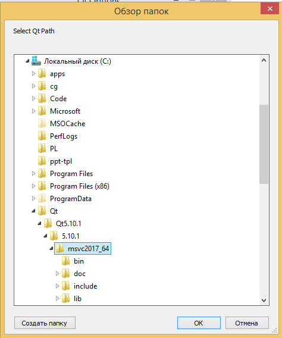

После добавления версии Qt вы можете снова попробовать создать проект!

### Чистим проект и добавляем main

В созданном проекте удалите все файлы, кроме "main.cpp". В файле "main.cpp" удалите всё содержимое. Мы будем писать проект с нуля.

Ниже приведён пример простейшей программы, отображающей окно и состоящей из одной функции main. Для удобства предлагаемый пример подробно прокомментирован. Вам нужно переписать код, не переписывая комментарии

>Хорошие комментарии в коде уточняют детали, объясняют странные решения или как-то иначе дополняют код. Если код говорит сам за себя, комментарий к нему не нужен. Комментарии, приведённые в примерах, просто повторяют то, что уже описанно в документации. Они не нужны в реальном коде.

```cpp
// Подключаем заголовок класса QGuiApplication из модуля QtGui.
#include <QtGui/QGuiApplication>

// Объявляем функцию main, принимающую аргументы командной строки в параметрах argc и argv
int main(int argc, char *argv[])
{
    // Объявляем переменную app типа QGuiApplication.
    // Объявить её надо как можно раньше, так как при инициализации Q*Application
    //  неявно инициализируются различные подсистемы Qt
    QGuiApplication app(argc, argv);

    // Объявляем переменную window типа QWindow.
    // Эта переменная представляет окно операционной системы.
    QWindow window;

    // Инициируем показ окна: показ случится позже, когда начнётся цикл событий
    window.show();

    // Запускаем цикл событий: метод exec выполняется вплоть до завершения
    //  работы приложения, и возвращает в main код возврата (ненулевой в случае ошибки).
    return app.exec();
}
```

Соберите программу и запустите ё в отладчике на пошаговое выполнение. Найдите ответ на вопрос: показывается ли окно программы сразу при вызове `window.show()`?

Разобраться со сборкой вам поможет шпаргалка по горячим клавишам Visual Studio:

| hotkey | действие                             |
|--------|--------------------------------------|
| F7     | сборка всех проектов в solution      |
| F5     | запуск программы в отладчике         |
| F10    | переход через инструкцию в отладчике |

Запущеная программа будет выглядеть примерно так:

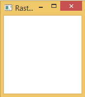

### Заменяем обычный QWindow на RasterWindow

Наша цель осталась прежней: нарисовать в окне круг. Обычный класс QWindow не содержит кода рисования круга &mdash; он вообще ничего не рисует.

В таких случаях в Qt принято наследоваться от класса QWindow, реализуя свой класс окна. Так мы и сделаем: создайте в проекте заголовочный файл "RasterWindow.h" и поместите в него код, описанный ниже, избегая комментариев:

```cpp
#pragma once

// Подключаем заголовки используемых классов.
#include <QtGui/QWindow>
#include <QtGui/QPainter>
#include <QtGui/QResizeEvent>
#include <QtGui/QExposeEvent>
#include <QtGui/QBackingStore>

// Класс RasterWindow наследует все поля и методы класса QWindow
class RasterWindow : public QWindow
{
    // Макрос Q_OBJECT является меткой для Qt moc - генератора кода в составе Qt SDK
    Q_OBJECT

public: // Начало секции публично доступных полей и методов

    // Конструктор класса: принимает один (опциональный) параметр типа QWindow,
    //  в этом параметре можно передать родительское окно (например, для модального диалога)
    explicit RasterWindow(QWindow *parent = 0);

protected: // Начало секции полей и методов, доступных только в наследниках этого класса

    // Ниже перегружены полиморфные методы родительского класса QWindow
    // Библиотека Qt рассылает различные события по этим методам
    //  - метод event вызывается перед обработкой любых событий, включая resizeEvent и exposeEvent
    //  - метод resizeEvent вызывается при изменении размера окна
    //  - метод exposeEvent вызывается при показе окна
    bool event(QEvent *event) override;
    void resizeEvent(QResizeEvent *event) override;
    void exposeEvent(QExposeEvent *event) override;

private: // Начало секции полей и методов, доступных только в наследниках этого класса

    void renderLater();
    void renderNow();
    void render(QPainter *painter);

    // Класс QBackingStore предоставляет окну буфер рисования кадра.
    // Грубо говоря, этот буфер содержит будущие пиксели окна и позволяет
    //  рисовать векторную графику (фигуры, изображения, текст), заполняя
    //  этот буфер пикселей.
    QBackingStore *m_backingStore = nullptr;
};
```

Теперь создайте файл "RasterWindow.cpp". Прежде всего, в этот файл надо добавить заголовок "RasterWindow.h".

```cpp
#include "RasterWindow.h"
```

Затем реализуем в файле "RasterWindow.cpp" конструктор класса. Перепишите этот код (кроме комментария):

```cpp
// В конструкторе создадим в динамической памяти новый объект QBackingStore.
// В современном C++ не принято использовать "new", но пока вы работаете с Qt,
//  "new" - это норма, т.к. Qt использует особый механизм управления памятью
//  parent-child.
// Именно поэтому мы передали "this" в конструктор QBackingStore.
// Объект класса RasterWindow становится родителем объекта класса QBackingStore.
// Когда будет вызван деструктор RasterWindow, Qt удалит и все дочерние объекты.
RasterWindow::RasterWindow(QWindow *parent)
    : QWindow(parent)
    , m_backingStore(new QBackingStore(this))
{
    // Устанавливаем минимальные размеры окна.
    setMinimumSize(QSize(600, 600));
}
```

Опишем метод event: этот метод вызывается при каждом событии окна, поэтому при его написании следует действовать аккуратно

* если мы не обработали событие, мы должны вызвать метод родительского класса: `QWindow::event(event)`, иначе механизм обработки событий Qt будет сломан
* мы должны обработать только событие UpdateRequest, которое уведомляет о запросе на изменение окна
    * изменение размера должно приводить к перерисовке окна

```cpp
bool RasterWindow::event(QEvent *event)
{
    if (event->type() == QEvent::UpdateRequest) {
        renderNow();
        return true;
    }
    return QWindow::event(event);
}
```

Опишем метод exposeEvent: этот метод класса QWindow библиотека Qt вызывает при фактическом показе окна.

```cpp
void RasterWindow::exposeEvent(QExposeEvent *)
{
    if (isExposed())
    {
        renderNow();
    }
}
```

На примере события QExposeEvent покажем, как именно происходит обработка событий в Qt. В первую очередь, любое событие добавляется в очередь и обрабатывается позднее, когда до него дойдёт очередь. Затем событие проходит через *виртуальный* (то есть *полиморфный*) метод `event()`. Реализация `event()` по умолчанию перенаправит событие в метод `exposeEvent`. Мы можем обработать это событие в нашем классе, чтобы выполнить действие сразу после отображения окна.

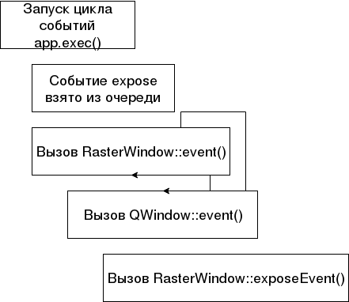

Опишем метод resizeEvent: этот метод класса QWindow библиотека Qt вызывает при изменении размера окна.

```cpp
void RasterWindow::resizeEvent(QResizeEvent *resizeEvent)
{
    // Изменяем размер буфера кадра, чтобы он совпадал с размером окна
    m_backingStore->resize(resizeEvent->size());
    if (isExposed())
    {
        renderNow();
    }
}
```

Метод "renderLater" будет добавлять в очередь событий Qt событие обновления экрана (UpdateRequest), тем самым форсируя перерисовку кадра в ближайшем будущем.

```cpp
void RasterWindow::renderLater()
{
    requestUpdate();
}
```

Теперь реализуем самый сложный метод класса &mdash; renderNow. Метод будет запускать рисование на буфере кадра, очищать буфер, а потом готовый буфер выводить на экран. 

Вывод сначала в буфер, а затем в окно известен как *двойная буферизация* (double buffering) &mdash; это общепринятый способ борьбы с мерцанием (flickering) изображения. Представьте, что двойной буферизации не будет. Тогда мы будем рисовать сразу в буфере кадра дисплея, при этом операционная система будет рисовать содержимое дисплея с частотой 60Гц, а наша программа по каким-то причинам будет рисовать каждый кадр вчетверо дольше. В этом случае на экране будут проявляться недорисованные фрагменты картинки:

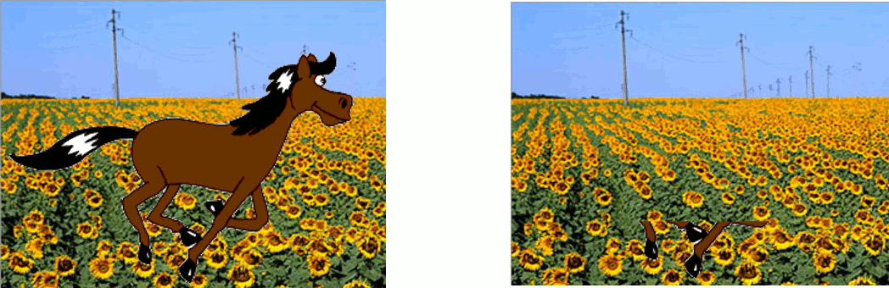

Поскольку в обычно время рисования мало отличается от времени вывода кадра, в реальности вы увидите лишь высокочастотное мерцание картинки над фоном.

Чтобы избежать этого, мы будем рисовать во вспомогательный буфер. Чтобы убрать следы старого кадра, будем заливать буфер белым цветом путём вызова `painter.fillRect`. Перепишите код, предложенный ниже:

```cpp
void RasterWindow::renderNow()
{
    if (!isExposed())
    {
        return;
    }

    QRect rect(0, 0, width(), height());
    m_backingStore->beginPaint(rect);

    QPaintDevice *device = m_backingStore->paintDevice();
    QPainter painter(device);

    painter.fillRect(0, 0, width(), height(), Qt::white);
    render(&painter);
    painter.end();

    m_backingStore->endPaint();
    m_backingStore->flush(rect);
}
```

Остался всего один метод "render", в котором мы установим параметры кисти рисования и нарисуем эллипс. Перед рисованием мы установим режим устранения ступенчатости. Ступенчатость &mdash; это эффект, при котором фигура, нарисованная ровно по решётке пикселей, вглядит угловатой из-за необходимости рисовать линии приближённо. Ступенчатость (aliasing) устраняется специальными алгоритмами рисования, которые частично закрашивают пиксели на границах фигур и линий. При взгляде издалека частичная заливка создаёт для глаза иллюзию прямых контуров.

На иллюстрации слева изображена ступенчатая линия (в большом увеличении), а справа сглаженная линия.

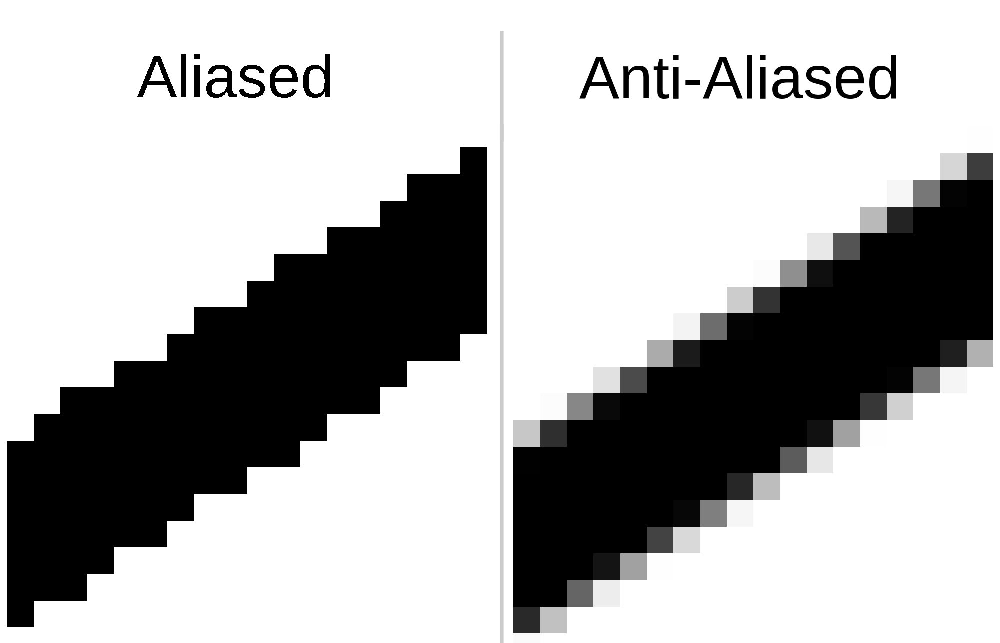

```cpp
void RasterWindow::render(QPainter *painter)
{
    // Устанавливаем режим устранения ступенчатости фигур (anti-aliasing mode)
    painter->setRenderHint(QPainter::Antialiasing);

    // Устанавливаем кисть жёлтого цвета (цвет задан в RGB)
    painter->setBrush(QBrush(QColor(0xFA, 0xFE, 0x78)));

    // Рисуем эллипс на всё окно с отступом 5 пикселей
    painter->drawEllipse(QRect(5, 5, width() - 10, height() - 10));
}
```

Теперь перейдите в функцию main и замените тип переменной "window" с QWindow на RasterWindow. Не забудьте подключить заголовок "RasterWindow.h" в файле "main.cpp".

Соберите программу, запусти её. Убедитесь, что окно программы выглядит примерно так:


### Исследуем программу в отладчике

**Остановитесь и проверьте следующее**

* код с предыдущих этапов у вас работает
* все ваши товарищи закончили те же этапы

После этого вместе с преподавателем посмотрите, как с помощью отладчика проинспектировать работу программы. Разберите вопросы:

* почему exposeEvent вызывается уже после вызова `window.show()`?
* почему при запуске программы вызывается resizeEvent?
* что показывает call stack, что такое стек и как стек используется для вызов функций?
* где находятся локальные переменные в памяти программы и как посмотреть их в отладчике?

## Добавляем анимацию

Наша следующая цель &mdash; добавить в окно анимацию движения шарика.

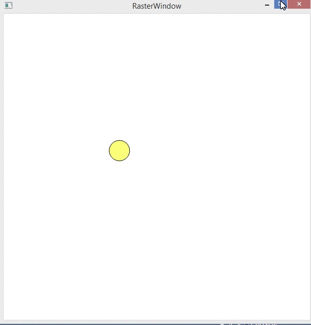

### Теоретический минимум: цикл рисования и обработки событий

В любой операционной системе оконные приложения рисуют содержимое окон непрерывно и циклически. В каждую секунду в системе происходит множество событий:

- мониторы обновляются с частотой ~60 Герц (60 кадров в секунду)
- контроллер мыши присылает уведомления об изменении положения мыши
- контроллер клавиатуры присылает состояние клавиш
- каждая программа старается получить процессорное время, чтобы выполнить свои задачи

В таких условиях операционной системе (ОС) приходится ловко манипулировать множеством событий и потоков данных. Например, около 60 раз в секунду система собирает изображения всех окон, рисует их поверх друг друга в одну картинку рабочего стола и выводит на экран.

Чтобы ОС могла выполнить свою задачу, программа должна ей помогать: вести общение с системой в режиме интерактивного диалога, реагируя на переданные окну события ввода и рисуя новые кадры со скоростью до 60 кадров в секунду.

Графические библиотеки делают это путём реализации событий рисования (paint events) в цикле событий (event loop). Qt также реализует цикл событий, запуск которого происходит внутри метода `QGuiApplication::exec()`, в этом цикле событий есть события рисования.

Однако, по умолчанию Qt старается сэкономить ресурсы и рисовать как можно реже. Чтобы реализовать анимацию, нам потребуется форсировать постоянное рисование новых кадров с частотой до 60 кадров в секунду.

### Добавляем окну свойство animating

>Код основан на примере [OpenGL Window Example](http://doc.qt.io/qt-5/qtgui-openglwindow-example.html) из документации Qt

Добавьте в класс RasterWindow новые публичные методы "isAnimating" и "setAnimating":

```cpp
bool isAnimating() const;
void setAnimating(bool isAnimating);
```

Затем добавьте булево поле для хранения данных этого свойства

```cpp
bool m_isAnimating = false;
```

>Мы используем термины "поле класса" и "свойство класса". Разница между ними в том, что термин "поле" выражает хранение данных в области памяти класса, а термин "свойство" выражает наблюдаемое извне свойство объекта. Свойство может быть реализовано с помощью поля, а может быть вычислено на лету: например, мы можем вычислить площадь прямоугольника, а не хранить её постоянно, если мы знаем ширину и высоту прямоугольника. Если у класса `Rectangle` есть метод `area()`, то внешний наблюдатель не заметит разницы между хранением поля и повторным вычислением. Поэтому "свойство" и "поле" &mdash; это разные вещи.

Реализация методов будет простой, единственный нюанс заключается в планировании (scheduling) выполнения метода render путём вызова метода renderLater:

```cpp
bool RasterWindow::isAnimating() const
{
    return m_isAnimating;
}

void RasterWindow::setAnimating(bool isAnimating)
{
    m_isAnimating = isAnimating;
    if (isAnimating)
    {
        renderLater();
    }
}
```

Самый важный трюк мы разместим в методе "renderNow". Если окно зациклено на анимацию, то после рисования кадра мы должны нарисовать новый кадр. Делать это немедленно нельзя: мы уйдём в бесконечную рекурсию, что приведёт к переполнению стека программы.

Поэтому мы будем лишь планировать перерисовку путём добавления события в очередь событий. Фактически перерисовка состоится тогда, когда на то будет воля Qt. Тем не менее, мы расчитываем на частоту порядка 60Гц (благодаря вертикальной синхронизации и её обработке в Qt).

Перейдите к методу "RasterWindow::renderNow()" и добавьте в конец метода планирование перерисовки:

```cpp
if (m_isAnimating)
{
    renderLater();
}
```

Перейдите в функцию main и добавьте вызов метода setAnimating:

```cpp
    RasterWindow window;
    window.setAnimating(true);
    window.show();
```

Соберите программу и запустите. Не видите анимации? Ну конечно, ведь её же нет! Программа рисует порядка 60 кадров в секунду, но кадры пока ешё не отличаются друг от друга.

### Добавляем класс сцены и анимацию шарика

Чтобы анимировать шарик, надо на каждом кадре изменять его местоположение. Для этого надо как минимум где-то хранить позицию шарика.

Добавлять позицию шарика в поле класса RasterWindow не стоит: во-первых класс и так стал объёмным, во-вторых хранение позиции шарика явно выбивается из абстракции, которую задаёт термин "окно".

>Каждый класс реализует один слой абстракции. Каждая функция реализует одно действие на одном слое абстракции. Если вы чувствуете, что пишете в одной функции код с разных слоёв абстракции &mdash; значит, пора выделить новую функцию. Если вы хотите добавить в класс поле или метод с другого уровня абстракции &mdash; возможно, пора выделить новый класс

Создайте файлы "PoolTableScene.h" и "PoolTableScene.cpp". В новом заголовке поместите объявление класса PoolTableScene. На этот раз комментарий лучше сохранить, т.к. он отражает предназначение класса:

```cpp
#pragma once

#include <QtGui/QPainter>

// Класс PoolTableScene реализует сцену бильярдного стола, с шариками и стенками.
class PoolTableScene
{
public:
    void update(float deltaSeconds);
    void redraw(QPainter& painter);

private:
    float m_ballPositionX = 0;
    float m_ballPositionY = 0;
};
```

Реализация PoolTableScene имеет всего три нюанса

* мы используем constexpr для определения констант
* мы используем анонимные пространства имён, чтобы при компоновке с другими файлами исходного кода не возникало конфликтов имён
    * т.е. другой файл в большой программе тоже может содержать константу BALL_SIZE, но с другим значением

```cpp
#include "PoolTableScene.h"

namespace
{
// Скорость, пикселей в секунду
constexpr float BALL_SPEED_X = 50;
constexpr float BALL_SPEED_Y = 60;
constexpr float BALL_SIZE = 40;
}

void PoolTableScene::update(float deltaSeconds)
{
    m_ballPositionX += BALL_SPEED_X * deltaSeconds;
    m_ballPositionY += BALL_SPEED_Y * deltaSeconds;
}

void PoolTableScene::redraw(QPainter& painter)
{
    painter.setRenderHint(QPainter::Antialiasing);
    painter.setBrush(QBrush(QColor(0xFA, 0xFE, 0x78)));
    painter.drawEllipse(QRectF(m_ballPositionX, m_ballPositionY, BALL_SIZE, BALL_SIZE));
}
```

### Связываем классы окна и сцены

В языке C++ работает идиома владения: каждым объектом должен кто-то владеть &mdash; либо другой объект, либо какая-то фукнция.

* если объектом уникально владеет другой объект, то объект-хозяин должен создавать этот объект и удалять его самостоятельно
    * удаление должно произойти в любом варианте удаления хозяина: нельзя расчитывать, что перед удалением хозяина будет вызван какой-либо метод, кроме деструктора
* если объектом уникально владеет функция, она должна гарантировать, что объект будет создан перед использованием и удалён при выходе из функции или даже раньше
    * удаление должно произойти даже при выбросе исключения

В Qt соблюсти эти принципы позволяет идиома parent-child. В современном C++ без Qt для той же цели служит класс "unique_ptr" и функция "make_unique". В данном случае мы следуем идиомам Qt, поэтому будем использовать отношения parent-child.

Кроме сцены нам потребуется таймер, способный замерять время, прошедшее с предыдущего кадра. Скорость работы системы может быть изменчивой, и нельзя заранее предсказать, сколько времени пройдёт с предыдущего кадра в реальных условиях. Однако, для плавной и физически корректной анимации движения нам при каждом обновлении сцен надо знать промежуток времени, прошедший с предыдущего обновления.

Для измерения времени мы будем использовать [QElapsedTimer](http://doc.qt.io/qt-5/qelapsedtimer.html), который применяется следующим способом:

```cpp
// ! код только для иллюстрации !
QElapsedTimer timer;
timer.start(); // запуск таймера, выполняется один раз

// Выполняем действие долгое время
slopOperation()

// Получаем число милисекунд, прошедших с предыдущего вызова
const uint64_t elapsedMilliseconds = timer.elapsed();

// Сбрасываем таймер и повторно запускаем
timer.restart();
```

Итак, добавьте перед определением класса RasterWindow включение заголовка 
"PoolTableScene.h", заголовка "memory", в котором определён *умный указатель* unique_ptr, и заголовка "QtCore/QElapsedTimer", в котором определён класс таймера:

```cpp
#include "PoolTableScene.h"
#include <QtCore/QElapsedTimer>
#include <memory>

class RasterWindow : public QWindow
{
    // ...
```

Затем добавьте в класс RasterWindow два новых поля и два новых приватных метода, а затем удалите метод "render":

```cpp
class RasterWindow : public QWindow
{
    // ...

private:
    void renderNow();
    void renderLater();
    void updateScene(); // обновляет состояние сцены
    void renderScene(); // перерисовывает содержимое сцены

    QBackingStore *m_backingStore = nullptr;
    std::unique_ptr<PoolTableScene> m_scene; // объект сцены
    QElapsedTimer m_updateTimer; // таймер обновления сцены
    bool m_isAnimating = false;
};
```

Метод updateScene будет содержать получение времени у таймера, перезапуск таймера и обновление сцены. В случае, если кадры рисуются слишком быстро и время, прошедшее с предыдущего кадра, оказалось меньше 1 миллисекунды, обновление сцены будет пропущено.

```cpp
void RasterWindow::updateScene()
{
    const float elapsedSeconds = float(m_updateTimer.elapsed()) / 1000.f;

    // Пропуск обновления в случае, если таймер не успел засечь прошедшее время.
    if (elapsedSeconds > 0)
    {
        m_updateTimer.restart();
        m_scene->update(elapsedSeconds);
    }
}
```

Метод renderScene будет содержать подготовку объекта QPainter, заполнение буфера кадра белым цветом и затем вызов метода `redraw()` у класса сцены.

```cpp
void RasterWindow::renderScene()
{
    QRect rect(0, 0, width(), height());
    m_backingStore->beginPaint(rect);

    QPaintDevice *device = m_backingStore->paintDevice();
    QPainter painter(device);

    painter.fillRect(0, 0, width(), height(), Qt::white);
    m_scene->redraw(painter);
    painter.end();

    m_backingStore->endPaint();
    m_backingStore->flush(rect);
}
```

Также мы изменим два существующих метода: конструктор и метод renderNow. В конструкторе мы будем создавать новый объект сцены, связывая его отношением parent-child с классом окна путём передачи указателя this:

```cpp
RasterWindow::RasterWindow(QWindow *parent)
    : QWindow(parent)
    , m_backingStore(new QBackingStore(this))
    , m_scene(std::make_unique<PoolTableScene>())
{
    setMinimumSize(QSize(600, 600));
    m_updateTimer.start();
}
```

Метод renderNow станет намного проще благодаря выделению кода в методы renderScene и updateScene:

```cpp
void RasterWindow::renderNow()
{
    if (!isExposed())
    {
        return;
    }

    updateScene();
    renderScene();

    if (m_isAnimating)
    {
        renderLater();
    }
}
```

Соберите программу и запустите её. У вас должно появиться окно, в котором будет виден движущийся шарик.


### Задание cg2.1: используем векторную алгебру

Векторная алгебра позволяет писать код выразительнее: вместо раздельных расчётов для каждой координаты вы можете складывать, умножать или обрабатывать иным путём две координаты в 2D пространстве, 3 координаты в 3D и 4 координаты в однородном представлении в 3D графике. Кроме того, современные процессоры и видеокарты (особенно видеокарты) получают ускорение за счёт использования векторных операций и векторизации. Впрочем, о векторизации вашего кода позаботится компилятор (если сможет), а вам нужно заботиться о выразительности кода.

**Задание:** перепишите код в PoolTableScene, чтобы вместо float использовалась структура "Vector2f".

Советы:
* хранить позицию удобнее в виде 2D вектора
* скорость лучше задать с помощью константного 2D вектора
* сдвиг шарика за один кадр равен произведению вектора скорости на прошедшее время, значит, пригодится оператор умножения Vector2f на float.

Определение структуры "Vector2f" показано ниже. Обратите внимание на оператор умножения скаляра на вектор, определёный в виде свободной функции.
* операция умножения вектора на скаляр является коммутативной, то есть `vector * scale = scale * vector`, поэтому определены два оператора: `Vector2f operator*(Vector2f, float)` и `Vector2f operator*(float, Vector2f)`
* оба оператора определены вне класса в виде свободных функций, т.к. по крайней мере один из них нельзя сделать методом (мы не можем объявлять методы для типа float)
* к обоим операторам добавлен `inline`, чтобы избежать нарушения [One Definition Rule](https://ru.stackoverflow.com/questions/418755/)

```cpp
#pragma once
#include <cmath>

// Структура, моделирующая двумерный вектор
struct Vector2f
{
    float x = 0;
    float y = 0;

    Vector2f() = default;

    Vector2f(float x, float y)
        : x(x), y(y)
    {
    }

    float length() const
    {
        return std::hypot(x, y);
    }

    Vector2f operator+(const Vector2f& other) const
    {
        return { x + other.x, y + other.y };
    }

    Vector2f& operator+=(const Vector2f& other)
    {
        x += other.x;
        y += other.y;
        return *this;
    }
};

inline Vector2f operator*(const Vector2f& v, float scale)
{
    return { scale * v.x, scale * v.y };
}

inline Vector2f operator*(float scale, const Vector2f& v)
{
    return v * scale;
}
```

## Численный метод против аналитического

### Численный метод: реализуем отталкивание от стенок

Чтобы шар отталкивался от стенок, мы добавим серию проверок через if.

### Аналитический метод: реализуем волновое движение

Изменим код так, чтобы вместо прямолинейного движения с отталкиванием от стенок шар двигался по синусоиде.

### Задание cg2.2: волновое движение с отталкиванием

Совместите отталкивание от стенок и волновое движение так, чтобы
