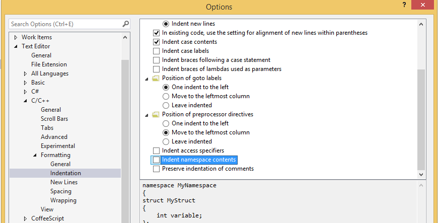
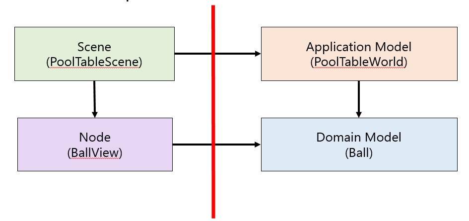

## Задание cg4.1 (общее) - настройка автоформатирования

Выполнять автоформатирование в IDE можно с помощью [плагина ClangFormat](https://marketplace.visualstudio.com/items?itemName=LLVMExtensions.ClangFormat).

>Начиная с Visual Studio 2017 версии 15.7 поддержка ClangFormat будет встроенной, плагин больше не потребуется.

После установки плагина вам становятся доступны две команды: "форматировать выделенное" и "форматировать документ"

В настройках Visual Studio рекомендуется отключить добавление отступа для содержимого namespace:

## Задание cg4.2 - спроектировать разделение Model и View для сцены с бильярдом

Составить на листе бумаги диаграмму классов для модели и отображения сцены с бильярдом. Как модели, так и отображения могут иметь свои иерархии.

Например, можно разделить следующим образом:

## Задание cg4.3 - выделить и покрыть тестами libmath

1. Перенесите классы Vector2f и Rect2f в проект libmath.
2. Обеспечьте покрытие всех методов тестами в проекте libmath_tests.

Проверить покрытие тестами можно с помощью [плагина OpenCppCoverage](https://marketplace.visualstudio.com/items?itemName=OpenCppCoverage.OpenCppCoveragePlugin)

## Задание cg4.4 - выделить и покрыть тестами libballs2d

Выделите в libballs2d классы моделей:

1. `class Ball`, представляющий физическую модель шара
    * класс моделирует круглое тело, имеющее массу, местоположение, размеры и скорость (векторные величины)
    * класс не должен уметь рисовать себя
    * все поля класса должны быть приватными
    * класс не должен быть "бескровной моделью" ([anemic domain model](https://www.martinfowler.com/bliki/AnemicDomainModel.html)), то есть не должен состоять из простых setters/getters для своих свойств
2. `class PoolTable`, представляющий физическую модель бильярдного стола, содержащего шары
    * класс содержит в себе список шаров
    * класс не должен уметь рисовать себя
    * все поля класса должны быть приватными

Обеспечьте покрытие классов тестами:

* Тесты `class Ball`, скорее всего, будут простыми и будут построены по принципу BlackBox тестирования (передаёте данные на вход, сравниваете с ожидаемым выходом)
* Тесты `class World` будут более сложными: в частности, можно проверять соблюдение законов сохранения энергии и импульса при большом количестве симуляций движенияи соударения шаров

Проверить покрытие тестами можно с помощью [плагина OpenCppCoverage](https://marketplace.visualstudio.com/items?itemName=OpenCppCoverage.OpenCppCoveragePlugin)

## Задание cg4.5 - реализовать в PoolTableApp классы отображения и связующий код

Реализуйте в проекте PoolTableApp

* классы отображения моделей Ball и PoolTable
* связующий код в "main.cpp", создающий модель, отображение и запускающий программу
