## Клонируем репозиторий, создаём ветку

Для освоения OpenGL мы будем использовать репозиторий с примерами [cg-course-2018/QtLabs2D](https://github.com/cg-course-2018/QtLabs2D). Если вы ещё не клонировали к себе этот репозиторий, клонируйте его. После этого вы можете переключиться на ветку stable в интерфейсе своего клиента git или в консоли.

>Вы должны переключиться в существующую ветку, а не в новую. Возможно, перед началом потребуется синхронизировать репозитории (`git fetch origin`).

```
git checkout stable
```

Теперь на основе ветки stable создайте ветку `tmp_{NAME}`, где вместо `{NAME}` — ваше имя на латиннице.

```
git checkout -b tmp_sergey
```

Ветку не нужно будет отправлять на удалённый репозиторий. Она временная.

## Что такое OpenGL

OpenGL — это стандарт API для рисования трёхмерной графики. В нашем курсе будем использовать OpenGL 3.x — примерно то же самое, что GLES 2.x или WebGL 1.

Посмотрите на общую историю версий графических API, чтобы понять, где мы находимся:

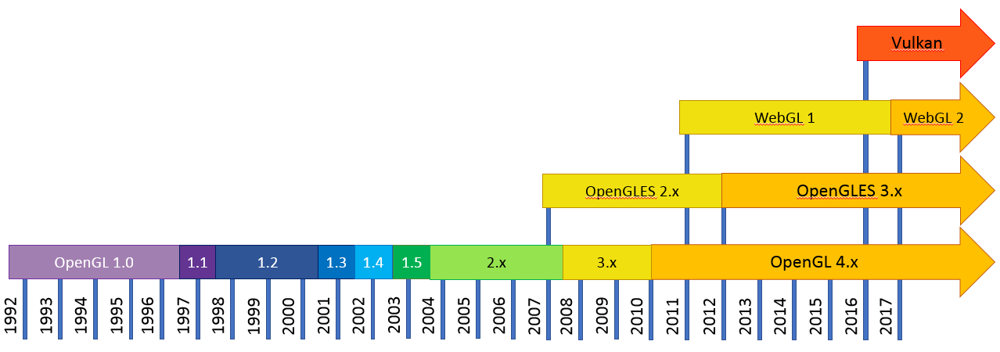

За годы, прошедшие между OpenGL 1.x и OpenGL 3.x, представления программистов о 3D-графике изменились кардинально. Было обнаружено, что программный интерфейс, разработанный для OpenGL 1.0, имеет недостаточную гибкость и потворствует потерям производительности при рисовании графики. Начиная с OpenGL 3.0, была представлена полностью новая модель программирования с использованием OpenGL, а старый способ был объявлен устаревшим.

>В последующие годы появились очередные новшества, такие как OpenGL 4.x и Vulkan. Они нацелены на сверхбыстрый параллелизм при вычислениях и на нестандартные применения видеокарт (например, для выполнения расчётов общего назначения с помощью Computing Shaders). Если же вы хотите изучить именно графику, не стоит оглядываться на OpenGL 4 и Vulkan: их использование даже в минимальных примерах требует прекрасного понимания 3D-графики, умения качественно писать многопоточный и асинхронный код, глубих знаний в системном программировании.

### OpenGL спроектирован для видеокарт

Это означает, что в OpenGL приложениях изображение рисует не центральный процессор, а множество узкоспециализированных процессоров внутри видеокарты. В редких случаях используется медленная программная растеризация: в этом случае изображение рисует центральный процессор в несколько потоков.

Современные видеокарты предоставляют огромные вычислительные возможности благодаря параллельной обработке вершин и фрагментов. Это хорошо показано на видео "CPU vs GPU" от NVIDIA:

<iframe width="560" height="315" src="https://www.youtube.com/embed/-P28LKWTzrI" frameborder="0" allowfullscreen></iframe>

Возможности OpenGL на конкретном компьютере зависят от операционной системы и от производителя драйвера. OpenGL на Linux и на Windows имеют разные возможности. OpenGL в драйверах от NVIDIA и в драйверах от Intel также различаются. Тем не менее, можно писать код, одинаково качественно работающий на любой реализации OpenGL — для этого нужно соблюдать стандарты и внимательно читать документацию используемых функций OpenGL.

### Создаём сцену для работы с OpenGL

В наборе проектов QtLabs2D из шаблона Qt GUI Application создайте новый проект приложения с названием "Sample05":

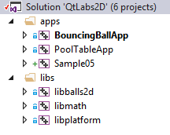

Удалите все файлы, кроме "main.cpp". Перейдите к настройкам проекта и добавьте в пути поиска заголовочных файлов путь к корню репозитория. Это можно сделать, используя переменную SolutionDir:

```
$(SolutionDir);$(IncludePath)
```

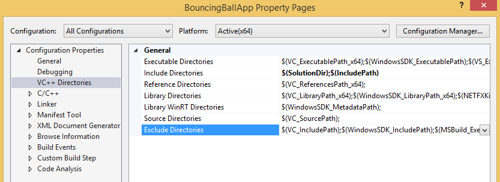

Затем нужно добавить ссылку на проект libplatform, чтобы система сборки автоматически выполняла компоновку с ним.


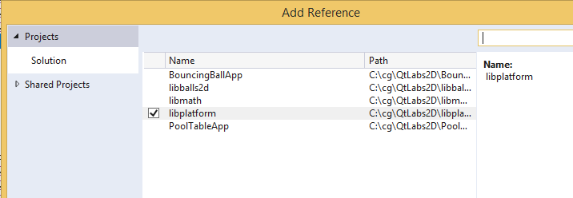

Затем перепишите в "main.cpp" следующий код:

```cpp
#include <QtWidgets/QApplication>
#include <QtWidgets/QMessageBox>
#include <libplatform/libplatform.h>
#include <iostream>

int main(int argc, char *argv[])
{
	QApplication app(argc, argv);
	try
	{
		// Окно размером 800x600, используем OpenGL Core Profile
		platform::RenderWindowOptions opts = { 800, 600, true };
		platform::RenderWindow window(opts);

		window.show();
		return app.exec();
	}
	catch (const std::exception &ex)
	{
		std::cerr << ex.what() << std::endl;
		QMessageBox::warning( 
			nullptr, 
			QLatin1String("Sample05"), 
			QString::fromUtf8(ex.what()));
	}
}
```

Наконец, соберите и запустите проект "Sample05". Программа должна собраться успешно, после запуска программы отобразится окно размерами 800x600 (вероятно, залитое чёрным цветом).

Теперь создадим и подключим класс сцены. Создайте в проекте заголовок и "*.cpp" файл для класса SimpleScene.

В заголовке "SimpleScene.h" вам нужно подключить заголовок `<libplatform/IRenderScene.h>`, и затем перегрузить методы интерфейса IRenderScene:

```cpp
class SimpleScene : public platform::IRenderScene
{
public:
	SimpleScene();

	void initialize() final;
	void update(float deltaSeconds) final;
	void redraw(unsigned width, unsigned height) final;
};
```

Реализация класса пока что будет пустой:

```cpp
#include "SimpleScene.h"

SimpleScene::SimpleScene()
{
}

void SimpleScene::initialize()
{
}

void SimpleScene::update(float deltaSeconds)
{
	(void)deltaSeconds;
}

void SimpleScene::redraw(unsigned width, unsigned height)
{
	(void)width;
	(void)height;
}
```

Теперь можно передать объект класса сцены объекту окна. В функции main добавьте соответствующую инструкцию:

```cpp
window.setScene(std::make_unique<SimpleScene>());
```

### Путаница версий OpenGL

Интерфейс OpenGL состоит из функций и констант. В новых версиях OpenGL старые функции и константы исчезали (в режиме Core Profile) либо оставались в роли устаревших (в режиме Compatibility Profile).

Для использования OpenGL предоставляется заголовок `<GL/gl.h>`. Какую версию OpenGL вы увидите в этом заголовке?

* На Windows: OpenGL 1.1, API 1997-го года
* На Android/iOS: зависит от версии NDK/SDK
* На Linux/Mac OSX: зависит от способа подключения заголовка (набора макросов) и версии ОС

Реализацию OpenGL предостаяет видеодрайвер. Это означает, что на Windows с современной видеокартой NVIDIA вам может быть доступна последняя версия OpenGL, а с древней видеокартой — только версия 2.0 или даже 1.1.

На современных Linux/Mac OSX ситуация лучше: если видеокарта устаревшая, то новые возможности OpenGL буду эмулироваться программно. Это работает медленее и нагружает центральный процессор, зато вам доступна новая версия OpenGL.

Как использовать OpenGL без привязки к версии платформы? Для этой в Qt5 есть класс QOpenGLFunctions_3_3_Core (и серия похожих классов). Вы можете унаследовать от него свой класс сцены

```cpp
class SimpleScene
	: public platform::IRenderScene
	, private QOpenGLFunctions_3_3_Core
{
	// ...
};
```

Также добавьте инициализацию функций OpenGL в метод initialize:

```cpp
void SimpleScene::initialize()
{
	QOpenGLFunctions_3_3_Core::initializeOpenGLFunctions();
}
```

### Устанавливаем glm

>Подробное описание vcpkg и список пакетов можно найти здесь: [blogs.msdn.microsoft.com/vcblog/2016/09/19/vcpkg-a-tool-to-acquire-and-build-c-open-source-libraries-on-windows](https://blogs.msdn.microsoft.com/vcblog/2016/09/19/vcpkg-a-tool-to-acquire-and-build-c-open-source-libraries-on-windows/)

Для установки библиотек мы будем использовать пакетный менеджер vcpkg. Пакетный менеджер vcpkg распространяется в исходниках и собирается на машине разработчика. Для сборки потребуется установленная Visual Studio с инструментами C++ разработчика.

Порядок установки описан в консольных командах:

```
:: Клонируем репозиторий vcpkg (ветка master)
git clone https://github.com/Microsoft/vcpkg

:: Переходим в каталог клона репозитория
cd vcpkg

:: Выполняем скрипт для сборки vcpkg
bootstrap-vcpkg.bat

:: Теперь в корне репозитория лежит vcpkg.exe, который можно вызывать
::  из каталога либо добавить в переменную окружения PATH.
```

После того, как вы получили `vcpkg.exe`, вы можете устанавливать пакеты командой `install`.

В частности, нам потребуется установить GLBinding и GLM:

```
vcpkg install glbinding:x64-windows glm:x64-windows
```

В команде, представленной выше, имена пакетов перечисляются по порядку, а в качестве суффикса используется так называемый "триплет": `имя_пакета:триплет`.

- Имя пакета задаёт одно из множества имён доступных библиотек, полный список есть в [блоге Visual C++ Team](https://blogs.msdn.microsoft.com/vcblog/2016/09/19/vcpkg-a-tool-to-acquire-and-build-c-open-source-libraries-on-windows/)
- Триплет задаёт архитектуру и режим сборки

Доступные триплеты:

```
x86-windows
x64-windows-staticx
x86-windows
x86-windows-static
arm-uwp
x64-uwp
x86-uwp
```

Для удобства использования пакетов vcpkg вы можете включить режим интеграции для всех проектов на своей машине одной командой:

```
vcpkg integrate install
```

## Как работает OpenGL

В основном OpenGL оперирует треугольниками, изображениями и состояниями драйвера рисования. Если упростить схему работы, останется пять ключевых шагов рисования каждого объекта на экране. Рассмотрим все эти шаги.

### Шаг №1 - загрузка вершин примитивов

Программист передаёт из управляющей программы массивы данных, описывающих вершины графических примитивов, то есть треугольников, линий или точек (чаще всего треугольников). Каждая фигура и каждая поверхность будет нарисована с помощью примитивов. На рисунке показано, как разбить сектор эллипса на треугольники:


### Шаг №2 - обработка вершин примитивов вершинным шейдером

На втором шаге выполняется *вершинный шейдер* (*англ.* vertex shader): он получает на вход все данные одной из вершин, а на выход обязан предоставить четырёхкомпонентный вектор с координатами вершины и набор любых других данных для фрагментного шейдера:

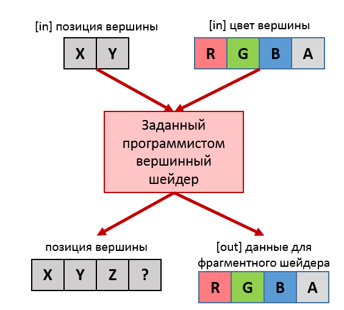

Программист заранее указывает свой вершинный шейдер. Его пишут на специальном языке GLSL, затем он компилируется видеодрайвером и выполняется прямо на видеокарте.

### Шаг №3 - интерполяция атрибутов вершин и фрагментация примитивов

Представьте, что вы рисуете треугольник на клетчатой бумаге. Какие-то клетки будут зарисованы полностью, другие — только частично, а оставшиеся не будут зарисованы вообще. Точно так же видеокарта должна определить, в какие пиксели попадает треугольник. Эти пиксели называются фрагментами.

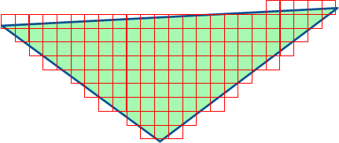

Представьте, что вы захотели сделать треугольник разноцветным, с плавным переходом от жёлтого цвета по левому краю в красный цвет на правом. В OpenGL это выполняется автоматически:
 
 - вы указываете разные цвета для каждой из вершин треугольника
 - на шаге №3 видеокарта выполняет в каждом фрагменте линейную интерполяцию, вычисляя взвешенное значение цвета или любого другого атрибута

Линейная интерполяция — это интерполяция с линейным (равномерным) изменением свойства от вершины A к вершине B. Возьмём условный параметр `t ∈ [0..1]`, описанный следующим образом:
 
 - для фрагмента, содержащего вершину A, `t = 0`
 - для фрагмента, содержащего вершину B, `t = 1`
 - для фрагмента, лежащего между A и B ровно посередине, `t = 0.5`
 - и так далее для всех фрагментов между A и B

 Линейно интерполированное свойство фрагмента будет вычисляться по формуле: `p(t) = pA ∙ (1 - t) + pB ∙ t`. Легко заметить, что эта формула работает для самих вершин A и B:
 
 - для вершины A: `p(0) = pA ∙ (1 - 0) + pB ∙ 0 = pA`
 - для вершины B: `p(1) = pA ∙ (1 - 1) + pB ∙ 1 = pB`

 Конечный результат линейной интерполяции RGBA-цвета от вершин по всему треугольнику показан на рисунке:

 

### Шаг №4 - обработка фрагментов фрагментным шейдером

На данном шаге снова вызывается пользовательский код в составе *фрагментного шейдера* (*англ.* fragment shader). Его также пишут на языке GLSL. Фрагментный шейдер получает на вход всё, что вершинный шейдер ему передал, но в преобразованном виде. Допустим, вершинный шейдер сохранил для фрагментного цвет вершины — но фрагментный шейдер оперирует фрагментами, и поэтому переданные данные также проходят линейную интерполяцию.

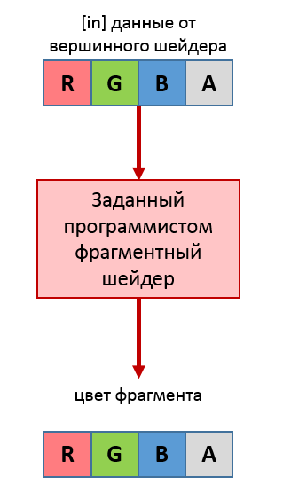

### Шаг №5 - проверки, смешивание цвета и запись в буфер кадра

На последнем шаге фрагмент проходит ряд тестов — в каждом из них видеокарта проверяет, должен ли фрагмент попасть в кадр. Например, в 3D пространстве фрагмент может быть закрыт другим геометрическим телом, и это выявляется в *тесте глубины* (*англ.* depth test).

Если проверка пройдена (что в 2D графике случается почти всегда), то фрагмент записывается в пиксель кадра. Перед эти выполняется смешивание, позволяющее наложить полупрозрачный пиксель на существующий фон кадра.

### Конвейер в целом

Все шаги конвейера изображены на единой схеме, взятой из статьи [An intro to modern OpenGL. Chapter 1: The Graphics Pipeline](http://duriansoftware.com/joe/An-intro-to-modern-OpenGL.-Chapter-1:-The-Graphics-Pipeline.html):

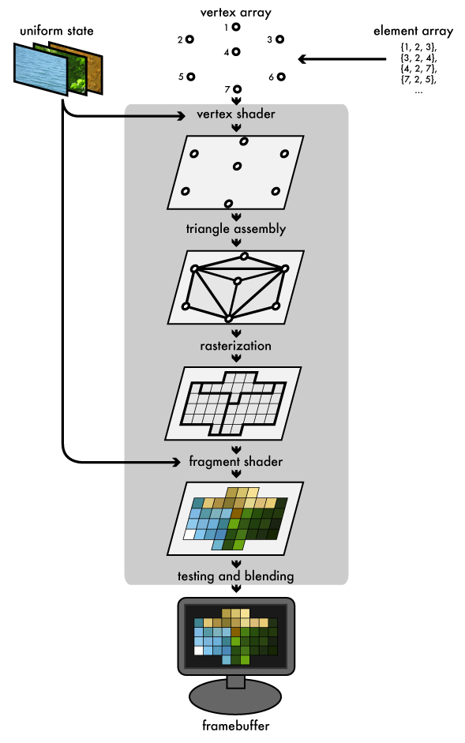

## Подготовка: RandomColorGenerator

Чтобы продемонстрировать работу интерполяции атрибутов вершин, мы будем генерировать цвета вершин случайным образом. Для этого создайте класс RandomColorGenerator. Объявление будет следующим:

```cpp
#pragma once
#include <glm/vec4.hpp>
#include <vector>
#include <random>

class RandomColorGenerator
{
public:
	RandomColorGenerator();

	glm::vec4 GenerateColor();

private:
	// Палитра цветов для выбора.
	std::vector<glm::vec4> m_palette;

	// random_device - это источник непредсказуемых псевдослучайных чисел.
	std::random_device m_rd;

	// mt19937 - это "Вихрь Мерсенна", он размножает одно псевдослучайное число,
	//  превращая в несколько по известному алгоритму.
	std::mt19937 m_generator;

	// В линейном случайном распределении вероятность появления
	//  каждого из чисел одинакова.
	std::uniform_int_distribution<size_t> m_indexDist;
};
```

Реализация генератора случайных цветов будет всего лишь выбирать цвет из готовой палитры:

```cpp
#include "RandomColorGenerator.h"

namespace
{
std::vector<glm::vec4> MakePalette()
{
	// Превращает rgb(255, 0, 128) в vec4{ 1, 0, 0.5, 1 }
	auto rgb = [](unsigned red, unsigned green, unsigned blue) {
		return glm::vec4(float(red) / 255.f, float(green) / 255.f, float(blue) / 255.f, 1);
	};

	// Цвета подобраны на сайте https://websafecolors.info/color-chart
	return {
		rgb(0, 204, 102),
		rgb(102, 102, 102),
		rgb(102, 153, 204),
		rgb(153, 255, 153),
		rgb(204, 153, 51),
		rgb(0, 255, 102),
		rgb(204, 0, 102),
		rgb(204, 102, 255),
		rgb(102, 255, 255),
		rgb(153, 255, 102),
	};
}
}

RandomColorGenerator::RandomColorGenerator()
	: m_palette(MakePalette())
	, m_generator(m_rd())
	, m_indexDist(0, m_palette.size() - 1u)
{
}

glm::vec4 RandomColorGenerator::GenerateColor()
{
	const size_t index = m_indexDist(m_generator);
	return m_palette.at(index);
}
```

## Запускаем конвейер

Перейдите к "SimpleScene.cpp" и добавьте подключение заголовков glm. Заголовки пригодятся нам для работы с векторной алгеброй.

```cpp
#include <glm/gtc/matrix_transform.hpp>
#include <glm/gtc/type_ptr.hpp>
#include <glm/vec2.hpp>
```

Создайте анонимное пространство имён и добавьте в него константы-строки, содержащие исходные коды вершинного и фрагментного шейдеров.

>Анонимное пространство имён прячет константы и функции от других единиц трансляции (cpp-файлов), тем самым избавляя вас от неожиданных конфликтов имён функций.

```cpp
namespace
{

// Этот вершинный шейдер выполняет две задачи:
//  1) передаёт цвет фрагментному шейдеру
//  2) выполняет ортографическое проецирование вершины,
//     по сути проецируя вершину на плоскость экрана.
const char kVertexShaderCode[] = R"**(#version 110
in vec2 i_position;
in vec4 i_color;
out vec4 v_color;
uniform mat4 u_projection_matrix;
void main()
{
    v_color = i_color;
    gl_Position = u_projection_matrix * vec4( i_position, 0.0, 1.0 );
}
)**";

// Этот фрагментный шейдер устанавливает фрагменту переданный из
//  вершинного шейдера цвет.
static const char kFragmentShaderCode[] = R"**(#version 110
in vec4 v_color;
void main()
{
    gl_FragColor = v_color;
}
)**";

} // anonymous namespace
```

### Компиляция шейдеров

Что такое шейдер? Это маленькая программа на языке GLSL (расшифровывается OpenGL Shading Language). Задача программы зависит от типа шейдера: вершинный шейдер трансформирует вершины, фрагментный шейдер вычисляет цвет фрагмента фигуры. Шейдер работает как чистая функция: один вход, один выход и никаких состояний (вы не можете ничего запомнить между двумя вызовами шейдера).

Компиляция шейдера выполняется во время выполнения вашей программы. Компилятор шейдеров находится в ядре видеодрайвера. Руководит компиляцией ваша программа. В OpenGL разделены понятия "шейдер" и "программа". Программа состоит из нескольких разнотипных шейдеров. Минимальная программа в OpenGL Core Profile состоит из вершинного и фрагментного шейдеров.

Общая схема компиляции шейдеров изображена ниже.

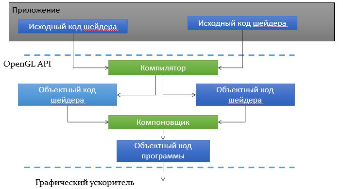

Для сборки шейдера мы будем использовать API OpenGL. Примерная схема вызовов (без обработки ошибок) выглядит следующим образом:


Добавьте классу SimpleScene три поля:

```cpp
GLuint m_vertexShader = 0;
GLuint m_fragmentShader = 0;
GLuint m_program = 0;
```

После этого в метод `initialize()` добавьте вызов нового приватного метода `initializeShaders()`, в котором будет размещена компиляция шейдеров и компоновка программы:

```cpp
void SimpleScene::initializeShaders()
{
	m_vertexShader = compileShader(GL_VERTEX_SHADER, kVertexShaderCode);
	m_fragmentShader = compileShader(GL_FRAGMENT_SHADER, kFragmentShaderCode);
	m_program = linkProgram({ m_vertexShader, m_fragmentShader });
}
```

Приватный метод compileShader будет выполнять компиляцию шейдера и проверку статуса компиляции:

```cpp
GLuint SimpleScene::compileShader(GLenum type, const std::string & source)
{
	// Выделяем ресурс шейдера
	GLuint shader = glCreateShader(type);

	// Передаём исходный код шейдера видеодрайверу
	const auto length = static_cast<int>(source.length());
	const char* sourceLine = source.data();
	glShaderSource(shader, 1, (const GLchar**)&sourceLine, &length);

	// Просим видеодрайвер скомпилировать шейдер и проверяем статус
	glCompileShader(shader);

	GLint ok = 0;
	glGetShaderiv(shader, GL_COMPILE_STATUS, &ok);
	if (ok == GL_FALSE)
	{
		// При неудаче есть лог ошибок, который мы соберём
		// и в первую очередь надо узнать длину лога.
		GLint logLength = 0;
		glGetShaderiv(shader, GL_INFO_LOG_LENGTH, &logLength);

		// Зная длину, выделяем строку нужного размера и копируем в неё лог
		std::string log(logLength, '\0');
		GLsizei ignored = 0;
		glGetShaderInfoLog(shader, log.size(), &ignored, (GLchar*)log.data());

		// Бросаем исключение, прикрепив к нему лог
		throw std::runtime_error("shader compilation failed: " + log);
	}

	return shader;
}
```

Приватный метод linkProgram выполняет компоновку программы из шейдеров:

```cpp
GLuint SimpleScene::linkProgram(const std::vector<GLuint>& shaders)
{
	// Запрашиваем у видеодрайера новый объект.
	GLuint obj = glCreateProgram();

	// Прикрепляем ранее скомпилированные шейдеры.
	for (GLuint shader : shaders)
	{
		glAttachShader(obj, shader);
	}

	// Просим видеодрайвер выполнить компоновку и проверяем статус.
	glLinkProgram(obj);

	GLint status = 0;
	glGetProgramiv(obj, GL_LINK_STATUS, &status);
	if (status == GL_FALSE)
	{
		// При неудаче есть лог ошибок, который мы соберём
		// и в первую очередь надо узнать длину лога.
		GLint logLength = 0;
		glGetProgramiv(obj, GL_INFO_LOG_LENGTH, &logLength);

		// Зная длину, выделяем строку нужного размера и копируем в неё лог
		std::string log(logLength, '\0');
		GLsizei ignored = 0;
		glGetProgramInfoLog(obj, log.size(), &ignored, (GLchar*)log.data());

		// Бросаем исключение, прикрепив к нему лог
		throw std::runtime_error("program linking failed " + log);
	}

	return obj;
}
```

В конце добавьте в деструктор SimpleScene удаление шейдерной программы и шейдеров:


```cpp
SimpleScene::~SimpleScene()
{
	glDeleteProgram(m_program);
	glDeleteProgram(m_vertexShader);
	glDeleteProgram(m_fragmentShader);
}
```

### Вершинные данные

В старых версиях OpenGL существовали стандартные атрибуты (свойства) вершин: координаты, текстурные координаты, цвет и так далее. Однако, стандартизация ограничивала возможности программиста. Поэтому в современном OpenGL вершина может иметь какие угодно числовые или векторные величины, описывающие её содержимое. Способ интерпретации вершинных данных вы определяете самостоятельно в шейдерах.

Наши шейдеры ожидают два атрибута на каждую вершину: двумерные координаты и четырёхмерный цвет (RGBA). Поэтому мы поместим в начале заголовка "SimpleScene.h" определение структуры, которую мы назовём VertexP2C4:

```cpp
struct VertexP2C4
{
	glm::vec2 xy;
	glm::vec4 rgba;
};
```

Далее мы должны сообщить драйверу видеокарты смещения атрибутов вершины в памяти. Дело в том, что на видеокарту мы будем загружать целые массивы вершин, и внутри массива будут так назваемые interleaved массивы атрибутов. Другими словами, несколько массивов атрибутов как будто бы сплетены в единый массив вершинных данных:

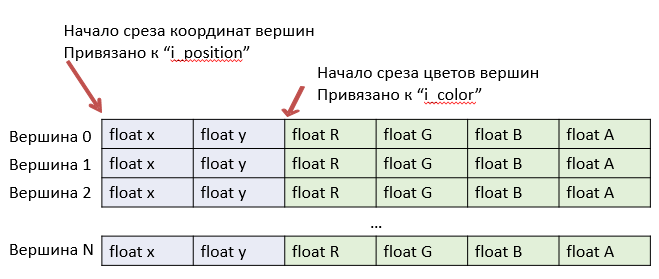

Во время компиляции шейдера видеодрайвер назначил каждому атрибуту его собственный целочисленный идентификатор. Мы должны получить у шейдерной программы идентификаторы атрибутов, а затем для каждого атрибута указать смещения в памяти, с помощью которых OpenGL сможет в непрерывном массиве памяти найти нужные байты. Этим займётся приватный метод bindVertexData:

```cpp
void SimpleScene::bindVertexData(const std::vector<VertexP2C4> &verticies)
{
	// OpenGL должен получить байтовые смещения полей относительно структуры VertexP2C4.
	const void *colorOffset = reinterpret_cast<void *>(offsetof(VertexP2C4, rgba));
	const void *posOffset = reinterpret_cast<void *>(offsetof(VertexP2C4, xy));
	const size_t stride = sizeof(VertexP2C4);

	// Привязываем атрибут i_color к данным в вершинном буфере.
	const int colorLocation = glGetAttribLocation(m_program, "i_color");
	glEnableVertexAttribArray(colorLocation);
	glVertexAttribPointer(colorLocation, glm::vec4().length(), GL_FLOAT, GL_FALSE, stride, colorOffset);

	// Привязываем атрибут i_position к данным в вершинном буфере.
	const int posLocation = glGetAttribLocation(m_program, "i_position");
	glEnableVertexAttribArray(posLocation);
	glVertexAttribPointer(posLocation, glm::vec2().length(), GL_FLOAT, GL_FALSE, stride, posOffset);

	// Загружаем данные в вершинный буфер.
	glBufferData(GL_ARRAY_BUFFER, stride * verticies.size(), verticies.data(), GL_STATIC_DRAW);
}
```

### Vertex Buffer Object и Vertex Array Object

Vertex Buffer Object - это объект видеодрайвера, представляющий область пользовательских данных на видеокарте. Для программиста VBO доступен в виде целочисленного идентификатора.

Чтобы хранить целочисленный идентификатор VBO, добавьте в SimpleScene поле `GLuint m_vbo = 0;`.

Кроме того, мы будем хранить Vertex Array Object - объект, позволяющий оптимизировать смену состояний видеодрайвера. Пока что мы используем VAO просто потому, что OpenGL требует хотя бы одного VAO, поэтому добавьте в класс ещё одно поле: `GLuint m_vao = 0;`

Затем в функцию initialize добавьте инициализацию VBO и VAO:

```cpp
// Создаём Vertex Buffer Object (VBO) для загрузки данных,
//  в этот буфер мы запишем параметры вершин для видеокарты.
glGenBuffers(1, &m_vbo);
glBindBuffer(GL_ARRAY_BUFFER, m_vbo);

// Создаём Vertex Array Object (VAO), который хранит связи между данными
//  в VBO и переменными шейдера.
glGenVertexArrays(1, &m_vao);
glBindVertexArray(m_vao);
```

В конце добавьте деструктор классу SimpleScene, который будет очищать данные:

```cpp
SimpleScene::~SimpleScene()
{
	glDeleteProgram(m_program);
	glDeleteProgram(m_vertexShader);
	glDeleteProgram(m_fragmentShader);
	glDeleteBuffers(1, &m_vbo);
	glDeleteVertexArrays(1, &m_vbo);
}
```


### Триангуляция пятиугольника

Среди всех многоугольников в компьютерной графике предпочитают выпуклые многоугольники (*англ.* convex), т.к. их проще всего разделить на треугольники. [Согласно википедии](https://ru.wikipedia.org/wiki/%D0%92%D1%8B%D0%BF%D1%83%D0%BA%D0%BB%D1%8B%D0%B9_%D0%BC%D0%BD%D0%BE%D0%B3%D0%BE%D1%83%D0%B3%D0%BE%D0%BB%D1%8C%D0%BD%D0%B8%D0%BA):

>Выпуклым многоугольником называется многоугольник, все точки которого лежат по одну сторону от любой прямой, проходящей через две его соседние вершины.

Благодаря этому мы можем разделить выпуклый многоугольник на треугольники с помощью центральной точки. Таким образом мы создадим своего рода веер треугольников.


Следует учесть, что многие вершины будут продублированы — каждая внешняя вершина входит в состав двух треугольников, но при этом треугольники могут иметь разный цвет, а цвета определяются вершинами.


Добавьте в анонимное пространство имён функции тесселяции многоугольника:

```cpp
// Генерирует список вершин треугольников для выпуклого многоугольника, заданного вершинами и центром.
//  @param center - геометрический центр многоугольника
//  @param hullPoints - вершины многоугольника
//  @param colorGen - генератор цвета полученных треугольников
std::vector<VertexP2C4> tesselateConvexByCenter(const glm::vec2& center, const std::vector<glm::vec2>& hullPoints, RandomColorGenerator& colorGen)
{
	const size_t size = hullPoints.size();
	std::vector<VertexP2C4> verticies;
	verticies.reserve(3u * size);
	for (size_t pointIndex = 0; pointIndex < size; ++pointIndex)
	{
		// Генерируем цвет треугольника и добавляем три его вершины в список.
		const glm::vec4 triangleColor = colorGen.GenerateColor();
		const size_t nextPointIndex = (pointIndex + 1) % size;
		verticies.push_back({ hullPoints.at(pointIndex), triangleColor });
		verticies.push_back({ hullPoints.at(nextPointIndex), triangleColor });
		verticies.push_back({ center, triangleColor });
	}

	return verticies;
}

// Генерирует список вершин треугольников для выпуклого многоугольника, заданного вершинами.
std::vector<VertexP2C4> tesselateConvex(const std::vector<glm::vec2>& verticies, RandomColorGenerator& colorGen)
{
	// Центр выпуклого многоугольника - это среднее арифметическое его вершин
	const glm::vec2 center = std::accumulate(verticies.begin(), verticies.end(), glm::vec2()) / float(verticies.size());
	return tesselateConvexByCenter(center, verticies, colorGen);
}
```

## Тесселяция круга

Разделить круг на треугольники легко с помощью тригонометрии: достаточно пройтись по углам от 0° до 360° с некоторым шагом, например, 1°. Каждый угол вместе с радиусом задаёт точку в полярных координатах.

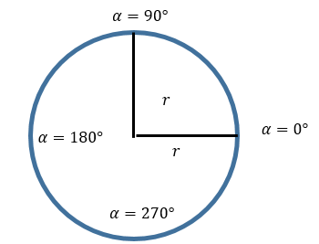

Перевести полярные координаты в декартовы очень легко — достаточно вспомнить одно из определений синуса и косинуса:


Декартовы координаты по-английски называются Эвклидовыми (euclidean), и мы назовём функцию соответствующе:

```cpp
// Переводит полярные координаты {radius, angle} в декартовы.
// Угол задаётся в радианах.
glm::vec2 euclidean(float radius, float angle)
{
	return { radius * cos(angle), radius * sin(angle) };
}
```

Теперь мы можем описать функцию для триангуляции (тесселяции) круга:

```cpp
constexpr float PI = 3.1415926f;

glm::vec2 euclidean(float radius, float angle)
{
	return { radius * cos(angle), radius * sin(angle) };
}

// Функция делит круг на треугольники,
//  возвращает массив с вершинами треугольников.
std::vector<VertexP2C4> tesselateCircle(float radius, const glm::vec2& center, RandomColorGenerator& colorGen)
{
	assert(radius > 0);

	// Круг аппроксимируется с помощью треугольников.
	// Внешняя сторона каждого треугольника имеет длину 2.
	constexpr float step = 2;
	// Число треугольников равно длине окружности, делённой на шаг по окружности.
	const auto pointCount = static_cast<unsigned>(radius * 2 * PI / step);

	// Вычисляем точки-разделители на окружности.
	std::vector<glm::vec2> points(pointCount);
	for (unsigned pi = 0; pi < pointCount; ++pi)
	{
		const auto angleRadians = static_cast<float>(2.f * PI * pi / pointCount);
		points[pi] = center + euclidean(radius, angleRadians);
	}

	return tesselateConvexByCenter(center, points, colorGen);
}
```

## Выполняем триангуляцию двух фигур

Теперь мы можем триангулировать фигуры, чтобы получить результат, который вы видите на скриншоте:

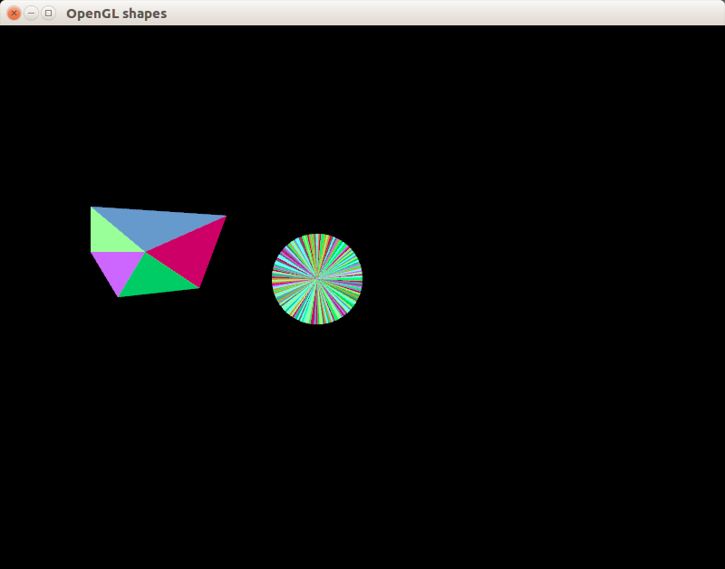

Прежде всего добавьте в SimpleScene новое поле `size_t m_trianglesCount = 0;` - позже число треугольников потребуется нам для рисования.

Добавим в main следующий код в метод initializeShapes, вызов которого надо поместить в конец метода initialize:

```cpp
void SimpleScene::initializeShapes()
{
	// Привязываем вершинный массив
	glBindVertexArray(m_vao);

	// Генерируем список вершин треугольников, представляющих круг,
	//  каждый треугольник будет раскрашен в собственный цвет.
	RandomColorGenerator colorGen;
	std::vector<VertexP2C4> verticies = tesselateCircle(50, { 350, 280 }, colorGen);

	// Генерируем список вершин треугольников, представляющих пятиугольник,
	//  добавляем его к списку вершин круга.
	const std::vector<glm::vec2> convexPoints = {
		{ 100, 200 },
		{ 250, 210 },
		{ 220, 290 },
		{ 130, 300 },
		{ 100, 250 },
	};
	const std::vector<VertexP2C4> convexVerticies = tesselateConvex(convexPoints, colorGen);
	std::copy(convexVerticies.begin(), convexVerticies.end(), std::back_inserter(verticies));

	// Выполняем привязку вершинных данных в контексте текущего VAO.
	bindVertexData(verticies);

	m_trianglesCount = verticies.size();
}
```

### Устанавливаем матрицу проецирования

Казалось бы, что может быть проще, чем наложить виртуальные координаты холста на координаты окна? Однако, OpenGL устроен иначе: он расчитан на 3D графику, в которой координаты виртуального мира не совпадают с координатами окна. Более того, начало координат OpenGL находится в нижнем левом углу, а не в верхнем левом!

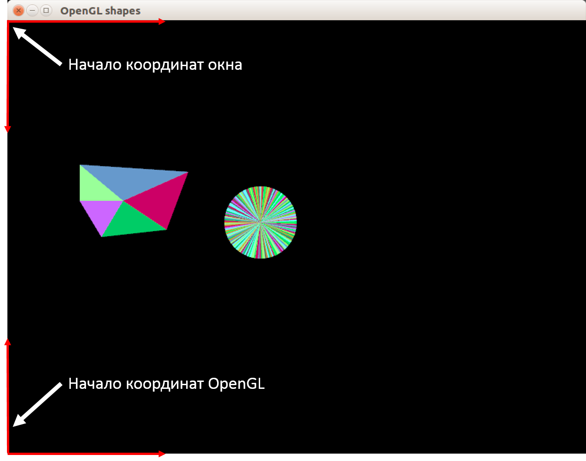

Ради нужд 3D графики все координаты вершин проецируются внутрь куба размерами 2x2x2 условных единиц с помощью матрицы проецирования. Поскольку мы хотим получить 2D координаты, да ещё и совмещённые с привычными координатами окна, нам нужна матрица орторафического проецирования, которая растянет координаты вершин обратно из куба 2x2x2 в координаты окна. Для этой цели мы напишем метод `setProjectionMatrix`, выполняющий две задачи:

- вычислить матрицу ортографического проецирования из куба на координаты окна с помощью функции [glm::ortho](http://glm.g-truc.net/0.9.1/api/a00237.html#gad25e5b029ebefac5b657861378c17aa8)
- установить эту матрицу как константу в шейдерной программе с помощью [glUniformMatrix4fv](http://docs.gl/gl3/glUniform)


```cpp
void SimpleScene::setProjectionMatrix(unsigned width, unsigned height)
{
	// Вычисляем матрицу ортографического проецирования
	const glm::mat4 mat = glm::ortho(0.f, float(width), float(height), 0.f);

	// Передаём матрицу как константу в графической программе
	glUniformMatrix4fv(glGetUniformLocation(m_program, "u_projection_matrix"), 1, GL_FALSE, glm::value_ptr(mat));
}
```

### Реализуем метод redraw

Метод redraw будет с использованием полученных размеров окна устанавливать так называемый Viewport, привязывать шейдерную программу и VAO, а затем очищть изображение, устанавливать матрицу проецирования, наконец, вызывать glDrawArrays для отрисовки всех вершин.

```cpp
void SimpleScene::redraw(unsigned width, unsigned height)
{
	glViewport(0, 0, width, height);
	glUseProgram(m_program);
	glBindVertexArray(m_vao);

	glClear(GL_COLOR_BUFFER_BIT);

	// Устанавливаем матрицу ортографического проецирования.
	setProjectionMatrix(width, height);

	// Рисуем отдельные треугольники, то есть интерпретируем массив вершин
	//  как тройки вершин треугольников
	glDrawArrays(GL_TRIANGLES, 0, m_trianglesCount);
}
```

Теперь вы наконец можете собрать, запустить и увидеть готовый результат!
