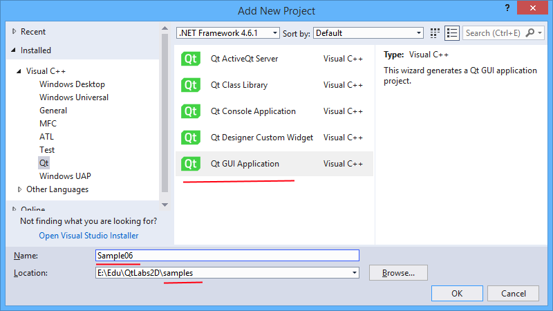
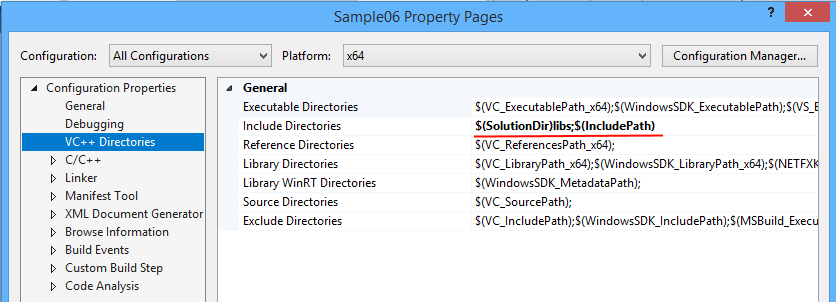
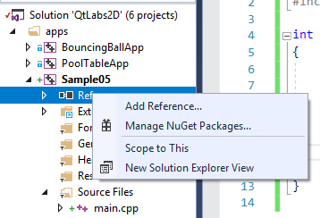
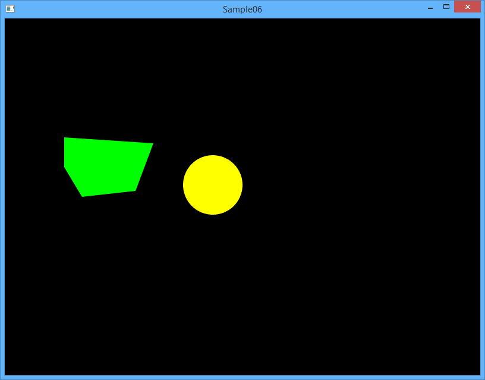
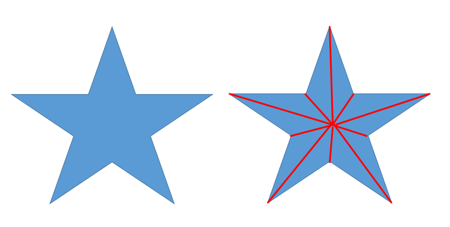
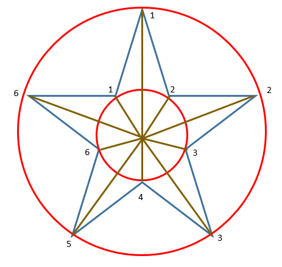
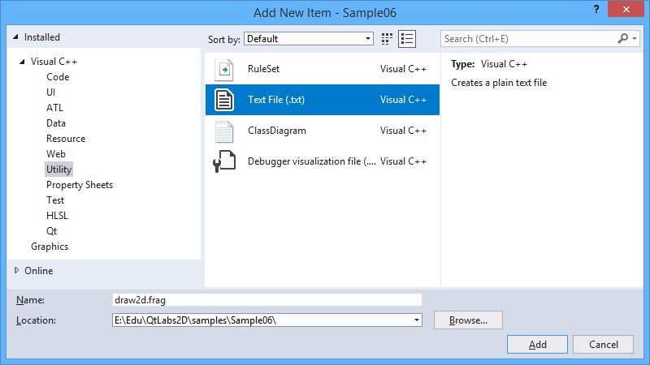
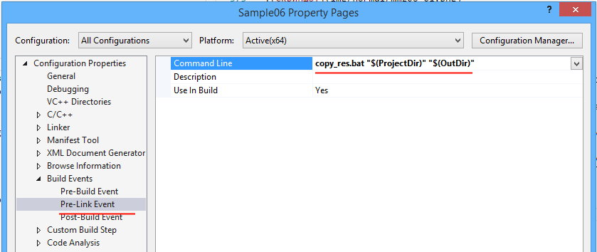
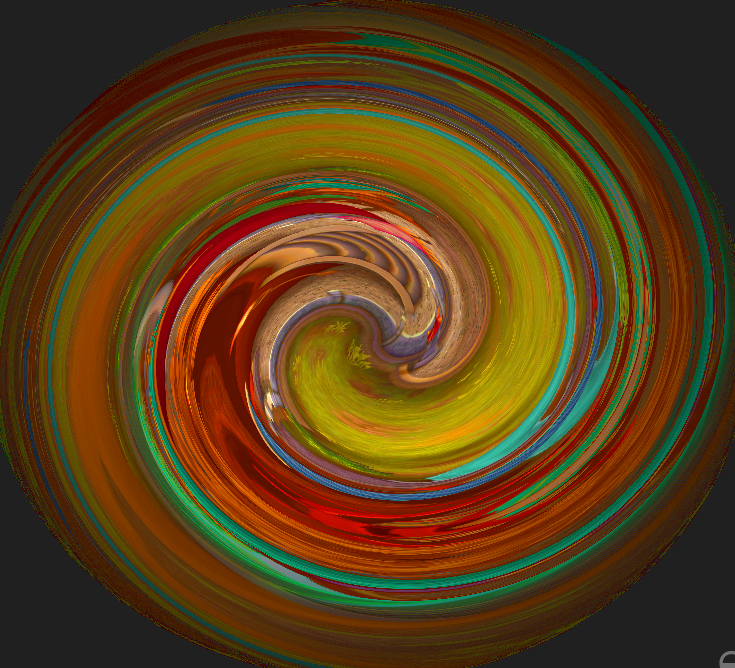
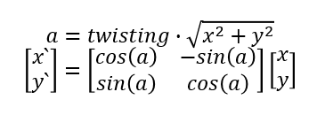

>Вам пригодится плагин [GLSL language integration](https://marketplace.visualstudio.com/items?itemName=DanielScherzer.GLSL) для Visual Studio. С этим плагином будет работать подсветка кода для GLSL (для файлов  с расширениями  glsl, frag, vert, geom, comp, tesse, tessc).

## Клонируем репозиторий, создаём ветку

Для освоения OpenGL мы будем использовать репозиторий с примерами [cg-course-2018/QtLabs2D](https://github.com/cg-course-2018/QtLabs2D). Если вы ещё не клонировали к себе этот репозиторий, клонируйте его. После этого вы можете переключиться на ветку stable в интерфейсе своего клиента git или в консоли.

>Вы должны переключиться в существующую ветку, а не в новую. Возможно, перед началом потребуется синхронизировать репозитории (`git fetch origin`).

```
git checkout stable
```

Теперь на основе ветки stable создайте ветку `tmp_{NAME}`, где вместо `{NAME}` — ваше имя на латинице. Если ветка уже существовала, удалите её.

```
git branch -D tmp_sergey
git checkout -b tmp_sergey
```

Ветку не нужно будет отправлять на удалённый репозиторий. Она временная.

## Создаём проект

В наборе проектов QtLabs2D из шаблона Qt GUI Application создайте новый проект приложения с названием "Sample06". Обратите внимание, что проект должен располагаться в подкаталоге "samples" ради наведения порядка.



При создании проекта рекомендуется установить опцию "Precompiled header":


Удалите все файлы, кроме "main.cpp", "stdafx.cpp", "stdafx.h". Перейдите к настройкам проекта и добавьте в пути поиска заголовочных файлов путь к подкаталогу "libs" в корне репозитория. Это можно сделать, используя переменную SolutionDir:

```
$(SolutionDir)libs;$(IncludePath)
```



Затем нужно добавить ссылку на проекты libplatform и libglcore, чтобы система сборки автоматически выполняла компоновку с ними.



### Создаём функцию main

Функция main возьмёт на себя следующие задачи:

* установка размеров окна и параметров OpenGL
* создание окна `RenderWindow` и сцены `SimpleScene`
* вывод текста исключения в случае фатальной ошибки

```cpp
#include "stdafx.h"

#include "SimpleScene.h"
#include <QtWidgets/QApplication>
#include <QtWidgets/QMessageBox>
#include <iostream>
#include <libplatform/libplatform.h>

int main(int argc, char *argv[])
{
	QApplication app(argc, argv);
	try
	{
		// Окно размером 800x600, используем OpenGL Core Profile и multisampling со значением 8
		QSurfaceFormat format;
		format.setVersion(3, 3);
		format.setSamples(8);
		format.setProfile(QSurfaceFormat::CoreProfile);
		format.setRenderableType(QSurfaceFormat::RenderableType::OpenGL);
		platform::RenderWindowOptions opts = { 800, 600, format };

		platform::RenderWindow window(opts);
		window.setScene(std::make_unique<SimpleScene>());

		window.show();
		return app.exec();
	}
	catch (const std::exception &ex)
	{
		std::cerr << ex.what() << std::endl;
		QMessageBox::warning(
			nullptr,
			QLatin1String("ERROR"),
			QString::fromUtf8(ex.what()));
	}
}
```

### Создаём класс сцены SimpleScene

Создайте файлы заголовка и реализации класса. Содержимое заголовка будет следующим:

```cpp
#pragma once
#include "TesselateUtils.h"
#include <libglcore/libglcore.h>
#include <libplatform/IRenderScene.h>

class SimpleScene
	: public platform::IRenderScene
{
public:
	SimpleScene();
	~SimpleScene();

	void initialize() final;
	void update(float deltaSeconds) final;
	void redraw(unsigned width, unsigned height) final;

private:
	void bindVertexData(const std::vector<VertexP2C4> &verticies);
	void initializeShaders();
	void setProjectionMatrix(unsigned width, unsigned height);

	glcore::ProgramObject m_program;
	glcore::VBO m_vbo;
	glcore::VAO m_vao;

	size_t m_vertexCount = 0;
};
```

Обратите внимание на типы данных `glcore::VBO`, `glcore::VAO`, `glcore::ProgramObject`. Эти типы данных представляют из себя RAII объекты, управляющие временем жизни ресурсов OpenGL. Вы можете ознакомиться с ними, если заглянете в исходники libglcore.

```cpp
#include "stdafx.h"

#include "SimpleScene.h"
#include <algorithm>
#include <glbinding/gl32core/gl.h>
#include <glm/gtc/matrix_transform.hpp>
#include <glm/gtc/type_ptr.hpp>
#include <glm/vec2.hpp>
#include <libplatform/ResourceLoader.h>

// Используем функции из gl32core, экспортированные библиотекой glbinding.
using namespace gl32core;

namespace
{

// Этот вершинный шейдер выполняет две задачи:
//  1) передаёт цвет фрагментному шейдеру
//  2) выполняет ортографическое проецирование вершины,
//     по сути проецируя вершину на плоскость экрана.
const char kVertexShaderCode[] = R"**(#version 110
in vec2 i_position;
in vec4 i_color;
out vec4 v_color;
uniform mat4 u_projection_matrix;
void main()
{
    v_color = i_color;
    gl_Position = u_projection_matrix * vec4(i_position, 0.0, 1.0);
}
)**";

// Этот фрагментный шейдер устанавливает фрагменту переданный из
//  вершинного шейдера цвет.
static const char kFragmentShaderCode[] = R"**(#version 110
in vec4 v_color;
void main()
{
    gl_FragColor = v_color;
}
)**";

} // anonymous namespace

SimpleScene::SimpleScene() = default;

SimpleScene::~SimpleScene() = default;

void SimpleScene::initialize()
{
	glcore::initGLBinding();
	initializeShaders();

	m_vao = glcore::createVAO();
	glBindVertexArray(m_vao);

	// Генерируем список вершин треугольников, представляющих круг,
	//  каждый треугольник будет раскрашен в собственный цвет.
	std::vector<VertexP2C4> verticies = tesselateCircle(50, { 350, 280 }, glm::vec4{ 1, 1, 0, 0 });

	// Генерируем список вершин треугольников, представляющих пятиугольник,
	//  добавляем его к списку вершин круга.
	const std::vector<glm::vec2> convexPoints = {
		{ 100, 200 },
		{ 250, 210 },
		{ 220, 290 },
		{ 130, 300 },
		{ 100, 250 },
	};
	const std::vector<VertexP2C4> convexVerticies = tesselateConvex(convexPoints, glm::vec4{ 0, 1, 0, 0 });
	std::copy(convexVerticies.begin(), convexVerticies.end(), std::back_inserter(verticies));

	// Загружаем данные в вершинный буфер.
	m_vbo = glcore::createStaticVBO(GL_ARRAY_BUFFER, verticies);

	// Выполняем привязку вершинных данных в контексте текущего VAO и VBO.
	glBindBuffer(GL_ARRAY_BUFFER, m_vbo);
	bindVertexData(verticies);

	m_vertexCount = verticies.size();
}

void SimpleScene::update(float deltaSeconds)
{
	(void)deltaSeconds;
}

void SimpleScene::redraw(unsigned width, unsigned height)
{
	glViewport(0, 0, width, height);
	glUseProgram(m_program);
	glBindVertexArray(m_vao);

	glClear(GL_COLOR_BUFFER_BIT);

	// Устанавливаем матрицу ортографического проецирования.
	setProjectionMatrix(width, height);

	glDrawArrays(GL_TRIANGLES, 0, m_vertexCount);
}

void SimpleScene::initializeShaders()
{
	std::vector<glcore::ShaderObject> shaders;
	shaders.emplace_back(glcore::compileShader(GL_VERTEX_SHADER, kVertexShaderCode));
	shaders.emplace_back(glcore::compileShader(GL_FRAGMENT_SHADER, kFragmentShaderCode));
	m_program = glcore::linkProgram(shaders);
}

void SimpleScene::bindVertexData(const std::vector<VertexP2C4> &verticies)
{
	// OpenGL должен получить байтовые смещения полей относительно структуры VertexP2C4.
	const void *colorOffset = reinterpret_cast<void *>(offsetof(VertexP2C4, rgba));
	const void *posOffset = reinterpret_cast<void *>(offsetof(VertexP2C4, xy));
	const size_t stride = sizeof(VertexP2C4);

	// Привязываем атрибут i_color к данным в вершинном буфере.
	const int colorLocation = glGetAttribLocation(m_program, "i_color");
	glEnableVertexAttribArray(colorLocation);
	glVertexAttribPointer(colorLocation, glm::vec4().length(), GL_FLOAT, GL_FALSE, stride, colorOffset);

	// Привязываем атрибут i_position к данным в вершинном буфере.
	const int posLocation = glGetAttribLocation(m_program, "i_position");
	glEnableVertexAttribArray(posLocation);
	glVertexAttribPointer(posLocation, glm::vec2().length(), GL_FLOAT, GL_FALSE, stride, posOffset);
}

void SimpleScene::setProjectionMatrix(unsigned width, unsigned height)
{
	// Вычисляем матрицу ортографического проецирования
	const glm::mat4 mat = glm::ortho(0.f, float(width), float(height), 0.f);

	// Передаём матрицу как константу в графической программе
	glUniformMatrix4fv(glGetUniformLocation(m_program, "u_projection_matrix"), 1, GL_FALSE, glm::value_ptr(mat));
}
```

После добавления сцены проект всё ещё не соберётся - не хватает заголовка `TesselateUtils.h`. Далее мы создадим его.

### Добавляем модуль TesselateUtils

Модуль TesselateUtils будет хранить процедуры, используемые для триангуляции фигур. Таким будет заголовок:

```cpp
#pragma once

#include <glm/vec2.hpp>
#include <glm/vec4.hpp>
#include <vector>

struct VertexP2C4
{
	glm::vec2 xy;
	glm::vec4 rgba;
};

// Генерирует список вершин треугольников для выпуклого многоугольника, заданного вершинами и центром.
//  @param center - геометрический центр многоугольника
//  @param hullPoints - вершины многоугольника
//  @param colorGen - генератор цвета полученных треугольников
std::vector<VertexP2C4> tesselateConvexByCenter(const glm::vec2 &center, const std::vector<glm::vec2> &hullPoints, const glm::vec4 &fillColor);

// Генерирует список вершин треугольников для выпуклого многоугольника, заданного вершинами.
std::vector<VertexP2C4> tesselateConvex(const std::vector<glm::vec2> &verticies, const glm::vec4 &fillColor);

// Функция делит круг на треугольники,
//  возвращает массив с вершинами треугольников.
std::vector<VertexP2C4> tesselateCircle(float radius, const glm::vec2 &center, const glm::vec4 &fillColor);
```

Реализация будет следующей:

```cpp
#include "stdafx.h"
#include "TesselateUtils.h"

namespace
{

constexpr float PI = 3.1415926f;

glm::vec2 euclidean(float radius, float angleRadians)
{
	return {
		radius * sin(angleRadians),
		radius * cos(angleRadians)
	};
}

} // namespace

std::vector<VertexP2C4> tesselateConvexByCenter(const glm::vec2 &center, const std::vector<glm::vec2> &hullPoints, const glm::vec4 &fillColor)
{
	const size_t size = hullPoints.size();
	std::vector<VertexP2C4> verticies;
	verticies.reserve(3u * size);
	for (size_t pointIndex = 0; pointIndex < size; ++pointIndex)
	{
		// Добавляем три вершины треугольника в список.
		const size_t nextPointIndex = (pointIndex + 1) % size;
		verticies.push_back({ hullPoints.at(pointIndex), fillColor });
		verticies.push_back({ hullPoints.at(nextPointIndex), fillColor });
		verticies.push_back({ center, fillColor });
	}

	return verticies;
}

std::vector<VertexP2C4> tesselateConvex(const std::vector<glm::vec2> &verticies, const glm::vec4 &fillColor)
{
	// Центр выпуклого многоугольника - это среднее арифметическое его вершин
	const glm::vec2 center = std::accumulate(verticies.begin(), verticies.end(), glm::vec2()) / float(verticies.size());
	return tesselateConvexByCenter(center, verticies, fillColor);
}

std::vector<VertexP2C4> tesselateCircle(float radius, const glm::vec2 &center, const glm::vec4 &fillColor)
{
	assert(radius > 0);

	// Круг аппроксимируется с помощью треугольников.
	// Внешняя сторона каждого треугольника имеет длину 2.
	constexpr float step = 2;
	// Число треугольников равно длине окружности, делённой на шаг по окружности.
	const auto pointCount = static_cast<unsigned>(radius * 2 * PI / step);

	// Вычисляем точки-разделители на окружности.
	std::vector<glm::vec2> points(pointCount);
	for (unsigned pi = 0; pi < pointCount; ++pi)
	{
		const auto angleRadians = static_cast<float>(2.f * PI * pi / pointCount);
		points[pi] = center + euclidean(radius, angleRadians);
	}

	return tesselateConvexByCenter(center, points, fillColor);
}
```

### Собираем проект

Соберите и запустите проект. Вы должны получить следующий результат:



## Задание: рисуем пятиконечную звезду

Чтобы нарисовать пятиконечную звезду, нужно:

1. Триангулировать звезду - лучше всего это сделать на шаге инициализации сцены
2. Загрузить вершинные данные списка треугольников в VBO - также на шаге инициализации сцены
3. Выполнить привязку атрибутов вершин к шейдерным переменным - также на шаге инициализации сцены
4. При рисовании кадра вызвать [glDrawArrays](http://docs.gl/gl3/glDrawArrays)

Требования:

* Процедура триангуляции должна находиться в модуле `TesselateUtils`
* Процедура триангуляции должна принимать число концов у звезды в качестве параметра
* Если концов менее 5, процедура должна вернуть пустой массив вершинных данных.

Триангуляцию рекомендуется выполнять следующим образом:



В расчёте вершин указанных треугольников вам поможет следующая подсказка:



## Загрузка шейдера из файла

Загружать шейдеры из файлов удобнее: в этом случае вы сможете хранить шейдеры в своём проекте как исходный код, разрабатывать их в удобном редакторе и затем лишь подгружать в программу.

Для загрузки шейдера из файла мы воспользуемся классом `platform::ResourceLoader`. Этот класс определён в libplatform следующим образом:

```cpp
class ResourceLoader
{
public:
	// Загружает ресурс из файла в виде строки.
	// @param relativePath - путь относительно каталога, где лежит исполняемый файл программы.
	static std::string loadAsString(const std::string &relativePath);
};
```

Доработаем метод initializeShaders, чтобы загружать шейдеры из файлов, находящихся в проекте:

```cpp
void SimpleScene::initializeShaders()
{
	platform::ResourceLoader loader;

	std::vector<glcore::ShaderObject> shaders;
	shaders.emplace_back(glcore::compileShader(GL_VERTEX_SHADER, loader.loadAsString("draw2d.vert")));
	shaders.emplace_back(glcore::compileShader(GL_FRAGMENT_SHADER, loader.loadAsString("draw2d.frag")));
	m_program = glcore::linkProgram(shaders);
}
```

Теперь мы можем добавить сами шейдеры. Добавлять их можно через шаблон "Text File", указывая собственное расширение файла:



Создайте в проекте файл "draw2d.frag" следующего содержания:

```glsl
#version 110

in vec4 v_color;

void main()
{
    gl_FragColor = v_color;
}
```

Создайте в проекте файл "draw2d.vert" следующего содержания:

```glsl
#version 110

in vec2 i_position;
in vec4 i_color;
out vec4 v_color;
uniform mat4 u_projection_matrix;

void main()
{
	v_color = i_color;
	gl_Position = u_projection_matrix * vec4(i_position, 0.0, 1.0);
}
```

Теперь соберите программу и запустите в отладчике.

О нет! Вы получили исключение при запуске. И это логично, потому что файлы были добавлены в ваш проект, а собранный `.exe` находится в другом каталоге (в каталоге "..\QtLabs2D\x64\Debug"). Мы можем решить проблему двумя путями:

* Простой и неправильный: скопировать файлы вручную
* Автоматический и правильный: написать скрипт

Скрипт можно сделать в виде bat-файла. Добавьте в проект файл "copy_res.bat" следующего содержания:

```
@echo off
echo Copying resources...

set ProjectDir=%1
set OutDir=%2

echo F | xcopy /Y "%ProjectDir%draw2d.frag" "%OutDir%draw2d.frag"
echo F | xcopy /Y "%ProjectDir%draw2d.vert" "%OutDir%draw2d.vert"
```

Теперь этот скрипт надо правильно запустить. Перейдите в настройках проекта в раздел "Build Events -> Pre-Link Event" и добавьте команду запуска `copy_res.bat "$(ProjectDir)" "$(OutDir)"`

* переменная ProjectDir будет раскрыта системой сборки в путь к исходному коду проекта
* переменная OutDir будет раскрыта системой сборки в путь к выходному каталогу



Теперь запустите повторную сборку проекта: в контекстном меню выберите "Project Only -> Link Only ...". Запустите программу &mdash; всё снова должно заработать.

Не забудьте удалить из кода константы kFragmentShaderCode и kVertexShaderCode

## Скручивание в вершинном шейдере

Нужно добавить скручивание звезды в вершинном шейдере, примерно таким образом:



Разберёмся, как это вычислить. Скручивание можно сделать пропорциональным расстоянию от точки (0, 0).

* В таком случае угол поворота точки вокруг центра будет равен произведению расстояния от точки (0, 0) и коэффициента скрутки (twisting)
* Поворот точки выполняется умножением на матрицу поворота



Начнём с вершинного шейдера, в котором мы и будем выполнять вычисления. Мы добавим в шейдер ещё одну uniform переменную `u_twisting` и, опираясь на неё, реализуем скручивание:

```glsl
#version 110

in vec2 i_position;
in vec4 i_color;
out vec4 v_color;
uniform mat4 u_projection_matrix;
uniform float u_twisting;

void main()
{
	float angle = u_twisting * length(i_position.xy);
	float s = sin(angle);
	float c = cos(angle);
	vec2 twisted_pos;
	twisted_pos.x = c * i_position.x - s * i_position.y;
	twisted_pos.y = s * i_position.x + c * i_position.y;

	v_color = i_color;
	gl_Position = u_projection_matrix * vec4(twisted_pos, 0.0, 1.0);
}
```

Теперь шейдер подготовлен, и осталось только реализовать передачу uniform переменной со стороны C++

### Передаём параметр twisting со стороны C++

Чтобы скручивание работало относительно центра окна, нам надо изменить матрицу проецирования. Возможно, потребуется также переместить фигуру-звезду в центр. В любом случае, обновите метод setProjectionMatrix:

```
void SimpleScene::setProjectionMatrix(unsigned width, unsigned height)
{
	// Вычисляем матрицу ортографического проецирования
	const glm::mat4 mat = glm::ortho(-0.5f * float(width), 0.5f * float(width), -0.5f * float(height), 0.5f * float(height));

	// Передаём матрицу как константу в графической программе
	glUniformMatrix4fv(glGetUniformLocation(m_program, "u_projection_matrix"), 1, GL_FALSE, glm::value_ptr(mat));
}
```

Запустите программу и убедитесь, что звезда находится в центре. Если нет, то вам надо поправить координаты звезды.

Добавьте в класс сцены приватный метод updateTwisting (который будет обновлять значение uniform переменной на каждом кадре) и поле m_totalTime:

```cpp
void updateTwisting();

float m_totalTime = 0;
```

Вызов `updateTwisting()` добавьте в метод redraw перед вызовом setProjectionMatrix.

В методе update добавьте обновление времени:

```cpp
void SimpleScene::update(float deltaSeconds)
{
	m_totalTime += deltaSeconds;
}
```

Мы будем вычислять коэффициент скручивания на основе периода, используя деление по модулю и отражение значения (чтобы разделить этапы увеличения/уменьшения скрутки).

Добавьте реализацию метода updateTwisting:

```cpp
void SimpleScene::updateTwisting()
{
	constexpr float kTwistingPeriodSec = 4.0f;
	constexpr float kTwistingHalfPeriodSec = 0.5f * kTwistingPeriodSec;
	constexpr float kTwistingAmplitude = 0.02f;

	const float twistingPhase = std::abs(kTwistingHalfPeriodSec - fmodf(m_totalTime, kTwistingPeriodSec)) / kTwistingHalfPeriodSec;
	const float twisting = kTwistingAmplitude * (twistingPhase - 0.25f * kTwistingPeriodSec);

	glUniform1f(glGetUniformLocation(m_program, "u_twisting"), twisting);
}
```

Запустите - и вы должны увидеть анимацию закручивания звезды.

## Задание: закручивание + масштабирование

Доработайте вершинный шейдер, чтобы помимо закручивания происходило ещё и масштабирование фигуры (от масштаба x1.0 до x2.0). Для расчёта коэффициента масштабирования используйте ту же самую uniform переменную u_twisting.

## Задание: закручивание + масштабирование + раскраска

Доработайте фрагментный шейдер, чтобы он также использовал переменную u_twisting - для того, чтобы плавно менять цвет с синего на красный. Для смешивания двух цветов используйте встроенную функцию [mix](http://docs.gl/sl4/mix)

<!--

## Фрагментный шейдер: шахматная окраска

## Задание: добавляем квадрат

Нужно добавить квадрат, который будет рисоваться с отдельным шейдером из отдельного VBO.

* Создайте ещё по одному объекту ShaderProgram, VBO, VAO в полях класса сцены
* Подготовьте триангуляцию квадрата: квадрат можно разделить на треугольники по диагонали


### Закрашиваем квадрат в шейдере

## Фрагментный шейдер: рисуем фигуры в шейдере

-->
