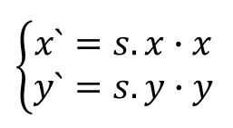
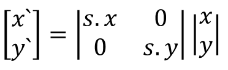
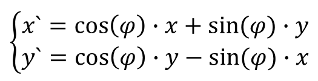
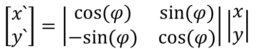
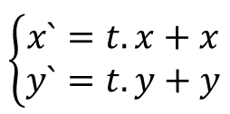
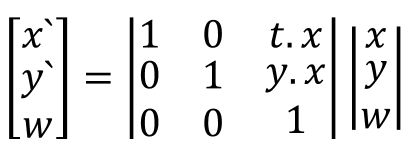
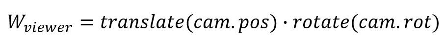
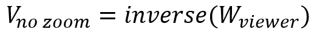
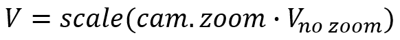

>Вам пригодится плагин [GLSL language integration](https://marketplace.visualstudio.com/items?itemName=DanielScherzer.GLSL) для Visual Studio. С этим плагином будет работать подсветка кода для GLSL (для файлов  с расширениями  glsl, frag, vert, geom, comp, tesse, tessc).

## Клонируем репозиторий, создаём ветку

Для освоения OpenGL мы будем использовать репозиторий с примерами [cg-course-2018/QtLabs2D](https://github.com/cg-course-2018/QtLabs2D). Если вы ещё не клонировали к себе этот репозиторий, клонируйте его. После этого вы можете переключиться на ветку stable в интерфейсе своего клиента git или в консоли.

>Вы должны переключиться в существующую ветку, а не в новую. Возможно, перед началом потребуется синхронизировать репозитории (`git fetch origin`).

```
git checkout stable
```

Теперь на основе ветки stable создайте ветку `tmp_{NAME}`, где вместо `{NAME}` — ваше имя на латиннице. Если ветка уже существовала, удалите её.

```
git branch -D tmp_sergey
git checkout -b tmp_sergey
```

Ветку не нужно будет отправлять на удалённый репозиторий. Она временная.

## Создаём проект

В наборе проектов QtLabs2D из шаблона Qt GUI Application создайте новый проект приложения с названием "Sample07". Обратите внимание, что проект должен располагаться в подкаталоге "samples" ради наведения порядка. При создании проекта рекомендуется установить опцию "Precompiled header":


Удалите все файлы, кроме "main.cpp", "stdafx.cpp", "stdafx.h". Перейдите к настройкам проекта и добавьте в пути поиска заголовочных файлов путь к подкаталогу "libs" в корне репозитория. Это можно сделать, используя переменную SolutionDir:

```
$(SolutionDir)libs;$(IncludePath)
```


Затем нужно добавить ссылку на проекты libplatform, libglcore и libmath, чтобы система сборки автоматически выполняла компоновку с ними.


### Создаём функцию main

Функция main возьмёт на себя следующие задачи:

* установка размеров окна и параметров OpenGL
* создание окна `RenderWindow` и сцены `AnimatedScene`
* вывод текста исключения в случае фатальной ошибки

```cpp
#include "stdafx.h"

#include "AnimatedScene.h"
#include <QtWidgets/QApplication>
#include <QtWidgets/QMessageBox>
#include <iostream>
#include <libplatform/libplatform.h>

int main(int argc, char *argv[])
{
	QApplication app(argc, argv);
	platform::CatchAndDisplay([&] {
		// Окно размером 800x600, используем OpenGL Core Profile и multisampling со значением 8
		QSurfaceFormat format;
		format.setVersion(3, 3);
		format.setSamples(8);
		format.setProfile(QSurfaceFormat::CoreProfile);
		format.setRenderableType(QSurfaceFormat::RenderableType::OpenGL);
		platform::RenderWindowOptions opts = { 800, 600, format };

		platform::RenderWindow window(opts);
		window.setScene(std::make_unique<AnimatedScene>());

		window.show();
		return app.exec();
	});
}
```


### Создаём класс сцены AnimatedScene

Создайте файлы заголовка и реализации класса. Содержимое заголовка будет следующим:

```cpp
#pragma once
#include "TesselateUtils.h"
#include <libglcore/libglcore.h>
#include <libplatform/IRenderScene.h>

class AnimatedScene
	: public platform::IRenderScene
{
public:
	AnimatedScene();
	~AnimatedScene();

	void initialize() final;
	void update(float deltaSeconds) final;
	void redraw(unsigned width, unsigned height) final;
	bool keyReleaseEvent(platform::IKeyEvent &event) final;

private:
	void bindVertexData(const std::vector<VertexP2C4> &verticies);
	void initializeShaders();
	void setProjectionMatrix(unsigned width, unsigned height);
	void animateShape(std::vector<VertexP2C4> &verticies);
	glm::vec2 animate(const glm::vec2 &point, float phase);

	glcore::ProgramObject m_program;
	glcore::VBO m_vbo;
	glcore::VAO m_vao;

	size_t m_trianglesCount = 0;
	float m_totalTime = 0;
};
```

Обратите внимание на методы `keyReleaseEvent` и `animateShape`. Эти методы в дальнейшем будут точками расширения для реализации анимации фигуры и управления камерой.

```cpp
#include "stdafx.h"
#include "AnimatedScene.h"
#include <algorithm>
#include <glbinding/gl32core/gl.h>
#include <glm/gtc/matrix_transform.hpp>
#include <glm/gtc/type_ptr.hpp>
#include <glm/vec2.hpp>
#include <libplatform/ResourceLoader.h>

namespace
{
glm::vec2 animateMoveAlongY(const glm::vec2 &point, float phase)
{
	constexpr float kAmplitudePx = 50;
	const float deviation = std::abs(0.5f - phase) / 0.5f;
	return {
		point.x,
		point.y + kAmplitudePx * deviation
	};
}
} // namespace

// Используем функции из gl32core, экспортированные библиотекой glbinding.
using namespace gl32core;

AnimatedScene::AnimatedScene() = default;

AnimatedScene::~AnimatedScene() = default;

void AnimatedScene::initialize()
{
	glcore::initGLBinding();
	initializeShaders();

	m_vao = glcore::createVAO();
	glBindVertexArray(m_vao);

	// Загружаем данные в вершинный буфер.
	m_vbo = glcore::createVBO();
}

void AnimatedScene::update(float deltaSeconds)
{
	m_totalTime += deltaSeconds;
}

void AnimatedScene::redraw(unsigned width, unsigned height)
{
	glViewport(0, 0, width, height);
	glUseProgram(m_program);
	glBindVertexArray(m_vao);

	// Генерируем список вершин треугольников, представляющих полярную розу.
	std::vector<VertexP2C4> verticies = tesselatePolarRose(100.0f, 7, glm::vec2{ 0, 0 }, glm::vec4{ 0.72, 0.2, 1, 0 });
	animateShape(verticies);

	// Загружаем вершины на видеокарту
	glcore::setStreamBufferData(m_vbo, GL_ARRAY_BUFFER, verticies);

	// Выполняем привязку вершинных данных в контексте текущего VAO и VBO.
	glBindBuffer(GL_ARRAY_BUFFER, m_vbo);
	bindVertexData(verticies);

	// Запоминаем число примитивов.
	m_trianglesCount = verticies.size();

	glClear(GL_COLOR_BUFFER_BIT);

	// Устанавливаем матрицу ортографического проецирования.
	setProjectionMatrix(width, height);

	glDrawArrays(GL_TRIANGLES, 0, m_trianglesCount);
}

bool AnimatedScene::keyReleaseEvent(platform::IKeyEvent &event)
{
	using platform::Key;

	switch (event.getKey())
	{
	case Key::Equal:
		// TODO: zoom camera in.
		break;
	case Key::Minus:
		// TODO: zoom camera out.
		break;
	case Key::Left:
		// TODO: move camera left.
		break;
	case Key::Right:
		// TODO: move camera right.
		break;
	case Key::Up:
		// TODO: move camera up.
		break;
	case Key::Down:
		// TODO: move camera down.
		break;
	}
	return false;
}

void AnimatedScene::initializeShaders()
{
	platform::ResourceLoader loader;

	std::vector<glcore::ShaderObject> shaders;
	shaders.emplace_back(glcore::compileShader(GL_VERTEX_SHADER, loader.loadAsString("draw2d.vert")));
	shaders.emplace_back(glcore::compileShader(GL_FRAGMENT_SHADER, loader.loadAsString("draw2d.frag")));
	m_program = glcore::linkProgram(shaders);
}

void AnimatedScene::bindVertexData(const std::vector<VertexP2C4> &verticies)
{
	// OpenGL должен получить байтовые смещения полей относительно структуры VertexP2C4.
	const void *colorOffset = reinterpret_cast<void *>(offsetof(VertexP2C4, rgba));
	const void *posOffset = reinterpret_cast<void *>(offsetof(VertexP2C4, xy));
	const size_t stride = sizeof(VertexP2C4);

	// Привязываем атрибут i_color к данным в вершинном буфере.
	const int colorLocation = glGetAttribLocation(m_program, "i_color");
	glEnableVertexAttribArray(colorLocation);
	glVertexAttribPointer(colorLocation, glm::vec4().length(), GL_FLOAT, GL_FALSE, stride, colorOffset);

	// Привязываем атрибут i_position к данным в вершинном буфере.
	const int posLocation = glGetAttribLocation(m_program, "i_position");
	glEnableVertexAttribArray(posLocation);
	glVertexAttribPointer(posLocation, glm::vec2().length(), GL_FLOAT, GL_FALSE, stride, posOffset);
}

void AnimatedScene::setProjectionMatrix(unsigned width, unsigned height)
{
	// Вычисляем матрицу ортографического проецирования
	const glm::mat4 mat = glm::ortho(-0.5f * float(width), 0.5f * float(width), -0.5f * float(height), 0.5f * float(height));

	// Передаём матрицу как константу в графической программе
	glUniformMatrix4fv(glGetUniformLocation(m_program, "u_projection_matrix"), 1, GL_FALSE, glm::value_ptr(mat));
}

void AnimatedScene::animateShape(std::vector<VertexP2C4> &verticies)
{
	constexpr float kAnimationPeriodSec = 2.0;
	for (auto &v : verticies)
	{
		const float phase = std::fmod(m_totalTime, kAnimationPeriodSec) / kAnimationPeriodSec;
		assert(phase >= 0.f && phase <= 1.f);
		v.xy = animate(v.xy, phase);
	}
}

glm::vec2 AnimatedScene::animate(const glm::vec2 &point, float phase)
{
	return animateMoveAlongY(point, phase);
}
```

После добавления сцены проект всё ещё не соберётся - не хватает заголовка `TesselateUtils.h`. Далее мы создадим его.

### Добавляем модуль TesselateUtils

Модуль TesselateUtils будет хранить процедуры, используемые для тесселяции (триангуляции) фигур. Таким будет заголовок:

```cpp
#pragma once

#include <glm/vec2.hpp>
#include <glm/vec4.hpp>
#include <vector>

struct VertexP2C4
{
	glm::vec2 xy;
	glm::vec4 rgba;
};

// Генерирует список вершин треугольников по методу веера треугольников, образованного центром и вершинами фигуры.
//  @param center - геометрический центр многоугольника
//  @param hullPoints - вершины фигуры
//  @param fillColor - цвет полученных треугольников
std::vector<VertexP2C4> tesselateTriangleFan(const glm::vec2 &center, const std::vector<glm::vec2> &hullPoints, const glm::vec4 &fillColor);

// Генерирует список вершин треугольников для выпуклого многоугольника, заданного вершинами.
std::vector<VertexP2C4> tesselateConvex(const std::vector<glm::vec2> &verticies, const glm::vec4 &fillColor);

// Функция делит круг на треугольники,
//  возвращает массив с вершинами треугольников.
std::vector<VertexP2C4> tesselateCircle(float radius, const glm::vec2 &center, const glm::vec4 &fillColor);

// Генерирует список вершин треугольников для фигуры Polar Rose (Полярная Роза),
//  возвращает массив с вершинами треугольников.
//  @param outerRadius - радиус окружности, описывающей полярную розу
//  @param petelsCount - число лепестков, не менее 3
//  @param center - геометрический центр фигуры
//  @param fillColor - цвет полученных треугольников
std::vector<VertexP2C4> tesselatePolarRose(float outerRadius, unsigned petelsCount, const glm::vec2 &center, const glm::vec4 &fillColor);
```

Реализация будет следующей:

```cpp
#include "stdafx.h"
#include "TesselateUtils.h"

namespace
{

constexpr float PI = 3.1415926f;

glm::vec2 euclidean(float radius, float angleRadians)
{
	return {
		radius * sin(angleRadians),
		radius * cos(angleRadians)
	};
}

} // namespace

std::vector<VertexP2C4> tesselateTriangleFan(const glm::vec2 &center, const std::vector<glm::vec2> &hullPoints, const glm::vec4 &fillColor)
{
	const size_t size = hullPoints.size();
	std::vector<VertexP2C4> verticies;
	verticies.reserve(3u * size);
	for (size_t pointIndex = 0; pointIndex < size; ++pointIndex)
	{
		// Добавляем три вершины треугольника в список.
		const size_t nextPointIndex = (pointIndex + 1) % size;
		verticies.push_back({ hullPoints.at(pointIndex), fillColor });
		verticies.push_back({ hullPoints.at(nextPointIndex), fillColor });
		verticies.push_back({ center, fillColor });
	}

	return verticies;
}

std::vector<VertexP2C4> tesselateConvex(const std::vector<glm::vec2> &verticies, const glm::vec4 &fillColor)
{
	// Центр выпуклого многоугольника - это среднее арифметическое его вершин
	const glm::vec2 center = std::accumulate(verticies.begin(), verticies.end(), glm::vec2()) / float(verticies.size());
	return tesselateTriangleFan(center, verticies, fillColor);
}

std::vector<VertexP2C4> tesselateCircle(float radius, const glm::vec2 &center, const glm::vec4 &fillColor)
{
	assert(radius > 0);

	// Круг аппроксимируется с помощью треугольников.
	// Внешняя сторона каждого треугольника имеет длину 2.
	constexpr float step = 2;
	// Число треугольников равно длине окружности, делённой на шаг по окружности.
	const auto pointCount = static_cast<unsigned>(radius * 2 * PI / step);

	// Вычисляем точки-разделители на окружности.
	std::vector<glm::vec2> points(pointCount);
	for (unsigned pi = 0; pi < pointCount; ++pi)
	{
		const auto angleRadians = static_cast<float>(2.f * PI * pi / pointCount);
		points[pi] = center + euclidean(radius, angleRadians);
	}

	return tesselateTriangleFan(center, points, fillColor);
}

std::vector<VertexP2C4> tesselatePolarRose(float outerRadius, unsigned petelsCount, const glm::vec2 &center, const glm::vec4 &fillColor)
{
	assert(outerRadius > 0);
	assert(petelsCount >= 3);

	// Фигуры аппроксимируется с помощью треугольников.
	// Внешняя сторона каждого треугольника имеет длину 2.
	constexpr float step = 2;
	// Число треугольников равно длине описанной окружности, делённой на шаг по окружности.
	const auto pointCount = static_cast<unsigned>(outerRadius * 2 * PI / step);

	// Вычисляем точки-разделители на границе фигуры.
	std::vector<glm::vec2> points(pointCount);
	for (unsigned pi = 0; pi < pointCount; ++pi)
	{
		const auto factor = static_cast<float>(petelsCount) / 2.f;
		const auto angleRadians = static_cast<float>(2.f * PI * pi / pointCount);
		const auto radius = static_cast<float>(outerRadius * std::abs(std::cos(factor * angleRadians)));

		points[pi] = center + euclidean(radius, angleRadians);
	}

	return tesselateTriangleFan(center, points, fillColor);
}
```

### Добавляем файлы шейдеров

Теперь мы можем добавить сами шейдеры. Добавлять их можно через шаблон "Text File", указывая собственное расширение файла:


Создайте в проекте файл "draw2d.frag" следующего содержания:

```glsl
#version 130

in vec4 v_color;
out vec4 out_fragColor;

void main()
{
    out_fragColor = v_color;
}
```

Создайте в проекте файл "draw2d.vert" следующего содержания:

```glsl
#version 130

in vec2 i_position;
in vec4 i_color;
out vec4 v_color;
uniform mat4 u_projection_matrix;

void main()
{
	v_color = i_color;
	gl_Position = u_projection_matrix * vec4(i_position.xy, 0.0, 1.0);
}
```

Добавьте в проект файл "copy_res.bat" следующего содержания:

```
@echo off
echo Copying resources...

set ProjectDir=%1
set OutDir=%2

echo F | xcopy /Y "%ProjectDir%draw2d.frag" "%OutDir%draw2d.frag"
echo F | xcopy /Y "%ProjectDir%draw2d.vert" "%OutDir%draw2d.vert"
```

Теперь этот скрипт надо правильно запустить. Перейдите в настройках проекта в раздел "Build Events -> Pre-Link Event" и добавьте команду запуска `copy_res.bat "$(ProjectDir)" "$(OutDir)"`

* переменная ProjectDir будет раскрыта системой сборки в путь к исходному коду проекта
* переменная OutDir будет раскрыта системой сборки в путь к выходному каталогу


### Собираем проект

Соберите и запустите проект. Вы должны получить следующий результат:


## Аффинные преобразования

Аффинные преобразования широко используются в графике, поскольку этот математический аппарат позволяет

* из объекта-шаблона нарисовать любое число объектов с любыми размерами, поворотами и местоположениями;
* выполнить анимацию составного объекта, моделируя шарнирные и другие крепления частей объекта друг к другу;
* реализовать виртуальную камеру, способную поворачиваться, передвигаться и изменять масштаб просмотра.

* Любое аффинное преобразование может быть представлено последовательностью трёх элементарных преобразований: масштабирования (scale), поворота (rotate), перемещения (translate), при условии что все операции совершаются относительно начала текущей системы координат.
* Аффинное преобразование фигуры выполняется путём применения преобразования ко всем вершинам фигуры
* Преобразование можно рассматривать как смену одной системы координат на другую систему координат

### Элементарное преобразование scale

Пусть s - вектор, представляющий коэффициенты масштабирования точки по двум осям относительно начала системы координат (коэффициенты для разных осей могут быть разными). Масштабирование точки выполняется следующим образом:



Можно также выполнить масштабирование вектора путём умножения на матрицу 2x2:

 

Напомним, как выполняется умножение матриц. Если мы умножаем M1 на M2 и получаем M3, то:

* ширина M3 равна ширине M2, высота M3 равна высоте M1
* чтобы вычислить элемент матрицы M3 в колонке №x и строке №y, нужно взять строку №y матрицы M1 и умножить покомпонентно на колонку №x матрицы M2, а затем компоненты полученного вектора сложить, получив скаляр

### Задание cg7.1: анимация отражения

>Перед выполнением задания не забудьте сделать commit. Как говорится, "сделал дело - коммить смело".

С помощью масштабирования можно отразить объект: достаточно масштабировать одну из осей на -1. Напишите свободную функцию `glm::vec2 animateFlipY(const glm::vec2& point, float phase)`, которая будет принимать два параметра

* `point` - вершина, которую надо преобразовать
* `phase` - фаза анимации, в диапазоне [0..1]

Эту функцию вы должны поместить в метод `AnimatedScene::animate` в качестве реализации анимации.

Требования:

* Функция должна масштабировать точку, равномерно изменяя коэффициент масштабирования по оси Y в зависимости от фазы от 1 до -1 и обратно.
* Для реализации `animateFlipY` вы должны написать и использовать функцию `glm::vec2 scale2d(const glm::vec2& point, const glm::vec2& s)`, которая масштабирует точку относительно начала системы координат
    * Реализовать масштабирование вы можете любым удобным методом: векторным или матричным
* В реализации функций вы не должны использовать функций библиотеки GLM, но можете использовать классы векторов и матриц из этой библиотеки на своё усмотрение

### Элементарное преобразование rotate

Пусть 𝜑 - угол вращения (в радианах), на который надо повернуть точку относительно начала системы координат.  Вращение точки выполняется следующим образом:



Можно также выполнить вращение путём умножения на матрицу 2x2:



### Задание cg7.2: анимация вращения

>Перед выполнением задания не забудьте сделать commit. Как говорится, "сделал дело - коммить смело".

Напишите новую свободную функцию `glm::vec2 animateRotate(const glm::vec2& point, float phase)`, которая будет принимать два параметра

* `point` - вершина, которую надо преобразовать
* `phase` - фаза анимации, в диапазоне [0..1]

Эту функцию вы должны поместить в метод `AnimatedScene::animate` в качестве реализации анимации.

Требования:

* Функция должна вращать точку относительно начала координат, равномерно изменяя угол вращения в зависимости от фазы от 0 до 2π и обратно до 0.
* Для реализации `animateRotate` вы должны написать и использовать функцию `glm::vec2 rotate2d(const glm::vec2& point, const glm::vec2& s)`, которая масштабирует точку относительно начала системы координат
    * Реализовать вращение вы можете любым удобным методом: векторным или матричным
* В реализации функций вы не должны использовать функций библиотеки GLM, но можете использовать классы векторов и матриц из этой библиотеки на своё усмотрение

### Элементарное преобразование translate

Пусть t - вектор, представляющий смещения точки относительно начала координат. Тогда смещение точки выполняется следующим образом:



Матричного представления преобразования translate, на первый взгляд, не существует. Однако, существует трюк, позволяющий представить в виде матриц все три типа аффинных преобразований: это однородные координаты.

### Однородные координаты

Вектора и точки на плоскости и в пространстве имеют одно различие:

* точка имеет положение
* вектор - не имеет

Другими словами, точка привязана к началу координат, а вектор может быть помещён в любом месте. Есть удобный вычислительный трюк, позволяющий унифицированно работать с векторами и точками с помощью матриц: достаточно превратить вектор из 2-х координат в вектор из 3-х координат, причём 3-я координата (обозначаемая "w") будет всегда либо нулём, либое единицей. Для точек 3-я координата равна единице, для векторов, не привязанных к началу координат, 3-я координата равна нулю.

В этом случае матрица translate будет выглядеть следующим образом:



Если вы умножите эту матрицу на `(x y w)`, третья координата останется неизменной, и это можно интерпретировать следующим образом: точка останется точкой, вектор останется вектором. Нижняя строка в однородном представлении одинакова для всех матриц аффинных преобразований, включая матрицы rotate и scale в однородном представлении.

Комбинировать матрицы в однородном представлении можно, перемножая их. Если, например, вы умножаете матрицу translate на матрицу rotate, вы получите матрицу, которая представляет комплексное преобразование, состоящее из вращения и перемещения. Порядок применения преобразований - обратный к порядку умножения матриц.

### Задание cg7.3: комплексная анимация

>Перед выполнением задания не забудьте сделать commit. Как говорится, "сделал дело - коммить смело".

Напишите новую свободную функцию `glm::vec2 animateComplex(const glm::vec2& point, float phase)`, которая будет принимать два параметра

* `point` - вершина, которую надо преобразовать
* `phase` - фаза анимации, в диапазоне [0..1]

Эту функцию вы должны поместить в метод `AnimatedScene::animate` в качестве реализации анимации.

Требования:

* Функция должна применять комплексную анимацию, эквивалентную последовательному применению следующих преобразований
    * масштабирование точки с равномерным изменением коэффициента масштабирования по оси Y в зависимости от фазы от 1 до 4 и обратно.
    * вращение точки относительно начала координат с равномерным изменением угла вращения в зависимости от фазы от 0 до 2π и обратно до 0.
    * движение точки относительно начала координат от 0 до 100px вправо и обратно.
* Реализовать комплексное преобразование вы должны методом умножения матриц элементарных преобразований
* Для этого вы должны можете использовать функции GLM: rotate, scale, translate; либо вы можете написать свои функции для создания матриц элементарных преобразований
    * они находятся в заголовке `<glm/gtx/matrix_transform_2d.hpp>`
    * документацию можно найти [на сайте glm.g-truc.net](https://glm.g-truc.net/0.9.6/api/a00209.html)

### Задание cg7.4: изменить порядок анимаций

>Перед выполнением задания не забудьте сделать commit. Как говорится, "сделал дело - коммить смело".

Создайте функцию "animateComplex2", эквивалентную функции animateComplex во всём, кроме одной детали: элементарные преобразования применяются в обратном порядке. Сравните, как выглядит анимация после изменений.

Если вы всё сделали правильно, то анимация изменится, поскольку умножение матриц не коммутативно, и применение аффинных преобразований также не коммутативно.

## Класс Transform2D

Класс Transform2D представляет аффинную трансформацию, состоящую из масштабирования, ориентирующего поворота и перемещения объекта. Этот класс избавит вас от необходимости постоянно помнить о порядке применения преобразований, и облегчит программирование систем, в которых положение, ориентация или даже размеры множества объектов постоянно меняются.

>Изучить документацию класса вы можете в отдельной статье [docs_transform2d](docs_transform2d).

### Задание cg7.5: использовать Transform2D

>Перед выполнением задания не забудьте сделать commit. Как говорится, "сделал дело - коммить смело".

Доработайте функцию animateComplex, чтобы она использовала класс Transform2D для создания преобразования, соответствующего текущей фазе анимации

## Задание cg7.6: перенести умножение на матрицу в вершинный шейдер

>Перед выполнением задания не забудьте сделать commit. Как говорится, "сделал дело - коммить смело".

Перенесите преобразование вершин в вершинный шейдер

* добавьте в вершинный шейдер uniform-переменную `uniform mat4 u_world_matrix;`, в которую вы будете записывать матрицу преобразования
* добавьте в вершинный шейдер умножение на u_world_matrix
* не забудьте о порядке умножения матриц: преобразование проецирования должно выполняться последним
* удалите код, который преобразует каждую вершину фигуры перед заполнением буфера вершин, хранимого на стороне видеокарты
* буфер вершин теперь статичный, и вы можете перенести инициализацию буфера в метод `AnimatedScene::initialize`, тем самым сэкономив на передаче данных видеокарт
* добавьте для каждого объекта на сцене в `AnimatedScene::redraw` вычисление текущей матрицы преобразования с учётом анимации
* для этого разберите функцию animate на части, часть выкиньте, а другую часть переиспользуйте для определения матрицы преобразания
* добавьте в C++ коде передачу значения uniform переменной так же, как это сделано для "u_projection_matrix", перед вызовом каждой из функций рисования каждого из объектов

## Виртуальная камера

>Если гора не идет к Магомету, то Магомет идет к горе

Позиция виртуальной камеры &mdash; это фактически позиция виртуального наблюдателя, чьим взглядом вы смотрите на 2D сцену сверху. Поворот камеры также эквивалентен повороту виртуального наблюдателя. Масштаб не так просто интерпретировать, поскольку перспективное искажение &mdash; термин из трёхмерного пространства; но в любом случае, вы можете связать с камерой масштаб просмотра 2D сцены.

Удивительно, но для реализации виртуальной камеры тоже пригождается механизм аффинных преобразований!

Чтобы изменить положение наблюдателя относительно мира, есть два способа:

* преобразовать положение наблюдателя (т.е. передвинуть/повернуть наблюдателя относительно мира)
* преобразовать положение каждой вершины виртуального мира (т.е. передвинуть/повернуть мир относительно наблюдателя)

В компьютерной графике выбирают второй способ, поскольку цель первых стадий графического конвейера - получить положение всех вершин виртуального мира относительно наблюдателя.

Преобразование камеры складывается с двумя другими преобразованиями в известную тройку с чётко фиксированным порядком применения:

1. Преобразование из локальной системы координат объекта в мировую систему координат (т.е. в глобальную систему координат виртуального мира)
2. Преобразование из мировой системы координат в систему координат наблюдателя
3. Ортографическое/перспективное преобразование, которое сворачивает трёхмерную сцену OpenGL в куб размерами 2x2x2, легко превращаемый в плоскую картинку

### Обратные матрицы - основа обратных преобразований

Преобразование из мировой системы координат в систему координат наблюдателя (с масштабированием или без) может быть выполнено умножением на матрицу. Однако, в вычислении этой матрицы есть нюанс: переход от мировых координат к координатам наблюдателя - это не то же самое, что переход от координат наблюдателя к мировым.

Давайте определимся, как перевести точку из координат наблюдателя в мировые координаты:

* Сначала выполним ориентирование, т.е. поворот в соответствии с поворотом наблюдателя
* Затем выполним перемещение, т.е. перемещение в соответствии с позицией наблюдателя

Это можно запрограммировать с помощью Transform2D, заполнив его поля и получив матрицу соответствующего преобразования. В виде формул задача будет выглядеть следующим образом:



Любое аффинное преобразование обратимо, и любая матрица аффинного преобразования имеет обратную матрицу. По определению, умножение матрицы на обратную даёт единичную матрицу. Такая матрица не преобразует координаты. В GLM для обращения матрицы есть функция [inverse](https://glm.g-truc.net/0.9.6/api/a00153.html), с её помощью можно получить матрицу преобразования в координаты наблюдателя.



Остаётся только учесть масштаб: мы можем применить масштабирование после учёта поворота/положения наблюдателя, и это значит, что соответствующую матрицу вам нужно расположить левым операндом умножения матриц.



### Задание cg7.7: добавить виртуальную камеру, управляемую горячими клавишами

>Перед выполнением задания не забудьте сделать commit. Как говорится, "сделал дело - коммить смело".

* Доработайте класс `AnimatedScene`, чтобы в нём хранилось поле `Transform2D m_cameraTransform;` для хранения преобразования из мировой системы координат в систему координат наблюдателя
    * добавьте в вершинный шейдер uniform-переменную `uniform mat4 u_view_matrix;`, в которую вы будете записывать матрицу преобразования из мировых координат в координаты наблюдателя
    * не забудьте о порядке умножения матриц: преобразование проецирования должно выполняться последним, а преобразование из локальных координат в мировые должно происходить до преобразования камеры
    * добавьте в C++ коде передачу значения uniform переменной так же, как это сделано для "u_projection_matrix"
    * добавьте вместо `// TODO: zoom camera in.` и других подобных заглушек изменение параметров камеры
