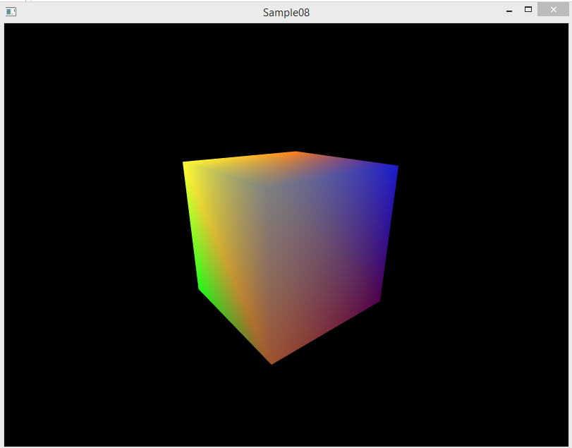
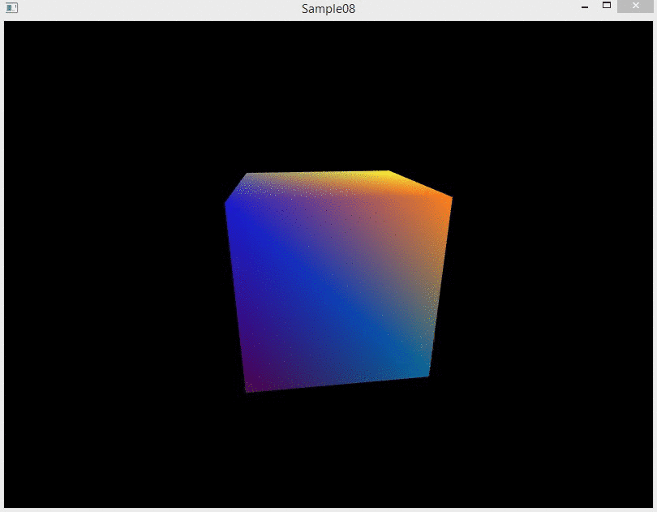
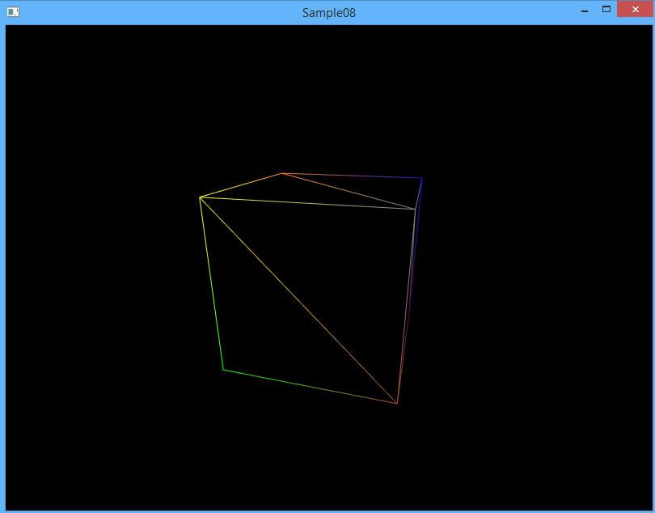
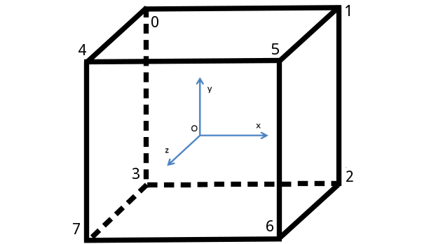
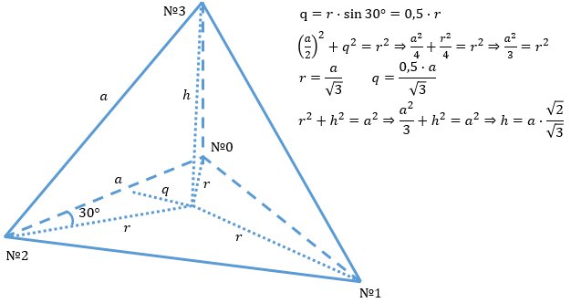
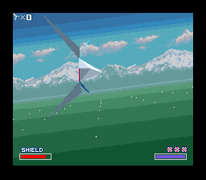

## Создаём проект

Обновите локальный репозиторий [cg-course-2018/QtLabs2D](https://github.com/cg-course-2018/QtLabs2D), переключитесь на ветку `sample08`. Затем создайте новую ветку, уникальную для вас и этого задания (например, `%фамилия%_sample08`).

Затем откройте `QtLabs2D.sln` и соберите проекты. Откройте проект Sample08 - в нём вы будете выполнять разработку. Но до этого мы доработаем заготовку проекта, чтобы добавить поддержку рендеринга в 3D пространстве. Места, где надо внести изменения, перечислены ниже; также вы можете их найти по комментариям `// TODO: ...`

### Включаем тест глубины и отсечение задних граней

Добавьте в `Simple3DScene::initialize()` настройку состояния OpenGL: включение теста глубины и отсечения задних граней.

```cpp
// Включаем тест глубины.
glEnable(GL_DEPTH_TEST);

// Включаем отсечение задних граней
glEnable(GL_CULL_FACE);
glFrontFace(GL_CCW);
glCullFace(GL_BACK);
```

Не забудьте добавить в метод рендеринга сцены очистку буфера глубины (а не только буфера цвета):

```cpp
glClear(GL_COLOR_BUFFER_BIT | GL_DEPTH_BUFFER_BIT);
```

### Устанавливаем матрицу проецирования

Чтобы выполнялось перспективное преобразование, мы должны передать в вершинный шейдер матрицу перспективного преобразования. Эта матрица будет создаваться классическим путём, который реализован в функции `glm::perspective`. Мы должны указать несколько параметров:

* fieldOfView - угол обзора зрителя
* aspect - соотношение ширины и высоты окна (чтобы изображение не искажалось по ширине или высоте)
* zNear - расстояние до ближней плоскости отсечения, больше нуля
* zFar - расстояние до дальней плоскости отсечения, больше zNear
    * Чем больше разница между zNear и zFar, тем больше погрешности вычислений глубины и больше перспективные искажения объектов, поэтому разницу между zNear и zFar желательно оставлять минимальной допустимой для вас

Добавьте в метод `Simple3DScene::setProjectionMatrix` следующий код:

```cpp
// Вычисляем матрицу перспективного проецирования.
// Затем передаём матрицу как константу в графической программе.
const float fieldOfView = glm::radians(70.f);
const float aspect = float(width) / float(height);
const float zNear = 0.05f;
const float zFar = 50.f;
const glm::mat4 mat = glm::perspective(fieldOfView, aspect, zNear, zFar);

glUniformMatrix4fv(glGetUniformLocation(m_program, "u_projection_matrix"), 1, GL_FALSE, glm::value_ptr(mat));
```

### Собираем программу

На этом этапе вы можете собрать программу и запустить её. Если всё было сделано правильно, вы увидите разноцветный куб в центре экрана.



Воспользуйтесь виртуальной камерой:

* W/A/S/D - движение камеры
* перетаскивание курсора при нажатой левой клавише мыши - поворот камеры (тангаж и рысканье)

### Добавляем вращение куба

В классе MeshP3C3 добавлено свойство `transform`. Мы будем устанавливать его перед каждым кадром. Для этого добавьте следующий код в метод `Simple3DScene::update()`:

```
// Вращаем куб вокруг оси Oy (вертикальной оси).
const float cubeRotation = glm::radians(CUBE_ROTATE_SPEED * deltaSeconds);
m_cubeTransform.rotateBy(glm::angleAxis(cubeRotation, glm::vec3{ 0, 1, 0 }));
m_cube.setTransform(m_cubeTransform);
```

На этом этапе вы можете собрать программу и запустить её. Если всё было сделано правильно, вы увидите вращающийся разноцветный куб в центре экрана.



### Включаем режим wireframe

Добавьте в метод рендеринга сцены установку в glPolygonMode в один из двух режимов: GL_FILL (по умолчанию) либо GL_LINE, в зависимости от значения поля `m_renderWireframe`:

```cpp
// Выбираем режим рендеринга треугольников: только линии (wireframe mode) либо полная заливка.
glPolygonMode(GL_FRONT_AND_BACK, m_renderWireframe ? GL_LINE : GL_FILL);
```

Соберите программу и запустите. Вы должны увидеть периодическое переключение между wireframe режимом и обычным рендерингом:



## Триангуляция тетраэдра

### Вершины куба

В чём OpenGL измеряет расстояния в трёхмерном мире? В 2D графике всё понятно: у нас есть пиксели. На трёхмерной проекции объекты одинакового размера могут дать разные проекции из-за перспективного искажения: чем дальше поверхность или линия, тем она меньше. Поэтому OpenGL измеряет расстояния в единицах измерения, не уточняя, в каких именно. Вы можете измерять в метрах, попугаях или в футах — на картинке это не имеет разницы, потому что исходные размеры не совпадают с проекциями.

Кроме того, трёхмерные тела поддаются преобразованиям. Поэтому мы будем рисовать только единичный куб и не станем заботиться о поддержке масштаба, вращения и положения центра куба. Единичный куб лежит в координатах от -1 до +1, т.е. каждое ребро имеет длину 2.

В примере вы можете найти следующий код:

```cpp
struct VertexP3C3
{
    glm::vec3 pos;
    glm::vec3 color;
};

const glm::vec3 kYellowColor = { 1.0f, 1.0f, 0.2f };
const glm::vec3 kOrangeColor = { 1.0f, 0.5f, 0.1f };
const glm::vec3 kBlueColor = { 0.f, 0.4f, 0.6f };
const glm::vec3 kGreenColor = { 0.1f, 1.0f, 0.1f };
const glm::vec3 kDarkBlueColor = { 0.1f, 0.1f, 0.8f };
const glm::vec3 kVioletColor = { 0.3f, 0.0f, 0.3f };
const glm::vec3 kLightGrayColor = { 0.5f, 0.5f, 0.5f };
const glm::vec3 kBrownColor = { 0.62f, 0.32f, 0.18f };

// Вершины куба служат материалом для формирования треугольников,
//  составляющих грани куба.
const VertexP3C3 kCubeVerticies[] = {
	{ { -1, +1, -1 }, kYellowColor },
	{ { +1, +1, -1 }, kOrangeColor },
	{ { +1, -1, -1 }, kBlueColor },
	{ { -1, -1, -1 }, kGreenColor },
	{ { -1, +1, +1 }, kLightGrayColor },
	{ { +1, +1, +1 }, kDarkBlueColor },
	{ { +1, -1, +1 }, kVioletColor },
	{ { -1, -1, +1 }, kBrownColor },
};
```

## Триангуляция куба

После того, как мы выписали список вершин куба, следует распределить вершины по треугольникам. У куба 6 квадратных граней, их можно описать 12-ю треугольниками. При этом вершины каждого треугольника следует перечислять по часовой стрелке для наблюдателя, смотрящего снаружи куба на этот треугольник. В противном случае треугольник станет поверхностью, видимой изнутри куба, что нарушает физические законы.

Процесс разделения поверхности на треугольники называют *триангуляцией* (*англ.* triangulation). Куб достаточно прост, чтобы выполнить триангуляцию в полуавтоматическом режиме. Для выполнения этой задачи сделаем визуализацию куба с вершинами, нумерованными в том же порядке, в котором они были перечислены ранее в массиве:



```cpp
// Индексы вершин задают косвенный способ получения вершины для
//  каждого из треугольников.
const glm::uvec3 kCubeIndexes[] = {
	{ 0, 1, 2 },
	{ 0, 2, 3 },
	{ 2, 1, 5 },
	{ 2, 5, 6 },
	{ 3, 2, 6 },
	{ 3, 6, 7 },
	{ 0, 3, 7 },
	{ 0, 7, 4 },
	{ 1, 0, 4 },
	{ 1, 4, 5 },
	{ 6, 5, 4 },
	{ 6, 4, 7 },
};
```

Для триангуляции куба мы должны пройтись по массивам данных и сформировать буферы вершин и индексов:

```cpp
MeshDataP3C3 tesselateCube(const Transform3D &transform)
{
	MeshDataP3C3 data;

	// Копируем вершинные данные, затем трансформируем их.
	data.vertexes.assign(std::begin(kCubeVerticies), std::end(kCubeVerticies));
	const glm::mat4 transformMat = transform.toMat4();
	for (auto &v : data.vertexes)
	{
		const glm::vec4 transformed = transformMat * glm::vec4(v.position, 1.f);
		v.position = { transformed.x, transformed.y, transformed.z };
	}

	// Копируем индексы вершин.
	data.indicies.reserve(3 * std::size(kCubeIndexes));
	for (const auto &triangleIndexes : kCubeIndexes)
	{
		data.indicies.push_back(triangleIndexes.x);
		data.indicies.push_back(triangleIndexes.y);
		data.indicies.push_back(triangleIndexes.z);
	}

	return data;
}
```

### Задание cg8.1: триангуляция тетраэдра

Куб относится к так называемым [Платоновых тел](https://ru.wikipedia.org/wiki/%D0%9F%D1%80%D0%B0%D0%B2%D0%B8%D0%BB%D1%8C%D0%BD%D1%8B%D0%B9_%D0%BC%D0%BD%D0%BE%D0%B3%D0%BE%D0%B3%D1%80%D0%B0%D0%BD%D0%BD%D0%B8%D0%BA), в число которых также входят тетраэдр, октаэдр, икосаэдр и додекаэдр.


Каждый из этих пяти многогранников является выпуклым, каждая грань является правильной двумерной фигурой, и к каждой вершине сходится одинаковое число рёбер. Такие тела обладают высокой степенью симметрии, а способы расчёта координат их вершин широко известны.

Правильный тетраэдр — это правильный многогранник, состоящий из четырёх граней, каждая из которых является правильным треугольником (с равными сторонами и равными углами по 60°). Как и другие Платоновы тела, тетраэдр является выпуклым и обладает высокой степенью симметрии. Сделав простое построение, можно аналитически рассчитать соотношения между его сторонами и особыми внутренними линиями, такими, ка высота тетраэдра (перпендикуляр из вершины к противоположной грани). Вычислим эти отношения:



Требуется добавить функцию триангуляции тетраэдра со сторонами размером √3. Список координат вершин представлен ниже, список индексов треугольников, содержащих эти вершины, вам нужно составить самостоятельно. Тетраэдр должен быть залит четырьмя разными цветами. Для этого вы можете доработать kTetrahedronVerticies в примере ниже:

```cpp
// Сторона тетраэдра равна √3,
// расстояние от центра грани до вершины равно 1.
const VertexP3C3 kTetrahedronVerticies[] = {
    {0.f, 0.f, -1.0f},
    {std::sqrt(1.5f), 0.f, 0.5f},
    {-std::sqrt(1.5f), 0.f, 0.5f},
    {0.f, std::sqrt(2.f), 0.f},
};
```

## Задание cg8.2

Изучите, что представляет из себя [Крен](https://ru.wikipedia.org/wiki/%D0%9A%D1%80%D0%B5%D0%BD) летательного аппарата. Добавьте в класс FlyingCamera новый параметр в метод rotate: `roll` (крен).

- добавьте обработку этого параметра в методе rotate
- добавьте возможность задавать крен камеры с помощью перетаскивания мыши вправо/влево при зажатой **правой** клавише мыши - для этого доработайте класс CameraController

Иллюстрация крена на 360°:



Другую иллюстрацию вы можете найти, введя в google запрос [do a barrel roll](https://www.google.com/search?q=do+a+barrel+roll&ie=utf-8&oe=utf-8).

## Задание cg8.3

Добавьте в класс CameraController возможность поворота камеры не только при перетаскивании мыши, но и по нажатию клавиш Up/Down/Left/Right на клавиатуре.

## Задание cg8.4

Используя шаблон проектирования [Декоратор](https://refactoring.guru/ru/design-patterns/decorator), разработайте класс CameraControllerDisabler со следующим интерфейсом:

```cpp
class CameraControllerDisabler final : public ICameraController
{
public:
    explicit CameraControllerDisabler(ICameraControllerPtr nested);

    // Блокирует управление камерой на N секунд.
    void disableFor(float seconds);

    void update(float deltaSeconds) final;

private:
    ICameraControllerPtr m_nested;
};
```

Блокирование управления камерой можно инициировать из метода `update` класса сцены. Добавьте блокировку управление камерой на первые 5 секунд после запуска программы.
