## Подготавливаем проект

Для тестирования освещения мы должны подготовить объекты на сцене. Лучше всего использовать несколько объектов:

* хотя бы один объект с гранями, такой как куб
* хотя бы один объект с гладкой поверхностью, такой как сфера
* возможно, какой-либо гладкий объект невыпуклой формы, такой как тор или бутылка Клейна

Для начала мы будем использовать только куб.

Обновите локальный репозиторий [cg-course-2018/QtLabs2D](https://github.com/cg-course-2018/QtLabs2D), переключитесь на ветку `sample09`. Затем создайте новую ветку, уникальную для вас и этого задания (например, `%фамилия%_sample08`).

Затем откройте `QtLabs2D.sln` и соберите проекты. Запустите Sample09 - вы должны увидеть следующее:

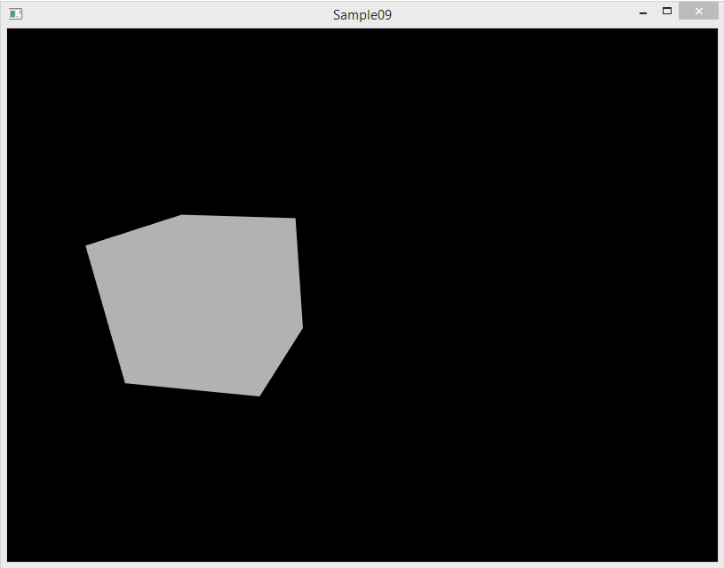

Откройте проект Sample09 - в нём вы будете выполнять разработку. Но до этого мы доработаем заготовку проекта, чтобы добавить поддержку рендеринга в 3D пространстве. Места, где надо внести изменения, перечислены ниже; также вы можете их найти по комментариям `// TODO: ...`

## Особенности реалистичного изображения

На данный момент по изображению на экране не очевидно, что это куб. Дело в том, что для создания по-настоящему реалистичного изображения, которое легко воспринимается человеческим глазом и мозгом, нужны дополнительные детали:

* Освещение объектов
    * Позволяет оценить форму, цвет и материал объектов
* Отбрасывание теней
    * Позволяет понять взаимное расположение объектов на сцене
* Оптические эффекты
    * Даёт дополнительную информацию об особенностях объекта, таких как агрегатное состояние поверхности (твёрдое тело, жидкость, газ), полупрозрачность среды поверхности

В рамках этого занятия мы вплотную займёмся освещением, отбросив тени и оптические эффекты.

## Закон Ламберта и модель освещения Lambert

Световая энергия, падающая на поверхность:

* Частично поглощается, вызывая нагревание объекта
    * При полном поглощении световой энергии тело называется абсолютно черным
* Частично отражается
    * При полном отражении световой энергии тело называется абсолютно белым
* Частично пропускается
    * При полном пропускании световой энергии тело является абсолютно прозрачным (вакуум)

Важнейшую роль в восприятии формы объекта играет отражённый свет. Из него можно выделить несколько компонентов, в частности, у реальных материалов всегда присутствует рассеивание света. Рассеивание возникает из-за огромного числа мелких неровностей на поверхности, и приводит к распространению отражённых лучей во всех направлениях без соблюдения закона отражения для всей поверхности в целом:

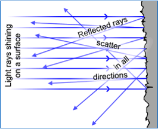

Согласно Wikipedia, [Закон Ламберта](https://ru.wikipedia.org/wiki/%D0%97%D0%B0%D0%BA%D0%BE%D0%BD_%D0%9B%D0%B0%D0%BC%D0%B1%D0%B5%D1%80%D1%82%D0%B0) - физический закон, по которому яркость рассеивающей свет (диффузной) поверхности одинакова во всех направлениях. Из этого закона следует формула для расчёта силы света, рассеиваемого плоской площадкой, пропорционально интенсивности излучения источника света, коэффициенту рассеивания материала и косинусу угла, под которым падает поток света:

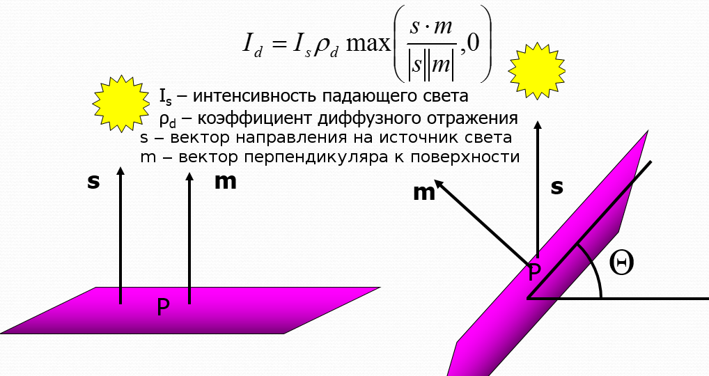

Такая формула поддаётся вычислению в шейдерах. Значит, мы можем симулировать освещение поверхности, улучшив восприятие глазом формы поверхности. Отметим, что формула, следующая из закона Ламберта, хорошо симулирует только такие материалы, как пластик и пластмасса. У металла есть дополнительные физические особенности, которые мы пока ещё не учитывали в формуле (и не будем учитывать). Таким образом, наш способ освещения будет придавать поверхностям внешний вид пластмассы. Для симуляции металлической поверхности подошла бы модель освещения Кука-Торренса (Cook-Torrance).

### Нормали к поверхности

Для корректного расчёта освещения по закону Ламберта нужны дополнительные сведения о поверхности — перпендикуляры к точкам поверхности единичной длины. Такие перпендикуляры называются *нормалями*, а процесс деления вектора на собственную длину ради получения вектора единичной длины называется *нормализацией*. Процесс нормализации выполняет, например, функция `glm::normalize` библиотеки GLM, принимающая единственным параметром нормализуемый вектор.

Нормали используются для расчёта рассеянной силы света GL_DIFFUSE по закону Ламберта: зная вектор нормали и вектор направления света, несложно вычислить угол падения лучей на поверхность. Принято вычислять нормали на CPU, и на GPU передавать готовые нормали как атрибут каждой вершины.

Как рассчитать нормаль к грани? Согласно одной из аксиом геометрии, три точки однозначно задают плоскость, и одновременно задают треугольник, лежащий на этой плоскости. Нормали к плоскости всегда имеют одно направление, то есть для всех трёх вершин плоской треугольной грани поверхности следовало бы задать в качестве атрибута "нормаль" одно и то же значение:

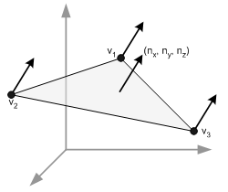

Такой подход позволит реализовать вычисление и передачу нормалей для любой поверхности с известными плоскими гранями, например, для икосаэдра:

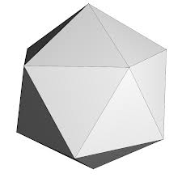

Однако, существуют и гладкие поверхности. Простейшим примером является сфера:

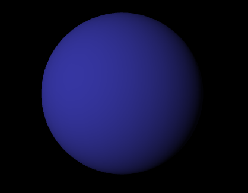

OpenGL не имеет примитивов для рисования по-настоящему гладких поверхностей. Но треугольники вместе с закраской треугольников фрагментным шейдером позволяют имитировать гладкость. Идея состоит в том, чтобы каждая нормаль каждой вершины треугольника имела собственное значение, равное значению нормали к касательной плоскости к данной точке поверхности. Тогда освещение вершин будет разным, и интерполяция освещения создаст иллюзию гладкости.

Для сферы вектора нормалей к касательным плоскостям поверхностей будут выглядеть примерно следующим образом:


### Отдельная матрица преобразования для нормалей

Для нормалей в шейдер потребуется передавать особую матрицу преобразования. Способ преобразования нормалей будет отличаться от преобразования точек поверхности. Поскольку нормаль является вектором единичной длины, то трансформации scale и translate для неё бесполезны; кроме того, неоднородное масштабирование может нарушить главное свойство нормали — перпендикулярность к плоскости, касающейся поверхности в вершине:

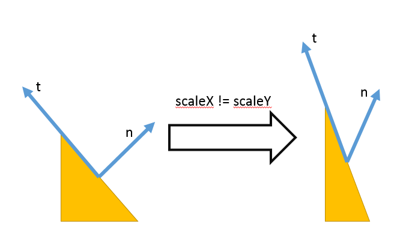 

Корректную матрицу трансформации нормалей можно получить способом, обозначенным в [ответе на вопрос "What is the gl_NormalMatrix and gl_ModelViewMatrix in shaders?" на stackoverflow](http://stackoverflow.com/questions/23210843/what-is-the-gl-normalmatrix-and-gl-modelviewmatrix-in-shaders):

```glsl
mat4 normal_matrix = transpose(inverse(u_world_matrix))
```

Мы не можем получить матрицу преобразования нормалей средствами шейдеров, поскольку в GLSL нет дорогостоящей операции обращения матрицы. Вместо того, чтобы вычислять обратную матрицу для каждой вершины и каждого фрагмента, мы будем передавать матрицу нормалей через uniform-переменную, вычисляя её силами центрального процессора с помощью GLM:

```cpp
glm::mat4 getNormalMatrix(const glm::mat4 &modelView)
{
    return glm::transpose(glm::inverse(modelView));
}
```

### Типы источников света

Источники света с разными свойствами условно делят на 3 группы:

* Направленные источники, такие как солнце, луна и звёзды
* Точечные источники, такие как лампы
* Прожекторные источники, такие как фонари и прожекторы

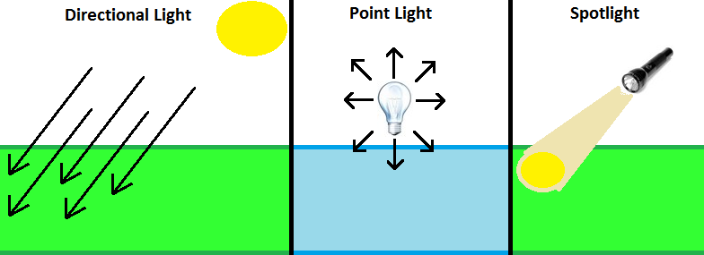

Симуляция каждого из источников имеет свои особенности. Например, для точечных и прожекторных источников потребовалось бы учесть взаимное положение источника и поверхности, а для прожекторных - ещё и конус распространения света.

### Шейдер lambert_lighting

Шейдеры `lambert_lighting.vert` и `lambert_lighting.frag` реализуют модель освещения Ламберта, в том числе:

* вершинный шейдер принимает атрибут нормалей к поверхности `i_normal` и преобразуют его в `v_normal`, который затем будет интерполирован по всем фрагментам и передан фрагментному шейдеру
* фрагментный шейдер использует структуры `LightSource` и `Material` для описания материала поверхности, и поддерживает два источника света, передаваемые через uniform переменные
* в функции calculateDiffuseIntensity реализован расчёт интенсивности рассеянного освещения по закону Ламберта

В классе `LightingScene` этот шейдер ассоциирован с полем `m_programLambert`. Перейдите в метод `LightingScene::initializeShaders()` и включите шейдер, заменив указатель на активный шейдер `m_activeProgram`:

```cpp
m_activeProgram = &m_programLambert;
```

Пересоберите и запустите программу. Вы увидите освещённый сверху куб:

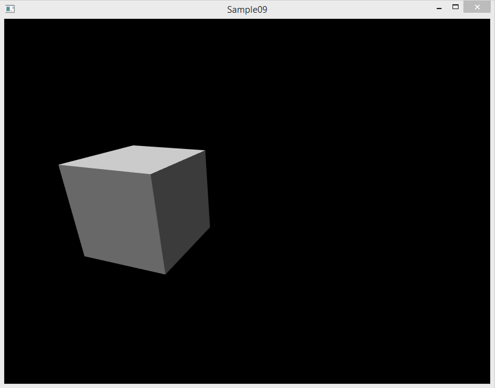

### Расчёт освещения от окружения (ambient light)

Запустите программу снова и поверните камеру так, чтобы была видна задняя сторона куба. Вы увидите примерно следующее:

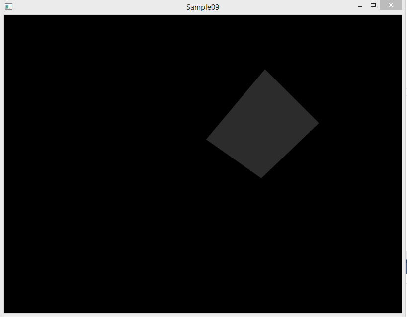

Как вы видите, расчёт рассеянного освещения по закону Ламберта даёт неприятный эффект: обратная по отношению к источнику света сторона объекта не освещена. В реальном мире рассеянный свет отражается множество раз от различны объектов даже те поверхности, на которые не попадают прямые лучи от источника света.

Таким образом, хорошая модель освещения должна учитывать свет, рассеянный окружением объекта. Такая компонента цвета называется ambient. Есть два популярных способа вычислить эту компоненту:

* принять за константу: считать, что в пределах одной сцены ambient цвет одинаков в любой точке
* вычислять трассировкой лучей: выпускать лучи из объекта (например, в 6 направлениях вперёд/назад/влево/вправо/вверх/вниз) и считать, сколько лучей не пересекается с другими объектами: чем больше лучей уходит в бесконечность без пересечений, тем интенсивнее ambient light

Второй способ расчёта известен также как ambient occlusion, и его эффект изображён ниже:

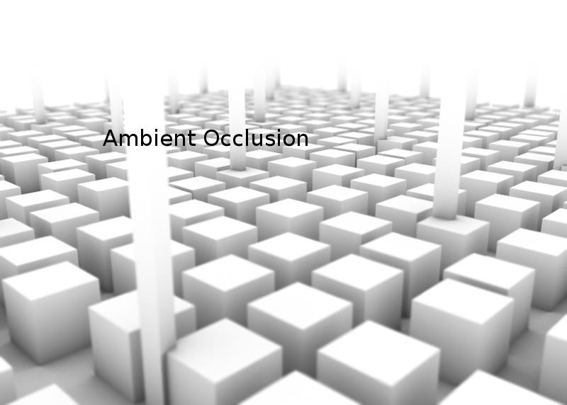

Мы не будем использовать ambient occlusion, т.к. для нас это ненужное усложнение. Вместо ambient occlusion мы будем использовать константный ambient light, и назовём его `emission`. Фактически это будет цвет собственного свечения материала, и мы будем хранить его в поле `emission` материалов поверхностей.

## Задание cg9.1: включаем компоненту цвета emission

Найдите в коде два TODO со следующим текстом и выполните то, что в них предложено:

```
// TODO: замените значения emission цвета на 0.15, 0.15, 0.15, 1
```

Запустите программу снова и поверните камеру так, чтобы была видна задняя сторона куба. Теперь задняя сторона тоже должна быть немного освещена.

## Задание cg9.1: включаем и улучшаем точечный источник света

В программе уже есть поддержка точечных источников света, и даже есть дополнительный источник красного света. Найдите и раскомментируйте следующие фрагменты кода:

```cpp
// TODO: включите снова источник света №1
// utils::setLightSource1(*m_activeProgram, m_rightLight);
```

```cpp
// TODO: раскомментируйте рисование визуализации источника света.
// m_rightLightSphere.updateUniforms(*m_activeProgram);
// m_rightLightSphere.draw();
```

Пересоберите и запустите программу, и вы увидите как эффект от источника света m_rightLight, так и его визуализацию в виде объекта m_rightLightSphere:

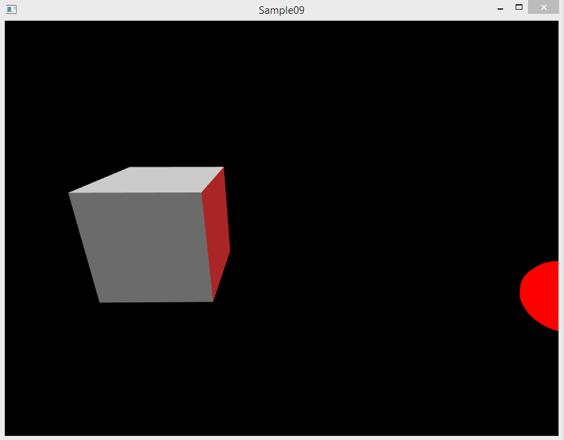

Ваша задача - заставить источник света двигаться вокруг сцены по кругу вдоль плоскости OXZ. Для расчёта круговой траектории вам может помочь переход из полярных координат в декартовы. Вам потребуется, как минимум, сделать следующее:

* провести доработки, связанные с `m_rightLight` (моделью источника света) и `m_rightLightSphere` (визуализацией источника света)
* перенести некоторые вызовы из метода инициализации сцены в метод `redraw` класса сцены

## Задание cg9.2: раскрасить куб

Найдите в коде места, связанные с материалом поверхности, поиском по ключевому слову "Material". Разберитесь, как цвет материала передаётся в шейдер и влияет на цвет поверхности. Раскрасьте куб в жёлтый цвет.

## Задание cg9.3: включить и раскрасить сферу

Найдите в коде следующий фрагмент и раскомментируйте его:

```cpp
// TODO: раскомментируйте рисование серой сферы.
// m_sphere.updateUniforms(*m_activeProgram);
// m_sphere.draw();
```

Соберите и запустите программу. Вы должны увидеть следующее:

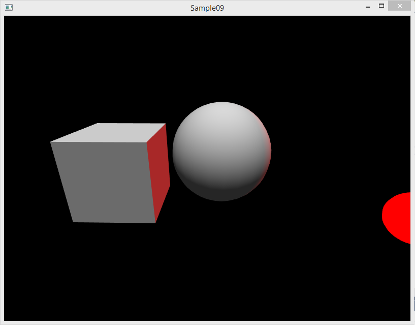

Разберитесь, как цвет материала сферы передаётся в шейдер и влияет на цвет поверхности. Раскрасьте сферу в зелёный цвет `{0, 1, 0}`.

Будут ли после этого на сфере видны красные блики? Измените цвет сферы так, чтобы лёгкие красные блики были видны, но цвет поверхности оставался зелёным (например, светло-зелёным или тёмно-зелёным).

## Модель освещения Фонга (Phong)

Модель Ламберта имеет недостатки. Мы улучшим эту модель, доработав её до модели Фонга.

В модели освещения Фонга финальный цвет фрагмента выбирается путём вычисления суммарного эффекта трёх категорий освещения: фоновый свет (ambient light), рассеянный свет (diffuse light) и блики (specular light). 
Вот так выглядят три компонента и результат их сложения:


Компонент Specular (световые блики) имитирует резкое повышение интенсивности отражения в тех точках, для которых угол падения лучей света практически равен углу между поверхностью и направлением на наблюдателя.

Вычислить прибавку цвета от бликов можно по следующей формуле:

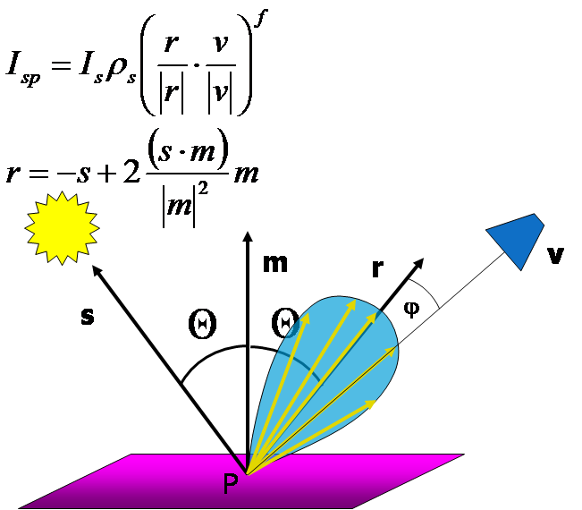

>Строго говоря, существует как минимум два метода расчёта бликов: модель Фонга (Phong) и модель Блинна-Фонга (Blinn-Phong). Они имеют схожую вычислительную сложность и схожий внешний вид, более того, их часто путают между собой.

## Задание cg9.4: модель освещения Фонга

Модель освещения Фонга реализована в `phong_lighting.vert` и `phong_lighting.frag`, но в C++ коде поддерживается только частично. Вам потребуется:

* изучить исходный код шейдеров phong_lighting, сравнить их с шейдерами lambert_lighting
* реализовать метод `LightingScene::initializePhongProgram()` (см. TODO в этом методе)
    * в процессе реализации вам нужно будет задать отображение дополнительных uniform переменных и атрибутов на имена этих переменных в коде шейдера
* также потребуется в методе `LightingScene::initializeShaders()` изменить указатель на активный шейдер

После успешного подключения модели Фонга вы сможете увидеть световые блики, местоположение которых зависит от расположения камеры. Попробуйте переместить камеру, чтобы увидеть, как световые блики меняют своё положение.

## Задание cg9.5: изменяем цвет бликов

Измените параметры материала сферы `m_sphere` так, чтобы цвет рассеянного освещения на поверхности был красным, а цвет световых бликов был жёлтым.

## Задание cg9.6: модель освещения Блинна

Требуется сменить модель освещения Фонга на модель освещения Блинна. Изучите статью [Модели освещения (steps3d.narod.ru)](http://steps3d.narod.ru/tutorials/lighting-tutorial.html), чтобы понять разницу между моделями Блинна и Фонга. Затем доработайте шейдер phong_lighting, чтобы в нём была реализована модель Блинна (иногда называемая моделью Блинна-Фонга).
