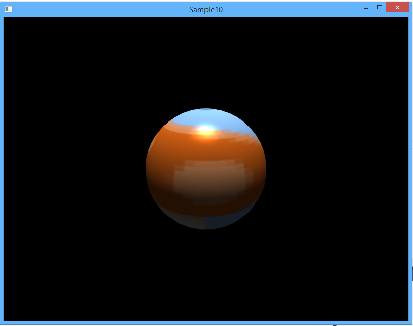

Основное задание на сегодня - разработать игру Memory Trainer 3D. Мы можете разделять роли, чтобы разработать проект максимально быстро.

## Подготавливаем проект

Обновите локальный репозиторий [cg-course-2018/QtLabs2D](https://github.com/cg-course-2018/QtLabs2D), переключитесь на ветку `sshambir_all_samples`. Затем создайте новую ветку, уникальную для вас и этого задания (например, `%фамилия%_sample10`).

Затем откройте `QtLabs2D.sln` и соберите проекты. Запустите Sample10 - вы должны увидеть следующее:



Откройте проект Sample10 - в нём вы будете выполнять разработку.

## Геймплей Memory Trainer 3D

Суть игры заключается в следующем:

- пользователю показывается игровое поле M * N табличек (всего табличек четное число)
- изначально таблички повёрнуты оборотной стороной (текстура оборотной стороны одинакова для всех табличек)
- при щелчке по плитке она плавно переворачивается лицевой стороной, на которой нарисована некоторая картинка
- если до этого была открыта плитка с тем же рисунком, то обе плитки удаляются с поля (игрок получает 50 очков)
- в противном случае обе плитки плавно поворачиваются обратно рубашкой вверх (игрок теряет 10 очков)
- повторный щелчок по ячейке, повернутой к нам картинкой, вызывает ее обратный поворот рубашкой вверх.

Цель игры – убрать все плитки с игрового поля. Скриншот игры представлен ниже:


## Управление состоянием плитки

Можно запрограммировать плитку таким образом, чтобы у неё было 4 дискретных состояния:

```cpp
enum class State
{
    FacedFront,
    Teasing,
    FacedBack,
    Dead,
};
```

Правила переключения состояний будут следующими:

- изначальное состояние будет равным FacedBack, но при этом в начале игры все плитки плавно перевернутся вокруг оси Oz вниз лицевой гранью, вместо того чтобы быть повёрнутыми изначально
- при нажатии на плитку, повёрнутую лицевой гранью вниз, она переключается в состояние FacedFront и плавно переворачивается вокруг оси Oz
- если две ранее перевёрнутые плитки имеют разные изображения, они переключаются в состояние Teasing и "дразнят" игрока, прежде чем перевернуться, путём поворота вокруг оси Oy
- если две ранее перевёрнутые плитки имеют одинаковые изображения, они исчезают, при этом проигрывается анимация уменьшения масштаба плитки от 1 до 0, и всё это время плитка повёрнута лицевой гранью вверх

## Задание cg10.1: триангуляция двухстороннего quad

Чтобы нарисовать плитку, имеющую разные изображения с двух сторон, добавьте двухсторонний quad, позволяющий задать разные текстурные координаты для передней и задней стороны. Также плитка будет иметь трёхмерные координаты и нормаль, при этом нормали передней и задней сторон отличаются.

В заголовок `MeshP3N3T2.h` добавьте объявление функции:

```
// Генерирует список вершин отдельных треугольников, формирующих двухсторонний quad.
// @param frontTextureRect - текстурный прямоугольник передней грани
// @param backTextureRect - текстурный прямоугольник задней грани
MeshDataP3C3 tesselateTwoSideQuad(const FloatRect& frontTextureRect, const FloatRect& backTextureRect);
```

Каждая из сторон плитки, по сути, является sprite, на котором рисуется картинка:


## Задание cg10.2: переворот плиток (требует cg10.1)

Реализуйте сцену с одной тестовой плиткой, которую можно переворачивать по нажатию в любую точку экрана. Переворот происходит мгновенно.

## Задание cg10.3: плавная анимация плиток (требует cg10.2)

Анимация переворота плитки должна быть плавной. Для создания плавной анимации создайте класс AnimationCounter, который будет следить за фазой анимации (будем считать, что фаза изменяется от 0 до 1). Используйте класс AnimationCounter вместе с классом Transform3D для реализации плавного переворота плитки. Процесс изменения фазы будет выглядеть следующим образом:


Ниже приведено примерное определение класса. Вам нужно создать одноимённый интерфейс (`IAnimationCounter`) с эквивалентными возможностями.

```cpp
class AnimationCounter
{
public:
    AnimationCounter(float changeSpeed);

    float GetPhase()const;
    bool IsActive()const;

    // Перезапускает изменение фазы анимации.
    void Restart();

    // Продолжает прирост фазы либо делает анимацию
    //  неактивной, если фаза достигла 1.
    void Update(float deltaSeconds);

private:
    bool m_isActive = false;
    float m_phase = 1.f;
    float m_changeSpeed = 0;
};
```

Начальная фаза анимации равна 1, как если бы она остановилась и ещё не была перезапущена.

В реализации основную сложность представляет метод Update, который должен передвинуть фазу ровно до конечного значения, если он достижимо за deltaSeconds или за меньшее время:

```cpp
AnimationCounter::AnimationCounter(float changeSpeed)
    : m_changeSpeed(changeSpeed)
{
}

float AnimationCounter::GetPhase() const
{
    return m_phase;
}

bool AnimationCounter::IsActive() const
{
    return m_isActive;
}

void AnimationCounter::Restart()
{
    m_phase = 0;
    m_isActive = true;
}

void AnimationCounter::Update(float deltaSeconds)
{
    if (!m_isActive)
    {
        return;
    }
    const float maxPhase = 1.f;
    const float delta = m_changeSpeed * deltaSeconds;
    if ((maxPhase - m_phase) < delta)
    {
        m_phase = maxPhase;
        m_isActive = false;
    }
    else
    {
        m_phase += delta;
    }
}
```

## Задание cg10.4: рисование в два прохода

Добавьте шейдер для 2D рисования `draw2d.frag`, который будет копировать цвет из текстуры (используя его как текст фрагмента) без какой-либо имитации освещения. Добавьте шейдер `draw2d.vert`, который будет просто трансформировать переданную позицию типа `vec2`. Оба шейдера должны быть помещены в каталог `res/`.

Скопируйте из предыдущих примеров в проект Sample10 следующие функции:

```
// Генерирует список вершин треугольников для выпуклого многоугольника, заданного вершинами и центром.
//  @param center - геометрический центр многоугольника
//  @param hullPoints - вершины многоугольника
//  @param colorGen - генератор цвета полученных треугольников
std::vector<VertexP2C4> tesselateConvexByCenter(const glm::vec2 &center, const std::vector<glm::vec2> &hullPoints, const glm::vec4 &fillColor);

// Генерирует список вершин треугольников для выпуклого многоугольника, заданного вершинами.
std::vector<VertexP2C4> tesselateConvex(const std::vector<glm::vec2> &verticies, const glm::vec4 &fillColor);

// Функция делит круг на треугольники,
//  возвращает массив с вершинами треугольников.
std::vector<VertexP2C4> tesselateCircle(float radius, const glm::vec2 &center, const glm::vec4 &fillColor);
```

Добавьте в метод перерисовки сцены второй проход рисования, в котором будет настраиваться двумерное рисование, и в левом верхнем углу экрана будет рисоваться зелёный кружок радиусом 30 пикселей.

## Задание cg10.5: реализовать интерфейс игры

Спроектируйте классы, ответственные за реализацию интерфейса. Реализуйте интерфейс игры.

## Задание cg10.6: формируем луч для трассировки по сцене

Координаты, полученные от мыши, надо применить для активации плитки, при этом попадание должно измеряться с точностью до пикселя. Добиться подобного эффекта можно с помощью обратной трассировки луча, исходящего из точки в координатах viewport, сквозь сцену. Общий принцип трассировки луча проиллюстрирован ниже:


Нас интересует именно луч, а не прямая либо отрезок, потому что у луча есть начало и нет конца, что удовлетворяет нашим потребностям. Программировать класс луча, трассируемого сквозь сцену, мы будем с помощью параметрического уравнения луча:


## Задание cg10.7: генерация поля

Напишите интерфейс класса, генерирующего содержимое поля. Реализуйте генератор. Фактически, требуется генерировать индексы текстур для плиток.
