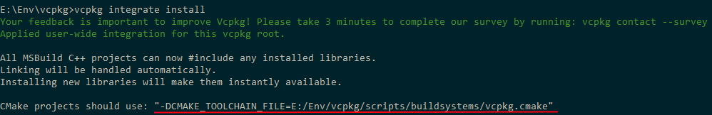
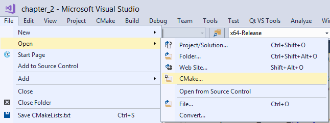
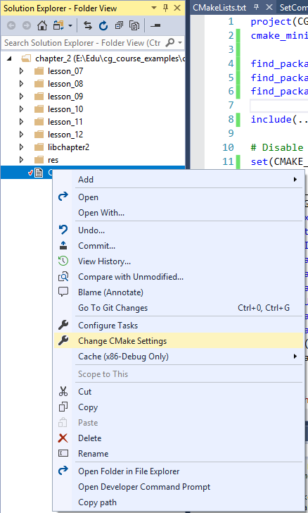
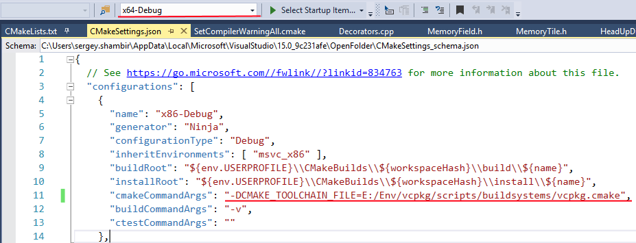
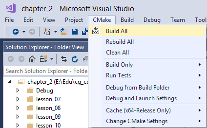
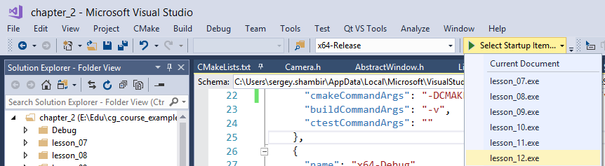

Основное задание на сегодня - завершить разработку игры Memory Trainer 3D.

* В процессе вы будете использовать пример реализации MemoryTrainer3D на C++, SDL2, OpenGL2
* Вы должны будете написать свою реализацию, используя C++, Qt (вместо SDL2) и OpenGL 3.3 Core Profile (вместо OpenGL 2.0)

# Подготовка проекта

* Сделайте клон (git clone) либо обновите свой клон (git fetch) репозитория [github.com/cg-course-2018/QtLabs2D](https://github.com/cg-course-2018/QtLabs2D)
* Переключитесь на ветку MemoryTrainer
* После этого создайте свою ветку с уникальным названием, например, "MemoryTrainer_%ФАМИЛИЯ%"
* Откройте "QtLabs2D.sln" в Visual Studio 2017 и продолжайте двигаться по инструкции

# Пример MemoryTrainer3D на C++/SDL2/OpenGL2

Исходный код примера находится на github ([github.com/ps-group/cg_course_examples](https://github.com/ps-group/cg_course_examples)) в каталоге "chapter_2" (пример "lesson_12").

- пример использует старые механизмы OpenGL, внедрённые в OpenGL 2.0, и не использует никаких шейдеров
- пример использует оконную библиотеку SDL2 для отображения окна и обработки событий ввода

Вы можете изучать исходный код и предварительно собранную программу, либо собрать пример самостоятельно.

## Установка CMake

Для сборки примеров потребуется CMake. Свои работы также рекомендуется делать с помощью CMake.

- Скачайте Cmake [с официального сайта](https://cmake.org/download/)
- При установке не забудьте поменять опцию, чтобы путь к CMake был добавлен в переменную [PATH](http://superuser.com/questions/284342/what-are-path-and-other-environment-variables-and-how-can-i-set-or-use-them)


>Переменные окружения, такие как [PATH](http://superuser.com/questions/284342/what-are-path-and-other-environment-variables-and-how-can-i-set-or-use-them), передаются приложению при старте. Если вы поменяли переменную PATH, изменения вступят в силу после перезапуска программ.

## Сборка примера из исходного кода

Для сборки потребуется установить несколько библиотек vcpkg:

```
vcpkg install sdl2:x64-windows sdl2-image:x64-windows sdl2-ttf:x64-windows
```

После этого нужно подключить библиотеки к проекту. Запустите следующую команду:

```
vcpkg integrate install
```

Вы увидите примерно следующий вывод - обратите внимание на последнюю строку:



В этой строке сказано, как подключить библиотеки vcpkg к CMake - нужно будет добавить опцию "-DCMAKE_TOOLCHAIN_FILE=E:/Env/vcpkg/scripts/buildsystems/vcpkg.cmake" при вызове CMake. Мы сделаем это по шагам:

* Сделайте клон (git clone) репозитория [github.com/ps-group/cg_course_examples](https://github.com/ps-group/cg_course_examples)

* Откройте в Visual Studio 2017 подкаталог `cg_course_examples/chapter_2` как проект CMake:



* В открытом проекте в контекстном меню над "CMakeLists.txt" выберите пункт "Change CMake Settings":



* В открывшемся файле для всех конфигураций ("x64-Debug", "x64-Release" и так далее) добавьте к значению по ключу "cmakeCommandArgs" следующий текст:

```
-DCMAKE_TOOLCHAIN_FILE=E:/Env/vcpkg/scripts/buildsystems/vcpkg.cmake
```

* Кроме того, выберите для сборки конфигурацию "x64-Debug":



* Запустите сборку всех целей (targets) проекта:



* Если проект собрался успешно, запустите цель "lesson_12" в отладчике из IDE



## Структура примера

* Исходный код игры MemoryTrainer3D находится в каталоге "chapter_2/lesson_12"
* Код построен по принципам ООП
    * основной класс: Window, он управляет интерфейсом игры, полем и камерой, а также состоянием игры
    * класс MemoryTile хранит логическое состояние плиток
    * класс MemoryField сочетает в себе генерацию начального состояния поля, рисование и обновление поля, а также управление списком логических плиток
    * класс HeadUpDisplay управляет состоянием интерфейса игры (индикаторов, отображающих количество очков и число оставшихся плиток)
    * остальные классы обеспечивают рендеринг 3D сцены средствами OpenGL 2.0

## Примерные шаги переноса примера

Вы можете копировать код функций и классов исходного примера, если он приемлем для решения текущей задачи, однако:

* вы должны исправлять стиль этого кода (например, убирать префикс "C" у классов и писать имена методов с маленькой буквы)
* вы должны учитывать, что код примера использует SDL2/OpenGL2.0, и переписывать его на Qt (используя внутреннюю библиотеку libplatform) и OpenGL (используя знания, полученные ранее)

Примерные шаги и возможные сложности:

* реализовать триангуляцию двухстороннего quad, чтобы реализовать Sprite (см. класс `CSprite` в примере)
* реализовать рисование сцены и интерфейса в два прохода (первый - рисование 3D сцены, второй - рисование 2D интерфейса)
    * на каждом проходе потребуется настроить матрицу проецирования (для перспективного преобразования - в случае 3D, ортографического - в случае 2D)
    * для вывода текста вы можете воспользоваться функцией `renderTextAsTexture` в файле `TextureUtils.h` - эта функция может превратить заданную строку текста в изображение, а затем загрузить изображение на видеокарту в виде текстуры
* реализовать использование луча для трассировки по сцене
    * вы можете включить макрос `ENABLE_DEBUG_MEMORY_FIELD_HITS` в примере, чтобы включить показ точек кликов, и начать изучать код примера с тех мест, где используется макрос `ENABLE_DEBUG_MEMORY_FIELD_HITS`
    * чтобы включить макрос, замените 0 на 1 в строке `#define ENABLE_DEBUG_MEMORY_FIELD_HITS 0`
