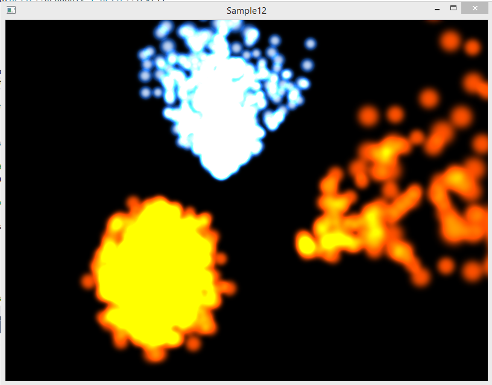
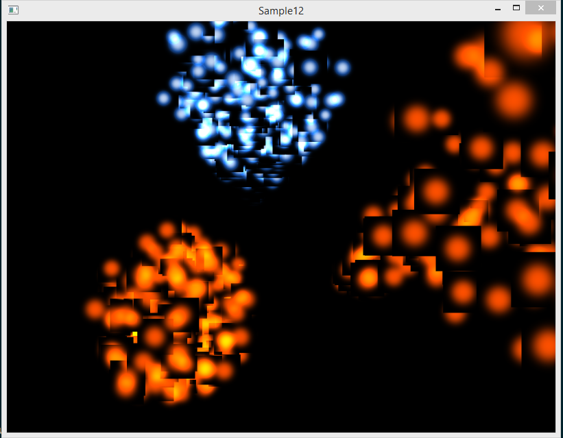
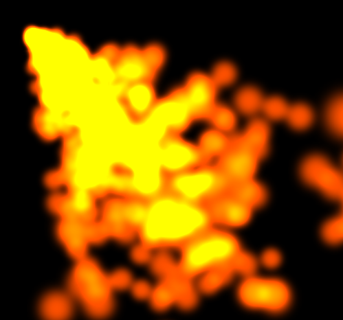
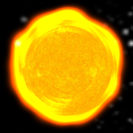

В прошлых статьях мы применяли линейную алгебру и тригонометрию. Теперь пришло время теории вероятностей: именно она позволяет симулировать связанную физическими законами систему из множества простых частиц, таких как дым, огонь, молния, дождь, брызги воды, пар или облака:



## Подготовка проекта

* Обновите или клонируйте репозиторий [github.com/cg-course-2018/QtLabs2D](https://github.com/cg-course-2018/QtLabs2D)

* Переключитесь на ветку "sample12", создайте от неё новую ветку, уникальную для вас - например, "sample12_%ФАМИЛИЯ%"
* Откройте QtLabs2D.sln, соберите и запустите проект Sample12
* Вы увидите следующее:



Пока что система частиц рисуется неправильно - мы исправим это в скором времени.

## Модель системы частиц

Система частиц состоит из

* генератора частиц - emitter, который представлен классом ParticleEmitter
* набора живых частиц, хранимого в классе ParticleSystem
* физических законов, действующих на частицы - таких, как сила тяготения

Откройте заголовок класса ParticleEmitter и ознакомьтесь с интерфейсом.

Генератор частиц - экземпляр класса ParticleEmitter - создаёт новые частицы через случайные интервалы времени.

* Интервал времени может быть меньше

Случайным вариациям поддаются:
* дистанция от источника частиц, на которой появляется частица
* отклонение направления частицы от направления источника
* скорость частицы
* время жизни частицы
* интервал между генерацией двух частиц

Интервал между генерацией и время жизни распределены по закону нормального распределения:


Остальные величины подчиняются линейному распределению вероятностей.

## Сортировка частиц и порядок рисования

Частицы являются полупрозрачными объектами. Из-за математических особенностей смешивания цветов должны соблюдаться следующие правила:

- полупрозрачные грани поверхностей должны рисоваться после всех непрозрачных граней
- при взаимном наложении граней их нужно отсортировать в порядке удаления от наблюдателя

Если сортировку не выполнять, частицы будут нарисованы в хаотическом порядке. Если к тому же выполняется тест глубины, то расположенные сзади и выводимые позднее частицы ошибочно не пройдут тест глубины:


Сортировку можно реализовать в методе ParticleSystem::updateParticlePositions. Сортировка должна выполняться в порядке удалённости от наблюдателя (от камеры).

## Задание cg12.1: сортировка системы частиц

Найдите в проекте следующий комментарий

```
// TODO: раскомментируйте код, выполняющий сортировку частиц
```

Раскомментируйте код сортировки частиц. Соберите и запустите программу. Вы увидите примерно следующее: 



Однако, сортировка систем частиц не исправляет артефакты в ситуации, когда частицы из разных систем пересекаются. Данный баг можно исправить путём сбора всех частиц из всех систем в единый массив, а всех текстур частиц — в единый атлас. Способ сложен, и программировать его мы конечно же не будем. Гораздо проще избегать пересечения разных систем частиц на уровне описания сцены.

## Задание cg12.2: смешивание без аддитивности

В примере смешивание цветов полупрозрачных частиц является аддитивным: этот режим включается в коде строкой `glBlendFunc(GL_SRC_ALPHA, GL_ONE);`.

Аддитивное смешивание хорошо подходит для имитации светящихся частиц (таких, как частицы пламени). Если мы создать систему частиц из отражающих свет объектов, мы должны использовать "стандартный" режим смешивания `glBlendFunc(GL_SRC_ALPHA, GL_ONE_MINUS_SRC_ALPHA);`

Нужно добавить в проект поддержку систем частиц со стандартным смешиванием. Для этого:

* добавьте в класс ParticleSystem булево свойство `m_useAdditiveBlending`
    * если свойство равно `true`y, то в методе `ParticleSystem::draw` должен выбираться режим `glBlendFunc(GL_SRC_ALPHA, GL_ONE)`, иначе - режим `glBlendFunc(GL_SRC_ALPHA, GL_ONE_MINUS_SRC_ALPHA)`
* добавьте в класс ParticlesSceneLoader поддержку чтения из JSON булева свойства "useAdditiveBlending" и передачу этого свойства созданному объекту типа ParticleSstem
* добавьте в файл `scene.json` к существующим системам частиц свойство `useAdditiveBlending: true`
* добавьте в файл `scene.json` новую систему частиц, использующую
    * текстуру `butterfly.png`
    * свойство `useAdditiveBlending: false`
    * свойства объекта `emitter` подберите так, чтобы бабочки разлетались вверх

Запустите программу и проверьте, что система частиц, состоящая из бабочек, корректно отображается.

## Задание cg12.3: добавляем солнце

Требуется добавить на сцену жёлтую сферу, которая будет располагаться в том же месте, где находится система частиц, имитирующая огонь. При правильном выборе параметров объектов на сцене это позволит создать объект, похожий на солнце:



Последовательность действий следующая.

* Реализуйте класс `SolidObject`, унаследованный от `SceneGraphNode`
* Добавьте в класс сцены `ParticlesScene` новую программу, выполняющую освещение по модели Фонга, состоящую из шейдеров "phong_lighting.frag" и "phong_lighting.vert"
* На основе проекта Sample09 и класса `ParticleSystem` добавьте на сцену оранжевую сферу, которая рисуется с помощью программы phong_lighting
* Разместите эту сферу и одну из систем частиц так, чтобы система частиц имитировала солнечную корону
    * рисование сферы должно выполняться до рисования всех систем частиц, иначе тест глубины будет выполняться неправильно, отбрасывая либо участки сферы, либо солнечную корону
* Добавьте в класс ParticlesSceneLoader загрузку объектов класса `SolidObject` из JSON по образу и подобию загрузки ParticleSystem - как пример описания используйте следующий фрагмент из "scene.json":

```json
"solidObjects": [
        {
            "geometry": "sphere",
            "size": [2, 2, 2],
            "position": [-7, -6, 0]
        }
    ],
```

## Задание cg12.4: отключение записи в буфер глубины

Ещё один способ избежать проблем при выводе полупрозрачных частиц - отключить запись в буфер глубины. При этом система частиц будет корректно отображаться на фоне других (непрозрачных) объектов.

Найдите в проекте следующий комментарий:

```
// TODO: раскомментируйте код, отключающий запись в буфер глубины
```

Раскомментируйте код, отключающий запись в буфер глубины. Запустите и соберите программу. Отключение записи в буфер глубины должно решить проблемы с отображением имитации солнца.

## Задание cg12.5: вращение частиц

Добавьте в классы ParticleSystem, ParticleEmitter и ParticlesSceneLoader возможность вращения частиц вокруг своей оси с разной скоростью. Скорость вращения задаётся в момент испускания частицы источником

Для реализации потребуется:

* добавить в `particles.vert` новый атрибут, подобный `a_particle_pos`, хранящий угол поворота частицы в 2D пространстве
    * при передаче атрибута в шейдер надо использовать `glVertexAttribDivisor(location, 1)`, чтобы атрибут менялся один раз на частицу, а не один раз на вершину
* реализовать в шейдере поворот частицы, используя правила перехода из полярной системы координат в декартову
* добавить в класс Particle хранение и обновление поворота частицы
* добавить в ParticleEmitter новое распределение вероятности, задающее скорость вращения, а также добавить метод для установки границ скорости вращения
* добавить в ParticlesSceneLoader поддержку нового свойства объектов JSON, позволяющего передать в ParticleEmitter пределы скорости вращения частицы (по умолчанию `[0; 0]`)

Добавьте в `scene.json` систему частиц, использующую текстуру "green-face.png" (см. каталог "res" в проекте). Частицы должны вращаться вокруг своей оси с разной скоростью.
