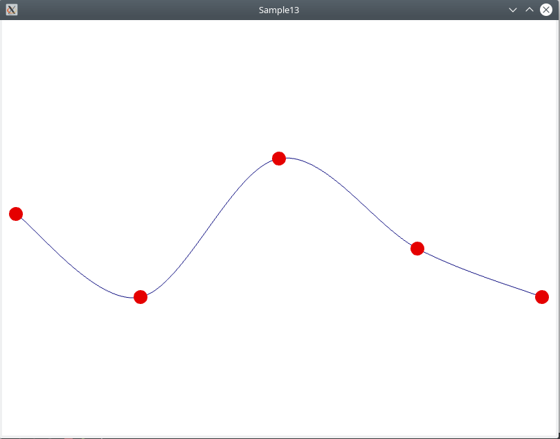
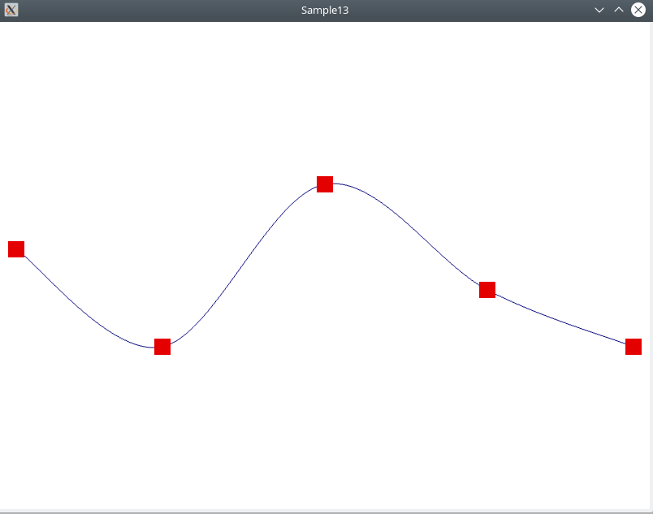
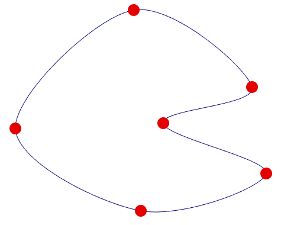

Сплайн-интерполяция, наряду с аппроксимацией - один из ключевых приёмов в визуализации большого объёма измерений. Например, если у вас есть облако точек, полученное от 3D сканера, то вам придётся

* отбросить аномальные точки, восстановить грани поверхности сканируемого объекта
* интерполировать грани и корректно вычислить нормали, чтобы визуально поверхность была гладкой

В данной статье мы рассмотрим основы &mdash; интерполяцию кривой на плоскости.

## Подготовка проекта

* Обновите или клонируйте репозиторий [github.com/cg-course-2018/QtLabs2D](https://github.com/cg-course-2018/QtLabs2D)
* Переключитесь на ветку "sample13", создайте от неё новую ветку, уникальную для вас - например, "sample13_%ФАМИЛИЯ%"
* Откройте QtLabs2D.sln, соберите и запустите проект Sample13
* Вы увидите следующее:



С помощью кликов и перетаскивания вы можете передвигать контрольные точки кривой.

## Задание cg13.1: частичное удаление кривой при нажатии Delete

Доработайте класс CurveController так, чтобы при нажатии клавиши Delete он удалял из кривой все контрольные точки, кроме первых четырёх.

Вы можете начать разработку с метода `CurveController::keyReleaseEvent` - в нём есть соответствующий TODO-комментарий:

```cpp
// TODO: добавьте обрезание кривой при нажатии Delete
```

## Задание cg13.2: изменение режима интерполяции на лету

Доработайте класс CurveController так, чтобы при нажатии левой/правой клавиш-стрелок он менял режим интерполяции контрольных точек.

Режим задан перечислимым типом:

```cpp
enum class CurveMode
{
    Lines,
    HermiteSplines,
    CatmullRomSplines,
};
```

В классе CurveModel хранится свойство типа CurveMode - изменяя его и обновляя CurveView, вы можете добиться переключения режима интерполяции.

Вы найдёте подсказки в методе `CurveController::keyReleaseEvent(...)`:

```cpp
// TODO: добавьте переключение режимов тесселяции кривой (CurveMode) в порядке возрастания.
// TODO: добавьте переключение режимов тесселяции кривой (CurveMode) в порядке убывания.
```

## Задание cg13.3: рисование контрольных точек кругами

Сейчас в примере контрольные точки рисуются примитивом GL_POINTS. Далеко не всегда это работает идеально: на некоторых видеокартах или операционных системах точки будут рисоваться как квадраты. Это может выглядеть следующим образом:



Нужно рисовать каждую контрольную точку как круг, составленный из треугольников. Для этого следуйте указаниям TODO: комментариев в методах `CurveView::setControlPoints(...)` и `CurveView::draw(...)`

## Задание cg13.4: интерполяция замкнутой кривой

Доработайте метод `tesselate(...)` класса CurveModel так, чтобы полученная кривая была замкнутой, т.е. сегмент между первой и последней контрольными точками также подчинялся триангуляции.

Нужно доработать интерполяцию во всех трёх режимах: Lines, HermiteSplines, CatmullRomSplines.



## Задание cg13.5: автоматический подбор числа сегментов для интерполяции

Доработайте класс CurveModel так, чтобы он автоматически подбирал число сегментов линии между двумя контрольными точками.

* длину фрагмента кривой между двумя контрольными точками можно приблизительно вычислить с помощью `distance(v1, v2)`
  * назовём это оценкой длины
* поскольку в нашем примере 1 единица размера соответствует 1 пикселю, мы можем взять округлить оценку длины фрагмента до целого числа и взять полученное число за количество фрагментов
  * в любом случае, потребуется не менее 1 фрагмента

Дальнейшие подсказки вы найдёте в TODO-комментарии в методе `CurveModel::tesselate(...)`.
