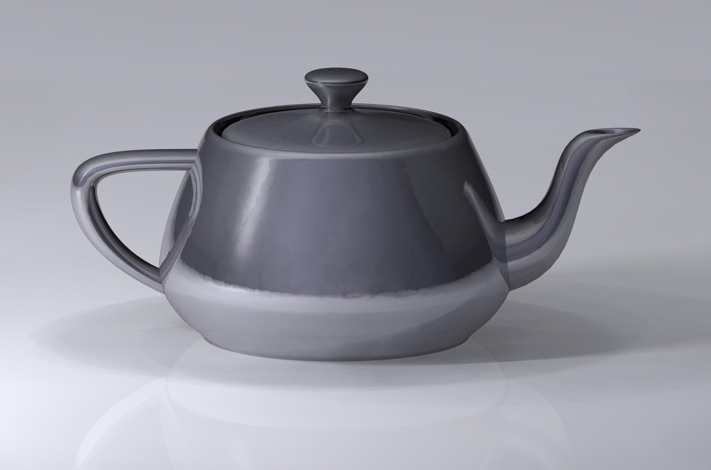
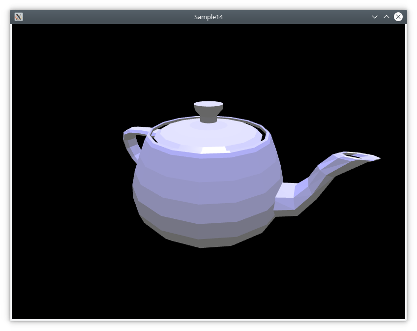
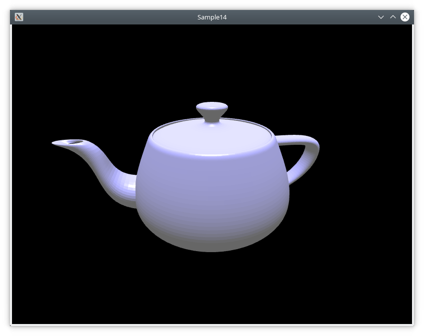
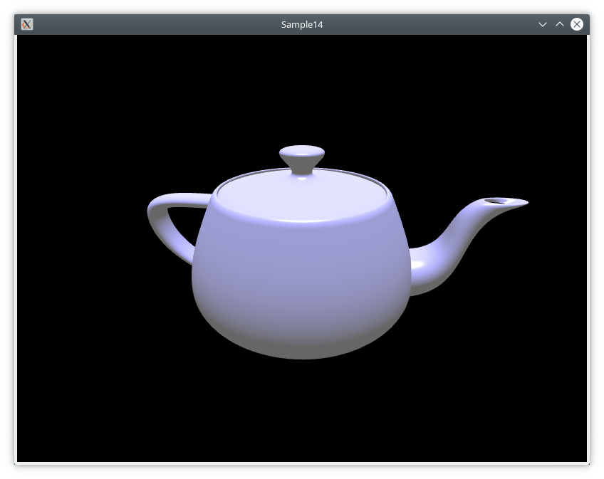
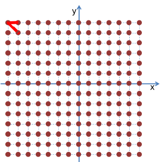

Как кривые Безье, так и сплайны могут быть обобщены для трёхмерного пространства. Другими словами, с их помощью можно выполнять интерполяцию и дальнейшую детализацию треугольников не только для линий, но и для поверхностей.

На основе поверхностей Безье построена одна из классических моделей компьютерной графики, часто используемая для тестирования моделей освещения и шейдеров. Ниже изображён чайник Юты в одном из наиболее удачных рендерингов:



## Подготовка проекта

* Обновите или клонируйте репозиторий [github.com/cg-course-2018/QtLabs2D](https://github.com/cg-course-2018/QtLabs2D)
* Переключитесь на ветку "sample14", создайте от неё новую ветку, уникальную для вас - например, "sample14_%ФАМИЛИЯ%"
* Откройте QtLabs2D.sln, соберите и запустите проект Sample14
* Вы увидите следующее:



С помощью горячих клавиш WASD вы можете управлять камерой

## Задание cg14.1 - доработать внешний вид чайника

На данный момент интерполяция чайника выполнена с низкой степенью точности (т.е. с малым числом треугольников). Каждый фрагмент имеет всего лишь 5 делений. Кроме того, между крышкой и корпусом чайника можно наблюдать щель, сквозь которую видна поверхность ручки.

Нужно доработать проект, чтобы деление чайника происходило с большей точностью, а крышка была растянута до соприкосновения с корпусом. Растянуть крышку можно за счёт изменения ключевых точек.

Подсказки в коде можно найти по комментарию следующего вида:

```cpp
// TODO: (cg14.1) <подсказка>
```



## Задание cg14.2 - добавляем второй источник света

Добавьте на сцену (класс NurbsScene) второй источник света (объект класса LightSource) с излучением красного цвета.

* инициализацию этого источника света можно добавить в "NurbsScene::initializeLights()"
* во фрагментном шейдере уже есть поддержка второго источника света - он доступен через uniform-переменную "u_light1"
* в метод "NurbsScene::initializePhongProgram()" в список инициализации, содержащий имена uniform-переменных, добавьте переменные для источника света "u_light1"
* добавьте светящуюся красным цветом сферу, визуализирующую этот источник света
  * вам потребуется добавить на сцену новый объект - вы можете реализовать его по аналогии с "m_teapotNode"
  * для триангуляции сферы вы можете использовать функцию "utils::tesselateSphere(...)"

## Задание cg14.3 - добавляем визуальную гладкость

На данный момент для расчёта нормалей к поверхности чайника используется метод, подходящий не для гладких поверхностей: нормаль вычисляется отдельно к каждой треугольной грани внутри функции "tesselateTeapot":


Для создания иллюзии гладкой поверхности следует сделать нормали различными в разных вершинах каждой треугольной грани. В этом случае в ходе интерполяции атрибутов вершин графическим конвейером каждый фрагмент получит свою собственную интерполированную нормаль, что при расчёте освещения создаст эффект плавного изгиба поверхности:



Для изменения способа расчёта нормали предлагается в функцию "tesselateTeapot" добавить дополнительный вложенный цикл, который для каждой вершины из сетки вершин, составляющих один фрагмент, получит двух соседей этих вершин и рассчитает нормаль с помощью функции "getTriangleNormal":



Подсказки в коде можно найти по комментарию следующего вида:

```cpp
// TODO: (cg14.3) <подсказка>
```

## Задание cg14.4 - повторно используем вершины с помощью массива индексов

Изначально в примере вершины с одинаковыми координатами различались, т.к. из-за вхождения в разные треугольные грани они имели разные нормали (одна и та же точка, попадая в вершины четырёх треугольников, имела 4 различных нормали). Теперь, после добавления гладкости, мы можем повторно использовать вершины.

Подсказки в коде можно найти по комментарию следующего вида:

```cpp
// TODO: (cg14.4) <подсказка>
```
