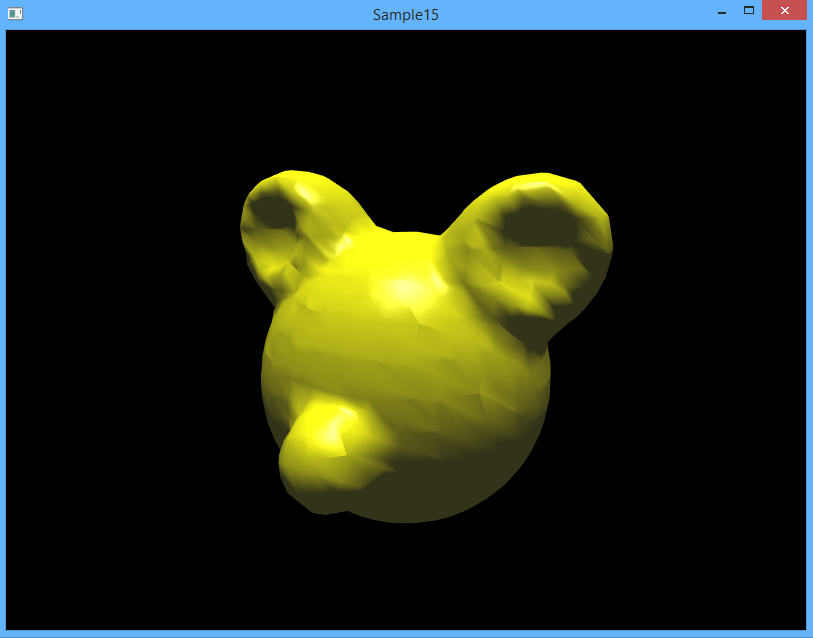
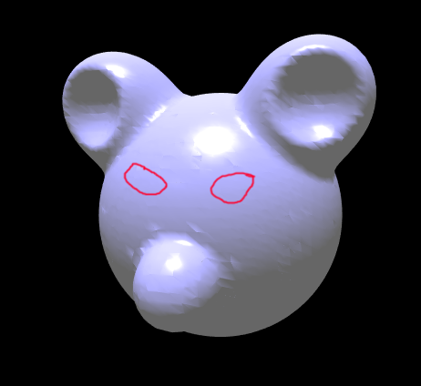

## Подготовка проекта

* Обновите или клонируйте репозиторий [github.com/cg-course-2018/QtLabs2D](https://github.com/cg-course-2018/QtLabs2D)
* Переключитесь на ветку "sample15", создайте от неё новую ветку, уникальную для вас - например, "sample15_%ФАМИЛИЯ%"
* Откройте QtLabs2D.sln, соберите и запустите проект Sample15
* Вы увидите следующее:

С помощью горячих клавиш WASD вы можете управлять камерой

## Задание cg15.1 - подобрать степень детализации

>Подсказки можно найти по комментариям `// TODO: (cg15.1)` в коде

Инициализация изоповерхности происходит в методе `IsosurfaceScene::initializeObjects()`. В текущей версии детализация поверхности достаточно плохая. Требуется подобрать значение константы cubeSize под возможности вашего компьютера, чтобы расчёт занимал не более 1-2 секунд.

## Задание cg15.2 - нарисовать красные глаза

Доработки можно выполнить в методе `IsosurfaceScene::initializeObjects()`. Требуется:

* путём добавление новых источников потенциала поля (объектов класса IsoPointSource) создать на голове, отображаемой в программе, углубления для глаз
* добавить на сцену две новых полигональных сетки, полученных путём тесселяции сферы
    * для тесселяции сферы используйте функцию "utils::tesselateSphere"
    * два новых узла будут храниться в поле типа "SceneGraphNodePtr" подобно полю "m_surfaceMesh"

<!-- ## Задание cg15.3 - изменить функцию поля -->
