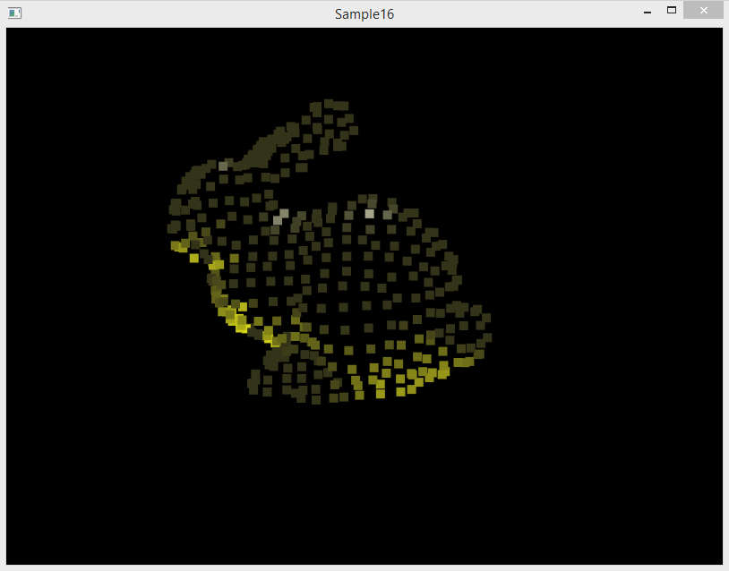

## Установка PCL на Windows

Для работы над примерами потребуется установить [Point Cloud Library](https://pointclouds.org). Это можно сделать с помощью vcpkg:

```
vcpkg install pcl:x64-windows
```

Процесс сборки и установки может быть достаточно долгим.

## Подготовка проекта

* Обновите или клонируйте репозиторий [github.com/cg-course-2018/QtLabs2D](https://github.com/cg-course-2018/QtLabs2D)
* Переключитесь на ветку "sample16", создайте от неё новую ветку, уникальную для вас - например, "sample16_%ФАМИЛИЯ%"
* Откройте QtLabs2D.sln, соберите и запустите проект Sample16
* Вы увидите следующее:



С помощью горячих клавиш WASD вы можете управлять камерой.

## Задание cg16.1 - включить визуализацию с помощью облака точек

* Найдите в коде все комментарии вида `// TODO: (cg16.1) `
* Выполните то, что указано в комментариях
* Соберите, запустите и визуально оцените качество триангуляции
    * алгоритм GreedyProjectionTriangulation обеспечивает низкое качество и высокую скорость триангуляции

## Задание cg16.2 - включить вычисление нормалей методом наименьших квадратов

* Найдите в коде все комментарии вида `// TODO: (cg16.2) `
* Выполните то, что указано в комментариях
* Соберите, запустите и сравните разницу в отображении двух поверхностей
  * у правой поверхности нормали вычислены методом наименьших квадратов

## Задание cg16.3 - заменить материал на цвет вершины

На данный момент в примере фрагментный шейдер принимает параметры материала, которые применяются ко всей поверхности:

```cpp
// Represents surface material passed to shader.
struct Material
{
    vec4 emission;
    vec4 diffuse;
    vec4 specular;
};
```

Требуется доработать фрагментный и вершинный шейдеры, чтобы вместо uniform-переменной материала для вычисления цвета использовался атрибут `in vec3 i_color;`, который будет передан из C++ кода, а затем перенаправлен из вершинного шейдера в фрагментный шейдер.

* Цвет фрагмента является заменой для diffuse/specular компонент цвета материала
* Для получения emission компонента предлагается умножать цвет фрагмента на константу 0.2
* Не забудьте обновить отображение шейдеров в методе `PointCloudScene::initializePhongProgram()` в C++ коде

<!--

## Задание cg16.5 - реализовать удаление точек, лежащих правее указанной плоскости

Реализуйте в программе возможность двумя кликами мыши по точкам A и B протянуть линию AB, задающую плоскость (перпендикулярную наблюдателю и проходящую через эту линию).

Затем реализуйте удаление всех точек, лежащих правее плоскости (справа относительно направления из A в B). Удалить точки можно путём применения к облаку точек аффинной трансформации и фильтра PassThrough.

Материалы:

* [Filtering a PointCloud using a PassThrough filter](http://pointclouds.org/documentation/tutorials/passthrough.php#passthrough)

-->

<!--

## Задание cg16.3 - использовать MarchingCubesRBF

Найдите в коде проекта в функции makeMarchingCubesTriangulation следующий фрагмент:

```cpp
// Класс MarchingCubesHoppe реализует одну из модификаций алгоритма Marching Cubes.
pcl::MarchingCubesHoppe<pcl::PointXYZRGBNormal> mc;
mc.setIsoLevel(kIsoLevel);
mc.setGridResolution(kGridResolution, kGridResolution, kGridResolution);
mc.setPercentageExtendGrid(kExtendPercentage);
mc.setInputCloud(cloud);
mc.reconstruct(triangleIndicies);
```

Создайте аналогичную функцию makeMarchingCubesRBFTriangulation, которая будет отличаться лишь использованием метода MarchingCubesRBF вместо MarchingCubesHoppe:

* используйте обе функции makeMarchingCubesTriangulation и makeMarchingCubesRBFTriangulation для получения двух полигональных сеток в методе `PointCloudScene::initializeObjects()`
* при инициализации MarchingCubesRBF установите дополнительный параметр этого алгоритма с помощью метода `setOffSurfaceDisplacement`, передав в качестве значения константу `0.01f`

Соберите программу, запустите и визуально сравните результаты работы алгоритмов


-->
