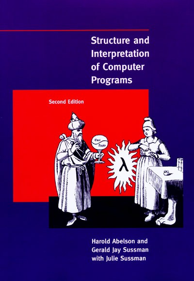
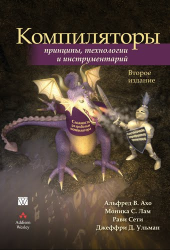
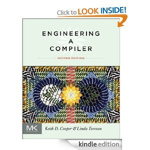

## Книга Мага

Книга "Структура и интерпретация компьютерных программ" стала итогом многих лет преподавания функционального программирования на 1-м курсе MIT в качестве вводного курса программирования. В университет часто приходили молодые студенты, которые уже имели за плечами опыт программирования, но этот курс с нуля и с самых основ объяснял

- почему и как в языки введены переменные, ключевые слова и другие инструкции
- как и почему работают области видимости, вычисление выражений и вычисление программы
- и так далее

Эта книга содержит чёткие требования к минимальному языку, на котором можно программировать. В последних главах рассматривается, как интерпретировать этот язык и как скомпилировать его для регистровой машины.

## Книга Дракона

Книга "Компиляторы: принципы, технологии, инструментарий" появилась после сбора материалов из курса конструирования компиляторов в MIT, тысячи студентов применили её для своих проектов. Однако, несмотря на переиздание, часть книги успела устареть, а часть дана в не очень практичной форме: например, для разбора грамматик по LR-алгоритму вместо data-driven подхода, использующего простой движок и таблицу переходов, предлагается вручную кодировать правила грамматики.

## Книга Engineering a Compiler

Эта книга может поэтапно показать минимальный набор теории и практики, достаточный для каждого компонента компилятора. Рассматриваются современные подходы, в том числе языки промежуточного представления, система типов языка, реализация возможностей современных процедурных и объектно-ориентированных языков. Каждая глава включает постановку проблемы, теоретические пути решения и несколько практических путей реализации.

## Пошаговое руководство LLVM Kaleidoscope

Kaleidoscope &mdash; это вечно живой пример от проекта LLVM. Он демонстрирует, как использовать LLVM в виде библиотеки. API LLVM постепенно меняется, например, в LLVM 3.9 он на 3-5% отличается от LLVM 3.8. Пример входит в состав исходного кода LLVM и всегда показывает работу с актуальной версией API

| Пример доступен в открытом доступе на странице [llvm.org/docs/tutorial/](http://llvm.org/docs/tutorial/). Лучше всего загрузить исходный код LLVM определённой версии, собрать LLVM с помощью CMake и начать изучать параллельно текст на сайте и исходники примера. На Windows можно сгенерировать проект командой `cmake -G "Visual Studio 14" "..\path-to-llvm-src"`

## Сборник Mapping High Level Constructs To LLVM

Этот сборник рецептов, оформленный в один документ, содержит концетрат практических советов по реализации возможностей процедурных, объектно-ориентированных и функциональных языков на LLVM-IR.

> Этот документ есть в открытом доступе [и выложен на Github](https://github.com/ps-group/compiler-theory-samples/blob/master/github/MappingHighLevelConstructsToLLVM.pdf)
