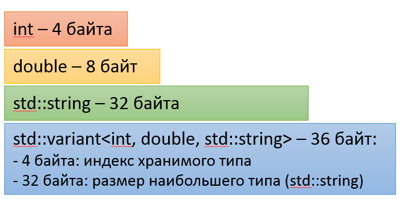

В статье показаны практичные приёмы, которые открыл для нас C++17. В целом в новом стандарте не хватает многих ожидаемых вещей: модулей, концептов, рефлексии, сопрограмм. Тем не менее, стандарт упростил некоторые задачи метапрограммирования и некоторые повседневные задачи. О метапрограммировании и других экспертных темах мы говорить не будем &mdash; лучше поговорим о том, как улучшился повседневный язык.

## Новые типы данных

### Тип данных string_view

В C++17 появился шаблон `std::basic_string_view<T>` и специализации string_view, wstring_view. Ранее они встречались:

- в библиотеках Boost под именем string_ref (переименован в string_view в последних версиях)
- в проектах LLVM и Chromium под именами StringRef и StringPiece соответственно

Совет: в C++17 в параметрах всех функций и методов вместо `const string&` принимайте невладеющий `string_view`, но возвращайте владеющий string.

```cpp
// старый стиль - до c++17
std::wstring utf8_to_wstring(const std::string &str)
{
    std::wstring_convert<std::codecvt_utf8<wchar_t>> myconv;
    return myconv.from_bytes(str);
}

// новый стиль - c++17
std::wstring utf8_to_wstring(std::string_view str)
{
    std::wstring_convert<std::codecvt_utf8<wchar_t>> myconv;
    return myconv.from_bytes(str);
}
```

Особенности string_view:

- он не владеет данными, но предоставляет интерфейс, аналогичный `const std::string &`
- размер string_view равен двум размерам указателя, его легко передать по значению или скопировать
- string_view имеет конструкторы из `string`, `char*`, `char[SIZE]`
- в `std::string` используется оптимизация коротких строк (SSO), из-за чего доступ к элементам строки по индексу каждый раз приводит к одной проверке с `if`. В string_view такой проверки нет, и доступ к элементам прямой &mdash; это немного повышает производительность.
- единственные модифицирующие операции над string_view &mdash; [remove_prefix](en.cppreference.com/w/cpp/string/basic_string_view/remove_prefix) и [remove_suffix](http://en.cppreference.com/w/cpp/string/basic_string_view/remove_suffix), которые отсекают от видимого диапазона string_view заданное число символов с начала или с конца; исходная строка не меняется, а меняется только наблюдаемый диапазон
- в стандартной библиотеке добавлен литерал ""sv, конструирующий string_view.


### Тип данных optional

Известный тип данных optional из Boost мигрировал в стандарт под именем `std::optional`. Мы не будем описывать класс в этой статье, отметим лишь основные особенности:

- optional имеет `operator*` и `operator->`, а тажке удобный метод `.value_or(const T &defaultValue)`

```cpp
// nullopt - это специальное значение типа nullopt_t, которое сбрасывает
//  значение optional (аналогично nullptr для указателей)
std::optional<int> optValue = std::nullopt;
// ... инициализируем optValue ...
// забираем либо значение, либо -1
const int valueOrFallback = optValue.value_or(-1);
```

- optional имеет метод value, который, в отличии от `operator*`, бросает исключение std::bad_optional_access при отсутствии значения

- optional имеет операторы сравнения "==", "!=", "<", "<=", ">", ">=", при этом "std::nullopt" меньше любого допустимого значения

- optional имеет оператор явного преобразования в bool, то есть:

```cpp
std::optional<int> optValue = std::none;
// ... инициализируем optValue ...
// проверять в if можно
if (optValue)
{
    ...;
}
// а неявно заносить в переменную или передавать параметром нельзя
bool isInitialized = optValue;
// но можно сделать явного
bool isInitialized = bool(optValue);
```

- optional можно использовать для композиции объекта, время жизни которого короче времени жизни владельца:

```
void Class::InitChild()
{
    // Если m_child - это std::optional<T>, то arg1, arg2 передаются в конструктор типа T
    m_child.emplace(arg1, arg2);
}

void Class::DestroyChild()
{
    m_child = std::none;
}
```

### Тип данных variant

Известный тип данных variant из Boost мигрировал в стандарт под именем `std::variant`, и в процессе миграции интерфейс класса значительно изменился благодаря другим нововведениям C++17.

Шаблонный variant параметризуется несколькими типами значений. Он способен хранить внутри значение любого из перечисленных в параметрах типов. Размер variant в байтах равен размеру наибольшего типа плюс 4 байта на хранение номера текущего типа:



- variant корректно вызывает конструкторы и деструкторы для внутреннего значения
- variant сам по себе не выделяет память в куче, но хранимый тип, такой как std::string, может сам выделять память
    - оговорка: рекурсивно определённый variant может выделять память в куче

В variant предусмотрена обработка исключений. При присваивании variant нового значения может быть выброшено исключение:

```cpp
// класс AlwaysThrowsOnMove бросает исключение при перемещении
std::variant<int, AlwaysThrowsOnMove> value;
// может быть выброшено исключение, когда старое значение уже удалено,
//  а новое перемещается во внутренний буфер памяти variant
value = AlwaysThrowsOnMove();
```

В случае выброса исключение variant потеряет внутреннее значение и перейдёт в специальное состояние valueless_by_exception, для запроса этого состояния существует одноимённый метод:

```cpp
std::variant<int, AlwaysThrowsOnMove> value;
try
{
    value = AlwaysThrowsOnMove();
}
catch (...)
{
    assert(value.valueless_by_exception());
}
```

Совет: используйте variant для хранения одного из нескольких состояний, если разные состояния могут иметь разные данные

```cpp
struct AnonymousUserState
{
};

struct TrialUserState
{
    std::string userId;
    std::string username;
};

struct SubscribedUserState
{
    std::string userId;
    std::string username;
    Timestamp expirationDate;
    LicenseType licenceType;
};

using UserState = std::variant<
    AnonymousUserState,
    TrialUserState,
    SubscribedUserState
>;
```

Методы работы с variant:

- функция `std::get<KnownType>(...)` бросает исключение, если тип внутри variant не совпадает с ожидаемым, а иначе возвращает ссылку на запрощенный тип
- функция `std::get_if<KnownType>(...)`, которая возвращает указатель на запрошенный тип, если тип внутри variant совпадает с ожидаемым, и возвращает nullptr в противном случае
- функция [visit](http://en.cppreference.com/w/cpp/utility/variant/visit), которая позволяет обойти variant либо с помощью полиморфной лямбды, либо с помощью класса с перегруженным для каждого варианта оператором "()"

Вызов visit принимает callable-объект, выполняет switch-case по внутреннему индексу типа и вызывает callable в той ветке, куда программа перейдёт во время выполнения после switch. Другими словами, во время компиляции вызовы callable будут компилироваться для каждого из вариантов типов. Так может быть использован visit:

```cpp
using variant_t = std::variant<int, double, std::string>;
variant_t value = "Hello, world!";

std::visit([](auto&& arg) {
    // Извлекаем тип аргумента текущего применения полиморфной лямбды
    using T = std::decay_t<decltype(arg)>;
    // Выполняем constexpr if (ещё одна особенность C++17)
    if constexpr (std::is_same_v<T, int>)
        // Эта ветвь компилируется, если T имеет тип int
        std::cout << "int with value " << arg << '\n';
    else if constexpr (std::is_same_v<T, double>)
        // Эта ветвь компилируется, если T имеет тип double
        std::cout << "double with value " << arg << '\n';
    else if constexpr (std::is_same_v<T, std::string>)
        // Эта ветвь компилируется, если T имеет тип std::string
        std::cout << "std::string with value " << std::quoted(arg) << '\n';
    else 
        // Эта ветвь выдаст ошибку компиляции, если не все типы
        //  были обработаны в остальных ветвях.
        static_assert(always_false<T>::value, "non-exhaustive visitor!");
}, value);
```

## Изменения в стандартных контейнерах

### Метод data() у std::string

До C++17 получить неконстантную ссылку на внутренние данные строки было трудно:

```cpp
std::string str = GetSomeString();
// Для пустой строки str[0] недопустим, поэтому требуем непустую строку
assert(!str.empty());
char *data = &str[0];
```

В C++11 у типа данных std::vector появился метод data, в C++17 такой же метод появился у строк:

```cpp
std::string str = GetSomeString();
char *data = str.data();
```

### Метод emplace_back возвращает ссылку

Методы emplace_back у различных контейнеров, таких как vector, конструируют новый элемент непосредственно в памяти коллекции, используя все переданные аргументы как параметры конструктора. В C++14 эти методы ничего не возвращали, и часто приходилось явно обращаться к созданному элементу:

```cpp
m_objects.emplace_back();
auto &obj = m_objects.back();
obj.property = value;
// ...
```

В C++17 emplace_back у vector возвращает ссылку на созданный элемент:

```cpp
auto &obj = m_objects.emplace_back();
obj.property = value;
// ...
```

Также напомним, что с C++11 у контейнеров map/vector существует метод emplace, который для map возвращает пару. Второй элемент пары сообщает, состоялась ли вставка нового элемента (true) или элемент по такому ключу уже существовал (false):

```cpp
template< class... Args >
std::pair<iterator,bool> emplace( Args&&... args );
```

### Методы try_emplace и insert_or_assign в контейнерах map и unordered_map

- Метод [try_emplace](http://en.cppreference.com/w/cpp/container/map/try_emplace) выполняет вставку тогда и только тогда, когда заданного ключа ещё нет в контейенере.

```cpp
// Есть перегрузка для key_type const& и key_type&&
template <class... Args>
pair<iterator, bool> try_emplace(const key_type& k, Args&&... args);

// Есть перегрузка для key_type const& и key_type&&
template <class... Args>
iterator try_emplace(const_iterator hint, const key_type& k, Args&&... args);
```

- Метод [insert_or_assign](http://en.cppreference.com/w/cpp/container/map/insert_or_assign) выполняет либо вставку, либо присваивание значения существующего элемента:

```cpp
// Есть перегрузка для key_type const& и key_type&&
template <class M>
pair<iterator, bool> insert_or_assign(const key_type& k, M&& obj);

// Есть перегрузка для key_type const& и key_type&&
template <class M>
iterator insert_or_assign(const_iterator hint, const key_type& k, M&& obj);
```

### Срезы (slices) для контейнеров map, unordered_map, set, unordered_set

В C++17 для данных контейнеров появилась поддержка срезов, обеспеченная новым методом [extract](http://en.cppreference.com/w/cpp/container/map/extract) и расширением метода [insert](http://en.cppreference.com/w/cpp/container/map/insert).

- Метод extract извлекает внутренний узел контейнера (отделяет его от контейнера и возвращает)
- Метод insert теперь умеет вставлять ранее извлечённые узлы

```cpp
map<int, string> mapping = { {1, "mango"}, {2, "papaya"}, {3, "guava"} };
auto nodeHandle = mapping.extract(2);
nodeHandle.key() = 4;
mapping.insert(std::move(nodeHandle));
// mapping == { {1,”mango”}, {3,”guava”}, {4,”papaya”} }
```

### Метод merge для контейнеров map, unordered_map, set, unordered_set

В C++17 для данных контейнеров появился метод [merge](http://en.cppreference.com/w/cpp/container/map/merge), который пытается один за другим извлечь все узлы из переданного контейнера методом extract и переместить их в другой контейнер методом insert. Такие перегрузки есть у метода в контейнере map:

```
// Есть перегрузка для Allocator& и Allocator&&
template<class C2>
void merge(std::map<Key, T, C2, Allocator>& source);

template<class C2>
void merge(std::multimap<Key, T, C2, Allocator>& source);
```

### Улучшения для tuple

В C++17 исправлена проблема tuple: теперь можно использовать список инициализации для его конструирования

```cpp
std::tuple<int, int> foo_tuple() 
{
    // Ошибка в версиях до C++17
    return {1, -1};
}
```

## Небольшие улучшения разных модулей STL

### Манипулятор quoted для вывода в ostream

Манипулятор quoted позволяет выводить в поток текст, обёрнутый в кавычки. При этом кавычки внутри текста по умолчанию экранируются с помощью "\". Параметризовать quoted символом кавычек и экранирующим символом можно через второй и третий параметры std::quoted.

```cpp
// Экранируем обратным слешем '\', в роли кавычки используем '"'
std::cout << "std::string with value " << std::quoted(arg) << '\n';

// Экранируем прямым слешем '/', в роли кавычки используем '`'
std::cout << "std::string with value " << std::quoted(arg, '`', '/') << '\n';
```

## Инструкции и поток управления

### switch-case и fallthrough

В C++17 появился атрибут fallthrough, способный помочь с вечными проблемами case/break:

- обычно в конце case происходит break, return или throw, что завершает выполнение блока кода
- если в конце case ничего нет, в C++17 надо поставить `[[fallthrough]]` &mdash; атрибут для следующего case
- если компилятор не увидит `[[fallthrough]]`, в C++17 он должен выдать предупреждение о неожиданном переходе к следующей метке case

```
void example(int action)
{
    void handler1(), handler2(), handler3();
    switch (action)
    {
    case 1:
    case 2:
        handler1();
        [[fallthrough]] // атрибут привязан к следующему case
    case 3:
        handler2();
        // предупреждение: переход к следующей метке без fallthrough
    case 4:
        handler3();
        [[fallthrough]] // некорректный код: атрибут ни к чему не привязан
    }
}
```

### if и switch с инициализатором

В C++17 условие if и switch может состоять из двух секций:

- `if (init; condition)`
- `switch (init; condition)`

Это может упростить работу с итераторами или некоторыми указателями:

```cpp
// C++17: if с инициализатором, в котором объявляется переменная,
//        видимая для обеих веток if и else.
if (auto p = m.try_emplace(key, value); !p.second)
{
    throw std::runtime_error("Element already registered");
}
else
{
    process(p.second);
}
```

Отметим, что в C++ и раньше можно было в некоторых случаях выполнять присваивание с проверкой:

```cpp
// CreateResource может возвращать обычный или умный указатель либо optional
if (auto p = CreateResource())
{
    ProcessResource(p);
}
else
{
    ThrowWin32LastError();
}
```
