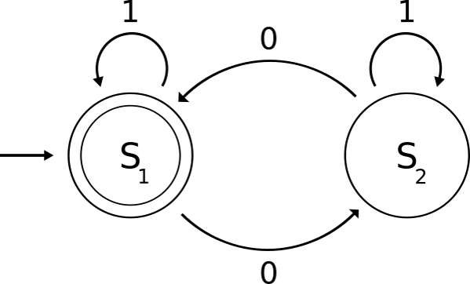

Graphviz — утилита командной строки для генерации схем графов на основе текстовых описаний узлов и рёбер. Из статьи вы узнаете, как и языка C++ программно вызвать graphiz с заданными параметрами, прочитать вывод и код возврата вызванной утилиты. Способ можно использовать в отрыве от Graphviz, здесь он взят для примера.

## Установка graphviz

Чтобы получить graphviz на Windows, вам нужно:

- установить Graphviz из MSI-пакета с сайта [graphviz.org](http://www.graphviz.org/Download_windows.php)
- добавить в системную переменную PATH путь к Graphviz (полный путь к поддиректории `Graphviz2.38\bin` внутри `Program Files`)


Для Ubuntu потребуется:

- установить пакет dot

После установки проверьте работу graphviz на простом примере:

```
digraph G {
0 [shape="circle"label="S0(a)"];
1 [shape="box"label="S1(b)"];
2 [shape="box"label="S2(c)"];
0->1 [label=" a "];
0->2 [label=" b "];
1->1 [label=" b "];
2->1 [label=" a "];
}
```

## Автоматизируем вызов Graphviz

Для автоматизации нам потребуется кроссплатформенный способ запуска внешнего процесса из C++. Например, функции `popen`/`pclose` из стандарта POSIX.

На Windows название функции `popen` изменено на `_popen`. Это легко исправить с помощью препроцессора:

##### макрозамена popen/pclose
```cpp
#ifdef _WIN32
#define popen _popen
#define pclose _pclose
#endif
```

Используя [пример из документации (msdn.microsoft.com)](https://msdn.microsoft.com/en-us/library/96ayss4b.aspx), можно реализовать функцию для запуска произвольной команды, печати вывода в консоль и возврата true/false при успешном/неуспешном выполнении.

##### объявление класса CUtils

```cpp
#pragma once

#include <string>

class CUtils
{
public:
    CUtils() = delete;

    static bool RunProcess(std::string const& command);
};
```

##### запуск внешней команды в CUtils::RunProcess
```cpp
bool CUtils::RunProcess(const std::string &command)
{
	CPipeHandle pipe(popen(command.c_str(), "r"));
	if (!pipe)
	{
		return false;
	}

	std::vector<char> buffer(256);

	while (std::fgets(buffer.data(), int(buffer.size()), pipe))
	{
		std::fputs(buffer.data(), stderr);
	}

	if (std::feof(pipe))
	{
		return true;
	}

	// process run failed, print error.
	std::fputs(std::strerror(errno), stderr);
	return false;
}
```

Класс CPipeHandle — это простейшая безопасная обёртка над `FILE*`, в деструкторе которой автоматически вызывается закрытие канала через `pclose`.

##### RAII-обёртка для FILE*
```cpp
namespace
{
class CPipeHandle
{
public:
	CPipeHandle(FILE *pipe)
		: m_pipe(pipe)
	{
	}

	~CPipeHandle()
	{
		if (m_pipe)
		{
			pclose(m_pipe);
		}
	}

	operator FILE*()const
	{
		return m_pipe;
	}

private:
	FILE *m_pipe = nullptr;
};
}
```

Чтобы воспользоваться API, нужно указать полную команду со всеми аргументами. Если путь к исполняемому файлу команды не добавлен в переменную окружения PATH, то придётся указать полный путь к `.exe`. Вот пример вызова Graphviz для преобразования диаграммы `fsm.dot` в изображение `fsm.png`
```cpp
CUtils::RunProcess("dot -Tpng -ofsm.png fsm.dot");
```

## Класс генерации кода для Graphviz

Допустим, нам захочется сделать сериализацию дерева или графа в язык Graphviz, чтобы автоматизировать их визуализацию. Допустим, мы хотим визуализировать конечный автомат:



На выходе мы должны получить примерно такой файл `*.dot`:

```
digraph G {
0 [shape="circle"label="S0(a)"];
1 [shape="box"label="S1(b)"];
2 [shape="box"label="S2(c)"];
0->1 [label=" a "];
0->2 [label=" b "];
1->1 [label=" b "];
2->1 [label=" a "];
}
```

В файле указаны надписи на вершинах и рёбрах графа, где под вершинами подразумеваются состояния, а под рёбрами — переходы. Для вершин указана форма: для начального состояния круг (circle), для конечных состояний (терминалов) двойной круг (doublecircle), для промежуточных состояний (нетерминалов) прямоугольник (box).

Вспомогательный класс для сериализации назовём CDotWriter. Определение класса:

```cpp
enum class StateType
{
	Initial,
	Nonterminal,
	Terminal
};

class CDotWriter
{
public:
	CDotWriter(std::ostream & out);
	~CDotWriter();

	void PrintVertex(size_t index, std::string const& label, StateType type = StateType::Nonterminal);
	void PrintEdge(size_t from, size_t to, std::string const& label);

private:
	std::string GetShape(StateType type)const;

	std::ostream & m_out;
};
```

Реализации методов выглядят так:

```cpp
CDotWriter::CDotWriter(std::ostream &out)
	: m_out(out)
{
	m_out << "digraph G {\n";
}

CDotWriter::~CDotWriter()
{
	m_out << "}\n";
}

void CDotWriter::PrintVertex(size_t index, const std::string &label, StateType type)
{
	m_out << index << " [";
	m_out << "shape=\"" << GetShape(type) << "\"";
	m_out << "label=\"" << label << "\"];\n";
}

void CDotWriter::PrintEdge(size_t from, size_t to, const std::string &label)
{
	m_out << from << "->" << to << " [label=\" " << label << " \"];\n";
}

std::string CDotWriter::GetShape(StateType type) const
{
	switch (type)
	{
	case StateType::Initial:
		return "circle";
	case StateType::Nonterminal:
		return "box";
	case StateType::Terminal:
		return "doublecircle";
	}
	return std::string();
}
```
