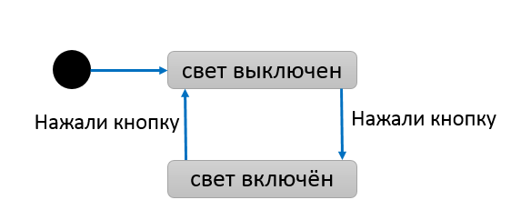
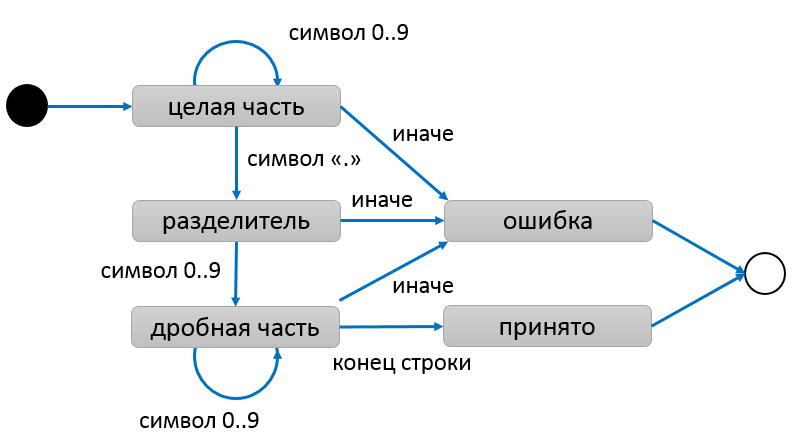
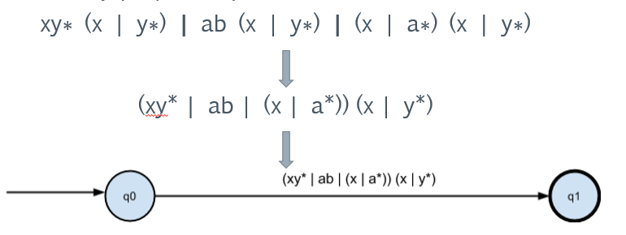
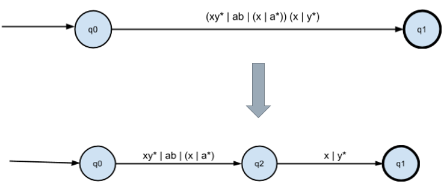
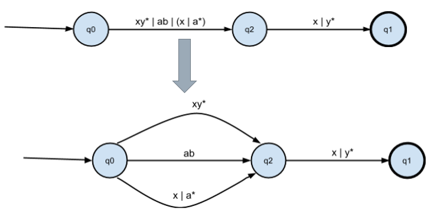
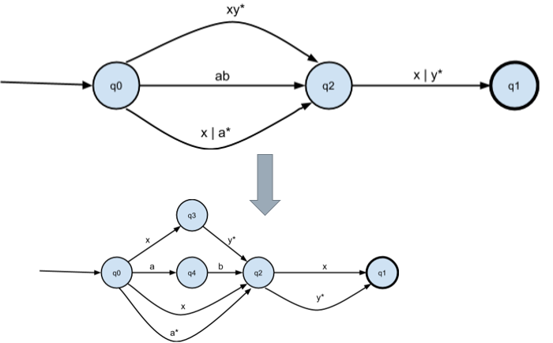
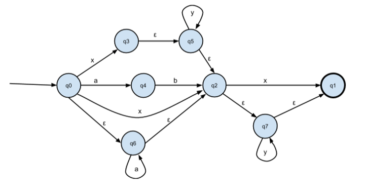
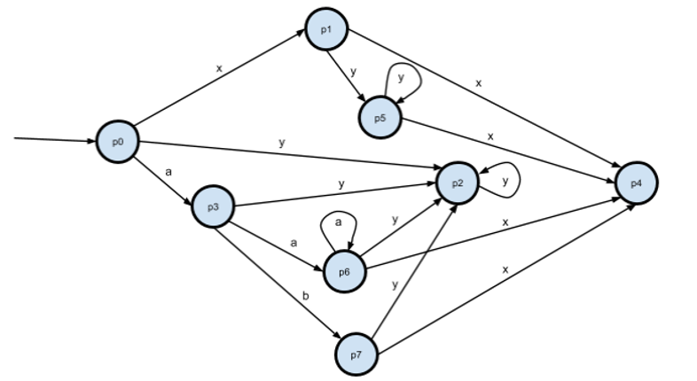
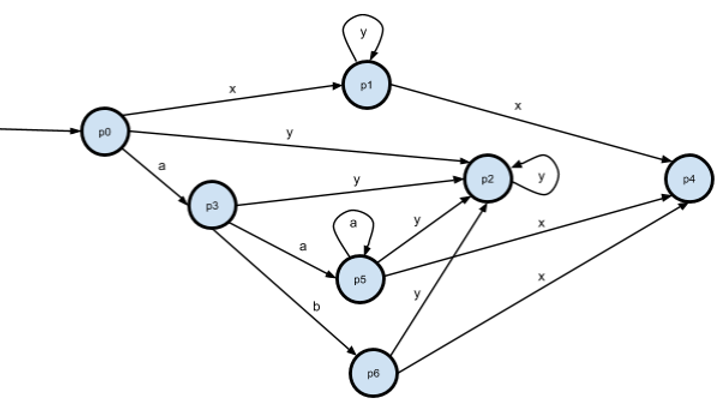
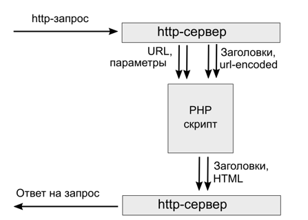

Конечный автомат &mdash; абстрактная модель, типичный паттерн в разработке компиляторов и не только. Реализовать автомат можно в любом стиле программирования &mdash; процедурном, объектно-ориентированном или функциональном.

## Что такое автомат?

Будучи абстрактной моделью, автомат в коде или в схемах может стать чем угодно. Ниже показан пример диаграммы состояний для автомата, моделирующего выключатель:

У этого автомата есть:

- два состояния ("свет выключен", "свет включён")
- два перехода между этими состояниями
- одно событие "нажали кнопку", которое вызывает оба перехода
- псевдопереход от чёрного кружка с заливкой, показывающий, какое состояние будет начальным. Конечного состояния здесь нет (иначе оно было бы помечено псевдопереходом к чёрному кружку без заливки)

Чуть более сложный автомат для разбора числа с плавающей точкой показан ниже:

Оба этих автомата являются детерминированными, потому что входной символ или событие однозначно определяет переход, и нет "самопроизвольных" переходов при отсутствии события. Если эти условия не соблюдаются, автомат становится недетерминированным. Также автомат не является детерминированным, если он использует дополнительную память (например, стек ранее накопленных символов) для принятия решения о переходе.

## Детерминированный и недетерминированный конечные автоматы

Детерминированный конечный автомат может разобрать строку в один проход из начала в конец, не используя дополнительной памяти кроме заранее заданных таблицы состояний и таблицы переходов между состояниями по событиям. В этой предсказуемости и линейной сложности разбора строки его главное преимущество. Например, в конце разбора строки автомат лексического анализатора приходит в состояние accepted либо в состояние error, что означает успешный или неуспешный разбор строки на токены соответственно.

Любой детерминированный конечный автомат имеет эквивалентное регулярное выражение, и эквивалетный язык регулярной грамматики, и наоборот. По сути это три разных формы представления одной сущности.

Существует формальный алгоритм превращения недетерминированного автомата без дополнительной памяти в детерминированный. Кстати, подобные алгоритмы используют реализации библиотек регулярных выражений: например, для выражения `"([a-z])|([a-z]\(\))"` легко составить недетерминированный автомат с неоднозначными или пустыми переходами, а алгоритм позволяет превратить его в детерминированный.

## Регулярное выражение в ДКА

В промышленных библиотеках регулярных выражениях многие операции избыточны с служат лишь для удобства. Если убрать всё лишнее и оставить самый минимум, достаточный для создания произвольных регулярных выражений, то останутся три операции:

- Символ * задаёт итерацию (a.k.a. замыкание Клини)
    - Пример: “1*” ищет строки “”, “1”, “11”, …
- Пустая строка задаёт конкатенацию двух выражений
    - Пример: “ab” ищет подстроку “ab”, “ab*” ищет подстроки вида “a”, “ab”, “abb”, …
- Символ | задаёт объединение
    - Пример: “a|b|c|d” ищут подстроки "a", "b", "c", "d"

Мы построим детерминированный конечный автомат на основе заданного регулярного выражения. Пусть дано выражение `"xy* (x | y*) | ab (x | y*) | (x | a*) (x | y*)"`, построим для него диаграмму автомата. Для наглядности обозначение начальных и конечных состояний убрано &mdash; мы считаем, что любой неожиданный символ переводит в состояние ошибки.

Преобразуем конкатенацию с `(x | y*)`:

Преобразуем объединение:

Преобразуем конкатенацию:

Получаем промежуточный εНКА, т.е. НКА с "пустыми" &mdash; или "самопроизвольными" &mdash; переходами:

Убираем переходы по пустой цепочке ε:

Теперь состояния s3 и s5 оказались эквивалентны. Уберём s5, переименуем s6->s5, s7->s6.

Убираем неопределённые переходы из НКА:

Теперь p1 и p5 эквивалентны. Уберём p5, переименуем p6->p5, p7->p6.

Полученный автомат эквивалентен выражению `"xy* (x | y*) | ab (x | y*) | (x | a*) (x | y*)"`.

- он допускает "aaax"
- он не допускает "xyyb"

## Применение конечных автоматов

Существует классификация программ по принципам их работы. Один из вариантов – это классификация Д. Харела, которая делит программы на три вида

- Трансформирующие системы только трансформируют данные, то есть работают в пакетном режиме
- Реактивные системы ещё и реагируют на команды или события
- Интерактивные системы реагируют на команды или события и делают ответное воздействие

Автоматы применяют в трансформирующих системах, особенно связанных с обработкой текста. Примером подобной системы является интерпретатор, компилятор, шаблонизатор, или же любой простой скрипт для обработки запроса к серверу:

