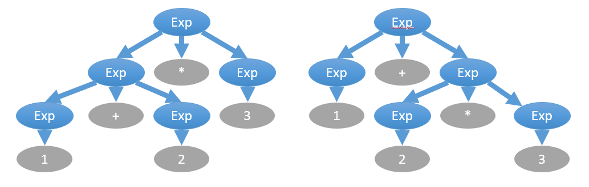
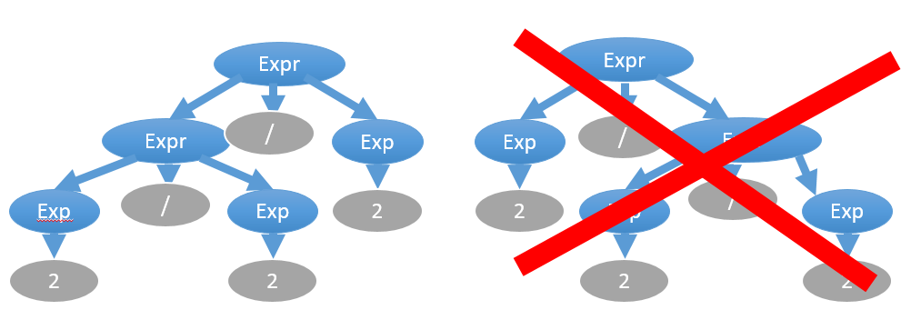

Грамматика указывает на иерархию между символами в формальном языке. Все тексты, соответствующие правилам языка, соответствуют и его грамматике. Иными словами, грамматика — это набор правил, позволяющих:

- Из грамматического символа верхнего уровня получить любой текст на языке путём рекурсивного раскрытия абстрактных символов в нечто конкретное
- Для любого текста проверить, соответствует ли он грамматике языка, то есть можно ли весь текст назвать символом верхнего уровня на этом языке

В большинстве языков символом верхнего уровня является один файл исходного кода, называемый "модулем" или "единицей трансляции". Например, в языке Python мы можем развернуть абстрактный символ "модуль Python" в список из двух абстрактных (нетерминальных) символов:

```python
<функция>
<ветвление>
```

После мы можем развернуть оба этих символа, и продолжать разворачивать порождённые символы до тех пор, пока *нетерминальные* символы не закончатся, после чего останутся лишь *терминальные* символы:

```python
def main():
    print "Hello, World!"

if __name__ == "__main__":
    main()
```

- Нетерминальные символы абстрактны, и могут быть развёрнуты далее по правилам грамматики языка. Примеры таких символов: "ветвление", "функция", "присваивание", "модуль программы".
- Терминальные символы конкретны, и не могут быть развёрнуты по правилам языка.
- Правило грамматики задаёт преобразование цепочки символов в новую цепочку символов. В том числе это может быть замена одного символа на пять новых, замена трёх символов на ноль символов и так далее.

> Когда надо остановиться и перестать раскрывать символы? Зависит от уровня абстракции грамматики. Вы можете раскрывать вплоть до отдельных символов. Можно остановиться на *токенах* (идентификаторах, числах, знаках операций) и дальше не раскрывать, если у вас есть лексический анализатор, который умеет превращать поток текста в поток более абстрактных токенов.

В промышленных компиляторах парсер (синтаксический анализатор) занимается обратной задачей — сворачивает токены, полученных лексером (лексическим анализатором), согласно правилам грамматики, и получает абстрактные (нетерминальные) символы "функция", "ветвление", "определение класса" и так далее. Набор символов языка и правил грамматики зависит от языка.

## Иерархия Хомского

Иерархия Хомского — это общепринятое деление формальных языков на 4 уровня. Чем выше номер типа, тем более скудный язык и тем легче его разбирать программно:

- Тип 0: неограниченные
    - правила замены символов ничем не ограничены, что делает машинный анализ таких текстов невозможным
- Тип 1: контекстно-зависимые
    - правила замены символов зависят от контекста
    - в этом примере на C++ без контекста неясно, что это — сравнение двух переменных или специализация шаблона: `vec < a > b`.
    - в этом примере неясно, объявлена ли функция "getSize": `getSize(sprite)`
- Тип 2: контекстно-свободные
    - правила описывают замену одного нетерминала на цепочку нетерминалов и терминалов (возможно, пустую), т.е. способ замены каждого нетерминала на другие символы не зависит от контекста
    - формально: в левой части правила может быть только нетерминал, `A → β`, где "A" — нетерминал, "β" — цепочка нетерминалов и терминалов
    - например, в языках программирования символ "присваивание" раскрывается однозначно независимо от того, что окружает присваивание
- Тип 3: регулярные
    - праворегулярные грамматики могут содержать три вида правил: `B → α`, `B → αC`, `B → ε`, где "ε" — пустое множество, "B" и "С" — нетерминалы, и "α" — терминал
    - леворегулярные грамматики могут содержать три вида правил: `A → α`, `A → Bα`, `A → ε`, где "ε" — пустое множество, "A" и "B" — нетерминалы, и "α" — терминальный символ

Все реальные языки программирования являются контекстно-зависимыми (тип 1), но большинство может быть разобрано как контекстно-свободные (тип 2) с последующей постобработкой в виде проверок типов и т.п. Не случайно фронтенд компилятора делят на три стадии:

- лексический анализ (в рамках регулярной грамматики текст делится на строковые литералы, числа, идентификаторы, операторы, разделители, убираются пробелы и комментарии)
- синтаксический анализ (в рамках контекстно-свободной грамматики)
- семантический анализ (проверка соответствия контекстно-зависимым правилам, таким как "переменная должна быть объявлена заранее")

## Регулярные грамматики

Любая регулярная грамматика имеет эквивалентное регулярное выражение, а также эквивалентный детерминированный конечный автомат (ДКА). Это всё три формы одной и той же сущности. Разобрать строку по правилам регулярной грамматики можно за один проход из начала в конец строки без дополнительной памяти с помощью ДКА.

В промышленных библиотеках регулярных выражениях многие операции избыточны с служат лишь для удобства. Если убрать всё лишнее и оставить самый минимум, достаточный для создания произвольных регулярных выражений, то останутся три операции:

- Символ * задаёт итерацию (a.k.a. замыкание Клини)
    - Пример: “1*” ищет строки “”, “1”, “11”, …
- Пустая строка задаёт конкатенацию двух выражений
    - Пример: “ab” ищет подстроку “ab”, “ab*” ищет подстроки вида “a”, “ab”, “abb”, …
- Символ | задаёт объединение
    - Пример: “a|b|c|d” ищут подстроки "a", "b", "c", "d"

Применения регулярных грамматик:

- Регулярные выражения применяют не только для лексического анализа, но и для фильтрации. Утилита grep в Unix-системах с помощью регулярок фильтрует вывод другой команды.

```bash
# cat /var/run/dmesg.boot | grep CPU
------------------------------------------------------
CPU : Intel(R) Core(TM)2 Quad CPU    Q9550  @ 2.83GHz (2833.07 - MHz K8 - class CPU)
```

- С помощью регулярных выражений удобно проверять введённые пользователем данные. Например, для проверки кода страны в формате "ru_RU": `[A-Za-z]{2}`.

- Лексические анализаторы производят предварительный разбор текста, превращающий единый массив текстовых символов в массив отдельных слов (в теории компиляции вместо термина «слово» используют термин «токен»). Лексический анализатор можно создать на базе регулярной грамматики, и построить эквивалентный ДКА, что даст фантастически низкую сложность разбора O(N), где N — длина строки.


## Контекстно-свободные грамматики

Контекстно-свободная грамматика, не являющаяся регулярной, не имеет ни эквивалентного регулярного выражения, ни эквивалентного детерминированного конечного автомата. При попытке сформировать ДКА количество его состояний будет расти бесконечно, и так же бесконечно будет возрастать глубина регулярного выражения. В контекстно-свободной грамматике правила для нетерминалов определяются без окружающего контекста, т.е. `A → β`, где "A" — нетерминал, "β" — цепочка нетерминалов и терминалов. Примеры таких грамматик:

- арифметические выражения с разным приоритетом операторов
- выражения со скобками, в которых глубина вложенности скобок может быть любой

Такие грамматики не получится разобрать в один проход из начала в конец строки с помощью ДКА, но можно разобрать с помощью прохода с возвратами (backtracking) и дополнительной памяти в виде стека (либо с помощью рекурсии, что эквивалентно стеку). Разбор можно вести как сверху вниз (ищем в файле функцию, в функции — имя, список параметров, тело и т.д.), так и снизу вверх. Методы разбора:

- [рекурсивный спуск с возвратом](/compilers/simple_recursive_parser.html)
- [восходящий разбор по принципу сдвига и свёртки (shift-recude)](/compilers/shift_reduce.html)

При описании грамматики обычно используются нотации BNF или EBNF. Вот пример грамматики в BNF:

```
<expr> ::= <term> | <expr><operator><term>
<term> ::= <integer> | "("<expr>")"
<operator> ::= "+" | "-" | "*" | "/" | "%"
<integer> ::= <digit>|<integer><digit>
```

При описании могут быть неоднозначности. Например, выражение "1 + 2 * 3" следует вычислять не слева направо, а в порядке приоритета операторов, где умножение приоритетнее, что даёт другое дерево выражения:



Устранить эту неоднозначность можно отдельным указанием приоритета операторов вне грамматики, либо введением промежуточных правил:

```
<expr> ::= <expr_add_sub> | <expr><operator_mul_div><expr_add_sub>
<expr_add_sub> ::= <term> | <expr_add_sub><operator_mul_div><term>
<term> ::= <integer> | "("<expr>")"
<operator_mul_div> ::= "*" | "/" | "%"
<operator_add_sub> ::= "+" | "-"
<integer> ::= <digit>|<integer><digit>
```

Ещё одна неоднозначность связана с ассоциативностью операторов. Например, присваивание правоассоциативное: "a = b = c" эвивалентно "a = (b = c)"


С другой стороны, в большинстве своём операторы — левоассоциативные, например, "2/2/2" вычисляется как "(2/2)/2=0,5", а не "2/(2/2)=2":



Эта сложность решается также введением дополнительных правил. Выше был приведён пример именно такого правила expr:

```bash
# Левоассоциативное правило, левая рекурсия
<expr> ::= <expr_add_sub> | <expr><operator_mul_div><expr_add_sub>
# Правоассоциативное правило, правая рекурсия
<expr> ::= <expr_add_sub> | <expr_add_sub><operator_mul_div><expr>
```

Кстати, с проблемой левой рекурсии методы нисходящего разбора напрямую не справляются. Исключение — это рекурсивный спуск, который может запросто использовать цикл вместо рекурсии, самостоятельно после каждой итерации склеивать два нетерминала, получая новый нетерминал для левой части того же правила.

Можно устранить левую рекурсию с помощью добавления нового правила:

```bash
# Была левая рекурсия
<expr> ::= <expr_add_sub> | <expr><operator_mul_div><expr_add_sub>
<argument_list> ::= <argument> | <argument_list>","<argument>

# Стала правая рекурсия
<expr> ::= <expr_add_sub> | <expr_add_sub><expr_tail>
<argument_list> ::= <argument> | <argument><argument_list_tail>

<expr_tail> ::= <operator_mul_div><expr_add_sub> | <operator_mul_div><expr_add_sub><expr_tail>
<argument_list_tail> ::= ","<argument> | ","<argument><argument_list_tail>
```

## Примеры контекстно-свободных грамматик

> Вы читаете перевод [Examples of BNF Grammars](http://www.cs.utsa.edu/~wagner/CS3723/grammar/examples.html)

### Грамматика для простых предложений

Порождает предложения такого плана:

```
THE MAN BITES A DOG
A DOG PETS A DOG
```

Но не порождает это предложение:

```
MAN BITES DOG
```

Набор правил выглядит так:

```
sentence ::= subject predicate
subject ::= article noun
predicate ::= verb direct-object
direct-object ::= article noun
article ::= 'THE' | 'A'
noun ::= 'MAN' | 'DOG'
verb ::= 'BITES' | 'PETS'
```

### Грамматика для чисел в двоичной системе счисления

Для чисел вида '010110111'. Неоднозначная (ambiguous) версия грамматики:

```
binary_string ::= '0' | '1' | binary_string binary_string
```

Однозначная (unambiguous) версия грамматики:

```
binary_string ::= binary_string '0' | binary_string '1' | '0' | '1'
```

### Грамматика для простой арифметики

Поддерживает операторы '+', '*' и переменные X, Y, Z. Первая версия будет однозначной для LALR-парсеров, и неоднозначной для LL-парсеров:

```
sentence ::= expression
expression ::= expression + expression
             | expression * expression
             | identifier
identifier ::= 'X' | 'Y' | 'Z'
```

Вторая версия будет однозначной и для LL-парсеров тоже:

```
sentence ::= expression
expression ::= term | expression + term
term ::= identifier | term * identifier
identifier ::= 'X' | 'Y' | 'Z'
```

Третья версия неоднозначная. Как думаете, почему?

```
sentence ::= expression
expression ::= term | expression + term
term ::= identifier | term * identifier | expression
identifier ::= 'X' | 'Y' | 'Z'
```

### Примеры ошибочных грамматик

Эта грамматика неоднозначная:

```
zot ::= zot 'b' zot | 'a'
```

И эта тоже неоднозначная:

```
zot ::= zing | 'a'
zing ::= zot | 'b'
```

В этой есть иная проблема. Подумайте, какая:

```
zot ::= zing | 'a'
zing ::= zing 'b'
```

## Контекстно-зависимые грамматики

Способа разобрать текст по контекстно-зависимой грамматике в один проход нет. Точно так же не справится и разбор с возвратами и стеком. Существующие алгоритмы имеют чрезмерно большую вычислительную сложность и не подходят для быстрой компиляции исходного кода. Поэтому все формальные языки используют простой трюк:

- грамматика языка составляется как контекстно-свободная, и по этой грамматике пишется парсер
- вводятся дополнительные правила (семантика языка), которая накладывает ограничение на уже разобранные парсером деревья разбора (parse tree), или на абстрактные синтаксические деревья (abstract syntax tree)

Примеры таких контекстных правил, которые можно проверить уже после разбора путём обхода дерева:

- типы операндов в выражениях должны либо полностью совпадать, либо быть приводимыми к общему типу
- все используемые переменные и функции должны быть определены или хотя бы объявлены в текущем модуле или в импортированных модулях, в пределах текущей области видимости или родительских областей видимости
- нельзя создавать экземпляр абстрактного класса
- если метод помечен как "override", то один из реализуемых интерфейсов должен содержать объявление этого метода с такой же сигнатурой (возвращаемым типом и списком типов параметров)

При разработке системы проверки семантических правил пригодятся:

- паттерн проектирования Visitor
- структура данных "ассоциативный массив" для хранения списка ране объявленных символов в процессе обхода дерево, эта структура также называется "таблица символов" в контексте теории компиляции
- понимание работы областей видимости в языках программирования (на каждую область видимости — своя таблица символов, и искать символ надо путём подьёма по таблицам символов от текущей области видимости до глобальной)

## Ссылки

- [Формальная грамматика (ru.wikipedia.org)](https://ru.wikipedia.org/wiki/%D0%A4%D0%BE%D1%80%D0%BC%D0%B0%D0%BB%D1%8C%D0%BD%D0%B0%D1%8F_%D0%B3%D1%80%D0%B0%D0%BC%D0%BC%D0%B0%D1%82%D0%B8%D0%BA%D0%B0)
- [Иерархия Хомского (ru.wikipedia.org)](https://ru.wikipedia.org/wiki/%D0%98%D0%B5%D1%80%D0%B0%D1%80%D1%85%D0%B8%D1%8F_%D0%A5%D0%BE%D0%BC%D1%81%D0%BA%D0%BE%D0%B3%D0%BE)
- [Устранение левой рекурсии (neerc.ifmo.ru)](neerc.ifmo.ru/wiki/index.php?title=Устранение_левой_рекурсии)
