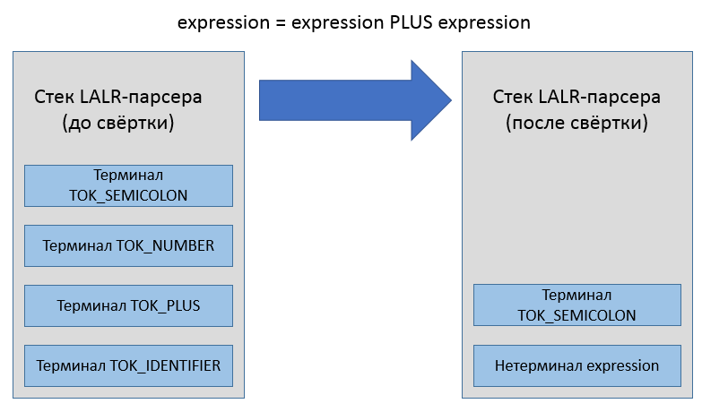
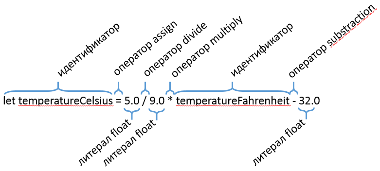
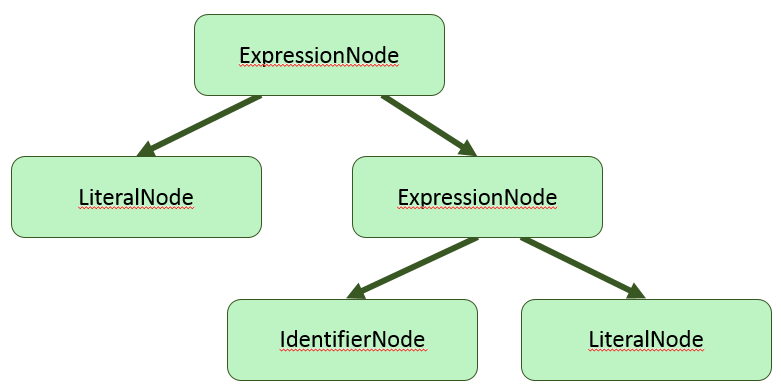

## Что такое Lemon parser generator?

Lemon &mdash; генератор синтаксических анализаторов (parser generator), разработанный автором СУБД SQLite (Dr. Richard Hipp), и доступный без лицензии как общественное достояние. Генераторы парсеров генерируют код автомата для [восходящего разбора по принципу сдвига и свёртки (shift-reduce)](shift-reduce.html).

Ещё до появления Lemon использовались генераторы парсеров UNIX Yacc и GNU Bison. Они не устроили автора SQLite, и он написал в целом похожий на GNU Bison генератор парсеров, учитывая прошлые ошибки проектирования:

- Bison и Yacc генерируют блокирующую функцию разбора, которая при вызове хочет получать весь файл сразу путём последовательного запроса токенов. Но в интерпретаторе SQL этого файла ещё просто нет, есть только отдельные строки!
- Bison и Yacc не позволяют выполнить указанный программистом код при выбрасывании значения из стека автомата, что может спровоцировать утечки памяти, если в стеке лежат указатели.
- Bison и Yacc генерируют не самый удобный и чистый код на C

## Интерфейс командной строки

Синтаксис вызова lemon следующий:

```
lemon <опции> <входной файл *.y или *.lemon>
```

Список опций командной строки:

```
  -c           Не применять сжатие к таблице контекстных действий правил.
  -D<string>   Объявить макрос, используемый в директивах %ifdef.
  -g           Генерировать парсер грамматики без контекстных действий.
  -m           Генерировать файл, совместимый с makeheaders.
  -l           Не добавлять в код директивы #line.
  -p           Печатать конфликты, решённые автоматически за счёт приоритета операторов
  -q           (Тихий режим) не записывать файл отчёта Grammar.out
  -b           Печатать в отчёте (файл Grammar.out) только ключевую информацию.
  -r           Не сортировать и не менять номера состояний
  -s           Распечатать в консоль статистику сгенерированного парсера.
  -x           Распечатать версию утилиты.
  -T<string>   Указать свой файл-шаблон для генератора кода.
  -f<string>   Игнорируется. (Заготовка на будущее для опций компилятора '-f')
  -I<string>   Игнорируется. (Заготовка на будущее для опций компилятора '-I')
  -O<string>   Игнорируется. (Заготовка на будущее для опций компилятора '-O')
  -W<string>   Игнорируется. (Заготовка на будущее для опций компилятора '-W')
```

> Подробнее об утилите makeheaders сказано здесь: [hwaci.com/sw/mkhdr/](http://www.hwaci.com/sw/mkhdr/).

## Определение грамматики

Описание грамматики составляется в файле с расширением "*.y" либо "*.lemon". Файл содержит список директив и правил грамматики, с помощью которых можно собрать дерево разбора либо абстрактное синтаксическое дерево, как только парсер получит извне последовательность токенов. Некоторые правила грамматики содержат императивные действия, заключённые в фигурные скобки:

```
// Разрешены однострочные комментарии в стиле C++
// Все директивы начинаются с символа %
%name ParseCalcGrammar

// Код в блоке директивы include попадёт в начало генерируемого файла "*.c"
%include {
#include "Token.h
#include "CalcParser.h"
#include <assert.h>
#include <math.h>
} // end %include

translation_unit ::= expression(A).
{
    // В фигурных скобках находится императивный код,
    //  срабатывающий в момент свёртки символов по правилу
    pParse->PrintResult(A.value);
}
```

Действия в фигурных скобках могут ссылаться на терминальные и нетерминальные символы, используя нотацию вида `expression(A)` для придания символу имени `A`, или любого другого имени. Когда правило грамматики однозначно распознаётся, оно "сворачивается", а связанное действие выполняется. Если быть точным, исходный код действия копируется в сгенерированный код парсера, попадая внутрь какого-то блока кода внутри функции Parse, и получая доступ к именованным символам, терминальным и нетерминальным. Задача действия &mdash; прочитать значения ячеек стека, соответствующих символам в правой части правила, и заполнить ячейку стека, соответствующую конструируемому символу в левой части.



### Разделение на токены

На первом шаге разбора формальных языков текст разбивается на лексические токены. Вы можете выполнять этот шаг любым удобным способом, и Lemon в этом не помощник &mdash; он всего лишь объявляет целочисленные идентификаторы токенов для каждого терминального символа, описанного в грамматике. Ядро сгенерированного парсера ожидает, что токены поступают один за другим последоватеьно, формируя виртуальный (либо реальный) поток токенов, которые и разбираются по грамматике.



Задача лексера/сканнера &mdash; создать поток токенов. Каждая категория токенов имеет свой идентификатор, такой как TOK_LEFT_PAREN, TOK_CLASS_KEYWORD и другие. Каждый токен имеет связанное с ним значение, дополняющее идентификатор токена. Примером служит, например, токен TOK_NUMBER со значением "1234". Все токены используют один и тот же тип для хранения своих значений, и этот тип определён директивой `%token_type` (по-умолчанию `int`). Дополнительная информация о токене может выглядеть так:

```cpp
#pragma once

struct Token
{
    // Позиция в исходном коде.
    unsigned position;
    // Числовое значение литерала (0 для остальных токенов).
    double value;
};
```

### Восходящий разбор в стиле shift-reduce

Более низкоуровневое правило грамматики должно сворачиваться раньше, чем более высокоуровневое правило. То есть, с точки зрения деревьев разбора грамматики, листовые узлы создаются перед родительскими узлами. Поэтому действия правил должны придерживаться стратегии передачи значений из листовых узлов в родительские узлы. В процедурном стиле этого можно добиться, используя обобщённую структуру, представляющую узел дерева. Например, для простой грамматики калькулятора подойдёт такая структура:

```cpp
struct Expression
{
    double value; // числовое значение
    int operationNo; // идентификатор операции +, -, *, / или %
    Expression *pLeft; // необязательный левый дочерний  узел
    Expression *pRight; // необязательный правый дочерний узел
};
```

В объектно-ориентированном стиле принят паттерн, известный как Abstract Syntax Tree. Вместо универсальной структуры, описывающей узел разбора, используются конкретные классы, наследуемые от одного или нескольких базовых интерфейсов: IExpressionAst, IStatementAst, IDeclarationAst.

```cpp
interface IExpression
{
    double Evaluate(RuntimeEnvironment &env) = 0;
};

class BinaryOperationNode : public IExpression
{
public:
    // в свойствах класса - информация об операторе и двух операндах,
    //  также имеющих тип IExpression
};

class LiteralNode : public IExpression
{
public:
    // в свойствах класса - тип и значение литерала
};

class IdentifierNode : public IExpression
{
public:
    // в свойствах класса - строковое имя и указатель на объект,
    //  на который ссылается идентификатор
};
```



## Процедурный интерфейс генерируемого кода

Все типы токенов в Lemon получают целочисленные идентификаторы, представленные как набор макросов. Для управления генерацией имён макросов в lemon есть директива "token_prefix". Директива "token_type" указывает строку, которая будет именем типа токена.

```
// All token codes are small integers with #defines that begin with "TK_"
%token_prefix TK_

// The type of the data attached to each token is Token.  This is also the
// default type for non-terminals.
//
%token_type {Token}
%default_type {Token}
```

Предполагаем, что структура Token объявлена в "Token.h":

```cpp
#pragma once

struct Token
{
    // position in source code.
    unsigned position;
    // token value (always 0 for most tokens).
    double value;
};

// Для языка C заменяем 'struct Token' на простой 'Token'
typedef struct Token Token;
```

После генерации набор токенов выглядит следующим образом:

```cpp
// Токен 0 зарезервирован под конец файла
// enum не используется по историческим причинам.
#define TK_PLUS                             1
#define TK_MINUS                            2
#define TK_STAR                             3
#define TK_SLASH                            4
#define TK_PERCENT                          5
#define TK_LPAREN                           6
#define TK_RPAREN                           7
#define TK_NUMBER                           8
```

> Числовые значения токенов выбирает именно синтаксический анализатор, а не лексический. Дело в том, что для лексического анализатора токены &mdash; это выходные значения, и их изменение не меняет таблицу переходов в конечном автомате, который может быть внутри лексического анализатора. Для синтаксического анализатора токены становятся терминальными символами, и их числовые коды попадают в таблицу переходов парсера как входные сигналы автомата. Также в таблицу попадают числовые коды нетерминальных символов (объявленных в левой части правил грамматики).

Lemon генерирует код, который позволяет держать в памяти множество парсеров одновременно, и использовать их по мере поступления токенов. Эта особенность очень важна для СУБД SQLite, которая обрабатывает SQL-код из множества присоединившихся клиентов. Имена сгенерированных функций зависят от директивы "name". Пример использования директивы:

```
// The name of the generated procedure that implements the parser
// is as follows:
%name ParseCalcGrammar
```

В данном случае процедурный интерфейс парсера будет выглядеть так:

```cpp
void *ParseCalcGrammarAlloc(void *(*mallocProc)(size_t));
void ParseCalcGrammar(void*, int, Token);
void ParseCalcGrammarFree(
  void *parser,               /* The parser to be deleted */
  void (*freeProc)(void*)     /* Function used to reclaim memory */);
#ifndef NDEBUG
void ParseCalcGrammarTrace(FILE * TraceFILE, char * zTracePrompt);
#endif
```

- Функция "ParseCalcGrammarAlloc" создаёт новое состояние парсера подобно конструкторам в C++, и она принимает "mallocProc" &mdash; указатель на функцию, выделяющую память
- Функция "ParseCalcGrammar" получает на вход токен и продвигает состояние shift-reduce парсера вперёд на один shift и несколько reduce
- Функция "ParseCalcGrammarFree" работает как деструктор, очищая состояние парсера и затем удаляя его через предоставленную функцию освобождения памяти "freeProc"
- В отладочном режиме сборки также доступна функция "ParseCalcGrammarTrace", которая устанавливает файл, куда lemon будет записывать отладочную информацию. Нетрудно догадаться, что для вывода отладочной информации в консоль достаточно передать вместо файла объект "stderr" или "stdout".

Контекстные действия, добавленные к правилам грамматики, будут встроены в функцию ParseCalcGrammar вперемешку с генерируемым кодом парсера. Возникает вопрос &mdash; как из действий обратиться к остальным объектам программы, если в функции ParseCalcGrammar доступны лишь параметры этой функции? Для проброса внешнего контекста в функцию ParseCalcGrammar предназначена директива "extra_argument", позволяющая избегать использования глобальных переменных (тем самым позволяя иметь множество объектов-парсеров, существующих и работающих совместно).

```cpp
// The generated parser function takes a 4th argument as follows:
%extra_argument {ParserState *pState}
```

Теперь в контекстных действиях правил будет доступна переменная "pState", а сигнатура функции ParseCalcGrammar изменится:

```cpp
void ParseCalcGrammar(void*, int, Token, ParserState *);
```

## Объектный фасад к процедурному коду

В ООП принято привязывать методы к объекту. В языке C++ каждый метод к тому же получает неявный параметр this. В то же время lemon генерирует процедурный код на языке C89 (совместимый с C++). Превратить неудобный процедурный интерфейс в удобный объектно-ориентированный можно с помощью шаблона проектирования "Фасад". Рассмотрим, как это сделать.

В первую очередь, следует заставить lemon выдать код на языке C++. Генератор lemon умеет генерировать только код на C89, но ничто не мешает просто переименовать файл из "*.c" в "*.cpp". Сделать это можно с помощью Shell-скрипта для Linux/OSX либо аналогичного Bat-скрипта для Windows:

```bash
#!/usr/bin/env bash

# Опции командной строки lemon:
# -q (Quite) чтобы избежать вывода отчёта о генерации кода в CalcGrammar.out
# -l чтобы не добавлять директивы препроцессора #line при генерации кода
# -s чтобы написать краткую сводку о результатах генерации парсера
lemon -q -s -l CalcGrammar.lemon
rm -f CalcGrammar.cpp
mv CalcGrammar.c CalcGrammar.cpp
```

Интерфейс класса будет выглядеть следующим образом:

```
#pragma once

struct Token;

/// Фасад для созданного утилитой lemon парсера,
///  предоставляющий объектно-ориентированный интерфейс
class ICalcParser
{
public:
    virtual ~ICalcParser() = default;

    virtual bool Advance(int tokenId, Token const& tokenData) = 0;
#ifndef NDEBUG
    virtual void StartDebugTrace(FILE *output) = 0;
#endif
};
```

Реализация будет содержать ещё несколько публичных методов, необходимых для внутренних целей парсера: из кода, сгенерированного lemon, мы можем обращаться к классу CCalcParser только через публичные методы. Чтобы передавать нужную информацию в CCalcParser, следует модифицировать грамматику:

```cpp
// Сгенерированная функция продвижения состояния парсера будет принимать 4-й аргумент
%extra_argument {CCalcParser *pParse}

// Этот блок кода запускается при синтаксической ошибке.
%syntax_error {
    (void)yymajor; // глушим предупреждения.
    pParse->OnError(TOKEN); // переменная TOKEN имеет тип, указанный в директиве '%token_type'
}

// Этот блок кода запускается при переполнении стека LALR-парсера
%stack_overflow {
    (void)yypMinor; // глушим предупреждения.
    pParse->OnStackOverflow();
}

// Деструктор будет выполняться перед выбросом токена со стека,
//  в данном случае мы просто глушим предупреждения.
%token_destructor {
    (void)yypParser;
    (void)yypminor;
    (void)pParse;
}

translation_unit ::= expression(A).
{
    // Печатаем результат выражения
    pParse->PrintResult(A.value);
}
```

С учётом изменений в грамматике, реализация интерфейса ICalcParser будет выглядеть так:

```cpp
#pragma once
#include "ICalcParser.h"

#include <string>

struct Token;

class CCalcParser : public ICalcParser
{
public:
    CCalcParser();
    ~CCalcParser();

    bool Advance(int tokenId, Token const& tokenData) final;
#ifndef NDEBUG
    void StartDebugTrace(FILE *output) final;
#endif

    void OnError(Token const& token);
    void OnStackOverflow();
    void PrintResult(double value);

private:
#ifndef NDEBUG
    // Префиксом отладочных сообщений владеет C++ код,
    //  даже если префикс - пустая строка
    std::string m_tracePrompt;
#endif
    bool m_isErrorState = false;
    void *m_parser = nullptr;
};
```

При создании фасада мы не будем трогать генерируемые файлы "CalcGrammar.h" и "CalcGrammar.cpp". Чтобы использовать функции из "CalcGrammar.cpp", достаточно сделать эквивалентные объявления функций и использовать их &mdash; реализации функций будут подставлены в на стадии компоновки. Это позволяет создать реализацию фасада парсера:

```cpp
#include "CalcParser.h"
#include "Token.h"
#include <stdlib.h>
#include <new>
#include <iostream>


// pre-declaration of generated functions.
void *ParseCalcGrammarAlloc(void *(*mallocProc)(size_t));
void ParseCalcGrammar(void*, int, Token, CCalcParser*);
void ParseCalcGrammarFree(
  void *p,                    /* The parser to be deleted */
  void (*freeProc)(void*)     /* Function used to reclaim memory */);
#ifndef NDEBUG
void ParseCalcGrammarTrace(FILE * TraceFILE, char * zTracePrompt);
#endif


CCalcParser::CCalcParser()
{
    // Лямбда-функция allocate не захватывает переменных,
    //  и может быть преобразована в указатель на функцию
    auto allocate = [](size_t size) -> void* {
        return new (std::nothrow) char[size];
    };
    m_parser = ParseCalcGrammarAlloc(allocate);
}

CCalcParser::~CCalcParser()
{
    // Лямбда-функция retain не захватывает переменных,
    //  и может быть преобразована в указатель на функцию
    auto retain = [](void *pointer) -> void {
        auto array = reinterpret_cast<char *>(pointer);
        delete[] array;
    };
    ParseCalcGrammarFree(m_parser, retain);
}

bool CCalcParser::Advance(int tokenId, const Token &tokenData)
{
    ParseCalcGrammar(m_parser, tokenId, tokenData, this);
    return !m_isErrorState;
}

#ifndef NDEBUG
void CCalcParser::StartDebugTrace(FILE *output)
{
    m_tracePrompt = "";
    ParseCalcGrammarTrace(output, &m_tracePrompt[0]);
}
#endif

void CCalcParser::OnError(const Token &token)
{
    std::cerr << "Syntax error at position " << token.position << std::endl;
    m_isErrorState = true;
}

void CCalcParser::OnStackOverflow()
{
    std::cerr << "LALR parser stack overflow occured." << std::endl;
    m_isErrorState = true;
}

void CCalcParser::PrintResult(double value)
{
    std::cerr << value << std::endl;
}
```

<!--

## Token recognition

The first step to parsing anything is to break it into lexical tokens. You can do this in any way you want. Lemon does not help you here, it only defines an integer "token id", for each terminal in your grammar, see cfg.h. It wants you to pass these id’s in sequentially, to represent the "token stream" being parsed.

The lexer/tokenizer’s job is simple: produce a list of tokens. Each token is identified by its integer id. E.g. TOK_LCURLY, TOK_SERVER, etc. Each token a value in addition to its id. For example a token with id TOK_NUMBER might have the value "1234". The tokens (terminals) all have the same data type determined by the %token_type directive `[default int]`. In our example code we use a char* for our tokens. Whenever a token is identified, we make a string from it and pass that char* and its associated integer token id into the lemon-generated Parse function.

### Regular expressions

A nice way to tokenize the input would be to define a bunch of regular expressions (e.g. using PCRE) and then apply them in a specified order til one hits. But this example doesn’t need that complexity.

### Simple custom lexer

See the tok.c file for our simple lexical analyzer. It just reads a minimal number of characters until a keyword is recognized or a whitespace-delimited number or dotted-alphanumeric string is found. As a bonus feature it also keeps track of our line number so that we can print nice error messages during lexing/parsing.

## Final notes

### Careful memory management of the terminals!

This bit me once or twice while learning how to write parsers. Recognize that lemon has a stack internally that keeps its state as it shifts and reduces rules. The token that your lexer passes in to Parse, will persist on that Lemon stack (maybe a long time) while other tokens are shifted. So, whatever token values you pass in, cannot be overwritten or reused while parsing proceeds.

In other words, don’t just re-use the same char* as your token value and keep passing it into Lemon for each token-- you need a unique char* for each one. If you’re lazy you can just strndup() every token before calling Parse (and then you could define the %token_destructor to free() each one). There’s nothing wrong with that approach. I prefer a more manually-tracked approach so I strndup each token and throw it onto a vector of tokens before passing it into Parse. At the conclusion of parsing I iterate over that token vector and free all of them.

Within my grammar actions in cfg.y, the "value" of each terminal is a pointer to one of those strings in my token vector. I write my grammar actions so that they, in turn, make their own copies of any tokens (strings) they want to "keep around" for inclusion in the final parsing result. This way I can free my token vector without worrying about whether the parsing result has remaining pointers into the token vector.

### Why lex and parse in unison?

As a side note you could "lex" the whole input into tokens (keeping the string and the integer id for each token, and if you want to be friendly, the line number it was on) prior to doing any parsing at all. I.e. the parsing could be done in an entirely separate phase using the pre-prepared token vector. But doing the lexing and the parsing in concert means that you can avoid the cost of further lexical analysis if you encounter a grammar error.

-->

<!--TODO: https://www.sqlite.org/src/doc/trunk/doc/lemon.html-->
<!--TODO: контроль приоритетов операторов -->
<!--TODO: обработка ошибок -->
<!--TODO: генерация AST с помощью шаблонов -->
<!--TODO: Shell Parser, part I: https://brskari.wordpress.com/2012/04/29/writing-a-basic-shell-using-flex-and-lemon-part-1/ -->
<!--TODO: Shell Parser, part II: https://brskari.wordpress.com/2012/04/30/writing-a-simple-shell-using-flex-and-lemon-part-2/ -->
<!--TODO: http://souptonuts.sourceforge.net/readme_lemon_tutorial.html -->
