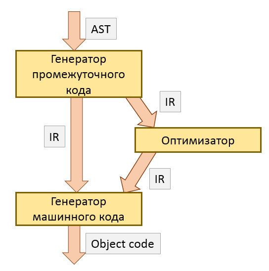

В компиляторах компонент Backend получает на вход логическую модель программы, обычно хранимую в Abstract Syntax Tree (AST), и преобразует её в машинный код. Возможны иные варианты трансляции &mdash; например, в ассемблер или в байткод виртуальной машины.

Между AST и машинным кодом в современных компиляторах есть ещё и промежуточный код. Это похожий на метаассемблер трёхадресный код вида:

```
...
%3 = mul nsw i32 3, %2
%5 = sub nsw i32 %3, %4
%6 = mul nsw i32 %1, %5
%7 = add nsw i32 %0, %6
...
```

Промежуточный код позволяет компиляторам абстрагироваться от различных процессоров: Backend работает с промежуточным кодом, и лишь в самом конце практически напрямую отображает инструкции промежуточного кода на реальные инструкции, доступные на заданном процессоре.



- AST поступает на вход из фронтенда и превращается в плоский, подобный ассемблеру промежуточный код
- промежуточный код либо напрямую поступает в генератор кода целевой платформы, либо отправляется в оптимизатор
- генератор кода целевой платформы создаёт не исполняемый, а объектный файл, который затем нужно скомпоновать (link)
- компоновка (linking) выходит за полномочия Backend, но Driver может поддерживать автоматический вызов компоновщика (linker) для удобства пользователя

## Debug и Release конфигурации

## LLVM - библиотеки для построения бекенда компилятора

>Подробнее об установке и использовании LLVM можно прочитать в [Руководстве по установке LLVM](/compilers/llvm_setup)

## Генерация кода выражений на LLVM-IR

TODO:

- генерация кода выражений на стековой машине
- бесконечное число регистров
- виртуальный метаассемблер
- SSA-форма
- трюк со стеком регистров
- llc/clang для компиляции LLVM-IR кода

## Генерация кода инструкций на LLVM-IR

TODO:

- базовые блоки
- схема базовых блоков для if-else
- упражнение: схема базовых блоков для while
- упражнение: схема базовых блоков для do-while
- clang для компиляции из C/C++ в LLVM-IR

## Генерация кода функций на LLVM-IR
