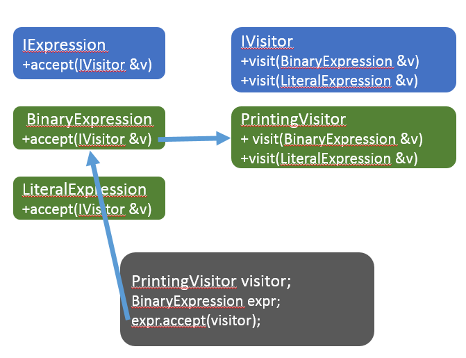

## Нововведения

Данный транслятор был получен путём доработки интерпретатора из примера `lemon-8` с использованием LLVM для генерации кода. Была реализована только часть языка:

- функции и определение функции main
- выражения

На данный момент не работают:

- кодогенерация для типов Boolean, String
- кодогенерация для циклов и ветвлений

Пример компилируемого кода:

```
function main()
  x = 2 + 34 / 2
  print x - 4 * 0.5
end
```

Транслятор пока ещё не умеет компилировать файлы в объектные и выдаёт LLVM-IR код, который мы прокомментировали для вашего удобства. Вы легко заметите, что никаких вычислений в коде нет, потому что LLVM обнаружил константы и произвёл вычисления заранее:

```
; комментарии начинаются с ';'
; ModuleID = 'main module'
; source_filename - атрибут для отладочных целей
source_filename = "main module"

; @str - глобальная строковая константа, содержит строку "%lf\n"
@str = internal constant [5 x i8] c"%lf\0A\00"

; @printf - внешняя функция, реализация находится в стандартной библиотеке
;  языка C и есть в каждой операционной системе
declare i32 @printf(i8*, ...)

; @main - точка входа программы по соглашениям LLVM-IR
define i32 @main() {
; entry - метка, открывающая первый блок инструкций функции
entry:
; инструкция call вызывает функцию printf
  %0 = call i32 (i8*, ...) @printf(i8* getelementptr inbounds ([5 x i8], [5 x i8]* @str, i32 0, i32 0), double 0x4030FFFFFF800000)
  ret i32 0
}
```

Также изменилась грамматика:

- теперь инструкции должны находится строго внутри функций
- точкой входа служит функция `main` без аргументов и без `return`

Транслятор читает входной поток целиком, и затем пишет в выходной поток LLVM-IR код в человекочитаемом виде. Этот код можно скомпилировать в исполняемый файл командой `"clang main.ll"`.

## Класс CCompilerDriver

Класс имеет очень простой интерфейс и реализует паттерн "Фасад" ("Facade"), т.е. его основная цель - объединить подсистемы компилятора в простой и удобный интерфейс.

```cpp
class CCompilerDriver
{
public:
    CCompilerDriver(std::ostream &errors);
    ~CCompilerDriver();

    void StartDebugTrace();
    bool Compile(std::istream &input, std::ostream &output);

private:
    // Используется идиома pointer-to-implementation.
    class Impl;
    std::unique_ptr<Impl> m_pImpl;
};
```

Метод CCompilerDriver::Compile работает в два шага: сначала разбирает исходный текст и конструирует AST, а затем обходит AST в глубину и генерирует код. Именно генерация кода представляет наибольший интерес, поэтому рассмотрим её подробнее.

## Паттерн "Посетитель" ("Visitor") для узлов AST

В интерпретаторе был использован паттерн "Интерпретатор", т.е. каждый узел AST имел метод, который принимал контекст выполнения и выполнял рекурсивное вычисление узла с учётом текущего контекста выполнения:

```
// Вычисление выражения возвращает результат в виде CValue
class IExpressionAst
{
public:
    virtual ~IExpressionAst() = default;
    virtual CValue Evaluate(CInterpreterContext& context) const = 0;
};

// Выполнение инструкции результата не возвращает
class IStatementAst
{
public:
    virtual ~IStatementAst() = default;
    virtual void Execute(CInterpreterContext& context) const = 0;
};

// Вычисление функции требует список аргументов и возвращает результат в виде CValue
class IFunctionAst
{
public:
    virtual ~IFunctionAst() = default;
    virtual CValue Call(CInterpreterContext& context, std::vector<CValue> const& arguments) const = 0;
    virtual unsigned GetNameId() const = 0;
};
```

Такой паттерн подходит для интерпретатора, где входные данные поступают вместе с исходным кодом программы и могут быть сразу использованы для вычисления. Процессы внутри компилятора выглядят сложнее:

- сначала должна произойти проверка типов и других семантических правил путём обхода AST
- затем путём ещё одного обхода AST нужно сгенерировать промежуточный код на языке LLVM-IR
- уже после генерации промежуточного кода он может быть превращён в машинный (это тема следующих статей) и использован для обработки входных данных

Для множественной обработки AST лучше подходит паттерн "Посетитель", который позволяет абстрагироваться от узлов AST. Для реализации паттерна достаточно создать у каждого узла дерева метод, например `void Accept(IVisitor&)`, который будет вызывать правильную перегрузку метода `IVisitor::Visit`, соответствующую типу текущего узла, и рекурсивно вызывать Accept для дочерних узлов:



## Генерация кода выражений

Для генерации кода выражений мы реализуем интерфейс IExpressionVisitor

```
class CExpressionCodeGenerator : protected IExpressionVisitor
{
public:
    CExpressionCodeGenerator(llvm::IRBuilder<>& builder, CFrontendContext& context);

    // Can throw std::exception.
    llvm::Value* Codegen(IExpressionAST& ast);

protected:
    void Visit(CBinaryExpressionAST& expr) override;
    void Visit(CUnaryExpressionAST& expr) override;
    void Visit(CLiteralAST& expr) override;
    void Visit(CCallAST& expr) override;
    void Visit(CVariableRefAST& expr) override;

private:
    // Стек используется для временного хранения
    // по мере рекурсивного обхода дерева выражения.
    std::vector<llvm::Value*> m_values;
    CFrontendContext& m_context;
    llvm::IRBuilder<>& m_builder;
};
```

Для генерации списка инструкций нам потребуется принцип стековых вычислений

> Принцип стековых вычислений описан в статье [Стековые и регистровые машины](stack_and_register)

Для стековых вычислений есть нюанс: в нашем распоряжении есть только регистры, в них находятся операнды инструкций и попадают результаты выполнения. В языке LLVM-IR бесконечно много регистров, и для создания нового регистра достаточно просто присвоить его. Так может выглядеть вычисление "28 / 9 + 7 + 5.5" на LLVM-IR:

```
; Программа вычисляет выражение 28.0 / 9.0 + 7.0 * 5.5 и печатает в консоль результат

; @str - глобальная строковая константа, содержит строку "%lf\n"
@str = internal constant [5 x i8] c"%lf\0A\00"


; @printf - внешняя функция, реализация находится в стандартной библиотеке
;  языка C и есть в каждой операционной системе
declare i32 @printf(i8*, ...)

define i32 @main() {
entry:
  %0 = fdiv double 28.0, 9.0
  %1 = fmul double 7.0, 5.5
  %2 = fadd double %0, %1
  %3 = getelementptr inbounds [5 x i8], [5 x i8]* @str, i32 0, i32 0
  %4 = call i32 (i8*, ...) @printf(i8* %3, double %2)
  
  ret i32 0
}
```

Нетрудно заметить, что здесь можно применить разложение выражения в линейный список инструкций с помощью стека. При этом в ячейках стека следует хранить не значения, а регистры, потому что на момент компиляции входных данных и соответственно значений ещё нет.

В библиотеках LLVM объекты регистров представляются указателями типа `llvm::Value*`, а в качестве стека подойдёт обычный `std::vector`. Класс CExpressionCodeGenerator по мере рекурсивного обхода одного выражения сохраняет регистры с результатами подвыражений в поле `std::vector<llvm::Value*> m_values;`. В конце обхода (в случае, если кодогенератор написан правильно) на стеке останется ровно один регистр, который и будет хранить в себе значение после выполнения всех инструкций.

```cpp
Value* CExpressionCodeGenerator::Codegen(IExpressionAST& ast)
{
    llvm::Value* pValue = nullptr;
    try
    {
        ast.Accept(*this);
        pValue = m_values.at(0);
        m_values.clear();
    }
    catch (std::exception const& ex)
    {
        m_context.PrintError(ex.what());
    }
    return pValue;
}
```

Генерация инструкций выполняется с помощью объекта `llvm::IRBuilder<>& m_builder;`:

```cpp
Value* GenerateUnaryExpr(IRBuilder<>& builder, LLVMContext& context, UnaryOperation op, Value* x)
{
    (void)context;
    switch (op)
    {
    case UnaryOperation::Plus:
        return x;
    case UnaryOperation::Minus:
        // Генерация инструкции negtmp
        return builder.CreateFNeg(x, "negtmp");
    }
    throw std::runtime_error("Unknown unary operation");
}

void CExpressionCodeGenerator::Visit(CUnaryExpressionAST& expr)
{
    expr.GetOperand().Accept(*this);
    Value* x = m_values.at(m_values.size() - 1);
    m_values.pop_back();

    auto pValue = GenerateUnaryExpr(m_builder, m_context.GetLLVMContext(), expr.GetOperation(), x);
    m_values.push_back(pValue);
}
```

## Генерация кода инструкций

В процедурных языках программирования есть цепочки инструкций, и в языках ассемблера они тоже есть. Поэтому генерация кода инструкций заключается в простом последовательном отображении высокоуровневых инструкций вашего языка на низкоуровневые инструкции ассемблера. Однако, с некоторыми высокоуровневыми конструкциями могут возникнуть сложности: мы рассмотрим основные случаи. Для генерации кода цепочек инструкций служит класс CBlockCodeGenerator:

```cpp
class CBlockCodeGenerator : protected IStatementVisitor
{
public:
    CBlockCodeGenerator(CFrontendContext& context);

    void Codegen(llvm::BasicBlock& bb, const StatementsList& block);
    void AddExitMain();

    // IStatementVisitor interface
protected:
    void Visit(CPrintAST& ast) override;
    void Visit(CAssignAST& expr) override;
    void Visit(CReturnAST& expr) override;
    void Visit(CWhileAst& expr) override;
    void Visit(CRepeatAst& expr) override;
    void Visit(CIfAst& expr) override;

private:
    CFrontendContext& m_context;
    llvm::IRBuilder<> m_builder;
    CExpressionCodeGenerator m_exprGen;
};
```

Начнём с самой простой инструкции возврата, которая должна просто привести в вызову инструкции ret языка LLVM-IR:

```cpp
// Выбрасывает ret double %имя_регистра
void CBlockCodeGenerator::Visit(CReturnAST& expr)
{
    if (auto* pValue = m_exprGen.Codegen(expr.GetValue()))
    {
        m_builder.CreateRet(pValue);
    }
}
```

Немного сложнее будет реализация присваивания: по сути переменные - это отображение имени (идентификатора) на некоторую ячейку памяти, а для построения такого отображения в памяти компилятора подойдёт структура данных "хеш-массив" (известная как ассоциативный массив или словарь). В примере ниже вызывается метод AssignVariable, который получает регистр, имя переменной (в виде целочисленного ID) и сохраняет отображение имени на регистр в хеш-таблице. Пока что у нас нет обработки областей видимости, поэтому хеш-таблица единая на всю программу.

```cpp
void CBlockCodeGenerator::Visit(CAssignAST& ast)
{
    llvm::Value* pValue = m_exprGen.Codegen(ast.GetValue());
    m_context.AssignVariable(ast.GetNameId(), pValue);
}
```

## Остальные изменения в сравнении с lemon-8-types

- новые классы `CCodeGenerator`, `CBlockCodeGenerator`, `CExpressionCodeGenerator` генерируют код для программы целиком, для тела функции и для выражения соответственно
- класс `CInterpreterContext` переименован в `CFrontendContext` и претерпел изменения в типах данных, с которыми он работает.
- класс `CValue` был удалён за ненадобностью
- методы `Evaluate` и `Execute` у выражений и инструкций были удалены, теперь узлы AST лишь дают возможность обхода посетителем, но сами не содержат логики генерации кода.

## Использованная литература

- [язык Kaleidoscope, глава 3 (llvm.org)](http://llvm.org/docs/tutorial/LangImpl3.html)
- [передача строковой константы как аргумента фукнции (stackoverflow.com)](http://stackoverflow.com/questions/16656855/llvm-ir-string-initialization)
- [как заставить Clang скомпилировать C++ в LLVM-IR (stackoverflow.com)](http://stackoverflow.com/questions/9148890/how-to-make-clang-compile-to-llvm-ir)
