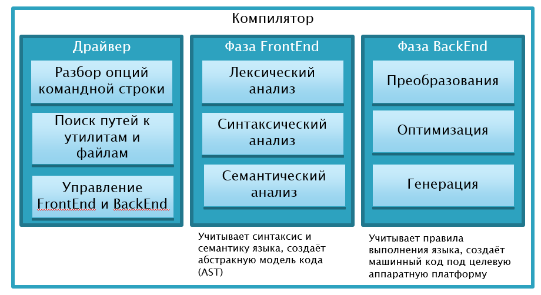

Задача &mdash; написать компилятор минимального жизнеспособного процедурного языка программирования. Компилятор должен представлять из себя консольную программу, которая получает в аргументах командной строки путь к единственному файлу с исходным кодом, обрабатывает его и после успешной обработки создаёт исполняемый файл.

## Техническое задание

 1. Ознакомиться со спецификацией (англ. language reference) одного из реальных языков, который будет взят за основу своего языка:
     - Python: [docs.python.org/3/reference](https://docs.python.org/3/reference)
     - Javascript: [ecma-international.org/publications/standards/Ecma-262.htm](http://www.ecma-international.org/publications/standards/Ecma-262.htm)
     - Golang: [golang.org/ref/spec](https://golang.org/ref/spec)
     - ANSI C: [softeng.polito.it/tongji/AP/C-reference-language.pdf](http://softeng.polito.it/tongji/AP/C-reference-language.pdf), [en.cppreference.com/w/c](http://en.cppreference.com/w/c)
 2. Составить 5-10 небольших программ на языке, взятом за основу, использующих как можно более ограниченное процедурное подмножество языка
 3. Спроектировать компилятор
    - Составить список возможностей, которые формируют минимальный возможный язык. Учесть обязательные требования: поддержу выражений с арифметическими, логическими и сравнительными операторами; переменных и присваивания; подпрограмм (функций) с параметрами и возвращаемым значением
    - Составить список поддерживаемых типов данных. Учесть обязательные требования: поддержку чисел с плавающей точкой, строк, а также массивов либо пользовательских структур
 4. Составить дорожную карту (roadmap) проекта в виде таблицы, которая бы ответила на вопросы
    - сколько итераций и каковы их сроки сдачи (deadline)?
    - что получает пользователь в конце каждой итерации?
    - как это выглядит?
    - какие задачи надо выполнить в итерации, чтобы пользователь смог получить обещаное?
 5. Реализовать компилятор, содержащий в себе драйвер, фронтенд и бекенд.
     - Фронтенд должен выполнять лексическую, синтаксическую и семантическую стадию анализа, на выходе создавать AST.
     - Можно использовать LLVM и его промежуточный язык LLVM-IR как набор готовых компонентов для бекенда, в этом случае бекенд должен выполнять преобразование AST в промежуточный код, оптимизатор промежуточного кода и генератор машинного кода из промежуточног
     - Можно разработывать бекенд без промежуточного кода, в этом случае используется ассемблер целевой платформы, и придётся реализовать оптимизатор ассемблерного кода
     - Драйвер должен уметь превращать объектный файл, созданный в бекенде, в исполняемый файл путём вызова компоновщика или иным способом.

На схеме показаны два ключевых компонента компилятора и управляющий ими драйвер:



Кроме этих компонентов предстоит написать библиотеку времени выполнения языка (runtime library) и набор функциональных тестов.

## Процесс написания компилятора

Компилятор можно разработать по методологии "водопад" либо по гибким методологиям.

В методологии "водопад" процесс разработки выглядит как последовательное движение по ТЗ, описанному выше. Перед каждым этапом нужно тщательно проектировать, изучать критически готовые примеры и теоретические материалы. Если пренебречь проектированием, проект наверняка пойдёт в неправильную сторону и не будет сдан в сроки.

В методологии agile вы за один короткий спринт реализуете минимальный рабочий прототип, а затем слоями накладываете новую функциональность. Проектирование, изучение теории и готовых примеров выполняется перед каждым спринтом. Если пренебречь проектированием, спринт наверняка будет потрачен впустую, что задержит сдачу проекта.

Для тех, кто предпочитает agile, есть примерный план послойного наращивания функционала:

 1. Компилятор уровня калькулятора с поддержкой `+`, `-`, `*`, `/`, учётом неявного приоритета и с основными компонентами компилятора: парсером на основе рекурсивного спуска, AST и бекендом, использующим для вычисления стек. Пользователь может использовать компилятор как калькулятор.
 2. Компилятор с инструкциями (одна на строку) и переменными, на этом спринте можно улучшить грамматику, реализацию парсера, добавить лексер, улучшить генератор кода. Пользователь может использовать компилятор как калькулятор с переменными.
 3. Компилятор структурного языка (с циклами и ветвлениями), на этом спринте потребуется улучшить грамматику и парсер, а в бекенде разобраться с генерацией программы с корректным графом потока выполнения (control flow graph)
 4. ...

## Командная работа

Проект компиляторов можно выполнять вдвоём. Зоны ответственности можно разделить, например, так

 1. Первый &mdash; реализует Frontent компилятора, определяет структуру AST и грамматику языка
 2. Второй &mdash; реализует Backend и драйвер компилятора, интегрирует Backend и Frontend
 3. Тестовый набор программ пишется сообща

## Как сделать язык разнообразнее

Разные языки используют разные подходы к таким привычным вещам, как выражения, ветвления и циклы, подпрограммы и та далее. Ниже показаны некоторые типовые решения из разных языков программирования:

#### Способ разделения инструкций (statements)

- Разделитель &mdash; точка с запятой: `x = 10; print x;`
- Разделитель &mdash; перенос строки: `x = 10;\nprint x\n`
- Язык ориентирован на выражения и не содержит разделителей инструкций (пример &dash; диалекты яыка LISP)

#### Способ указания вложенности инструкций (nested statements block)

- Вложенный блок инструкций обёрнут фигурными скобками: `if (x) { ... }`
- Вложенный блок инструкций обёрнут словами BEGIN/END: `if (x) BEGIN ... END`
- Вложенный блок инструкций имеет больший отступ, как в языке Python
- Вложенный блок инструкций начинается с переноса строки после `if` или `while` и продолжается до слова `end`.

#### Набор инструкций для поддержки Structured Programming

- `if` с опциональным `else`
- `while`
- `while` с опциональным `else` (как в языке Python)
- `do` / `while`
- `repeat` / `until`
- `loop` (бесконечный цикл)
- `for %item% in %array%`
- `foreach %item% in %array%`
- `for %item% : %array%`
- `for I := 1 TO 2`
- `for` в стиле языка C

Циклы могут содержать `break` или `continue`

#### Присваивание и сравнение

- присваивание через `=`, сравнение через `==` (стиль C++)
- присваивание через `=`, сравнение с приведением типов через `==`, сравнение с проверкой типов через `===` (стиль Javascript)
- присваивание через `:=`, сравнение через `=` (стиль PASCAL)
- присваивание с объявлением через `:=`, обычное присваивание через `=`, сравнение через `==` (стиль Golang)

#### Способ реализации системы типов

- динамическая проверка типов, переменная может менять тип во время выполнения
- статическая проверка типов, тип указывается при объявлении справа (в стиле C):
```cpp
int i = 10;
i = i + 2;
```
- статическая проверка типов, тип указывается при объявлении слева (в стиле ActionScript):
```as3
var i: Number = 20;
i = i + 1;
```
- статическая проверка типов, тип указывается при объявлении слева либо выводится автоматически (в стиле C++ и C#)
```cpp
var x = 10; // автоматический вывод типа из инициализатора
int y = 12; // явное указание типа
```
- статическая проверка типов, тип указывается при объявлении справа либо выводится автоматически (в стиле Golang)
```go
var x int // явное указание типа
y := 10 // вывод типа из инициализатора
```

#### Вызов функций

- аргументы в круглых скобках после имени функции (стиль C++)
```cpp
setPosition(x, y);
```
- аргументы в квадратных скобках вместе с именем функции, имя функции разбито на фрагменты (стиль Objective-C)
```objc
[object setX:x andY:y] // имя функции - 'setX:andY:'
```
- аргументы в круглых скобках вместе с именем функции (стиль LISP)
```lisp
(setPosition x y)
```

#### Объявление функций

- функция начинается с ключевого слова `def` (стиль Python)
- функция начинается с ключевого слова `function` (стиль ActionScript)
- функция отличается от остальны конструкций только синтаксически (стиль C++)

## Примеры небольших программ

Вычисления, числа с плавающей точкой, управляющие инструкции, функции

- [A+B](http://rosettacode.org/wiki/A%2BB)
- [Наибольший общий делитель (НОД, GCD)](http://rosettacode.org/wiki/Greatest_common_divisor#C)
- [Вычисление корня методом Ньютона](https://en.wikipedia.org/wiki/Newton%27s_method#Pseudocode) ([ещё пример на Python](https://helloacm.com/newton-iterative-sqrt-method/))
- [Скалярное произведение](http://rosettacode.org/wiki/Dot_product#C)
- [Поиск корня функции методом Ньютона](http://rosettacode.org/wiki/Roots_of_a_function#C.2B.2B)

Строки, ввод-вывод, управляющие инструкции

- [Fizz-Buzz](http://rosettacode.org/wiki/FizzBuzz#C.2B.2B)
- [99 bottles](http://www.99-bottles-of-beer.net/language-c%20%20-109.html)
- [Odd Word Problem](http://rosettacode.org/wiki/Odd_word_problem#C)

Сложные примеры

- [Анаграммы](http://rosettacode.org/wiki/Anagrams#C)

Множество иных примеров есть на сайте [rosettacode.org](http://rosettacode.org/wiki/Category:C%2B%2B)

## Литература

- [Статья "А что такое Compiler Frontend?"](what_is_frontend.html)
- [Статья "А что такое Compiler Backend?"](what_is_backend.html)
- [Статья "А что такое Compiler Driver?"](what_is_driver.html)
