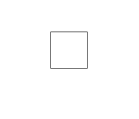
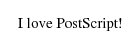
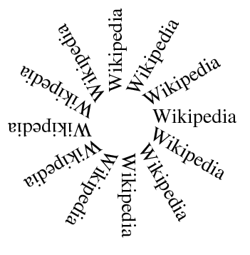
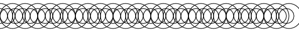

Задача — написать интерпретатор ограниченного подмножества формального языка PostScript. Интерпретатор должен представлять из себя оконное приложение, которое получает в аргументах командной строки путь к файлу со скриптом на языке PostScript, и затем показывает в окне изображение — результат интерпретации скрипта.

## Техническое задание

 1. Ознакомиться с языком PostScript, его синтаксисом и возможностями
 2. Составить список отдельных возможностей (features) интерпретатора, которые, предположительно, будут реализованы, и составить набор проверочных изображений — по 2-3 на каждую возможность.
 3. Составить дорожную карту (roadmap) проекта в виде таблицы, которая бы ответила на вопросы
    - сколько итераций и каковы их сроки сдачи (deadline)?
    - что получает пользователь в конце каждой итерации?
    - как это выглядит?
    - какие задачи надо выполнить в итерации, чтобы пользователь смог получить обещанное?

## Язык PostScript

Интерпретируемый язык PostScript разработан для использования в принтерах как альтернатива растровым изображениям. Вместо объёмной карты пикселей принтер может получить небольшую серию текстовых команд, и интерпретировать их для получения графического рисунка, который затем будет напечатан.

В данном примере однострочные комментарии начинаются с символа "%":

```ps
100 100 moveto % перемещаем начальную точку к левому нижнему углу прямоугольника
172 100 lineto % добавляем к фигуре отрезок, ведущий в правый нижний угол
172 172 lineto % добавляем к фигуре отрезок, ведущий в правый верхний угол
100 172 lineto % добавляем к фигуре отрезок, ведущий в левый верхний угол
closepath % добавляем к фигуре отрезок, ведущий назад к начальной точке
stroke % рисуем по контуру последнюю заданную фигуру
showpage % печатаем страницу и затем выталкиваем из принтера
```

Заметим, что в PostScript команда появляется после её аргументов. Такой формат записи выражений называется [обратной польской нотацией](https://ru.wikipedia.org/wiki/%D0%9E%D0%B1%D1%80%D0%B0%D1%82%D0%BD%D0%B0%D1%8F_%D0%BF%D0%BE%D0%BB%D1%8C%D1%81%D0%BA%D0%B0%D1%8F_%D0%B7%D0%B0%D0%BF%D0%B8%D1%81%D1%8C) (в честь польского математика Яна Лукашевича), и он хорош тем, что не требует скобок для указания приоритета операций.

При интерпретации скрипта получим прямоугольник внизу страницы:



### Интерпретация PostScript с помощью Ghostscript

Открытый кроссплатформенный пакет программ Ghostscript содержит в себе интерпретатор PostScript, способный в том числе вывести результат выполнения скрипта в JPEG или в PNG. На Unix-платформах можно использовать вспомогательный Shell-скрипт `ps_to_png.sh`:

```bash
#/usr/bin/env bash

# Интерпретирует переданный параметром скрипт на языке PostScript.
# Результат выводит как 32-битный PNG с alpha-каналом в "page-%d.png",
#   где '%d' - номер страницы.
# См. также документацию по использованию ghostscript из командной строки:
#   http://www.ghostscript.com/doc/doc/Use.htm

gs "-sDEVICE=pngalpha" "-sOutputFile=page-%d.png" -dBATCH -dNOPAUSE "$@"
```

Использовать `ps_to_png.sh` из оболочки командной строки можно так:

```bash
$ ./ps_to_png.sh rect.ps
GPL Ghostscript 9.18 (2015-10-05)
Copyright (C) 2015 Artifex Software, Inc.  All rights reserved.
This software comes with NO WARRANTY: see the file PUBLIC for details.
$ xdg-open page-1.png
```

Аналогичный скрипт можно оформить с помощью Batch или PowerShell для Windows.

## PostScript вычисляется с помощью стека

В языке PostScript операнды складываются в стек.

## Примеры скриптов на PostScript

### Вывод текста

Вывод надписи "I love PostScript!" со шрифтом "Times New Roman" размера 15pt:



```ps
/Times-Roman findfont
15 scalefont
setfont
100 500 moveto
(I love PostScript!) show
showpage
```

Отображение той же надписи со шрифтом "Times New Roman" в наклонном начертании (также известном как italic) размера 20pt:

```ps
/Times-Italic findfont
20 scalefont
setfont
100 450 moveto
(I love PostScript!) show
showpage
```

### 2D трансформации
```



```ps
%!PS-Adobe-1.0
% По умолчанию, постскрипт использует единицу измерения 1 пункт=1/72 дюйма,
% а нам нравятся миллиметры.
72 25.4 div           % 1 мм = 72/25.4 пунктов
dup                   % дублировать значение на вершине стека
scale                 % растянуть в это количество раз по обеим координатам
100 100 translate     % установить начало координат в (100мм, 100мм)

/Times-Roman findfont % взять шрифт Times-Roman
10 scalefont          % растянуть до размера 10 (у нас - мм!)
setfont               % установить выбранный шрифт

0 30 330 {            % цикл для углов от 0 до 330 с шагом 30
  gsave                 % запомнить текущее преобразование координат
    rotate              % повернуть систему координат (угол в градусах берём с вершины стека)
    15 0 moveto         % перейти в точку (15мм, 0мм)
    (Wikipedia) show    % написать слово текущим шрифтом
  grestore              % вернуть преобразование координат
} for                 % конец цикла for

showpage              % вывести страницу
```

### Градации серого


```ps
0.2 setgray
10 setlinewidth
100 700 moveto
200 0 rlineto
stroke
newpath
0.3 setgray
100 600 moveto
200 0 rlineto
stroke
newpath
0.4 setgray
100 500 moveto
200 0 rlineto
stroke
newpath
0.5 setgray
100 400 moveto
200 0 rlineto
stroke
newpath
0.6 setgray
100 300 moveto
200 0 rlineto
stroke
newpath
0.7 setgray
100 200 moveto
200 0 rlineto
stroke
newpath
0.8 setgray
100 100 moveto
200 0 rlineto
stroke
showpage
```

### Объявление процедур (def)


В примере используется объявление процедур (def), параметры которых лежат в стеке в момент вызова. Объявлены процедуры `/inch`, `/box` и `fillgray`

```ps
% Переводит дюймы в точки (points)
/inch {
    72 mul
} def

% Рисует прямоугольник
% параметры в стеке: [x, y]
/box {
    newpath
        moveto
        1 inch 0       rlineto
        0      1 inch  rlineto
        -1 inch 0      rlineto
    closepath
} def

% Заливает прямоугольник серым цветом
% параметры в стеке: [уровень серого цвета]
/fillgray {
    setgray fill
} def

% Основная программа

2 inch 3   inch box
    .9 fillgray
2.5 inch 3.5 inch box
    .7 fillgray
showpage
```

### Объявление процедур, пример 2


```ps
% Выполняет поворот осей координат,
%  тем самым модифицирует состояние интерпретатора.
/neworigin {
    250 150 translate
    60 rotate
} def

% Выполняет рисование треугольника.
/treangl {
    newpath
        0 0 moveto
        90 0 lineto
        20 70 lineto
    closepath
    fill
} def

treangl
neworigin
treangl
neworigin
treangl
showpage
```

### Объявление процедур, пример 3



```ps
%%% Определение процедур
 /pagewidth 8 72 mul def % Ширина страницы
 /circle  {              % Рисование круга
   x   y radius
   0 360 arc
         stroke
 } def

 /new-x {                % Новая позиция для следующего круга
    x radius add    % Это эквивалентно:
    /x exch def     % х=х+radius
 } def

 /DoLineOfCrle {         % Рисуем линию из окружностей
    /y      exch def  % заносим значения из стека в переменные
    /radius exch def
    /x      0    def
   {                  % условный цикл
     x pagewidth le   % центр нового круга в пределах границы?
      {circle new-x}  % да: рисуем и вычисляем новую позицию
      {exit}          % иначе - выход из цикла
     ifelse
   } loop
 } def

%%%% Рисуем две линии кругов
15 200 DoLineOfCrle
25 200 DoLineOfCrle
showpage
```

### Сохранение и восстановление состояния (gsave/grestore)


```ps
/cmm {
    72.0 mul 25.4 div
} def % перевод из миллиметров в пункты

% звезда - штриховка и контур (слева на рисунке)
newpath % начинаем путь
20 cmm 180 cmm moveto
20 cmm 0 rlineto
10 cmm 20 cmm rlineto
-10 cmm 20 cmm rlineto
-20 cmm 0 rlineto
-10 cmm -20 cmm rlineto
10 cmm -20 cmm rlineto
gsave % сохраняем текущие графические параметры
clip % устанавливаем путь как маску
0.4 setgray 0.1 setlinewidth % устанавливаем цвет линии и толщину линии
-70 2 70 {newpath cmm 180 cmm moveto 50 cmm 50 cmm rlineto stroke} for % цикл
grestore % восстанавливаем графические параметры "до штриховки"
stroke % рисуем контур вдоль пути

% звезда - заливка, штрих  и границы (справа на рисунке)
gsave % сохраняем графические параметры
newpath % начинаем путь
120 cmm 180 cmm moveto
20 cmm 0 rlineto
10 cmm 20 cmm rlineto
-10 cmm 20 cmm rlineto
-20 cmm 0 rlineto
-10 cmm -20 cmm rlineto
10 cmm -20 cmm rlineto
gsave % сохраняем текущие графические параметры
0.9 setgray fill % зальем фигуру светло-серым
grestore % восстанавливаем графические параметры "до заливки"
gsave % и сохраняем их опять
clip % устанавливаем путь как маску
2 10 120 {newpath 0 setgray 0.5 setlinewidth 130 cmm exch 200 cmm exch 0 360 arc stroke} for   % цикл рисования окружностей
grestore % восстанавливаем графические параметры "до штриховки"
0 setgray 2.0 setlinewidth stroke % рисуем контур вдоль пути (граница)
grestore % восстанавливаем графические параметры "до пути"
showpage
```

## Литература

- [Статья "Язык PostScript" (linuxfocus.org)](http://www.linuxfocus.org/Russian/May1998/article43.html)
- [PostScript language reference от Adobe Systems Inc. (adobe.com, PDF)](http://www.adobe.com/products/postscript/pdfs/PLRM.pdf)
- [Книга "PostScript BlueBook" от Adobe Systems Inc. (fnal.gov, PDF)](https://www-cdf.fnal.gov/offline/PostScript/BLUEBOOK.PDF)
- [Серия русскоязычных статей на базе "PostScript BlueBook" (narod.ru)](http://psdraw.narod.ru/les1.htm)
- [Статья "Первые уроки по языку PostScript" (narod.ru)](http://postscript-vk.narod.ru/papers/ps-paper-5.htm)
- [Пакет с 6,500 скриптов изображений на языке PostScript (sourceforge.net)](https://sourceforge.net/projects/epscliparts/)
