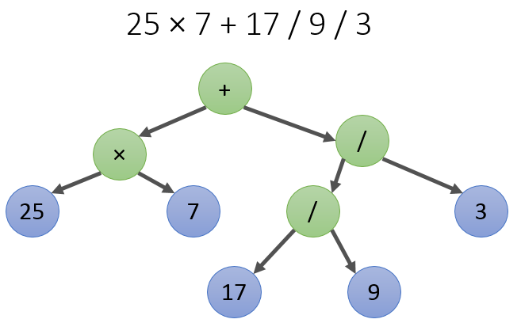

В этой статье вы узнаете, как разобрать арифметическое выражение в привычном формате из строки в структуру данных "дерево", а затем путём обхода дерева вычислить выражение. Другими словами, мы пишем калькулятор.

> У статьи есть [пример на github](https://github.com/ps-group/procedural_calculator), он написан в процедурном стиле на C++.

## BNF-нотация арифметических выражений

Нас интересуют арифметические выражения без скобок и с пятью операторами:

- `"+"` - сложение
- `"-"` - вычитание
- `"*"` - умножение
- `"/"` - деление (получение частного от деления)
- `"%"` - деление по модулю (получение остатка от деления)

Примеры таких выражений:

```
12 / 12 / 12 => 0.0833333
25 + 17 / 45 / 2 => 25.1889
```

Синтаксис выражений можно описать в BNF-нотации (также известной как нотация Бекуса-Наура). Такая нотация ещё называется грамматикой, и выглядит как набор правил:

```
expression ::= add_sub_expr

add_sub_expr ::= mul_div_expr '+' add_sub_expr
    | mul_div_expr '-' add_sub_expr
    | mul_div_expr

mul_div_expr ::= atom_expr '*' mul_div_expr
    | atom_expr '/' mul_div_expr
    | atom_expr '%' mul_div_expr
    | atom_expr

atom_expr ::= [0-9]+
```

Данная грамматика учитывает неравный приоритет операторов: в выражении `1 + 2 * 2` вы сначала должны свернуть `2 * 2` как mul_div_expr по правилу `atom_expr '*' mul_div_expr`, а потом уже свернуть `1 + mul_div_expr` в `add_sub_expr`. Раскроем эту мысль подробнее с помощью пошаговой трассировки сворачивания правил грамматики:

```bash
1) 17 + 25 / 7
2) atom_expr + 25 / 7 # правило atom_expr ::= [0-9]+
3) atom_expr + atom_expr / 7 # правило atom_expr ::= [0-9]+
4) atom_expr + atom_expr / atom_expr # правило atom_expr ::= [0-9]+
5) mul_div_expr + atom_expr / atom_expr # правило mul_div_expr ::= atom_expr
6) mul_div_expr + atom_expr / mul_div_expr # правило mul_div_expr ::= atom_expr
7) mul_div_expr + mul_div_expr # правило mul_div_expr ::= atom_expr '/' mul_div_expr
8) mul_div_expr + add_sub_expr # правило add_sub_expr ::= mul_div_expr
9) add_sub_expr # add_sub_expr ::= mul_div_expr '+' add_sub_expr
```

## Сверху вниз: строим и обходим дерево выражения

Дерево выражения &mdash; это вот такая прикольная штука:



Вычислить выражение по дереву легко и просто, достаточно обойти слева направо в глубину, применяя оператор в каждом нелистовом узле к дочерним узлам. Главный вопрос &mdash; как собрать дерево, имея строковое выражение?

Мы воспользуемся принципом нисходящего разбора, и применим нисходящий подход к проектированию программы. Сначала опишем функцию, которая получает выражение в виде строки и вычисляет его как число с плавающей точкой:

```cpp
double Calculate(const std::string &expression)
{
    Expression *pExpression = CreateExpression(expression);
    const double result = CalculateExpression(pExpression);
    DisposeExpression(pExpression);

    return result;
}
```

`Expression` &mdash; это узел дерева. Интересно, что узел дерева сам является деревом, ведь дерево &mdash; это рекурсивное понятие, не так ли? В листьях дерева находятся

```cpp
struct Expression;

// Expression tree node operation code.
enum class Operation
{
    NOP, // just a value
    ADD, // +
    SUB, // -
    MUL, // *
    DIV, // /
    MOD, // %
};

// Expression tree node is expression itself,
//  since expressions are recursively defined.
struct Expression
{
    double value = 0;
    Operation op = Operation::NOP;
    Expression *pLeft = nullptr;
    Expression *pRight = nullptr;
};
```

## Превращаем правила в функции

Мы хотим реализовать функцию `Expression *CreateExpression(const std::string &expression);`, которая выполняет разбор строки и в случае успеха возвращает указатель на выражение. Для этого на каждое из правил в BNF-нотации объявим по одной функции. Соглашения будут таковы:

- В случае успешного разбора функция возвращает `Expression *`, то есть стек вызовов функций уменьшается на одну запись
- В случае ошибки функция корректно удаляет выделенную память и выбрасывает исключение, то есть начинается экстренная раскрутка стека вызовов функций
- Функция может рекурсивно вызывать себя или другие функции
- Функция принимает изменяемую ссылку на строку, и в случае успешного разбора своего участка отсекает этот участок из строки, оставляя всё, что находится правее. Например, в выражении `18 - 7` после успешного разбора первого `atom_expr` подстрока "18" должна быть убрана из строки

```
Expression *ParseAtom(std::string &str);
Expression *ParseMulDiv(std::string &str);
Expression *ParseAddSub(std::string &str);
```

В реализациях этих фукнций мы применим три дополнительные функции, которые по тем же принципам отсекают от строки пробельные символы, число и следующий оператор соответственно:

```cpp
void SkipSpaces(std::string &expression)
{
    size_t numSize = 0;
    while (numSize < expression.size()
           && (expression[numSize] == ' '))
    {
        ++numSize;
    }
    expression = expression.substr(numSize);
}

// Skips spaces, then reads until first non-digit character.
// If successful, removes read characters from `expression`
//  and returns true.
bool ParseDouble(std::string &expression, double &result)
{
    std::string remainingStr = expression;
    SkipSpaces(remainingStr);

    size_t numSize = 0;
    if (remainingStr.size() > 0 && isdigit(remainingStr[0]))
    {
        while (numSize < remainingStr.size()
               && isdigit(remainingStr[numSize]))
        {
            ++numSize;
        }
        result = std::stod(remainingStr.substr(0, numSize));
        expression = remainingStr.substr(numSize);
        return true;
    }

    return false;
}

// Skips spaces, then reads next operator symbol.
// If successful, removes read characters from `expression`
//  and returns true.
bool ParseOperator(std::string &expression, Operation &op)
{
    std::string remainingStr = expression;
    SkipSpaces(remainingStr);
    if (remainingStr.empty())
    {
        op = Operation::NOP;
        return false;
    }

    switch (remainingStr[0])
    {
    case '+':
        op = Operation::ADD; break;
    case '-':
        op = Operation::SUB; break;
    case '*':
        op = Operation::MUL; break;
    case '/':
        op = Operation::DIV; break;
    case '%':
        op = Operation::MOD; break;
    default:
        op = Operation::NOP; break;
    }

    const bool succeed = (op != Operation::NOP);
    if (succeed)
    {
        expression = remainingStr.substr(1);
    }
    return succeed;
}
```

Теперь можно показать, как выглядят реализации функций разбора по правилам грамматики:

```cpp
// Parses expressions like: `a`, `a+b±...`, `a-b±...`,
//  where each sub-expression parsed by `ParseMulDiv`.
Expression *ParseAddSub(std::string &str)
{
    Expression *left = ParseMulDiv(str);
    while (true)
    {
        Operation op = Operation::NOP;

        // Don't remove operator from remaining string
        //  when this operator remains unhandled.
        std::string remainingStr = str;
        if (!ParseOperator(remainingStr, op)
                || (op != Operation::ADD && op != Operation::SUB))
        {
            return left;
        }
        str = remainingStr;

        Expression *right = nullptr;
        try
        {
            right = ParseMulDiv(str);
        }
        catch (...)
        {
            DisposeExpression(left);
            throw;
        }

        try
        {
            Expression *expr = new Expression;
            expr->pLeft = left;
            expr->pRight = right;
            expr->op = op;
            left = expr;
        }
        catch (...)
        {
            DisposeExpression(left);
            DisposeExpression(right);
            throw;
        }
    }

    return left;
}

// Parses expressions like: `a`, `a*b...`, `a/b...`, `a%b...`
//  where each sub-expression parsed by `ParseAtom`.
Expression *ParseMulDiv(std::string &str)
{
    Expression *left = ParseAtom(str);
    while (true)
    {
        Operation op = Operation::NOP;

        // Don't remove operator from remaining string
        //  when this operator remains unhandled.
        std::string remainingStr = str;
        if (!ParseOperator(remainingStr, op)
                || (op != Operation::MUL && op != Operation::DIV && op != Operation::MOD))
        {
            return left;
        }
        str = remainingStr;

        Expression *right = nullptr;
        try
        {
            right = ParseAtom(str);
        }
        catch (...)
        {
            DisposeExpression(left);
            throw;
        }

        try
        {
            Expression *expr = new Expression;
            expr->pLeft = left;
            expr->pRight = right;
            expr->op = op;
            left = expr;
        }
        catch (...)
        {
            DisposeExpression(left);
            DisposeExpression(right);
            throw;
        }
    }

    return left;
}

// Parses atom expression, like a number.
Expression *ParseAtom(std::string &str)
{
    Expression *expr = new Expression;
    if (!ParseDouble(str, expr->value))
    {
        DisposeExpression(expr);
        throw std::invalid_argument("Expected number at: " + str);
    }
    return expr;
}
```

## Что смотреть дальше и что улучшить

Другие примеры и теоретические выкладки по рекурсивному спуску есть в сети:

- [Recursive descent parser (en.wikipedia.org)](https://en.wikipedia.org/wiki/Recursive_descent_parser)
- [Compiler Design - Top-Down Parser](http://www.tutorialspoint.com/compiler_design/compiler_design_top_down_parser.htm)

В нашем парсере происходит множественное копирование строк в процессе разбора. Этого можно было бы избежать, если каждая рекурсивно вызываемая функция принимала бы [string_view &mdash; невладеющую ссылку на строку](http://htrd.su/wiki/zhurnal/2016/04/29/std_string_view_i_vremennye_obekty). Реализацию string_view можно раздобыть несколькими способами:

 1. Найти компилятор и IDE с поддержкой C++17, в котором `<string_view>` и объявленные в этом заголовке классы стали частью стандартной библиотеки
 2. Взять тривиальную реализацию на Github, состоящую из одного заголовка: [github.com/sergey-shambir/string_view](https://github.com/sergey-shambir/string_view/blob/master/string_view.h)
 3. Получить Boost версии 1.61 или выше, в котором есть `<boost/utility/string_view.hpp>`

По сути string_view &mdash; это удобная замена такой вот структуры для чтения строки слева направо:

```cpp
struct StringScanState
{
    std::string text;
    size_t position;
};
```

## Упражнения

Перед кодированием составьте исправленную BNF-грамматику, чтобы спроектировать, как добавить новую возможность.

- Добавьте в парсер поддержку скобок вокруг выражения. При отсутствии закрывающей скобки парсер должен выдавать какую-либо ошибку.
- Добавьте в парсер поддержку чтения чисел с плавающей запятой, таких как `124.17`. Для разбора вы можете использовать функцию `double strtod(const char *nptr, char **endptr);`, её полезная особенность &mdash; остановка разбора на первом недопустимом символе, с занесением адреса символа в `endptr` (подробнее см. документацию).
- Добавьте в парсер поддержку унарных операторов плюс и минус. Оператор может встретиться перед любым числом, но только в одиночку, т.е. выражения вида `a * -1` допустимы, а выражения вида `a + - - 2` &mdash; нет.
