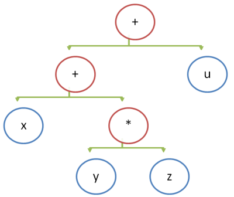

Машинный код (байткод) всегда предназначен для исполнения каким-либо процессором, физическим либо виртуальным. Процессоры (машины) могут быть стековыми либо регистровыми:

- Стековая машина для вычислений использует только стек, постоянно добавляя на него новые значения либо снимая старые, что приводит к непрерывному изменению вершины стека.
- Регистровая может использовать стек, но кроме него использует также независимые регистры, распределяя и переиспользуя регистры для последовательных вычисления.

> В стековом байткоде виртуальной машины инструкции короче, а сам подход позволяет написать компилятор значительно легче. Регистровый позволяет проводить операции с памятью намного эффективнее, особенно с учётом современных процессоров, которые практически всегда являются регистровыми с программным стеком в оперативной памяти (более медленной, чем регистры).

## Дерево выражений

В большинстве языков символ бинарного оператора ставится между его операндами, например: `x + y * z + u`. Порядок выполнения операций определяется неявным приоритетом операторов и явно расставленными скобками. Расставим все скобки явно: `((x + (y * z)) + u)` (мы пренебрегли правилом ассоциативности, по которому `(a + b) + c = a + (b + c)`).

После явной расстановки скобок можно нарисовать эквивалентное дерево, при обходе которого слева нараво вычисления будут выполнены корректно.



В BNF нотации простейшая грамматика выражений выглядит так:

```
expression ::= add_sub_expr

add_sub_expr ::= mul_div_expr '+' add_sub_expr
    | mul_div_expr '-' add_sub_expr
    | mul_div_expr

mul_div_expr ::= atom_expr '*' mul_div_expr
    | atom_expr '/' mul_div_expr
    | atom_expr '%' mul_div_expr
    | atom_expr

atom_expr ::= [0-9]+
```

## Трансляция дерева в инструкции стековой машины

Если у вас есть построенное дерево выражения, вы можете выполнить трансляцию с помощью обхода дерева слева направо в глубину:

- каждый узел со значением транслируется в команду push
- каждый узел с операцией транслируется в команду этой операции, которая возьмёт операнды со стека

```python
push x # Занести на стек x
push y # Занести на стек y
push z # Занести на стек z
multiply # Снять 2 последних значения со стека и перемножить, результат положить в вершину
add # Снять 2 последних значения со стека и сложить, результат положить в вершину
push u # Занести на стек u
add # Снять 2 последних значения со стека и сложить, результат положить в вершину
```

Если теперь выполнить инструкции, то на стеке останется одно число &mdash; результат арифметической операции

## Трансляция дерева в инструкции регистровой машины

Мы покажем способ на примере ассемблера виртуальной регистровой машины LLVM-IR, в котором можно использовать сколько угодно регистров &mdash; для этого нужно просто связывать каждое значение с новым имененем, а в остальном использовать те же самые принципы, что и для стековой (более того, в реализации кодогенератора вам наверняка пригодится структура данных "стек" либо рекурсия):

```python
# Исходник на компилируемом языке
function sqr(x Number) Number
    return x * x
end

# Результат в виртуальном ассемблере LLVM-IR
define double @sqr(double %x) {
entry:
  %x1 = alloca double # выделяем место для копирования параметра
  store double %x, double* %x1 # копируем параметр в переменную
  %x2 = load double, double* %x1 # вместо push x
  %x3 = load double, double* %x1 # вместо push x
  %multmp = fmul double %x2, %x3 # вместо mul
  ret double %multmp # возвращаем результат
}
```

> Если число регистров в процессоре ограничено, то придётся распределять свободные регистры по выражениям (хотя проще воспользоваться стековым методом). Хороший алгоритм распределения регистров выходит за рамки этой статьи, но в грубом виде он мог бы выглядеть так: у вас есть набор реальных регистров, имена которых служат ключом в ассоциативном массиве (например, в `std::unordered_map`), а значение &mdash; это указатель на объект Value, временно занимающий регистр (например, `shared_ptr<Value>`). Этот ассоциативный массив используется для учёта занятых регистров. Если регистры кончились, вы можете выдавить несколько значений на стек (добавив в промежуточный код соответствующие команды копирования), а освободившиеся регистры использовать.

## Упражнения

- Напишите программу, которая выполняет разбор арифметического выражения в структуру данных "дерево", а затем обходит дерево и генерирует линейный список простейших строковых команд работы со стеком: `push`, `add` (добавление), `sub` (вычитание), `mul` (умножение), `div` (деление), `mod` (деление по остатку). [Вы можете взять за основу готовый пример калькулятора на рекурсивном спуске](/compilers/simple_recursive_parser.html).
- Добавьте к предыдущей программе функцию, которая получает на вход линейный список строковых команд работы со стеком, и выполняет их интерпретацию, используя массив (или `std::vector`) в качестве стека вычислений. После выполнения вычислений программа должна выдать распечатку оставшихся на стеке значений. Должны обрабатываться ситуации stack overflow и stack underflow.
