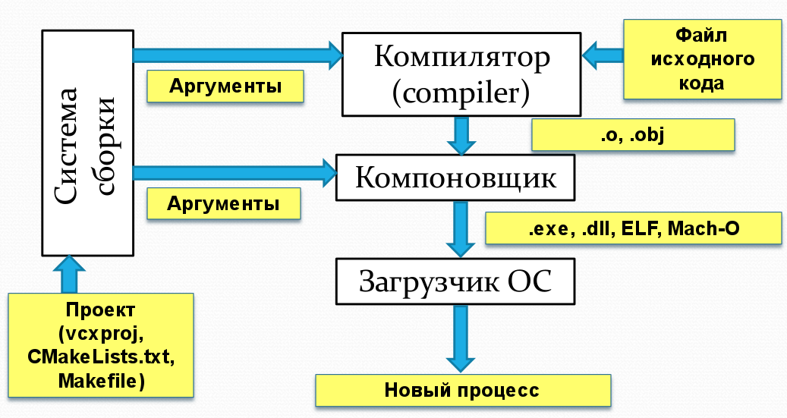

Драйвер компилятора объединяет фронтенд и бекенд как удобный фасад, в полном соответствии с паттерном Фасад (Facade). В том числе он:

- создаёт и параметризует фронтенд и бекенд
- вызывает методы фронтенда для начала разбора загруженного из файла текста
- получает Abstract Syntax Tree (AST) и передаёт его бекенду для кодогенерации

## Что делает компилятор?

Вместе с языком C в моду вошла раздельная компиляция &mdash; компилятор C обрабатывает один файл на языке C и получает объектный файл, где для каждой функции сгенерирован машинный код, но информация о функциях ещё не потеряна, поскольку не все функции известны (реализации некоторых функций находятся в других файлах проекта или в статических библиотеках). Соединением объектных файлов в программу занимается компоновщик, а не компилятор:

- 

На практике хороший компилятор может сам вызвать компоновщик как утилиту командной строки. Для поиска компоновщика в системе используются эвристические методы и переменные окружения, такие как %ProgramFiles% на Windows. Например, вы можете попытаться найти компоновщик в составе Visual Studio, перебирая заранее известные пути для различных версий Visual Studio.

> Для вызова внешних утилит в C++ можно использовать [system](http://en.cppreference.com/w/cpp/utility/program/system), но у неё много ограничений: например, нельзя прочитать сообщение об ошибке из другого процесса, нельзя его остановить, нельзя запускать его асинхронно. Часть недостатков устраняет POSIX-функция [popen](http://pubs.opengroup.org/onlinepubs/9699919799/functions/popen.html), на Windows доступная как [_popen](https://msdn.microsoft.com/en-us/library/96ayss4b.aspx).

## Аргументы командной строки

Драйвер обрабатывает аргументы командной строки: пути к файлам, опции компиляции, опции компоновщика. Для простейшего компилятора будет достаточно обрабатывать только пути к входным файлам и несколько простейших опций, например:

- Опция уровня оптимизации: `-odebug` (по-умолчанию) генерирует отладочную сборку без оптимизаций, а `-orelease` генерирует сборку с оптимизациями

## Ссылки

- [Автоматизируем вызов graphviz из командной строки](/compilers/driver_popen.html)
