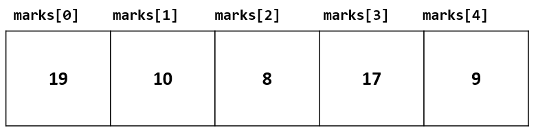
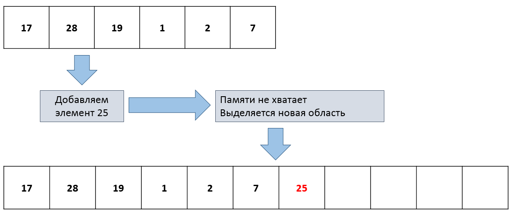

>Часть материала взята из статьи [C++ Arrays (programiz.com)](https://www.programiz.com/cpp-programming/arrays)

## Объявление массива в C/C++

В программировании часто встречается задача обработки множества экземпляров однотипных данных. Представьте себе ситуацию: мы провели опрос 100 человек и узнали их возраст. Чтобы сохранить собранные данные, вы можете создать целочисленный массив, содержащий 100 элементов:

```cpp
// массив из 100 целых чисел
int ages[100];

// массив из 100 целых неотрицательных чисел
unsigned ages[100];

// массив из 20 чисел с плавающей точкой
// (вы можете использовать константу, известную при компиляции)
constexpr unsigned ARRAY_SIZE = 20;
float rotations[ARRAY_SIZE];

// общий синтаксис
DataType variableName[ARRAY_SIZE];
```

В C++ массивы статичны: вы не сможете изменить размер или тип элементов после объявления.

### Доступ к элементам массива

Вы можете получать доступ к элементам массива, используя индексы и оператор `[]`. Допустим, вы объявили массив `marks`, как показано ниже. К первому элементу можно обратиться выражением `marks[0]`, ко второму - выражением `marks[1]`, и так далее. Доступ всегда начинается с единицы, а индекс последнего элемента на единицу меньше размера массива.

```cpp
void example()
{
    // Объявляем массив оценок
    int marks[5];
    // Заполняем массив по элементам.
    marks[0] = 19;
    marks[1] = 10;
    marks[2] = 8;
    marks[3] = 17;
    marks[4] = 9;
}
```



### Инициализация массива при объявлении

Можно инициализировать массив при объявлении. Для этого надо указать в списке столько значений, сколько вмещает массив, либо одно значение 0, чтобы заполнить массив нулями:

```cpp
// Объявляем массив размера 5 и инициализируем.
int marks[5] = { 19, 10, 8, 17, 9 };

// Объявляем массив без указания размера,
//  размер будет определён из списка инициализациии.
int marks[] = { 19, 10, 8, 17, 9 };

// Объявляем массив размера 10 и заполняем нулями.
int ages[10] = { 0 };
```

### Обход элементов массива в цикле

Узнать число элементов в массиве можно функцией [std::size](http://en.cppreference.com/w/cpp/iterator/size). Обойти можно, используя цикл по индексам либо range-based for:

```cpp
#include <iostream>

int main()
{
    int ages[] = { 17, 18, 29, 30, 16, 27, 22 };

    // цикл по индексам массива,
    //  специальный тип size_t - это беззнаковое целое,
    //  разрядность которого совпадает с разрядностью платформы
    //  (4 байта на 32-битных машинах и 8 байт на 64 битных)
    for (size_t i = 0; i < std::size(ages); ++i)
    {
        const int age = ages[i];
        std::cout << "age #" << i << " is " << age << std::endl;
    }

    // цикл по всем элементам массива,
    //  эта конструкция известна как range-based for.
    int agesSum = 0;
    for (int age : ages)
    {
        agesSum += age;
    }
    std::cout << "ages sum is " << agesSum << std::endl;

    // ещё одна фишка: цикл в стиле итераторов
    auto end = std::end(ages);
    int minAge = ages[0];
    for (auto it = std::begin(ages); it != end; ++it)
    {
        // если этот элемент меньше минимального, обновляем минимальный возраст.
        const int age = *it;
        if (age < minAge)
        {
            minAge = age;
        }
    }
    std::cout << "smallest age is " << minAge << std::endl;
}
```

### Неопределённое поведение: выход за границы (out of bounds)

Выход за пределы массива является неопределённым поведением (*англ.* undefined behavior). Нет гарантий, как поведёт себя программа в этом случае. Высока вероятность, что вы испортите память других переменных, но эффект может различаться в разных режимах компиляции:

```cpp
#include <iostream>

int main()
{
    // Индексы элементов: 0, 1, 2
    int ages[] = {1, 2, 3};

    // Неопределённое поведение! Запрос элемента с индексом 3 в массиве,
    //  где такого индекса нет.
    std::cout << ages[3] << std::cout;
}
```

### Передача массива как параметра функции

Массив в стиле языка C хранит только указатель на начало и не хранит свой размер, что и создаёт сложность в передаче в функцию. Размер массива известен во время компиляции, но не известен во время выполнения. Поэтому передать размер можно несколькими не очень очевидными путями:

```cpp
#include <iostream>

// Передаём указатель на начало массива и размер массива
// Тип size_t - это целочисленный тип, число байтов которого равно числу байт в указателях,
//  то есть 4 байта на 32-битных платформах и 8 байт на 64-битных.
void printArrayV1(int* values, size_t size)
{
    for (size_t i = 0; i < size; ++i)
    {
        std::cout << values[i] << std::endl;
    }
}

// Передаём ссылку на массив известного размера
constexpr size_t AGES_COUNT = 3;

void printArrayV2(int (&values)[AGES_COUNT])
{
    for (size_t i = 0; i < std::size(values); ++i)
    {
        std::cout << values[i] << std::endl;
    }
}

// Третий способ - использовать gsl::span,
//  но ввиду сложности этого пути мы не станем его описывать.

int main()
{
    // Индексы элементов: 0, 1, 2
    int ages[] = {1, 2, 3};

    printArrayV1(ages, std::size(ages));
    printArrayV2(ages);
}
```

## Динамически изменяемый массив

Обычные массивы имеют неизменный размер. Вы можете ввести вспомогательную переменную, которая бы хранила число реально используемых ячеек массива. Но и в этом случае вы не сможете использовать элементов больше, чем задано при компиляции в виде размера массива.

Так мог бы выглядеть имитация динамического массива:

```cpp
#include <cassert>
#include <cstdlib>
#include <iostream>

// Псевдо-динамический массив, вмещает не больше 100 элементов
struct DynamicArray
{
    static constexpr size_t MAX_SIZE = 100;

    size_t size = 0;
    int data[MAX_SIZE] = { 0 };
};

// Добавляет элемент в конец массива
void array_push(DynamicArray& array, int value)
{
    // Если условие не соблюдатся, assert вызовет аварийное
    //  завершение программы (но только в отладочной сборке).
    assert(array.size < DynamicArray::MAX_SIZE);

    // Поместим значение по индексу [size], после последнего элемента
    array.data[array.size] = value;
    // Увеличим размер на единицу
    ++array.size;
}

void array_print(const DynamicArray& array)
{
    std::cout << "{";
    for (size_t i = 0; i < array.size; ++i)
    {
        std::cout << array.data[i];
        // Если следующий элемент существует, выводим запятую
        if (i + 1 < array.size)
        {
            std::cout << ", ";
        }
    }
    std::cout << "}" << std::endl;
}

// Программа создаст массив, заполнит его и выведет содержимое: [10, 3, 7]
int main()
{
    DynamicArray ages;
    array_push(ages, 10);
    array_push(ages, 3);
    array_push(ages, 7);
    array_print(ages);
}
```

### Класс `std::vector<T>`

Стандартная библиотека C++ содержит шаблонный класс vector, который работает как динамический массив произвольного размера. Размер может расти до тех пор, пока у операционной системы есть область памяти подходящего размера (вплоть до нескольких гигабайт).

Класс является шаблонным, то есть при объявлении переменной потребуется *параметризовать* шаблон класса vector типом элемента:

```cpp
#include <vector>

int main()
{
    std::vector<int> ages = { 10, 3, 7 };
}
```

Использование вектора похоже на использование массива:

- работает запрос элемента `ages[index]`, причём индексация так же начинается с нуля
- при выходе за границы динамического массива так же возникает неопределённое поведение (*англ.* undefined behavior)
- работает перебор элементов с помощью индексов, range-based for или итераторов
- есть метод size для получения размера: `ages.size()`

```cpp
#include <vector>
#include <iostream>

// Печатает содержимое динамического массива чисел
// В отличии от статичного массива, объект класса vector легко передать как параметр.
void print(const std::vector<int>& values)
{
    std::cout << "{";
    for (size_t i = 0; i < values.size(); ++i)
    {
        std::cout << values[i];
        // Если следующий элемент существует, выводим запятую
        if (i + 1 < values.size())
        {
            std::cout << ", ";
        }
    }
    std::cout << "}" << std::endl;
}

int main()
{
    std::vector<int> ages = { 10, 3, 7 };
    print(ages);
}
```

### Добавление элементов в конец массива

Для добавления существует два метода: push_back и emplace_back

- push_back получает значение элемента и добавляет в конец
- emplace_back работает сложнее: он получает параметры, необходимые конструктору элемента, и конструирует его прямо в конце массива

Вы можете практически всегда использовать push_back. Метод pop_back можно использовать для удаления элемента:

```cpp
#include <vector>
#include <iostream>

int main()
{
    // эквивалентно инициализации ages = { 10, 3, 7 }.
    std::vector<int> ages;
    ages.push_back(10);
    ages.push_back(3);
    ages.push_back(7);

    // убираем последний элемент
    ages.pop_back();
}
```

В [документации std::vector](http://en.cppreference.com/w/cpp/container/vector) можно прочитать о других методах.

### Перемещение элементов в памяти при изменении массива

Динамический массив использует для хранения элементов динамическую память (так же известную как "куча", *англ.* heap). При добавлении большого числа элементов динамический массив несколько раз перераспределяет память, поскольку выделенной ранее линейной области памяти уже не хватает для хранения всех элементов. Обычно при нехватке памяти под очередной элемент vector запрашивает новую область памяти в 1,5-2 раза больше предыдущей, перемещает в неё уже существующие элементы и добавляет в конец новый, а затем освобождает старую область памяти.

Если не сообразили, как это происходит, взгляните на картинку:



Новая область находится уже другом месте, потому что менеджер динамической памяти не мог просто взять и расширить старую область (ведь сразу за ней находилась чужая память). Поэтому все итераторы, ссылки и указатели на элементы могут стать некорректными после любого изменения массива!

### Метод erase для удаления элементов из середины

Метод erase класса vector получает итератор и уничтожает элемент, на который итератор указывает:

```cpp
#include <vector>
#include <iostream>

// Печатает содержимое динамического массива чисел
void print(const std::vector<int>& values)
{
    std::cout << "{";
    for (size_t i = 0; i < values.size(); ++i)
    {
        std::cout << values[i];
        // Если следующий элемент существует, выводим запятую
        if (i + 1 < values.size())
        {
            std::cout << ", ";
        }
    }
    std::cout << "}" << std::endl;
}

int main()
{
    // эквивалентно инициализации ages = { 10, 3, 7 }.
    std::vector<int> ages = { 10, 3, 7 };

    // удаляем элемент с индексом 0, остаётся {3, 7}
    ages.erase(ages.begin());

    // удаляем элемент с индексом 1, остаётся {3}
    ages.erase(ages.begin() + 1);

    print(ages);
}
```

### Последствия перемещения элементов: ошибка в простом цикле с erase

Использование итератора, ссылки или указателя на элемент после перераспределения памяти в массиве является неопределённым поведением: скорее всего произойдёт падение программы либо будет пропущено несколько элементов коллекции. Это показано в примере ниже:

```cpp
#include <vector>
#include <iostream>

// ! КОД С НЕОПРЕДЕЛЁННЫМ ПОВЕДЕНИЕМ !
// После вызова erase итератор it невалиден и не должен использоваться.
void eraseNegativeAndPrint(std::vector<int> &ages)
{
    for (auto it = ages.begin(); it != ages.end(); ++it)
    {
        if (*it < 0)
        {
            ages.erase(it);
        }
        else
        {
            std::cout << *it << " ";
        }
    }
    std::cout << std::endl;
}

int main()
{
    // эквивалентно инициализации ages = { 10, 3, 7 }.
    std::vector<int> ages = { 10, -33, 23, -18, 7, 38, 99 };
    eraseNegativeAndPrint(ages);
}
```

Если вы запустите этот код, вы можете увидеть что угодно. Скорее всего программа выведет `10 38 99`, хотя должна вывести `10 23 7 38 99` по замыслу автора.

Для решения этой проблемы метод erase возвращает новый, валидный итератор на элемент, следующий после удалённого. Если элемент был последним, erase вернёт итератор end. Учитывая это, мы можем исправить код, чтобы новое значение it либо получалось из erase, либо получалось путём инкремента:

```cpp
#include <vector>
#include <iostream>

void eraseNegativeAndPrint(std::vector<int> &ages)
{
    for (auto it = ages.begin(); it != ages.end();)
    {
        if (*it < 0)
        {
            it = ages.erase(it);
        }
        else
        {
            std::cout << *it << " ";
            ++it;
        }
    }
    std::cout << std::endl;
}

int main()
{
    // эквивалентно инициализации ages = { 10, 3, 7 }.
    std::vector<int> ages = { 10, -33, 23, -18, 7, 38, 99 };
    eraseNegativeAndPrint(ages);
}
```

Программа корректно напечатает `10 23 7 38 99`.

### Идиома remove_if + erase

В C++ есть замечательная библиотека алгоритмов `<algorithm>`. В данном случае алгоритмом называют шаблон функции, способный заменить цикл в какой-то одной узкой задаче. Например, remove_if перемещает элементы, соответствующие условию, в конец массива (в "удалённую" зону), и возвращает итератор на начала "удалённой" зоны. Затем вызовом erase можно уничтожить элементы из этой зоны.

```cpp
#include <vector>
#include <iostream>
#include <algorithm>

bool isNegative(int value)
{
    return (value < 0);
}

void eraseNegativeAndPrint(std::vector<int> &ages)
{
    // Алгоритм remove_if принимает два итератора и функцию, которая решает,
    //  надо ли удалять элемент.
    auto newEnd = std::remove_if(ages.begin(), ages.end(), isNegative);

    // У метода erase есть версия, принимающая два итератора:
    //  она удаляет все элементы от первого до второго,
    //  включая первый и не включая второй.
    ages.erase(newEnd, ages.end());

    for (const int age : ages)
    {
        std::cout << age << " ";
    }
}

int main()
{
    // эквивалентно инициализации ages = { 10, 3, 7 }.
    std::vector<int> ages = { 10, -33, 23, -18, 7, 38, 99 };
    eraseNegativeAndPrint(ages);
}
```

Функция корректно напечатает `10 23 7 38 99`.

## Для дополнительного чтения

- [О выборе структур данных для начинающих](https://habrahabr.ru/post/339656/)
- [Алгоритмы STL](http://amse.ru/courses/cpp2/2011_03_14.html)
