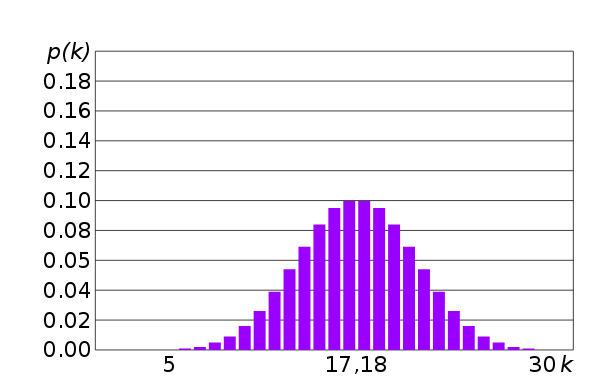

В 2011 году новый стандарт C++11 добавил в язык заголовок `<random>`, в котором описаны средства для работы со случайными числами на профессиональном уровне. Эти средства заменяют функцию [rand](http://en.cppreference.com/w/cpp/numeric/random/rand) и дают гораздо больше гибкости.

Но чтобы этим воспользоваться, надо немного разбираться в теории.

## Почему в IT все числа неслучайные

Казалось бы, что мешает использовать в программах случайные числа? К сожалению, процессор на это не способен: его поведение строго детерминировано и не допускает никаких случайностей.

- Для генерации по-настоящему случайных, ничем не связанных чисел операционной системе приходится использовать средства, недоступные обычным приложениям; такие случайные числа называются *криптографически стойкими случайными числами*
- Генерация системой таких случайных чисел работает медленно, и при нехватке скорости система просто отдаёт приложениями псевдослучайные числа либо заставляет их ожидать, пока появится возможность вернуть случайное число

>Вы можете узнать об этом подробнее, прочитав о разнице между устройствами `/dev/random` и `/dev/urandom` в ОС Linux

## Pseudo-random Numbers Generator (PRNG)

Генератор псевдослучайных чисел (PRNG) - это алгоритм генерации последовательности чисел, похожих на случайные числа. Псевдослучайные числа не являются по-настоящему случайные, т.е. между ними остаются связывающие их закономерности.

Общий принцип генерации легко показать в примере:

```cpp
#include <iostream>

int main()
{
    unsigned value = 18;
    // Порождаем и выводим 20 чисел, используя число 18 как зерно
    for (int i = 0; i < 20; ++i)
    {
        // Итеративно вычисляем новое значение value.
        value = (value * 73129 + 95121) % 100000;
        std::cout << value << std::endl;
    }
}
```

Несложная итеративная формула, содержащая умножение, сложение и деление по остатку на разные константы, создаёт целую серию чисел, похожих на случайные:

```
11443
10268
83693
13222
6759
74032
13953
64058
25307
70724
3221
43630
13391
65560
65065
66210
98915
82860
96765
55510
```

Очевидно, что между числами есть взаимосвязь: они вычислены по одной и той же формуле. Но для пользователя видимой взаимосвязи нет.

## Время как источник случайности

Если вы запустите предыдущую программу несколько раз, вы обнаружите проблему: числа будут те же самые. Причина проста - в начале последовательности мы используем всегда одно и то же число, 18. Для последовательности это число является *зерном* (англ. *seed*), и чтобы последовательность менялась с каждым запуском, зерно должно быть случайным.

Простейший, но не самый лучший способ получения зерна: взять текущее календарное время в секундах. Для этой цели мы воспользуемся функцией [std::time_t time(std::time_t* arg)](http://en.cppreference.com/w/cpp/chrono/c/time).

>Функция std::time возвращает число, представляющее время, прошедшее с полуночи 1 января 1970 года. Обычно это время в секундах, также известное как UNIX Timestamp. Параметр `arg` можно игнорировать и передавать нулевой указатель (вы можете в этом убедиться, прочитав документацию).

```cpp
#include <iostream>
#include <ctime>

int main()
{
    unsigned value = unsigned(std::time(nullptr));
    // Порождаем и выводим 20 чисел, используя время UNIX как зерно.
    for (int i = 0; i < 20; ++i)
    {
        value = (value * 73129 + 95121) % 100000;
        std::cout << value << std::endl;
    }
}
```

Теперь программа при каждом запуске будет выводить разные цепочки псевдослучайных чисел. При условии, что вы запускаете её не чаще одного раза в секунду.

>Такие случайные числа далеко не идеальны: например, их нельзя использовать в криптографии, потому что злоумышленник может примерно оценить, в каком промежутке времени были созданы случайные числа, и сильно сократить затраты на дешифровку сообщения. В разработке простых учебных приложений такие числа вполне подходят

## Ограничение числа по диапазону

Ограничить числа по диапазону можно путём деления по остатку (что сократит длину входного диапазона) и добавления нижней границы диапазона:

```cpp
#include <iostream>
#include <ctime>
#include <cassert>

// Структура генератора псевдослучайных чисел хранит одно число,
//  зерно следующего случайного числа.
struct PRNG
{
    unsigned seed = 0;
};

void initGenerator(PRNG& generator)
{
    // Получаем случайное зерно последовательности
    generator.seed = unsigned(std::time(nullptr));
}

// Генерирует число на отрезке [minValue, maxValue].
unsigned random(PRNG& generator, unsigned minValue, unsigned maxValue)
{
    // Проверяем корректность аргументов
    assert(minValue < maxValue);
    // Итеративно изменяем текущее число в генераторе
    generator.seed = (generator.seed * 73129 + 95121);
    
    // Приводим число к отрезку [minValue, maxValue]
    return (generator.seed % (maxValue + 1 - minValue)) + minValue;
}

int main()
{
    PRNG generator;
    initGenerator(generator);
    
    // Порождаем и выводим 10 чисел на отрезке [0, 7].
    std::cout << "ten numbers in range [0, 7]:" << std::endl;
    for (int i = 0; i < 10; ++i)
    {
        std::cout << random(generator, 0, 7) << std::endl;
    }
    
    // Порождаем и выводим 10 чисел на отрезке [10, 20].
    std::cout << "ten numbers in range [10, 20]:" << std::endl;
    for (int i = 0; i < 10; ++i)
    {
        std::cout << random(generator, 10, 20) << std::endl;
    }
}
```

## Всё то же, только лучше: заголовок `<random>`

Заголовок random разделяет генерацию псевдослучайных чисел на 3 части и предоставляет три инструмента:

- класс [std::random_device](http://en.cppreference.com/w/cpp/numeric/random/random_device), который запрашивает у операционной системы почти случайное целое число; этот класс более удачные зёрна, чем если брать текущее время
- класс [std::mt19937](http://www.cplusplus.com/reference/random/mt19937/) и другие классы псевдо-случайных генераторов, задача которых - размножить одно зерно в целую последовательность чисел
- класс [std::uniform_int_distribution](http://en.cppreference.com/w/cpp/numeric/random/uniform_int_distribution) и другие классы распределений

Класс mt19937 реализует алгоритм размножения псевдослучайных чисел, известный как [Вихрь Мерсенна](https://ru.wikipedia.org/wiki/%D0%92%D0%B8%D1%85%D1%80%D1%8C_%D0%9C%D0%B5%D1%80%D1%81%D0%B5%D0%BD%D0%BD%D0%B0). Этот алгоритм работает быстро и даёт хорошие результаты - гораздо более "случайные", чем наш самописный метод, показанный ранее.

О распределениях скажем подробнее:

- линейное распределение вероятностей (uniform distribution) возникает, когда вероятность появления каждого из допустимых чисел одинакова, т.е. каждое число может появиться с равным шансом
- в некоторых прикладных задачах нужны другие распределения, в которых одни числа появляются чаще других - например, часто используется *нормальное* распределение (normal distribution)

В большинстве случаев вам подойдёт линейное распределение. Изредка пригодится нормальное, в котором вероятность появления числе тем ниже, чем дальше оно от среднего значения:



Теперь мы можем переписать 

```cpp
#include <iostream>
#include <random>
#include <cassert>

struct PRNG
{
    std::mt19937 engine;
};

void initGenerator(PRNG& generator)
{
    // Создаём псевдо-устройство для получения случайного зерна.
    std::random_device device;
    // Получаем случайное зерно последовательности
    generator.engine.seed(device());
}

// Генерирует целое число в диапазоне [minValue, maxValue)
unsigned random(PRNG& generator, unsigned minValue, unsigned maxValue)
{
    // Проверяем корректность аргументов
    assert(minValue < maxValue);
    
    // Создаём распределение
    std::uniform_int_distribution<unsigned> distribution(minValue, maxValue);
    
    // Вычисляем псевдослучайное число: вызовем распределение как функцию,
    //  передав генератор произвольных целых чисел как аргумент.
    return distribution(generator.engine);
}

// Генерирует число с плавающей точкой в диапазоне [minValue, maxValue)
float random_float(PRNG& generator, float minValue, float maxValue)
{
    // Проверяем корректность аргументов
    assert(minValue < maxValue);
    
    // Создаём распределение
    std::uniform_real_distribution<float> distribution(minValue, maxValue);
    
    // Вычисляем псевдослучайное число: вызовем распределение как функцию,
    //  передав генератор произвольных целых чисел как аргумент.
    return distribution(generator.engine);
}

int main()
{
    PRNG generator;
    initGenerator(generator);
    
    // Порождаем и выводим 10 чисел на отрезке [0, 7]
    std::cout << "ten integer numbers in range [0, 7]:" << std::endl;
    for (int i = 0; i < 10; ++i)
    {
        std::cout << random(generator, 0, 7) << std::endl;
    }
    
    // Порождаем и выводим 10 чисел на отрезке [10, 20]
    std::cout << "ten float numbers in range [10, 20]:" << std::endl;
    for (int i = 0; i < 10; ++i)
    {
        std::cout << random_float(generator, 10.f, 20.f) << std::endl;
    }
}
```

## Приём №1: выбор случайного значения из предопределённого списка

Допусти, вы хотите случайно выбрать имя для кота. У вас есть список из 10 имён, которые подошли бы коту, но вы хотите реализовать случайный выбор. Достаточно случайно выбрать индекс в массиве имён! Такой же метод подошёл не только для генерации имени, но также для генерации цвета из заранее определённой палитры и для других задач.

Идея проиллюстрирована в коде

```cpp
#include <iostream>
#include <vector>
#include <string>
#include <random>

struct PRNG
{
    std::mt19937 engine;
};

void initGenerator(PRNG& generator)
{
    // Создаём псевдо-устройство для получения случайного зерна.
    std::random_device device;
    // Получаем случайное зерно последовательности
    generator.engine.seed(device());
}

// Генерирует индекс в диапазоне [0, size)
size_t random_index(PRNG& generator, size_t size)
{
    // Создаём распределение
    std::uniform_int_distribution<size_t> distribution(0, size - 1);
    
    // Вычисляем псевдослучайное число: вызовем распределение как функцию,
    //  передав генератор произвольных целых чисел как аргумент.
    return distribution(generator.engine);
}

int main()
{
    std::vector<std::string> names = {
        "Barsik",
        "Murzik",
        "Pushok",
        "Amor",
        "Balu",
        "Vert",
        "Damar",
        "Kamelot",
        "Mavrik",
        "Napoleon"
    };
    
    PRNG generator;
    initGenerator(generator);
    
    // Порождаем и выводим 3 случайных имёни из заданного списка
    
    std::cout << "3 random cat names:" << std::endl;
    for (int i = 0; i < 3; ++i)
    {
        const size_t nameIndex = random_index(generator, names.size());
        std::cout << names[nameIndex] << std::endl;
    }
}
```

## Приём №2: отбрасываем неподходящее значение

Если предыдущую программу запустить несколько раз, то рано или поздно у вас возникнет ситуация, когда одно и то же имя было выведено дважды. Что, если вам нужно уникальное значение, не выпадавшее прежде за время запуска программы?

Тогда используйте цикл, чтобы запрашивать случайные значения до тех пор, пока очередное значение не попадёт под ваши требования. Будьте аккуратны: если требования нереалистичные, вы получите бесконечный цикл!

Доработаем программу, добавив цикл while в функцию main. Для сохранения уже использованных имён воспользуемся структурой данных [std::set](http://en.cppreference.com/w/cpp/container/set) из заголовка `<set>, представляющей динамическое множество.

```cpp
#include <iostream>
#include <vector>
#include <string>
#include <set>
#include <random>

struct PRNG
{
    std::mt19937 engine;
};

void initGenerator(PRNG& generator)
{
    // Создаём псевдо-устройство для получения случайного зерна.
    std::random_device device;
    // Получаем случайное зерно последовательности
    generator.engine.seed(device());
}

// Генерирует индекс в диапазоне [0, size)
size_t random_index(PRNG& generator, size_t size)
{
    // Создаём распределение
    std::uniform_int_distribution<size_t> distribution(0, size - 1);
    
    // Вычисляем псевдослучайное число: вызовем распределение как функцию,
    //  передав генератор произвольных целых чисел как аргумент.
    return distribution(generator.engine);
}

int main()
{
    std::vector<std::string> names = {
        "Barsik",
        "Murzik",
        "Pushok",
        "Amor",
        "Balu",
        "Vert",
        "Damar",
        "Kamelot",
        "Mavrik",
        "Napoleon"
    };
    
    PRNG generator;
    initGenerator(generator);
    
    // Множество, хранящее индексы использованных имён.
    std::set<size_t> usedIndexes;

    // Порождаем и выводим 3 случайных имёни из заданного списка
    std::cout << "3 random cat names:" << std::endl;
    for (int i = 0; i < 3; ++i)
    {
        size_t nameIndex = 0;
        while (true)
        {
            // Запрашиваем случайный индекс
            nameIndex = random_index(generator, names.size());
            // Проверяем, что индекс ранее не встречался
            if (usedIndexes.find(nameIndex) == usedIndexes.end())
            {
                // Если не встречался, добавляем в множество и выходим
                //  из цикла: уникальный индекс найден
                usedIndexes.insert(nameIndex);
                break;
            }
            else
            {
                // Отладочная печать отброшенного индекса
                std::cout << "discard index " << nameIndex << std::endl;
            }
        }
        std::cout << "index: " << nameIndex << std::endl;
        std::cout << names[nameIndex] << std::endl;
    }
}
```
