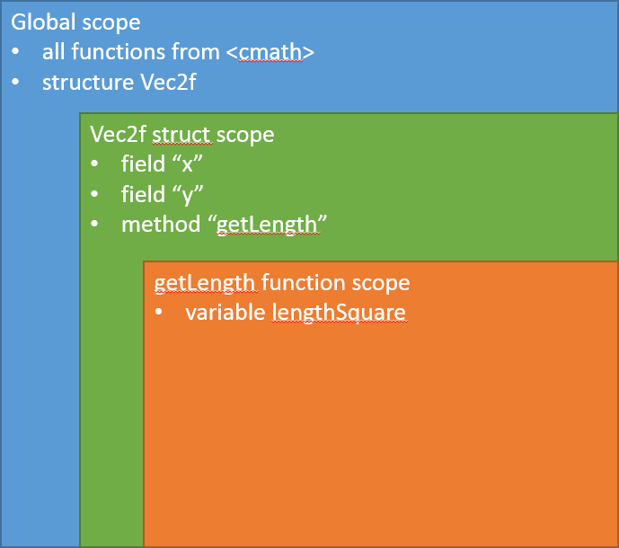
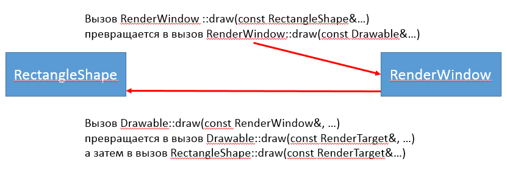

## Методы

Методы - это функции, объявление которых размещено внутри определения класса или структуры. В список переменных, доступных для метода, неявно попадают все поля структуры или класса, в котором он объявлен. Другими словами, в список областей видимости метода попадает область видимости структуры.

Взгляните на пример:

```cpp
#include <cmath>

struct Vec2f
{
    float x = 0;
    float y = 0;

    // Объявление метода с именем getLength
    //  1) метод - это функция, привязанная к объекту
    //  2) полное имя метода: "Vec2f::getLength"
    // Метод имеет квалификатор "const", потому что он не меняет
    //  значения полей и не вызывает другие не-const методы.
    float getLength() const
    {
        const float lengthSquare = x * x + y * y;
        return std::sqrt(lengthSquare);
    }
};
```

Методу `Vec2f::getLength` доступны все символы (т.е. переменные, функции, типы данных), которые были объявлены в одной из трёх областей видимости. При наличии символов с одинаковыми идентификаторами один символ перекрывает другой, т.к. поиск происходит от внутренней области видимости к внешней.

Понять идею проще на схеме. В ней область видимости названа по-английски: **scope**.



Поднимаясь по схеме от внутренней области видимости к внешней, легко понять, какие имена символов доступны в методе getLength:

 1. локальная переменная "lengthSquare"
 2. поля Vec2f под именами "x" и "y"
 3. всё, что есть в глобальной области видимости

К слову, в других методах структуры Vec2f переменная "lengthSquare" будет недоступна, а поля "x" и "y" будут доступны.

## Конструкторы

Конструктор - это специальный метод, который вызывается автоматически при выполнении инструкции объявления переменной. При этом память под переменную уже выделена заранее, т.к. память под все локальные переменные выделяется на стеке программы в момент вызова функции. Конструктор позволяет выполнить сложный код для инициализации переменной.

Посмотрите на простой пример. В нём есть проблема: и поля, и параметры конструктора названы одинаково. В результате в области видимости конструктора доступны только параметры, и своими именами они перекрывают поля!

```cpp
struct Vec2f
{
    float x = 0;
    float y = 0;

    // Имя метода-конструктора совпадает с именем типа, возвращаемый тип отсутствует
    Vec2f(float x, float y)
    {
        // поля x, y перекрыты, что делать?
    }
};
```

Язык C++ предлагает два решения. Первый способ - использовать косвенное обращение к полям через привязанный к методу объект. Указатель на него доступен по ключевому слову `this`:

```cpp
struct Vec2f
{
    float x = 0;
    float y = 0;

    Vec2f(float x, float y)
    {
        // Обращаемся к полю через указатель this
        this->x = x;
        this->y = y;
    }
};
```

Второй путь считается более правильным: мы используем специальную возможность конструкторов - "списки инициализации конструктора" (*англ.* constructor initializer lists). Списки инициализации - это список, разделённый запятыми и начинающийся с ":". Элемент списка инициализации выглядит как `field(expression)`, т.е. для каждого выбранного программистом поля можно указать выражение, инициализирующее его. Имя переменной является выражением. Поэтому мы инициализируем поле его параметром:

```cpp
struct Vec2f
{
    float x = 0;
    float y = 0;

    Vec2f(float x, float y)
        : x(x) // Перекрытия имён нет, т.к. согласно синтаксису C++
        , y(y) //  перед скобками может стоять только имя поля.
    {
    }
};
```

## Объявление и определение методов

C++ требует, чтобы каждый метод структуры или класса был упомянут в определении этой структуры или класса. Но допускается писать лишь объявление метода, о определение размещать где-нибудь в другом месте:

```cpp
// Определение структуры Vec2f содержит
// - объявление конструктора
// - объявление метода getLength
struct Vec2f
{
    float x = 0;
    float y = 0;

    Vec2f(float x, float y);
    float getLength() const;
};

// Определение конструктора (добавлен квалификатор "Vec2f::")
Vec2f::Vec2f(float x, float y)
    : x(x)
    , y(y)
{
}

// Определение метода getLength (добавлен квалификатор "Vec2f::")
float Vec2f::getLength() const
{
    const float lengthSquare = x * x + y * y;
    return std::sqrt(lengthSquare);
}
```

## Классы и структуры

В C++ есть ключевое слово `class` - это практически аналог ключевого слова `struct`. Оба ключевых слова объявляют тип данных, и разница между ними есть только на стыке наследования и инкапсуляции. Других различий `class` и `struct` не существует.

## Основы инкапсуляции

В C++ можно блокировать доступ к полям извне, но сохранять доступ для методов. Для этого введены три области доступа

 1. `public` - символ в этой области доступен извне
 2. `private` - символ из этой области доступен лишь собственных в методах
 3. `protected` - используется редко, о нём можете прочитать в документации

Давайте сделаем поля типа Vec2f недоступными извне. Также мы заменим ключевое слово struct на class - это не меняет смысла программы, но считается хорошим тоном использовать struct только если все поля доступны публично.

```cpp
class Vec2f
{
public: // начало списка публичных методов и полей
    Vec2f(float x, float y)
        : x(x)
        , y(y)
    {
    }

    float getLength() const
    {
        // Здесь поля x/y доступны, т.к. это внутренний метод
        const float lengthSquare = x * x + y * y;
        return std::sqrt(lengthSquare);
    }

private: // начало списка недоступных извне методов и полей
    float x = 0;
    float y = 0;
};

// ! ОШИБКА КОМПИЛЯЦИИ !
// Поля x/y недоступны для внешней функции
void printVector(const Vec2f& v)
{
    std::cout << "[" << v.x << "," << v.y << "]";
}
```

Запомните несколько хороших правил:

- Используйте struct, если все поля публичные и не зависят друг от друга; используйте class, если между полями должны соблюдаться закономерности (например, поле "площадь" круга должно быть)

## Основы наследования

В C++ новый тип может наследовать все поля и методы другого типа. Для этого достаточно указать структуру или класс в списке базовых типов. Такой приём используется в SFML при объявлении классов фигур:

```cpp
// ! КОД НАМЕРЕННО УПРОЩЁН!

// Класс RectangleShape наследует все поля и методы Shape,
//  но также имеет дополнительные поля и методы.
// Финальный список полей и методов составляет компилятор при сборке программы.
// Смысл наследования: "прямоугольник является фигурой".
class RectangleShape : public Shape
{
public:
    // Конструктор, принимающий один необязательный аргумент
    RectangleShape(const Vector2f& size = Vector2f(0, 0));

    // Метод с одним аргументом
    void setSize(const Vector2f& size);

    // ...
};

// Класс Shape наследует все поля и методы двух классов: Drawable и Transformable
// Смысл наследования: "фигура является сущностью, которую можно нарисовать
//  и у которой можно задать позицию/масштаб/вращение"
class Shape : public Drawable, public Transformable
{
public:
    // Виртуальный деструктор Shape.
    // Деструктор вызывается
    //  1) для локальной переменной - при выходе из области видимости локальной переменной
    //  2) для параметра, переданного по значению - при выходе из функции
    //  3) для временных объектов в выражении - при завершении инструкции, в которой находится выражение
    //  4) для объектов в динамической памяти - при освобождении памяти (например, через delete)
    // Деструкторы простых типов int, sf::Vector2f и т.д. не делают ничего.
    // Деструкторы сложных типов освобождают ресурсы (например, удаляют текстуру или вспомогательныю память)
    virtual ~Shape();

    // Метод setTexture, принимает 2 параметра, из которых 1 - необязательный.
    void setTexture(const Texture* texture, bool resetRect = false);

    // ...
};
```

Что означает public перед именем базового типа? Во-первых внешний код может передать RectangleShape в функцию, принимающую ссылку на Shape, то есть возможен так называемы upcast от более низкого (и более конкретного) типа RectangleShape к более высокому (и более абстрактному) типу Shape:

```cpp
// Хотя параметр имеет тип Shape, мы можем передать тип RectangleShape,
//  потому что RectangleShape является Shape.
// Аналогично мы можем передать CircleShape.
void drawShape(sf::RenderWindow& window, const Shape& shape)
{
    window.draw(shape);
}

// Параметр имеет тип RectangleShape, и передать Shape или CircleShape нельзя,
//  потому что ни Shape, ни CircleShape не являются RectangleShape.
void drawRect(sf::RenderWindow& window, const RectangleShape& shape)
{
    window.draw(shape);
}
```

Во-вторых из-за public наследования все унаследованные поля и методы сохраняют свой уровень доступ: приватные остаются приватными, публичные остаются публичными. А если бы мы наследовали Shape с ключевым словом private, то уровень доступа стал бы ниже: все методы и поля стали бы приватными:

```cpp
// ! КОД НАМЕРЕННО УПРОЩЁН!
// Все поля и методы Shape, даже публичные, стали приватными в RectangleShape
class RectangleShape : private Shape
{
public:
    RectangleShape(const Vector2f& size = Vector2f(0, 0));

    void setSize(const Vector2f& size);
};
```

>Контроль уровня доступа полей и методов - хитрый механизм, пройдёт немало времени, прежде чем вы научитесь пользоваться им правильно. В начале просто старайтесь сделать правильный выбор между private и public. Скорее всего поля будут private, а конструктор и все методы будут public. Это позволяет сохранять инвариант класса, то есть держать поля объекта в согласованном состоянии независимо от того, какие методы вызывают извне.

## Основы полиморфизма: виртуальные методы и их перегрузка

SFML использует ещё одну идиому C++: виртуальные методы. Ключевые слова `virtual`, `final`, `override` относятся именно к этой идиоме. Например, в SFML определяется класс Drawable, который обозначает "сущность, которую можно нарисовать". Все рисуемые классы SFML, включая `sf::Sprite`, `sf::RectangleShape`, `sf::Text`, прямо или косвенно наследуются от `sf::Drawable`. 

```cpp
// ! КОД НАМЕРЕННО УПРОЩЁН!
class Drawable
{
public:
    // Виртуальный деструктор.
    virtual ~Drawable() {}

    // Виртуальный метод draw
    virtual void draw(RenderTarget& target, RenderStates states) const;
};
```

Зачем это надо? Дело в том, что метод `draw` класса `RenderWindow` принимает параметр типа `Drawable`. Тем не менее, этот метод успешно рисует любые типы объектов: спрайты, фигуры, тексты. Он не выполняет проверок - он просто настраивает состояние рисования (RenderStates) и вызывает метод `draw` у сущности, которая является `Drawable`.

```cpp
void RenderWindow::draw(const Drawable& drawable)
{
    RenderStates states = ...; // как-то настраиваем состояние.
    drawable.draw(*this, states);
}
```

Виртуальный метод вызывается косвенно: если класс `Shape`, унаследованный от `Drawable`, переопределил метод, а потом был передан как параметр типа `Drawable`, то вызов метода draw всё равно приведёт к вызову переопределённого метода `Shape::draw`, а не метода `Drawable::draw`! С обычными (не виртуальными) методами такого не происходит: если бы мы убрали слово `virtual` из объявления `draw`, то вызов метода `draw` у параметра типа `Drawable` всегда приводил бы к вызову `Drawable::draw`, даже если реальный тип объекта, скрытого за этим параметром, совсем другой.

>Возможность по-разному реагировать на одинаковый вызов метода извне называется полиморфизмом. Точнее, это одна из разновидностей полиморфизма объектов.

Другими словами, RenderWindow и RectangleShape не знают, что они работают друг с другом, но тем не менее каждый вызывает правильный метод другого класса!



>Когда вы просто вызываете `window.draw(shape)`, повышение класса происходит дважды: сначала конкретный класс фигуры повышается до более ограниченного класса Drawable, затем конкретный класс RenderWindow повышается до абстрактного RenderTarget. Всё это не требует времени при выполнении: просто компилятор выполняет проверки типов данных ещё при компиляции, не более того.

## Как унаследовать Drawable: практический пример

Мы создадим класс, который рисует флаг России. Он будет унаследован от Drawable, чтобы использовать для рисования обычный метод draw у объекта окна.

```cpp
#pragma once
#include <SFML/Graphics.hpp>

// Класс RussianFlag рисует флаг России.
// Наследуем его от sf::Drawable, чтобы можно было рисовать флаг проще:
//  window.draw(flag);
class RussianFlag : public sf::Drawable
{
public:
    // Конструктор принимает два параметра: положение и размер флага.
    RussianFlag(const sf::Vector2f& position, const sf::Vector2f& size);

private:
    // Метод draw вызывается окном при рисовании флага,
    //  то есть window.draw(flag) косвенно привозит к вызову этого метода.
    void draw(sf::RenderTarget& target, sf::RenderStates states) const override;

    sf::RectangleShape m_whiteStrip;
    sf::RectangleShape m_blueStrip;
    sf::RectangleShape m_redStrip;
};
```

Теперь мы можем реализовать конструктор и метод draw. В конструкторе мы должны вычислить и установить позиции и размеры трёх полос на флаге, а в методе draw мы должны их последовательно нарисовать.

```cpp
#include "RussianFlag.h"

RussianFlag::RussianFlag(const sf::Vector2f& position, const sf::Vector2f& size)
{
    const sf::Vector2f stripSize = { size.x, size.y / 3.f };

    m_whiteStrip.setSize(stripSize);
    m_whiteStrip.setPosition(position);
    m_whiteStrip.setFillColor(sf::Color(0xFF, 0xFF, 0xFF));

    m_blueStrip.setSize(stripSize);
    m_blueStrip.setPosition(position + sf::Vector2f{ 0.f, stripSize.y });
    m_blueStrip.setFillColor(sf::Color(0, 0, 0xFF));

    m_redStrip.setSize(stripSize);
    m_redStrip.setPosition(position + sf::Vector2f{ 0.f, 2.f * stripSize.y });
    m_redStrip.setFillColor(sf::Color(0xFF, 0, 0));
}

void RussianFlag::draw(sf::RenderTarget& target, sf::RenderStates states) const
{
    target.draw(m_whiteStrip, states);
    target.draw(m_blueStrip, states);
    target.draw(m_redStrip, states);
}
```

Теперь использовать класс RussianFlag извне очень легко!

```cpp
#include "RussianFlag.h"
#include <SFML/Graphics.hpp>
#include <string>

// Функция создаёт окно определённого размера с определённым заголовком.
void initWindow(sf::RenderWindow& window)
{
    sf::VideoMode videoMode(800, 600);
    const std::string title = "Russian Flag + class derived from sf::Drawable";
    sf::ContextSettings settings;
    settings.antialiasingLevel = 8;
    window.create(videoMode, title, sf::Style::Default, settings);
}

int main()
{
    sf::RenderWindow window;
    initWindow(window);

    RussianFlag flag({100, 50}, {300, 150});

    while (window.isOpen())
    {
        sf::Event event;
        while (window.pollEvent(event))
        {
            if (event.type == sf::Event::Closed)
            {
                window.close();
            }
        }
        // Рисуем flag как обычную фигуру или спрайт: вызовом window.draw.
        window.clear();
        window.draw(flag);
        window.display();
    }
}
```
