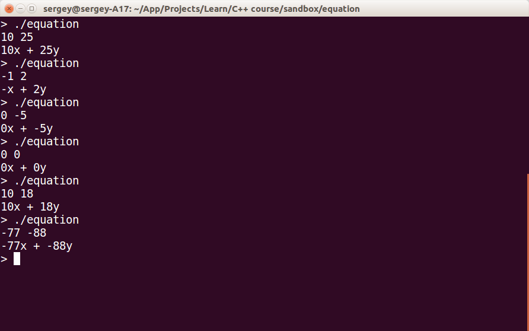
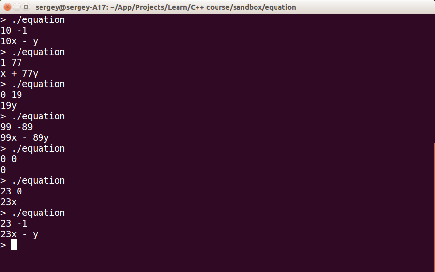

Изучать новый язык легче всего на примерах. В качестве примера мы разберём консольную программу, решающую следующую задачу:

> Написать программу, которая получает через стандартный консольный ввод два целых числа `a`, `b` в диапазоне `-100 < a, b < 100`, разделённых пробелами, и воспринимает их как коэффициенты в полиноме `ax + by`. Затем программа выводит в консоль полином `ax + by`, подставляя вместо a и b введённые числа. При этом множитель с нулевым коэффициентом не выводится: например, для ввода "10 0" программа должна вывести "10x". Коэффициент, равный единице, пропускается: `x + 23y`. Между членами полинома пишется только один знак: например, вместо `-13x + -2y` следует писать `-13x - 2y`. Если оба коэффициента равны нулю, программа выводит `0`. При любой ошибке в вводимых данных программа должна написать "error: invalid arguments".

Очевидно, что эта программа работает с консольным вводом/выводом и должна обрабатывать различные частне случаи коэффициентов, используя условное выполнение.

## Ввод-вывод

Для начала напишем программу, которая читает два числа из стандартного ввода и пишет их обратно в стандартный вывод. Запустите эту программу и проверьте, как она работает на различном вводе.

```cpp
#include <cstdio>

int main()
{
    int a = 0;
    int b = 0;
    scanf("%d %d", &a, &b);
    printf("%d %d\n", a, b);
}
```

Для вашего удобства прокомментируем код:

```cpp
// Подключаем заголовок cstdio из стандартной библиотеки
#include <cstdio>

// Определяем функцию main, возвращающую целочисленный код завершения.
int main()
{
    // Объявляем переменные a и b, инициализируем их нулями.
    int a = 0;
    int b = 0;

    // Считываем из консольного ввода данные в определённом формате: "%d %d"
    //  "%d" означает "считать целое число и положить результат по переданному адресу",
    //  " " означает "считать любое количество пробелов"
    //  адреса для записи считанных значений передаются в дополнительных аргументах, начиная со 2-го
    // Документация: https://www.opennet.ru/man.shtml?topic=scanf&category=3&russian=0
    scanf("%d %d", &a, &b);

    // Записываем данные в определённом формате: "%d %d\n"
    //  "\n" кодирует символ переноса строки
    // Документация: https://www.opennet.ru/man.shtml?topic=printf&category=3&russian=0
    printf("%d %d\n", a, b);
}
```

## Проверка вводимых данных

Если в первой версии программы пользователь введёт строку "10, 20", то никакого сообщения о некорректном вводе выведено не будет, и будет считано только первое число. Если ввести "x 10 20", то ни одно число не будет считано.

Для проверки ввода мы воспользуемся особенностью функции scanf: она возвращает количество успешно прочитанных значений. Также мы напишем функцию IsInRange100, проверяющую вхождение числа в диапазон (-100, 100). 

Мы воспользуемся инструкцией ветвления языка C++, которая имеет следующий синтаксис:

```cpp
// Вариант без ветки else
if (boolean_condition)
    then_statement;

// Вариант с веткой else
if (boolean_condition)
    then_statement;
else
    else_statement;

// Вариант с многострочными блоками then/else
// Рекомендуется использовать многострочный блок для обеих веток,
//  даже если в блоках будет по одной инструкции.
if (boolean_condition)
{
    then_statement;
}
else
{
    else_statement;
}
```

Код в "main.cpp" будет выглядеть следующим образом:

```cpp
#include <cstdio>

// Функция IsInRange100 принимает целочисленное значение и возвращает
//  - true, если значение лежит в интервале (-100; 100);
//  - false в противном случае
bool IsInRange100(int value)
{
    // другой вариант требует подключения заголовка <cmath>:
    //  return abs(value) < 100;

    return (value > -100) && (value < 100);
}

int main()
{
    int a = 0;
    int b = 0;

    // Ожидаем, что при правильном вводе будет считано 2 числа.
    const int expectedReadCount = 2;

    // Считаем и сохраняем число считанных значений.
    const int readCount = scanf("%d %d", &a, &b);

    // Проверяем корректность данных: успешно считано нужное количество чисел,
    //  и считанные числа лежат в интервале (-100; 100)
    if ((readCount == expectedReadCount) && IsInRange100(a) && IsInRange100(b))
    {
        printf("%d %d\n", a, b);
    }
    else
    {
        puts("error: invalid arguments");
    }
}
```

После запуска убеждаемся, что при неправильном вводе возникает сообщение об ошибке.


## Пробуем распечатать уравнение

Для удобства введём функцию PrintMonomial, которая печатает одночлен в составе многочлена и обрабатывает ситуацию, когда коэффициент при переменной равен 1 или -1. В примере ниже содержится ошибка, попробуйте найти её самостоятельно (подсказка: в C++ сравнение выполняется с помощью `==`, а присваивание с помощью `=`).

```cpp
// !!! Функция содержит ошибку !!!
// Печатает одночлен с заданным коэффициентом и переменной,
//  коэффициент, по модулю равный единице, не печатается.
void PrintMonomial(int coeff, char variable)
{
    if (coeff == 1)
    {
        printf("%c", variable);
    }
    else if (coeff = -1)
    {
        printf("-%c", variable);
    }
    else
    {
        printf("%d%c", coeff, variable);
    }
}

// Печатает строку, содержащую уравнение "ax + by" с заданными коэффициентами при x и y.
void PrintEquationLine(int coeffX, int coeffY)
{
    PrintMonomial(coeffX, 'x');
    printf(" + ");
    PrintMonomial(coeffY, 'y');
    printf("\n");
}

int main()
{
    int coeffX = 0;
    int coeffY = 0;

    const int expectedReadCount = 2;
    const int readCount = scanf("%d %d", &coeffX, &coeffY);

    if ((readCount == expectedReadCount) && IsInRange100(coeffX) && IsInRange100(coeffY))
    {
        PrintEquationLine(coeffX, coeffY);
    }
    else
    {
        puts("error: invalid arguments");
    }
}
```

Если вы смогли исправить PrintMonomial и запустить программу, то скорее всего заметили, что вывод программы теперь лучше соответствует требованиям, но обработка нуля и отрицательных коэффициентов при `y` всё ещё неправильная.



## Обрабатываем специальные случаи

Добавим обработку специальных случаев:

- выделим из функции PrintEquationLine функцию PrintNonzeroEquation, которая будет печатать уравнение в случае ненулевых коэффициентов, а для входных данных `10 -5` станет печатать `10x - 5y` вместо неправильного написания `10x + -5y`
- добавим обработку ситуаций, когда один из коэффициентов либо оба коэффициента равны нулю
- для выбора знака между `x` и `y` мы воспользуемся выражением с тернарным оператором: `condition ? then_value : else_value`; для примера посмотрите на два эквивалентных куска кода:

```cpp
// Вариант с тернарным оператором.
int absValue = (value >= 0) ? value : -value;

// Вариант с ветвлением.
int absValue = 0;
if (value >= 0)
{
    absValue = value;
}
else
{
    absValue = -value;
}
```

 Для обработки знака "минус" при `y` нам пригодится [функция abs](http://en.cppreference.com/w/c/numeric/math/abs) из заголовочного файла `<cstdlib>`, поэтому в начале "main.cpp" следует добавить директиву `#include <cstdlib>`. Функции PrintNonzeroEquation и PrintEquationLine будут выглядеть следующим образом:

```cpp
// Печатает уравнение "ax + by" с заданными коэффициентами при x и y,
//  переданные коэффициенты не должны быть нулевыми.
void PrintNonzeroEquation(int coeffX, int coeffY)
{
    assert((coeffX != 0) && (coeffY != 0));

    const char delimiter = (coeffY > 0) ? '+' : '-';
    PrintMonomial(coeffX, 'x');
    printf(" %c ", delimiter);
    PrintMonomial(abs(coeffY), 'y');
}

// Печатает строку, содержащую уравнение "ax + by" с заданными коэффициентами при x и y.
//  коэффициенты, равные нулю, пропускаются.
void PrintEquationLine(int coeffX, int coeffY)
{
    if ((coeffX != 0) && (coeffY != 0))
    {
        PrintNonzeroEquation(coeffX, coeffY);
    }
    else if ((coeffX == 0) && (coeffY == 0))
    {
        printf("0");
    }
    else if (coeffY == 0)
    {
        PrintMonomial(coeffX, 'x');
    }
    else
    {
        PrintMonomial(coeffY, 'y');
    }
    printf("\n");
}
```

После запуска легко убедиться в правильности вывода программы в различных ситуациях.


