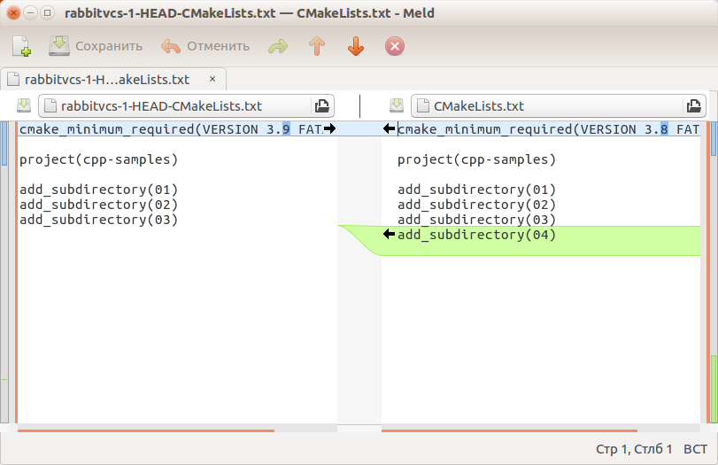
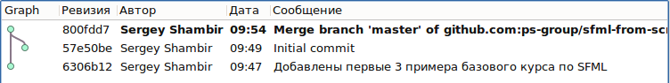

>Современные программисты постоянно совершенствуют свои программы. В процессе исходный код постоянно меняется, медленно, но неуклонно. Но что делать, если жёсткий диск откажет? Как пяти программистам работать с одним проектом? Как понять, что изменялось в проекте за последнюю неделю? Как выяснить, кем был написан этот файл? Во всём этом могут помочь системы контроля версий.

## Принципы работы систем контроля версий

Исходный код — это набор файлов на диске. Если программист что-то изменяет в исходном коде, он изменяет определённые файлы. Обычно изменение задевает лишь несколько строк.

Системы контроля версий (англ. Version Control System, VCS) — программы, которые автоматически отслеживают различия в файлах и строках между последней фиксированной версией и состоянием на диске.

- фиксированную версию называют ревизией (revision)
- фиксацию называют коммитом (commit)
- разницу между последней фиксацией и состоянием на диске называют working changes

Например, в этом файле подстроку "3.9" заменили на "3.8", и добавили строку "add_subdirectory(04)":

Также VCS хранят все версии, зафиксированные прораммистом линейно, в виде одной исторической последовательности версий. Они могут хранить версии нелинейно — это позволяет программистам работать над одним одновременно, периодически соединяя созданные ими линии истории программы. Нелинейная история выглядит как *граф* (в математическом смысле), и при соединении разных *ветвей* появляется специальный merge commit.

## Различия Git и SVN

Важных различия всего два:

- SVN — централизованная система, для работы с ним должен быть сервер, хранящий главный SVN-репозиторий
