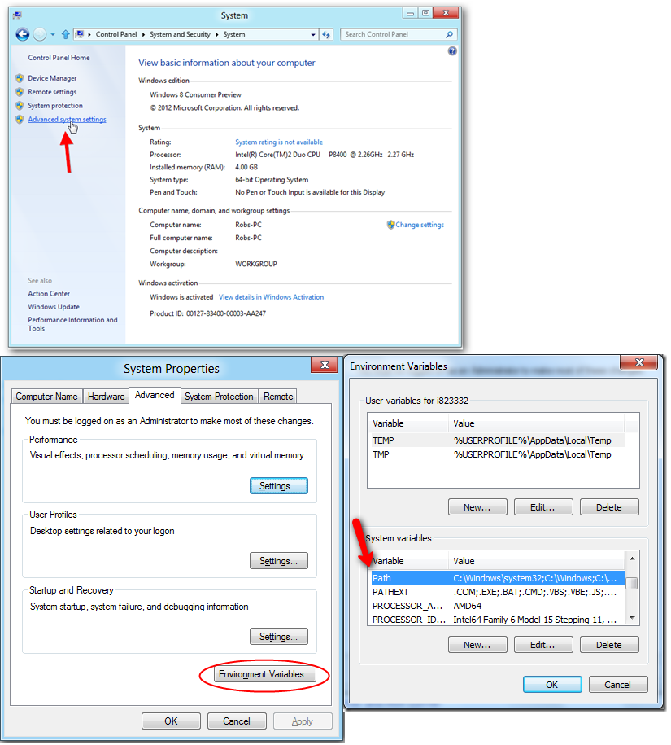
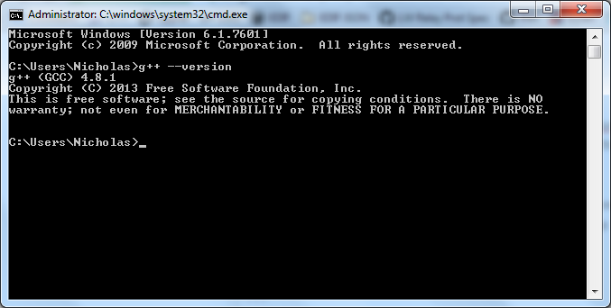
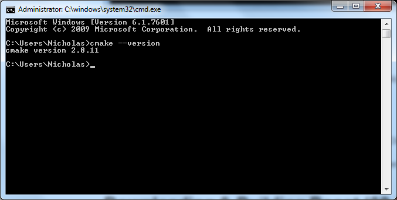

Изучать новый язык легче всего на примерах. Но прежде надо разобраться с техническими деталями: как собирать, как обслуживать написанный код. Поэтому мы возьмём очень простую программу — Hello World — и на её примере настроим окружение для разработки на C++.

Мы установим:

- [Компилятор MinGW и систему контроля версий Git](https://nuwen.net/mingw.html)
- [Систему сборки CMake](https://cmake.org/download/)
- [Редактор, такой как Visual Studio Code](https://code.visualstudio.com/)

Не стоит заводить бардак в файловой системе своего компьютера: лучше всего создать каталог "C:\DevEnvironment" устанавливать данные программы в него либо в Program Files.

## Основные понятия

- Файлы с исходным кодом на C++ имеют расширения `*.cpp`, реже `*.cc` или `*.cxx`. Расширение `*.c` имеют файлы на языке C.
- *Компилятор* преобразует исходный код в исполняемый код, в процессе компиляции он читает один из файлов исходного кода и записывает результат в объектный файл с машинным кодом;
- *Компоновщик* связывает машинный код из всех объектных файлов проекта и создаёт исполняемый файл программы;
- *Текстовый редактор* позволяет программисту удобно писать код;
- *IDE* (интегрированная среда разработки) — сочетание текстового редактора и оболочки для компилятора. Благодаря интеграции с компилятором IDE позволяют компилировать, запускать и отлаживать код, не закрывая текстовый редактор

IDE появились в 90-е годы и заметно расширили возможности программиста в сравнении с текстовыми редакторами. В современном мире разница стирается: развитые текстовые редакторы для программистов по функциональности уже догоняют IDE.

## Удобная работа с консолью

Лучше обеспечить себе удобную работу с командной строкой. Есть несколько вариантов:

- установить [Far Manager](http://www.farmanager.com/download.php?l=ru), для которого есть [обзорная статья на sheensay.ru](https://sheensay.ru/far)
- установить [Console2](https://sourceforge.net/projects/console/)

## Установка MinGW для 64-битных машин

Мы советуем установить дистрибутив, известный как "numen MinGW". Загрузить его можно со страницы [nuwen.net/mingw.html](http://nuwen.net/mingw.html).

После установки вам следует перейти в "C:\DevEnvironment\bin" (или "C:\MinGW\bin", если вы забыли сменить путь установки) и скопировать этот путь. Путь следует добавить в системную переменную PATH, чтобы программы из набора MinGW были доступны из консоли. Выполняйте этот шаг с осторожностью, ошибка может нарушить работу других программ!

Откройте меню Windows и наберите "System" (Система), затем нажмите кнопку "Advanced System Settings", в новом меню нажмите "Environment Variables...". Откроется диалог редактирования переменных окружения. Прокрутите список до переменной PATH:



Сделайте на ней двойной клик либо нажмите "Edit...", затем аккуратно переместите курсор в самый конец значения переменной, добавьте символ ";" и затем путь к каталогу bin установленного MinGW, например, "C:\DevEnvironment\bin".

Нажмите OK, а затем откройте консоль:

- можно просто запустить Far Manager
- можно набрать Win+R и в появившеимся диалоге запуска ввести "cmd", нажать Enter

В консольном окне наберите команду для вывода версии компилятора C++ — это позволит убедиться, что всё сделано правильно.

```
g++ --version
```



## Пишем main.cpp для Hello World

Первая программа будет состоять из одного файла "main.cpp", который содержит в себе функцию main. По стандарту, нормальное выполнение программы на C++ начинается именно с функции main, которая, в свою очередь, может вызывать другие функции. Создайте в каталоге учебных проектов подкаталог "hello-src", внутри него создайте файл main.cpp и наберите в нём следующий пример кода:

```cpp
#include <cstdio>

int main()
{
    puts("Hello, world");
}
```

Для вашего удобства мы прокомментировали код:

```cpp
// Подключает заголовочный файл "cstdio" из стандартной библиотеки
// Описание API, предоставляемого "cstdio", есть по ссылке http://en.cppreference.com/w/cpp/header/cstdio
#include <cstdio>

// Объявляем точку входа - функцию main, которая возвращает целое число - код завершения программы.
// Заметим, что в теле функции нет инструкции return для возврата из функции,
//  стандарт разрешает такое только для функции main, а все остальные функции, возвращающие значение,
//  должны использовать инструкцию return.
int main()
{
    // Вызываем стандартную функцию puts, выводяющую строку.
    // Документация по puts: http://en.cppreference.com/w/cpp/io/c/puts
    puts("Hello, world");
}
```

Теперь можно скомпилировать файл main.cpp: откройте в консоли (или в Far Manager) каталог с проектом, а затем вызовите компилятор g++. Если вызов "g++" завершится удачно, вы получите исполняемый файл helloworld.exe, иначе вы получите лог ошибок в консоли. Запустить helloworld.exe можно, набрав в консоли название файла и нажав Enter. Ниже приведёны озвученные команды:

```bash
cd "C:\...\helloworld\"
g++ -o helloworld main.cpp
helloworld.exe
```

При обычном вызове g++ происходит сборка отладочной версии: компилятор C++ практически не оптимизирует полученный машинный код и подготавливает его к отладке.

## Установка Visual Studio Code

Для C++ разработки полезно иметь удобный редактор. Впоследствии мы будем использовать IDE, такое как Visual Studio или CLion, но в ближайшей перспективе нам нужен полный контроль над сборкой, и поэтому стоит использовать текстовый редактор для кода. Примеры:

- Sublime Text
- Visual Studio Code
- Adobe Brackets, Github Atom

Мы рекомендуем установить Visual Studio Code. Это можно сделать двумя способами:

- скачать обычный установщик со страницы [code.visualstudio.com](https://code.visualstudio.com) и установить программу в Program Files
- установить Portable версию [с репозитория garethflowers/vscode-portable](https://github.com/garethflowers/vscode-portable/releases)

Обычный установщик лучше подходит для своего компьютера, а Portable версия, установленная на USB носитель, облегчит работу на компьютерах университета.

## Установка CMake

CMake (сокращение от Cross-platform Make) — это инструмент, позволяющий легко написать рецепт сборки проекта различными компиляторами и на различных компьютерах. Это далеко не единственная система сборки для C/C++. Популярные системы сборки можно сгруппировать следующим образом:

- Отдельные утилиты командной строки: GNU Make, NMake, Ninja и т.д.
- Интегрируемые в IDE: MSBuild (в Visual Studio), xcodebuild (в XCode) и т.д.
- Мета системы сборки: CMake, Autotools, GYP

Фраза "мета система сборки" означает, что CMake не умеет самостоятельно вызывать компилятор C++, но умеет создавать проект для Visual Studio или XCode, либо скрипт сборки для GNU Make, NMake, Ninja, который будет выполнять сборку проекта.

Собрать проект - значит вызывать компилятор (compiler) для превращения каждого файла с исходным кодом (".cpp") в файл с машинным кодом ("*.obj" или ".o"), а затем вызвать компоновщик (linker) для объединения объектных файлов в один

Для установки CMake загрузите свежую версию инсталлятора:

http://www.cmake.org/cmake/resources/software.html (См. секцию "Binary Distributions" для Windows)

Не забудьте включить опцию, добавляющую CMake в переменную окружения PATH. Если вы всё-таки забудете, вы сможете позже добавить путь к CMake в PATH вручную.


После этого в консольном окне наберите команду для вывода версии CMake — там вы проверите, что установка прошла корректно и пути к исполняемым файлам CMake добавлены в PATH:

```
cmake --version
```



## Пишем CMakeLists.txt для Hello World

Поднимитесь на уровень выше каталога hello-src, и создайте CMakeLists.txt с содержимым, показанным ниже:

```cmake
cmake_minimum_required(VERSION 3.5)
project(sandbox)

aux_source_directory(helloworld SRC_HELLOWORLD)
add_executable(helloworld ${SRC_HELLOWORLD})
```

Для вашего удобства мы прокомментировали код:

```cmake
# Для сборки требуется CMake версии 3.5 или выше
cmake_minimum_required(VERSION 3.5)

# Файл описывает проект с названием "sandbox"
project(sandbox)

# Все исходники из подкаталога helloworld добавляются в переменную SRC_HELLOWORLD
# Поиск исходников выполняется по расширениям: например, расширение ".c" соответствует исходному коду на C,
#  а расширения ".cpp", ".cc", ".cxx" - исходному коду на C++.
aux_source_directory(helloworld SRC_HELLOWORLD)

# При сборке будут собраны файлы, перечисленные в переменной SRC_HELLOWORLD, и создан исполняемый файл helloworld.
# Конструкция ${VAR} разворачивает переменную VAR (т.е. передаёт в аргументы команды значение этой переменной).
add_executable(helloworld ${SRC_HELLOWORLD})
```

Создайте каталог hello-debug рядом с hello-src. Структура каталогов должна быть такой:

```
cpp-projects
├── CMakeLists.txt
├── hello-debug
└── hello-src
  └── main.cpp
```

CMake служит мета-системой сборки. Другими словами, CMake интерпретирует простой рецепт сборки программы из исходного кода, описанный в виде файла, и создаёт новый рецепт для более традиционных систем сборки, таких как GNU Make, MSBuild или xcodebuild. Таким образом, сборка через CMake всегда двухшаговая:

 1. На первом шаге запускается `cmake {опции сборки} {путь-к-каталогу-исходного кода}`
 2. Затем запускается система сборки, например, `make -s`

В нашем случае мы воспользуемся GNU Make в роли второй системы сборки — GNU Make уже есть в составе MinGW.

cmake -G "MinGW Makefiles" -DCMAKE_BUILD_TYPE=RELEASE
