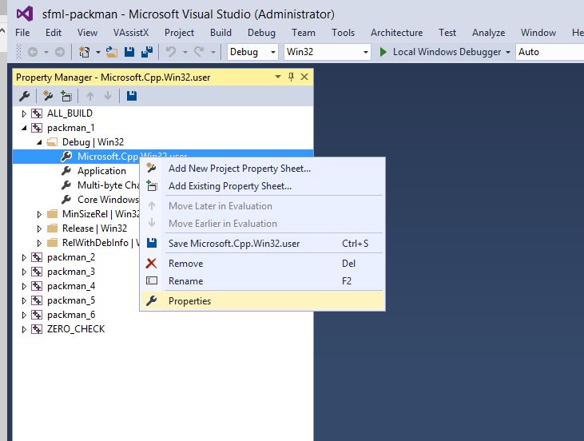
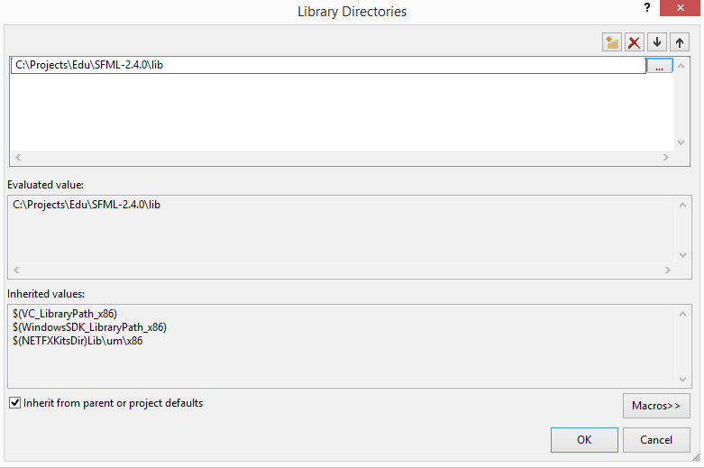
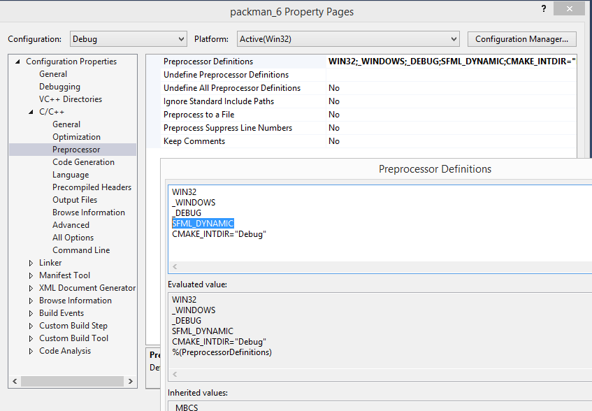

Дистрибутив библиотеки последней версии можно скачать на [www.sfml-dev.org](http://www.sfml-dev.org/download.php). Выбирайте 32-битный или 64-битный дистрибутив для нужной версии Visual Studio.


После скачивания нас ожидает ещё несколько шагов для подключения SFML к приложению:

- обеспечить поиск заголовочных файлов `*.h` препроцессором C++
- обеспечить поиск библиотек `*.lib` (`*.a`) компоновщиком C++
- перечислить библиотеки `*.lib` (`*.a`), используемые проектом
- добавить динамические библиотеки `*.dll (`*.so`) в пути поиска программы
- добавить макрос SFML_DYNAMIC в настройки препроцессора

## Выбор Visual Studio

Предпочтительно использовать последнюю выпущенную версию Visual Studio Community Edition, и выбирать английскую локализацию. Если вы установили другую локализацию (например, русскую), её лучше удалить и всё же поставить английскую. В противном случае появится целый ряд проблем с терминологией, поиском информации в сети и использованием статей и книг. Не секрет, что большая часть актуальной информации о программировании в сети — на английском языке, и лучше, если интерфейс среды разработки тоже будет английским.

## Механизм Property Sheet

Лучше всего сделать настройки сборки легко переносимыми между разными компьютерами. Это означает, что в проекте не должно быть абсолютных путей к файлам и каталогам. Кроме того, хотелось бы упростить создание нового проекта на SFML.

Соблюсти эти требования можно с помощью [Property Sheets](https://msdn.microsoft.com/en-us/library/669zx6zc.aspx) — внешних файлов, которые система сборки MSBuild и среда Visual Studio интерпретируют при загрузке проекта `*.vcxproj`.

Для начала работы с Property Sheets откройте вкладку "Property Manager" вместо "Solution Explorer" в панели Visual Studio. Нужный пункт меню доступен из раздела "View", но может находиться непосредственно в этом меню или скрываться в подменю "Other Windows".


Затем раскройте список Property Sheets. Вы можете изменить существующий Property Sheet с названием "Microsoft.Cpp.Win32.user" (или "Microsoft.Cpp.x64.user" для 64-битной конфигурации), поскольку этот Property Sheet лежит в личном каталоге пользователя и по умолчанию включается во все C++-проекты, созданные в Visual Studio.

Выбранный Property Sheet можно настроить вместо настройки проекта, и внесённые изменения будут действовать для всех проектов на данной машине, но не попадут под контроль версий Git.



На выходе вы получите файл `*.props`, который представляет собой переносимые между проектами настройки сборки. В этот файл надо добавить пути к заголовочным файлам и библиотекам, как описано ниже.

## Настройка путей поиска компонентов SFML

После распаковки загруженного архива с SFML в распакованном каталоге будут следующие важные для нас компоненты:

- каталог include должен быть добавлен в пути поиска заголовочных файлов (в Visual Studio это называют include directories, на UNIX их принято называть include paths)
- каталог lib должен быть добавлен в пути поиска линкуемых библиотек (в Visual Studio это называют library directories, на UNIX их принято называть linker search paths)

Внесённые изменения среда отображает жирным шрифтом:


При настройке путей поиска в диалоге их редактирования не забудьте оставить включённой галочку "Inherit from parent or project settings", чтобы случайно не сбросить стандартные пути поиска заголовков и библиотек, входящих в состав Windows API, C++ Standard Library и C Standard Library



## Настройка предопределённых макросов препроцессора

Поскольку SFML подключается нами как динамическая библиотека, нам надо не забыть объявить макрос SFML_DYNAMIC в списке предопределённых макросов (в Visual Studio они называются Preprocessor Definitions):



## Настройка шага компоновки (linking)

В настройки компоновщика (linker) в списке его входных файлов необходимо добавить

- для Release-конфигурации: sfml-graphics.lib, sfml-window.lib, sfml-system.lib
- для Debug-конфигурации: sfml-graphics-d.lib, sfml-window-d.lib, sfml-system-d.lib


## Копирование DLL в каталог с собранной программой

В дистрибутиве SFML каталог bin содержит разделяемые библиотеки (`*.dll`), которые следует добавить в каталог с исполняемым файлом после сборки программы.

- Вы можете скопировать DLL вручную
- Вы можете настроить шаг сборки, например, PreLink или PostBuild

Вы можете сделать это вручную, либо настроить шаг сборки PostBuild, как описано [в статье на jeremybytes.blogspot.com](https://jeremybytes.blogspot.com/2014/02/using-build-events-in-visual-studio-to.html)

## Пример на SFML (рисование круга на экране)

Пример ниже можно использовать для проверки работоспособности подключённого SFML. В случае ошибок внимательно читайте их содержание. Прежде всего определите, на каком шаге сборки происходит ошибка:

- на шаге компиляции (Compile Step), что проявляется в ошибках поиска заголовочных файлов
- на шаге компоновки (Link Step), что проявляется в таких ошибках, как "unresolved symbol", "library not found"
- при запуске приложения, где проблемы обычно вызваны отсутствием DLL, неправильной платформой (32-bit / 64-bit) или версией DLL и другими подобными проблемами

```cpp
#include <SFML/Graphics.hpp>

sf::RenderWindow window(sf::VideoMode(800, 600), "Window Title");
sf::CircleShape shape;
shape.setRadius(20);
shape.setFillColor(sf::Color::Green);
shape.setPosition(100, 0);

while (window.isOpen())
{
    sf::Event event;
    while (window.pollEvent(event))
    {
        if (event.type == sf::Event::Closed)
        {
            window.close();
        }
    }
    window.clear();
    window.draw(shape);
    window.display();
}
```
