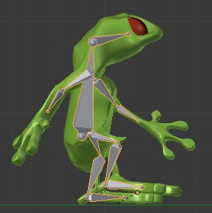

Библиотека Assimp поддерживает множество распространённых форматов моделей со следующими ограничениями:

- анимированные модели успешно загружаются из форматов MD5, DAE
- статичные модели успешно загружаются из форматов MD5, DAE, MD3, MD2, BLEND, 3DS, OBJ, PLY

Анимированная модель отличается от статичной:

- Всегда есть данные о костях (для скелетной анимации)
- Возможно, есть данные об анимациях. Анимации представляют движения в разных состояниях — прогулка, атака, гибель, охрана позиции. Одна анимация является набором трансформаций в разных точках времени для разных костей.

Так выглядят визуализированные кости в Blender (серые кости под поверхностью модели):

## Форматы MD5, MD3, MD2 (`*.md5mesh`, `*.md5anim`, `*.md2` и т.д.)

Формат моделей MD5 был разработан компанией idSoftware для Doom III, игры жанра шутер от первого лица. В этом формате данные о поверхностях модели и об анимациях хранятся в разных файлах:

- геометрические данные (включая скелет модели) хранятся в файлах `*.md5mesh`
- файлы анимации хранятся в файлах `*.md5anim`

Формат полностью поддерживает скелетную анимацию и скиннинг вершин. Формат является текстовым, информация о моделях хранится в кодировке ASCII в виде, похожем на YAML. Текстуры хранятся в отдельных файлах (обычно TGA, DDS).

Форматы моделей MD2 и MD3 считаются старыми, но их до сих пор можно встретить в сети. Они разрабатывались для ранних игр компании Id Software, таких как Quake и Doom / Doom II.

### Экспорт из Blender

Экспорт моделей из Blender в формат MD5 возможен с помощью скрипта `io_export_md5.py`. Скрипт [был опубликован на форуме katsbits.com](http://www.katsbits.com/smforum/index.php?topic=167.0).

- Обратите внимание, что работоспособность скрипта может быть нарушена в новых либо слишком старых версиях Blender, следует внимательно выбирать версию скрипта и версию Blender.
- [На github есть доработанный скрипт для Blender 2.77](https://github.com/pink-vertex/blender_addon_md5)

### Где скачать

Скачать примеры моделей в формате MD5 можно в следующих источниках:

- [katsbits.com](http://www.katsbits.com/download/models/#md5)

## Формат Collada (`*.dae`)

Основанный на XML формат Collada задуман как универсальный открытый стандарт для обмена данными между разными средами 3D-моделирования. Assimp умеет обрабатывать данный формат, в том числе он умеет загружать кости и анимации.

### Экспорт из Blender

## Формат Blender (`*.blend`)

Данный формат используется для сохранения и загрузки моделей в [Blender](https://www.blender.org/) (открытом редакторе 3D-моделей). К сожалению, формат представляет из себя бинарный снимок памяти внутренних структур данных Blender, и поэтому сторонним программам и библиотекам трудно его разбирать. В результате Assimp не поддерживает загрузку костей и анимаций из моделей Blender.

## Формат 3D Studio Max (`*.3ds`)

## Формат Wavefront OBJ (`*.obj`)

## Формат Stanford University PLY (`*.ply`)

Данный формат используется во многих университетах как стандарт представления различных учебных моделей. Assimp умеет загружать статичные модели в данном формате.

## Программы для упрощённого создания моделей

- [MakeHuman](http://www.makehuman.org/) — Open-Source кроссплатформенный WYSIWYG-редактор для создания модели человека, есть [ppa для Ubuntu](https://launchpad.net/~makehuman-official/+archive/ubuntu/makehuman-11x)

## Где скачать

- [Коллекция "Game Ready 3D Models" на opengameart.org](http://opengameart.org/content/game-ready-3d-models)
- [Набор моделей в формате 3DS на wiki.margtu.ru](http://wiki.margtu.ru/index.php?wakka=HomePage/20092010/Komp%27juternajaGrafika/3dmodels&show_files=1#files)
- [Архив Georgia Institute of Technology с набором стандартных моделей в формате PLY](http://www.cc.gatech.edu/projects/large_models/) — здесь можно найти такие широко известные модели, как Stanford Bunny. Все они создавались для обкатки различных шейдеров и проведения курсов компьютерной графики в университетах мира.
- [Модели в форматах MD2, FBX, 3DS, OBJ на telias.free.fr](http://telias.free.fr/Models_menu.html)
- [Архив разнообразных предметов интерьера, транспортных средств и тому подобного на artist-3d.com](http://artist-3d.com/)
- [Большой каталог разнообразных 3D моделей (tf3dm.com)](http://tf3dm.com/)
