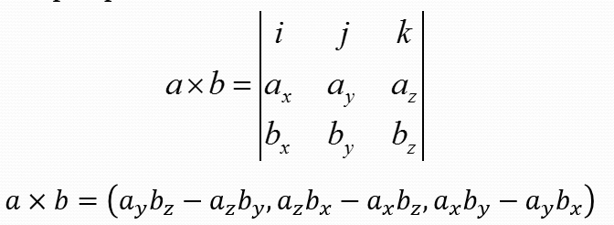
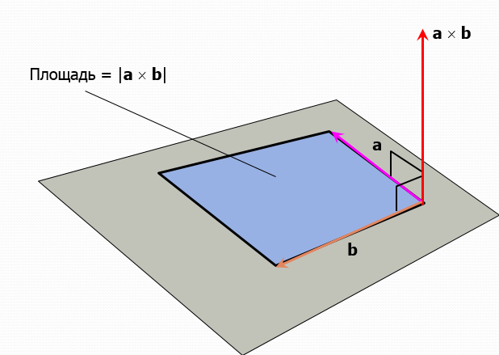
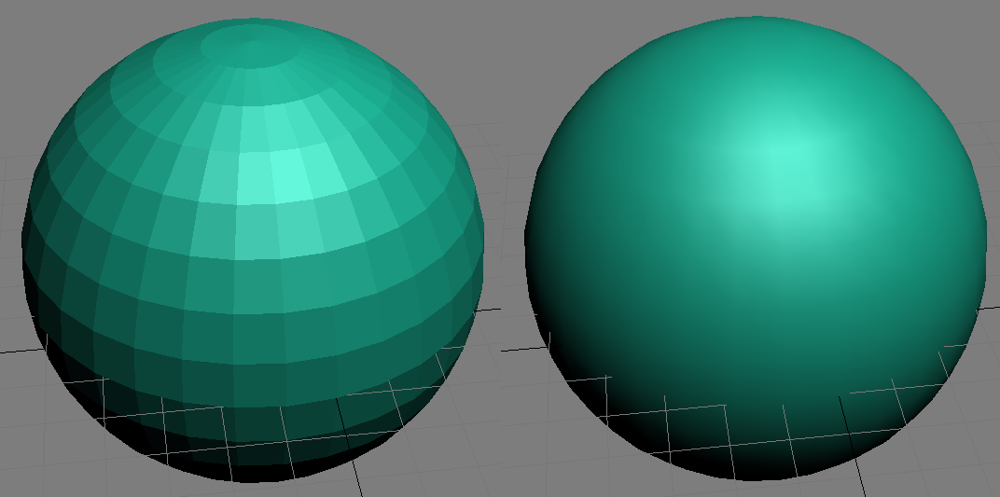
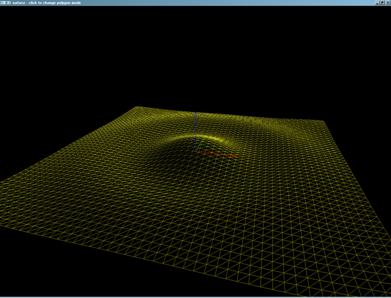

## Нормализация вектора

Нормализация вектора &mdash; это уменьшение длины вектора до единичной при сохранении направления.

- Для нормализации вектора достаточно вычислить его длину и разделить каждый компонент на эту длину
- В библиотеке GLM имеется функция [glm::normalize](https://glm.g-truc.net/0.9.4/api/a00131.html#ga68b931c228750eeba844c273c54ca43d)

```cpp
genType glm::normalize(genType const &x) 	
```

- Если нормализованный вектор умножить на число, вы получите вектор с тем же направлением, что и исходный, но с другой длиной

## Векторное произведение векторов

Формула для вычисления векторного произведения выводится как вычисление определителя специальной матрицы (из-за специальных символов i, j, k матрица не сворачивается в скаляр, а остаётся трёхмерным вектором):



Векторное произведение двух трёхмерных векторов даёт на выходе трёхмерный вектор. Этот вектор позволяет определить:

- площать паралеллограмма, сформированного двумя векторами &mdash; площадь равна длине полученного вектора
- перпендикуляр к плоскости, образованной двумя векторами &mdash; после нормализации вектор произведения станет нормалью к плоскости



- В английском языке векторное произведение называется "cross product".
- В библиотеке GLM имеется функция [glm::cross](https://glm.g-truc.net/0.9.4/api/a00131.html#gaa127ddc9d38f715125f91742d399eb6f)

```cpp
detail::tvec3<valType> glm::cross(
	detail::tvec3< valType > const & x,
	detail::tvec3< valType > const & y 
) 
```

## Рисование поверхностей с гранями и гладких поверхностей

В OpenGL вершинам одного треугольника можно задать разные значения нормалей, что создаст эффект гладкости фигуры из-за интерполяции нормалей между фрагментами и последующей интерполяции закраски от источников света. Если одна грань имеет одинаковое значение нормали во всех вершинах, эта грань будет после интерполяции освещения выглядеть плоской.



## Отладка вывода треугольников (режим Wireframe)

OpenGL позволяет изменить режим закраски треугольников с помощью функции [glPolygonMode](https://www.opengl.org/sdk/docs/man/html/glPolygonMode.xhtml). Функция позволяет выбирать между тремя путями визуализации:

- GL_FILL &mdash; режим по-умолчанию, в котором треугольники закрашиваются полностью
- GL_LINE, в котором рисуются только рёбра треугольных граней (т.е. стороны треугольников)
- GL_POINT, в котором рисуются только вершины треугольников как точки

Режим GL_LINE также известен как Wireframe, и может быть использован в целях отладки вывода треугольных примитивов (GL_TRIANGLES, GL_TRIANGLE_STRIP, GL_TRIANGLE_FAN)


