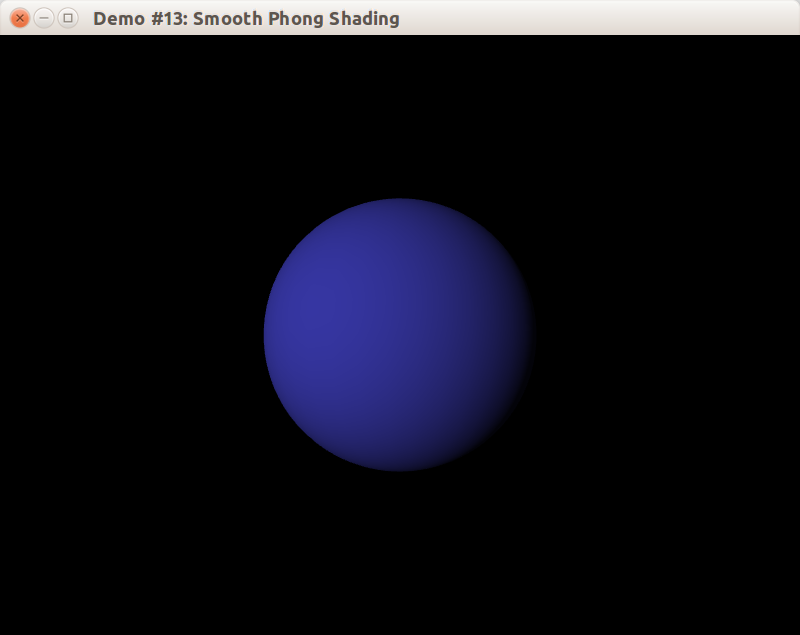
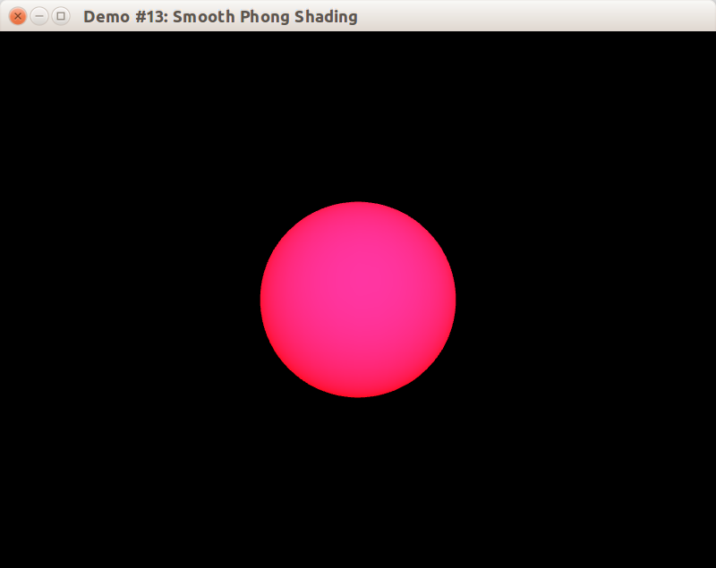

## Отладка освещения в шейдерах

Допустим, вы написали свой шейдер для расчёт освещения, но он не работает: освещение считается не так, как вы ожидали.

Напрямую отладить процесс выполнения вершинного или фрагментного шейдера едва ли получится, потому что шейдеры выполняются на видеокарте. Тем не менее, можно визуализировать возможные проблемы с помощью яркого цвета. Пусть у нас есть шейдер для попиксельного рассеяного освещения (по закону Ламберта):

```glsl
void main(void)
{
    vec4 result = vec4(0.0);
    for (int li = 0; li < gl_MaxLights; ++li)
    {
        vec3 delta = gl_LightSource[li].position.w * v;
        vec3 lightDirection = normalize(gl_LightSource[li].position.xyz - delta);

        vec4 Iamb = gl_FrontLightProduct[li].ambient;

        float diffuseAngle = max(dot(n, lightDirection), 0.0);
        vec4 Idiff = gl_FrontLightProduct[li].diffuse * diffuseAngle;
        Idiff = clamp(Idiff, 0.0, 1.0);

        result += Iamb + Idiff;
    }

    gl_FragColor = gl_FrontLightModelProduct.sceneColor + result;
}
```

В примере при рендеринге получалась следующее:



В нашем случае нарисована сфера. Однако, если бы экран был полностью чёрный, то было бы непонятно, попадают ли фрагменты поверхностей на экран, то можно добавить к gl_FragColor красный цвет:

```glsl
    const vec4 RED_RGBA = vec4(1.0, 0.0, 0.0, 1.0);
    gl_FragColor = gl_FrontLightModelProduct.sceneColor + result + RED_RGBA;
```


