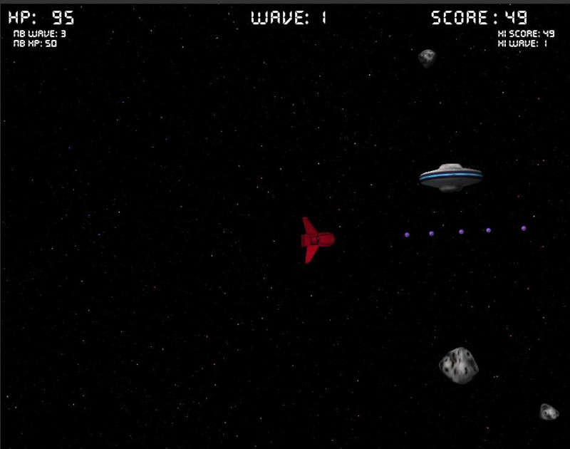

Component-Entity-System развивает идею Game Loop, поэтому надо разобраться, как могла бы выглядеть игра "Asteroids" с чистым паттерном Game Loop и простыми списками объектов. Вот скриншот одной из таких игр:



## Модель игры Asteroids

В игре есть четыре типа сущностей:

- корабль игрока (PlayerSpaceship)
- корабли врагов (список EnemyShip'ов)
- снаряды (список Bullet'ов)
- пассивные астероиды (список Asteroid'ов)

В типичных играх игровой цикл вызывается с постоянным интервалом, обычно 60 раз в секунду, чтобы обновить и нарисовать игру. На каждой итерации цикла выполняется, по сути, очередной шаг каждого из параллельно протекающих в игре процессов. Ниже на псевдокоде показана общая схема работы игрового цикла в игре Asteroids:

```js
struct Game
{
    // единственный персонаж игрока
    hero: PlayerSpaceship;
    // персонажи разнотипных врагов
    enemies: EnemyShip[];
    // быстро летящие снаряды
    bullets: Bullet[];
    // фоновые объеты
    asteroids: Asteroid[];
    background : Image;
}

// ядро основного цикла
function enterGameLoop()
{
    Game game;
    while (game not finished)
    {
        dispatchInput(game);
        update(game, getSecondsSinceLastFrame());
        render(game);
    }
}

// распределяет события ввода по всем объектам, подписанным на события
function dispatchInput()
{
    while (event = pollEvent)
    {
        if event is keyboard event
        {
            if event.key == PauseKey
            {
                // интерфейс игры нуждается в событиях
                game.pause();
            }
            else
            {
                // игрок также фильтрует события
                hero.processKey(event.key);
            }
        }
        // ... продолжаем рассылку событий других типов.
    }
}

function update(deltaSeconds: Number)
{
    // даём противникам право выбора своих действий
    for enemy in game.enemies
    {
        enemy.updateAI();
    }

    // перемещаем объекты согласно deltaSeconds и их собственной скорости
    move each in game.asteroids for deltaSeconds;
    move each in game.bullets for deltaSeconds;
    move each in game.enemies for deltaSeconds;
    move each in game.hero for deltaSeconds;

    // Проверяем столкновения, совершаем взрыв уничтоженных кораблей
    //  и помечаем их как мёртвые.
    // При проверке столкновений все объекты выглядят однообразно,
    //  но на факт столкновения они реагируют по-разному.
    game.checkCollisions()

    // Убираем мёртвые объекты
    remove enemy in game.ememies if enemy.dead;
    remove bullet in game.bullets if bullet.dead;

    // если игрок умер, игра приостанавливается
    if (hero.dead)
    {
        game.onGameOver()
    }
}

function render()
{
    draw game.background;
    draw each in game.asteroids;
    draw each in game.bullets;
    draw each in game.enemies;
    draw each in game.hero;
}
```

Если проанализировать этот псевдокод, можно сделать следующие выводы:

- обработка столкновений и перемещение объектов &mdash; это два почти независимых процесса, протекающих в игре параллельно друг с другом
- удаление мёртвых объектов &mdash; ещё один параллельно протекающий процесс
- функция update выглядит достаточно крупной, при этом на шаге update пока нет ни анимации персонажей и фоновых декораций, ни проигрывания звука, ни обновления подвешенных на таймеры событий, ни каких-либо иных присущих играм параллельно протекающих процессов
- небольшая часть игровой логики будет выполняться не в функции `update`, а в функции `dispatchEvent`, то есть ещё одним параллельным процессом будет прослушивание игровыми объектами событий

В игровом цикле параллельно протекающие в игре процессы представлены единым состоянием. На шаге update происходит одновременный переход всей игры из одного состояния в другое. Параллельно протекающие процессы размазаны по цельному состоянию игры и процедурам `update` и `dispatchEvents`.

## Иерархия сущностей и процессов в Component-Entity-System

Подход Component-Entity-System дополняет паттерн Game Loop:

- Параллельно протекающие процессы называются *системами* (*systems*), и являются самостоятельными объектами, реализующими метод `Update(deltaSeconds: Number)`;
- Игровые объекты, такие как юниты, декорации или пули, являются *сущностями* (*entities*);
- Каждая сущность состоит из одного или нескольких *компонентов* (*components*), отражающих её характер, например: компонент ИИ, компонент физического движения, графический компонент
- Сущности ничем не отличаются друг от друга, и вообще являются всего лишь вспомогательным контейнером для компонентов, все сущности хранятся в одной мета-сущности Вселенная (*World*)

В такой схеме даже обработку событий ввода и рисование можно представить как обновление систем, составляющих игровую логику. Игровые объекты, напротив, игрой не управляют, их компоненты служат всего лишь данными для различных систем. Если один тип компонентов умеют обрабатывать две-три системы, значит, они умеют общаться друг с другом посредством этого компоненнта. Например:

- система перемещения юнитов может изменить компонент трансформации у перемещённых сущностей
- система рендеринга воспользуется компонентом трансформации, чтобы определить матрицу Model (или World), производяющую преобразование из локальных координат объекта в мировые


## Создание ключевых сущностей средствами библиотеки anax

[Библиотека anax(github.com)](https://github.com/miguelmartin75/anax) позволяет строить архитектуру по принципу Component-Entity-System. Для этих целей она предоставляет ряд C++ классов, среди которых несколько шаблонных. Для сборки библиотеки можно использовать CMake, или создать проект для Visual Studio самостоятельно (библиотека небольшая, и процесс её сборки простой).

Контейнером для всех сущностей является World из заголовка `<anax/World.hpp>`, который создаётся так:

```cpp
std::unique_ptr<anax::World> pWorld = std::make_unique<anax::World>();
```

### Создание сущности и её компонентов

Сердцем библиотеки является создание сущностей и компонентов. Пример кода ниже создаст сущность, активирует её и в конце удалит:

```cpp
// Класс Entity имеет крошечный размер и свободно копируется
anax::Entity entity = world->createEntity();
// классы CPositionComponent, CDirectionComponent определены программистом
entity.addComponent<CPositionComponent>();
entity.addComponent<CDirectionComponent>();
entity.activate();
pWorld->refresh();

entity.kill();
```

Anax требует от программиста активации всех созданных сущностей. Более того, после создания набора сущностей следует вызвать обновление всего мира. Такой подход позволяет легко создать множество неактивных сущностей в разных системах, и только в конце шага update активировать их. Это избавляет от неприятных эффектов, когда только что созданная сущность уже начинает взаимодействовать, либо нарушает работу физического движка, не расчитанного на появление или удаление объектов во время шага симуляции.

### Определение компонентов позиции и направления

Компоненты определяются программистом, но по правилам библиотеки должны наследоваться от пустого класса anax::Component.

```cpp
class CPositionComponent : public anax::Component
{
public:
    CPositionComponent(float x = 0.0f, float y = 0.0f) : x(x), y(y) {}
    float x, y;
};

class CDirectionComponent : public anax::Component
{
public:
    CDirectionComponent(float x = 0.0f, float y = 0.0f) : x(x), y(y) {}
    float x, y;
};
```

Anax возьмёт на себя заботу о выделении памяти для компонента в шаблонном методе `World::addComponent<T>`, и все компоненты будут храниться в контейнере `std::vector` по указателю.

### Определение системы перемещения

Системы реализуют ключевую игровую логику, связывающую разные сущности игры и продвигающую игровое состояние.

```cpp
struct CMovementSystem : anax::System<anax::Requires<CPositionComponent, CDirectionComponent>>
{
    void update(double dt) const
    {
        auto entities = getEntities();
        for (auto entity : entities) {
            CPositionComponent& position = entity.getComponent<CPositionComponent>();
            CDirectionComponent& direction = entity.getComponent<CDirectionComponent>();
            position.x += direction.x * dt;
            position.y += direction.y * dt;
        }
    }
};
```

Система имеет метод getEntities(), который возвращает подмножество сущностей, соответствующее фильтру, указанному при специализации шаблонного класса `anax::System`. В примере выше фильтрацию пройдут только сущности, которые содержат в себе `CPositionComponent` и `CDirectionComponent` одновременно:

```cpp
struct CMovementSystem : anax::System<anax::Requires<CPositionComponent, CDirectionComponent>>
```

Каждую систему надо зарегистировать для мира, также надо обеспечить её существование длительное время между итерациями основного цикла:

```cpp
CMovementSystem movementSystem;
pWorld->addSystem(movementSystem);
```

Метод update у каждой созданной и игре системы следует вызывать вручную из своего игрового цикла. Возможное решение показано ниже:

```cpp
void CWindowClient::OnUpdate(float deltaSeconds)
{
    // Камера и контроллер виртуального времени - не системы,
    //  а просто объекты верхнего уровня.
    m_camera.Update(deltaSeconds);
    m_timeController.Update(deltaSeconds);

    // Обновление трёх из пяти систем приложения.
    m_keplerSystem.Update();
    m_rotationSystem.Update();
    m_particleUpdateSystem.Update(deltaSeconds);
}

void CWindowClient::OnDraw()
{
    const glm::ivec2 windowSize = GetWindow().GetWindowSize();

    const mat4 view = m_camera.GetViewMat4();
    const mat4 projection = MakeProjectionMatrix(windowSize);

    glViewport(0, 0, windowSize.x, windowSize.y);

    // Обновление оставшихся двух из пяти систем рендеринга
    m_renderSystem.Render(view, projection);
    m_particleRenderSystem.Render(view, projection);
}
```

## Набор советов по планированию архитектуры игры

- системы могут работать на каждом шаге игры &mdash; при распределении событий, при обновлении состояния или при рендеринге
- обычно для рендеринга достаточно завести одну систему, но при желании можно сделать рендеринг в несколько проходов в разных системах
- если многие объекты содержат собственную логику ежесекундного обновления, то вы можете ввести CustomActionSystem (или ScriptSystem) &mdash; систему, выполняющую вызов `std::function<void(float)>`, который хранится в компонентах CustomActionComponent
- вы можете вводить достаточно много систем, даже порядка 10 или немного больше
- вы можете создавать очень много компонентов, но не стоит создавать компонент на каждую каплю в эффекта дождя или для других крайне легковесных и многочисленных объектов; лучше используйте [системы частиц](/opengl/lesson_19.html)

## Сравнение с Model-View-Controller

В приложениях с графическим интерфейсом пользователя (GUI) часто используют паттерн MVC, разделяющий программу на Контроллеры (Controllers), Представления (Views) и Модели (Models). Контроллер отделяет Представление от Модели, позволяя создавать универсальные виджеты и окна для отображения разных данных, либо отображать одни и те же данные в разных виджетах и окнах.

В игровых приложениях такие возможности невостребованы. С другой стороны, роль Контроллера в управлении потоком данных берёт на себя игровой цикл и набор Систем, а количество разнородных Компонентов гораздо больше двух и не описывается простым делением на Модель и Представление. Кроме того, многие компоненты являются необязательными.

Именно поэтому в игровых приложениях не принято использовать Model-View-Controller, но зато активно используются паттерн Game Loop и архитектурное решение Component-Entity-System.

## Ссылки

- [Что такое Entity System Framework и зачем он нужен в геймдеве? (habrahabr.ru)](https://habrahabr.ru/post/197920/)
