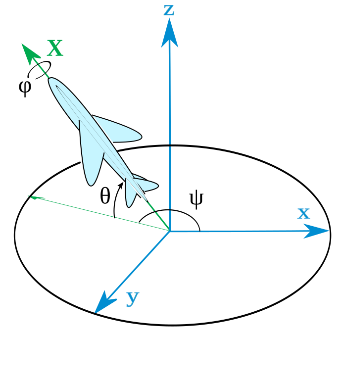
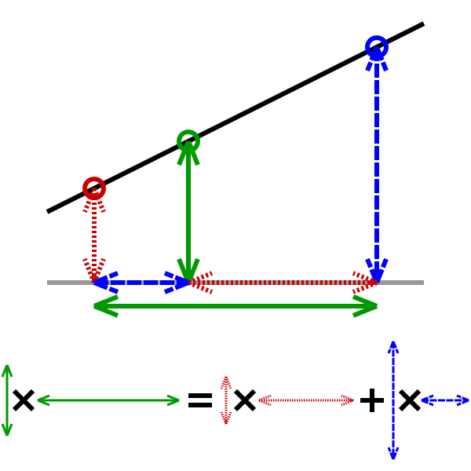

## Класс CTransform3D

Для удобства разделения трансформации на части было бы удобно представлять трансформацию трёхмерного объекта не в виде матрицы, а в виде структуры из нескольких составляющих, позволяющих получить матрицу. Такое представление позволяет легко модифицировать отдельные компоненты преобразования, не задевая остальные компоненты.

```cpp
#pragma once
#include <glm/vec3.hpp>
#include <glm/vec4.hpp>
#include <glm/matrix.hpp>
#include <glm/gtc/quaternion.hpp>

// Преобразует координаты из локальных в мировые в следующем порядке:
//  - сначала вершины масштабируются
//    например, единичный цилиндр превращается в диск или в трубку
//  - затем поворачиваются
//    т.е. тела ориентируются в пространстве
//  - затем переносятся
//    т.е. задаётся положение тела
// изменив порядок, мы изменили бы значение трансформаций.
class CTransform3D
{
public:
    // Конструирует трансформацию с
    //  - единичным масштабированием;
    //  - нулевым вращением вокруг оси Oy;
    //  - нулевой позицией.
    CTransform3D();

    // Преобразует исходную трансформацию в матрицу 4x4.
    glm::mat4 ToMat4()const;

    glm::vec3 m_sizeScale;
    glm::quat m_orientation;
    glm::vec3 m_position;
};
```

Реализация методов данного класса относительно проста. Однако, следует учесть, что компоненты трансформации применяются в строго определённом порядке, при изменении которого компоненты потеряют свой текущий смысл и обретут какой-либо иной &mdash; например, компонент поворота, применённый после компонента перемещения, перестанет быть ориентацией тела и станет поворотом вокруг центра.

```cpp
#include "libchapter4_private.h"
#include "Transform.h"

using namespace glm;

CTransform3D::CTransform3D()
    : m_sizeScale(glm::vec3(1))
    , m_orientation(glm::angleAxis(0.f, glm::vec3(0, 1, 0)))
{
}

mat4 CTransform3D::ToMat4() const
{
    const mat4 scaleMatrix = scale(mat4(), m_sizeScale);
    const mat4 rotationMatrix = mat4_cast(m_orientation);
    const mat4 translateMatrix = translate(mat4(), m_position);

    return translateMatrix * rotationMatrix * scaleMatrix;
}
```

## Понимание матрицы поворотов

Формулы вычисления произвольной матрицы поворота из угла достаточно сложны. Гораздо проще понимать матрицу поворота как объединение трёх векторов направлений: up (вверх), right (вправо) и forward (вперёд):

```cpp
[ right.x   up.x   -forward.x   0 ]
[ right.y   up.y   -forward.y   0 ]
[ right.z   up.z   -forward.z   0 ]
[       0      0            0   1 ]
```

Вектора up, right, forward должны быть взаимно перпендикулярны. Если исходные вектора не перпендикулярны, это можно исправить путём повторного вычисления с помощью нормализованых векторных произведений:

```cpp
// исходные вектора up и forward, потенциально не перпендикулярные друг другу
//  правильным считается вектор forward, и up не совпадает с forward
vec4 up = ...;
vec4 forward = ...;

// вычисляем right как перпендикуляр к плоскости, заданной up и forward
vec4 right = glm::normalize(glm::cross(up, forward));

// вычисляем повторно вектор up как перпендикуляр к плоскости, заданной forward и right
up = glm::normalize(glm::cross(forward, right));
```

Подобное преобразование производит [glm::lookAt](http://stackoverflow.com/questions/21830340/understanding-glmlookat), однако, lookAt для установки преобразования в систему координат камеры устанавливает не только вращение, но и перенос.

## Повороты (без кватернионов)

Заголовок `<glm/gtx/rotate_vector.hpp>` [предоставляет следующее API](http://glm.g-truc.net/0.9.8/api/a00224.html):

- поворачивает 2D вектор на заданный угол:

```cpp
vec2 glm::rotate(vec2 const &v, float angle);
```

- поворачивает 3D вектор на заданный угол вокруг заданной оси (представленной орт-вектором):

```cpp
vec3 glm::rotate(vec3 const& v, float angle, vec3 const& normal);
```

- поворачивают 3D вектор на заданный угол вокруг осей Ox, Oy, Oz соответственно:

```cpp
vec3 glm::rotateX(vec3 const &v, float angle);
vec3 glm::rotateY(vec3 const &v, float angle);
vec3 glm::rotateZ(vec3 const &v, float angle);
```

## Понимание кватернионов 3D-графике

Произвольную ориентацию трёхмерной поверхности можно задать с помощью одного поворота поверхности вокруг некоторой оси вращения (*англ.* rotation axis) на некоторый угол вращения (*англ.* rotation angle):


Кватернионом называется четвёрка чисел, вычисляемых из угла поворота и оси вращения по следующим формулам:

```cpp
// Угол вращения RotationAngle задан в радианах
x = RotationAxis.x * sin(RotationAngle / 2)
y = RotationAxis.y * sin(RotationAngle / 2)
z = RotationAxis.z * sin(RotationAngle / 2)
w = cos(RotationAngle / 2)
```

Есть другие определения кватернионов, но они сложны и не столь важны в прикладных целях. Показать геометрический смысл кватернионов также трудно. Программисту достаточно знать, что кватернионы дают удобные и общепринятые в графике способы работы с поворотами и ориентацией тел.

Приведём таблицу с примерами значений кватернионов:

|   w  |   x   |  y  |  z  |  Вращение         |
|:----:|:-----:|:---:|:---:|:----------------- |
|   1  |   0   |  0  |  0  | нет вращения      |
|   0  |   1   |  0  |  0  | 180° вокруг оси X |
| √0.5 |  √0.5 |  0  |  0  | 90° вокруг оси X  |
| √0.5 | -√0.5 |  0  |  0  | -90° вокруг оси X |

## Переход к кватернионам и обратно

Заголовок <glm/gtc/quaternion.hpp> [предоставляет следующее API](http://glm.g-truc.net/0.9.8/api/a00172.html):

- функция создаёт кватернион на основе оси вращения и угла поворота:

```cpp
quat glm::angleAxis(float angle, vec3 const& axis);
```

- с помощью оператора умножения можно применить к вектору вращение, хранимое в кватернионе:

```cpp
vec3 unrotated = ...;
quat orientation = ...;
vec3 rotated = unrotated * orientation;
```

- функция превращает кватернион в эквивалентную матрицу поворота:

```cpp
mat4 glm::mat4_cast(quat const& orientation);
```

## Углы Эйлера и кватернионы

В трёхмерном пространстве любую трансформацию поворота можно представить в виде [трёх углов Эйлера](https://ru.wikipedia.org/wiki/%D0%A3%D0%B3%D0%BB%D1%8B_%D0%AD%D0%B9%D0%BB%D0%B5%D1%80%D0%B0). Это возможно благодаря теореме Эйлера, согласно которой любой поворот вокруг произвольной оси можно представить как комбинацию трёх углов, последовательно поворачивающих тело вокруг базовых осей Ox, Oy, Oz.

Тройка углов Эйлера и кватернион являются двумя эквивалентными представлениями некоторой трансформации поворота. Этот факт отражён в GLM:

- конструктор quat, принимающий vec3, формирует кватернион
- функция `glm::eulerAngles` проводит обратную операцию &mdash; получение углов Эйлера из заданного кватерниона

```cpp
quat(vec3 const& eulerAngles);
vec3 glm::eulerAngles(quat const& quaternion);
```

## Авиационно-космическое представление ориентаци

Ориентация в авиационных терминах задаётся тремя углами:

- угол тангажа (*англ.* pitch, *греч. буква* θ)


- угол крена (*англ.* roll, *греч. буква* ϕ)


- угол рысканья (*англ.* yaw, *греч. буква* ψ)


Авиационные углы имеют огромное преимущество &mdash; исходные оси Ox, Oy, Oz фиксированы в мировых координатах (или в координатах диспетчерской станции аэропорта), и ориентация камеры задаётся лишь последовательным применением авиационных углов для получения вектора курса полёта (*англ.* heading):

- сначала считаем курс равным орту оси Ox (т.е. вектору `{1, 0, 0}`)
- поворачиваем курс на угол рысканья (yaw, ψ) вокруг оси Oy
- вычисляем нормаль к плоскости, образованной вектором курса и вектором Oy (назовём эту нормаль "right")
- поворачиваем курс на угол тангажа (pitch, θ) вокруг "right"
- вычисляем нормаль к плоскости, образованной вектором курса и вектором "right" (назовём эту нормаль "up")
- поворачиваем вектор "up" вокруг вектора курса на угол крена (roll, ϕ)
- теперь у нас есть вектор курса (heading, или front) и вектор направления вверх (up), и мы можем использовать уже привычную операцию lookAt для получения матрицы поворота

Данный метод проиллюстрирован на изображении:



Также в GLM есть функции для преобразования между yaw, pitch, roll и другими представлениями:

- функция [из заголовочного файла](http://glm.g-truc.net/0.9.8/api/a00190.html) `<glm/gtx/euler_angles.hpp>` преобразует углы yaw, pitch, roll в матрицу поворота:

```cpp
mat4 glm::yawPitchRoll(float yaw, float pitch, float roll);
```

- функция из заголовочного файла `<glm/gtc/quaternion.hpp>` преобразует матрицу поворота в кватернион; соединив её с предыдущей функцией, получим функцию для преобразования yaw, pitch, roll в кватернион:

```cpp
quat glm::quat_cast(mat4 const& rotationMatrix);

// Пример:
const float yaw = ...;
const float pitch = ...;
const float roll = ...;
const quat orientation = glm::quat_cast(glm::yawPitchRoll(yaw, pitch, roll));
```

## Пересечение луча и объектов

В библиотеке GLM есть заголовок `<glm/gtx/intersect.hpp>`, который [предоставляет средства](http://glm.g-truc.net/0.9.8/api/a00200.html) для поиска пересечения между лучом и геометрическими телами:

- функция intersectRayPlane определяет пересечение луча и плоскости
- функция intersectRaySphere определяет пересечение луча и сферы
- функция intersectRayTriangle определяет пересечение луча и треугольника
- все функции имеют входные параметры, используемые для расчёта, и выходные параметры, такие как дистанция пересечения (от начала луча)
- параметр rayDirection должен быть нормализованным вектором

```cpp
bool glm::intersectRayPlane(vec3 const& rayOrigin, vec3 const& rayDirection, vec3 const& planeOrigin, vec3 const& planeNormal, float &intersectionDistance);

bool glm::intersectRaySphere(vec3 const& rayOrigin, vec3 const& rayDirection, vec3 const& sphereCenter, float sphereRadiusSquare, float &intersectionDistance);

bool glm::intersectRaySphere(vec3 const& rayOrigin, vec3 const& rayDirection, vec3 const& sphereCenter, float sphereRadiusSquare, vec3 &intersectionPosition, vec3 &intersectionNormal);

bool glm::intersectRayTriangle(vec3 const& rayOrigin, vec3 const& rayDirection, vec3 const& vert0, vec3 const& vert1, vec3 const& vert2, float &baryPosition);
```

## Декомпозиция матрицы 4x4 на составляющие

В GLM есть расширение, позволяющее провести разделение матрицы на базовые афинные и неафинные преобразования. Подробнее об этом рассказано:

- [в вопросе "glm - Decompose mat4 into translation and rotation?" на stackoverflow](http://stackoverflow.com/questions/17918033/)
- [в документации GLM (glm.g-truc.net)](https://glm.g-truc.net/0.9.6/api/a00204.html)

Расширение подключается заголовком `#include <glm/gtx/matrix_decompose.hpp>`. Использовать его можно следующим образом:

```cpp
// входная матрица преобразования
glm::mat4 transformation;

// выходные значения
glm::vec3 sizeScale; // масштабирование, задающее размер
glm::quat orientation; // ориентация тела
glm::vec3 position; // перемещение тела
glm::vec3 skew; // афинная трансформация сдвига
glm::vec4 perspective; // неафинное перспективное искажение

// вызов функции декомпозиции
glm::decompose(transformation, sizeScale, orientation, position, skew, perspective);
```

В некоторых версиях GLM в выходной параметр rotation записывается сопряжённый кватернион ориентации тела вместо ожидаемого значения. Исправить эту проблему можно получением кватерниона, сопряжённого сопряжённому, что даст нам исходный кватернион.

```cpp
rotation = glm::conjugate(rotation);
```

## Линейная интерполяция чисел, векторов и кватернионов

Линейная интерполяция двух значений вычисляет новое значение как среднее между двумя с заданными значениями с применением весового коэффициента. Формула для обыкновенных чисел очень проста, и она легко масштабируется на векторные величины:

```cpp
float lerp(float a, float b, float weight)
{
    // Ключевой момент: сумма коэффициентов `weight` и `1 - weight` равна 1.
    return a * weight + b * (1 - weight);
}
```

Представьте, как зелёная точка движется между красной и синей; математически это движение описывается изменением весового коэффициента от 0 до 1:



Функция glm::lerp выполняет линейную интерполяцию. Она перегружена для скаляров, для векторов из 2-4 значений и для кватернионов.

```cpp

// для перегруженной glm::lerp, принимающей glm::vec3
#include <glm/gtx/compatibility.hpp>

using glm::vec2;
using glm::vec3;
using glm::vec4;

int main()
{
    {
        vec2 a = { 1, 3 };
        vec2 b = { -3, 5 };
        vec2 median = glm::lerp(a, b, 0.5f);
        assert(glm::distance(median, {-1, 4}) < 0.001f);
    }
    {
        vec3 a = { 1, 3 };
        vec3 b = { -3, 5 };
        vec3 median = glm::lerp(a, b, 0.5f);
        assert(glm::distance(median, {-1, 4}) < 0.001f);
    }
}
```
