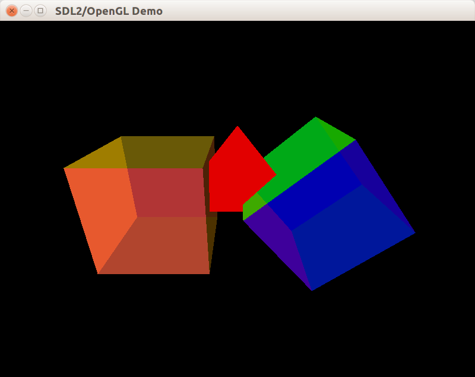
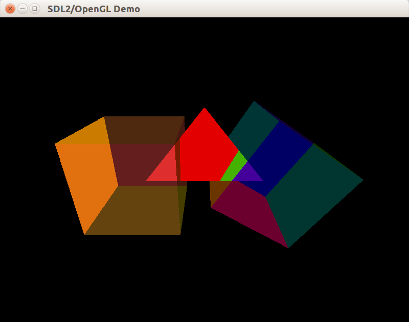
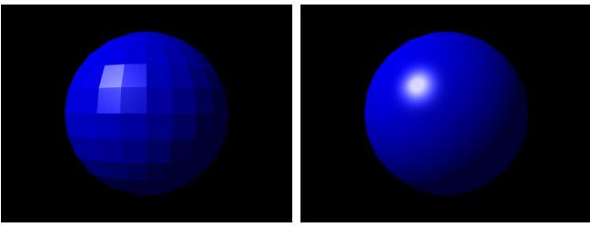
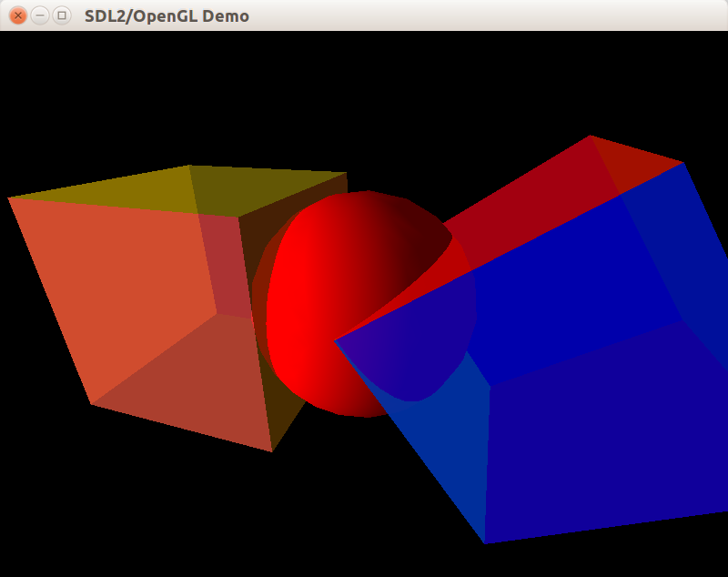
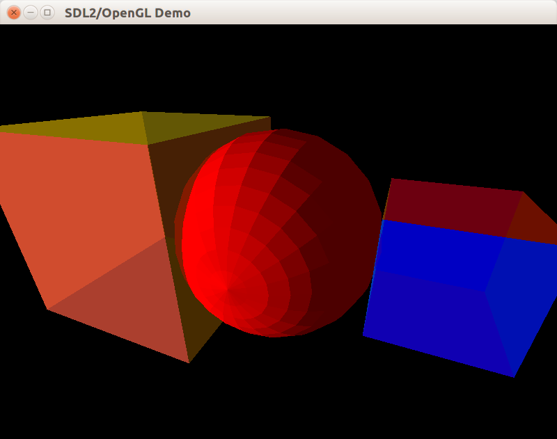
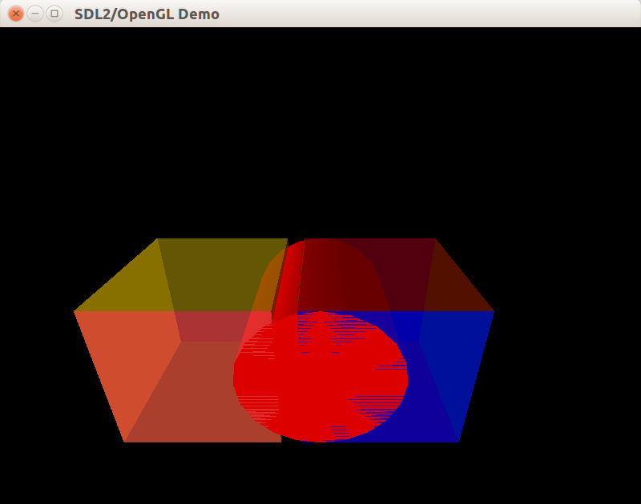

В этом уроке мы впервые применим механизм смешивания цветов, чтобы сделать грани куба полупрозрачными. Также мы научимся строить новый многогранник &mdash; тетраэдр.

## Физика полупрозрачности

Полупрозрачные тела частично пропускают свет насквозь. Остальная доля света поглощается, рассеивается или отражается (в зависимости от свойств материала и спектра падающего излучения). Свет, проходящий скозь тело, дважды преломляется, и степень преломления может быть разной для волн различной длины.

Полная эмуляция полупрозрачности на компьютере выполнима (например, путём трассировки лучей). Однако, такие задачи не принято выполнять в реальном времени. Вместо физически реалистичной эмуляции OpenGL предлагает модель смешивания цветов, позволяющую эмулировать полупрозрачную поверхность путём смешения цвета фона, лежащего за поверхностью, с цветом самой поверхности. Смешение можно выполнять с весовыми коэффициентами, которые зависят от alpha-компоненты RGBA-цветов материала и фона, а также от выбранной формулы смешивания (выбор формул смешивания достаточно большой, но ограниченный).

## Режим смешивания

Для включения режима смешивания, позволяющего вывести полупрозрачные тела, следует вызвать `glEnable(GL_BLEND)`. При этом вывод непрозрачных тел лучше всего выполнить заранее, до вывода первой полупрозрачной грани со смешиванием цветов. В противном случае, полупрозрачная грань заполнит буфер глубины и тем самым "закроет" фрагменты расположенных сзади "фоновых" граней, сделав их невидимыми. После чего конвейер OpenGL отбросит фоновые фрагменты граней, и вы получите отсутствие фона позади полупрозрачного объекта.

Результат этой ошибки можно увидеть на скриншоте &mdash; грани тетраэдра выброшены полупрозрачным кубом в ходе теста глубины:



## Формулы смешивания

OpenGL позволяет задавать способ смешения с помощью установки весовых коэффициентов функции смешивания. Для изменения функции смешивания служит функция-команда [glBlendFunc](https://www.opengl.org/sdk/docs/man2/xhtml/glBlendFunc.xml), которая принимает константы перечислимого типа, задающие способ выбора коэффициентов смешивания. Первый параметр задаёт способ выбора весового коэффициента для фонового фрагмента, второй &mdash; для фрагмента полупрозрачной поверхности, рисуемой поверх фона со смешиванием. Несколько примеров:

- `glBlendFunc(GL_SRC_ALPHA, GL_ONE_MINUS_SRC_ALPHA)` задаёт формулу "непрозрачность * цвет_поверхности + (1 - непрозрачность) * цвет_фона", где под "непрозрачностью" подразумевается alpha-канал рисуемой поверхности. В результате цвет полупрозрачной поверхности накладывается на фон привычным для человека образом.
- `glBlendFunc(GL_ONE, GL_ZERO)` задаёт формулу, эквивалентную отсутствию смешивания: цвет фрагментов новой поверхности замещает собой цвет фоновых фрагментов.
- `glBlendFunc(GL_CONSTANT_ALPHA, GL_ONE_MINUS_CONSTANT_ALPHA)` применяет уже показанную ранее формулу "непрозрачность * цвет_поверхности + (1 - непрозрачность) * цвет_фона", но в качестве "непрозрачности" берёт константу, установленную вызовом [glBlendColor](https://www.opengl.org/sdk/docs/man/html/glBlendColor.xhtml).
- `glBlendFunc(GL_SRC_ALPHA, GL_ONE)` устанавливает аддитивную формулу "непрозрачность_поверхности * цвет_поверхности + цвет фона", которая при большом числе смешиваний или высокой непрозрачности поверхности может дать очень яркий, возможно, даже белый цвет. Такой метод может пригодиться при рисовании некоторых систем частиц &mdash; например, языков пламени.

```cpp
// включает смешивание цветов
// перед выводом полупрозрачных тел
void enableBlending()
{
    glEnable(GL_BLEND);
    glBlendFunc(GL_SRC_ALPHA, GL_ONE_MINUS_SRC_ALPHA);
}

// отключает смешивание цветов
// перед выводом непрозрачных тел
void disableBlending()
{
    glDisable(GL_BLEND);
}
```

## Алгоритм вывода полупрозрачных тел

Кроме включения смешивания и выбора функции смешивания, перед выводом полупрозрачных тел рекомендуется ещё и отключить запись в буфер глубины. Тем самым мы гарантируем, что вывод полупрозрачной грани не приведёт к изменению граничной глубины, при которой фрагмент, попадающий в пиксель экрана, будет выброшен.

Изменим вспомогательные функции:
```cpp
// включает смешивание цветов
// перед выводом полупрозрачных тел
void enableBlending()
{
    glDepthMask(GL_FALSE);
    glEnable(GL_BLEND);
    glBlendFunc(GL_SRC_ALPHA, GL_ONE_MINUS_SRC_ALPHA);
}

// отключает смешивание цветов
// перед выводом непрозрачных тел
void disableBlending()
{
    glDepthMask(GL_TRUE);
    glDisable(GL_BLEND);
}
```

В ситуациях, когда полупрозрачные тела или их отдельные грани накладываются друг на друга, следует отсортировать тела либо отдельные грани по глубине (удалённости от камеры) и выводить так, чтобы для каждой пары из двух визуально пересекающихся тел (граней) первым рисовалось более далёкое от камеры тело (грань), а затем &mdash; более близкое. Только тогда смешивание будет работать правильно.

Общий алгоритм действий:

- включить возможность записи в буфер глубины вызовом `glDepthMask(GL_TRUE)` (или `disableBlending()`)
- нарисовать все непрозрачные объекты сцены
- выключить возможность записи в буфер глубины, включить смешивание
- отсортировать все полупрозрачные объекты (или непосредственно грани) в порядке от дальних к ближним (по отношению к камере)
- нарисовать все полупрозрачные объекты (грани)

Неверная сортировка полупрозрачных граней может привести к подобному результату (верхняя грань куба слева задана жёлтым цветом, но теперь она едва заметна):



## Выделение интерфейса IBody

Чтобы упростить дальнейшее расширение кода, введём интерфейс IBody в файле "IBody.h":

```cpp
#pragma once
#include <memory>

class IBody
{
public:
    virtual ~IBody() = default;
    virtual void Update(float deltaTime) = 0;
    virtual void Draw()const = 0;
};

using IBodyUniquePtr = std::unique_ptr<IBody>;
```

Теперь в приватных данных класса CWindow можно хранить всего лишь два массива &mdash; один для непрозрачных тел, другой для полупрозрачных:

```cpp
// фрагмент объявления CWindow
private:
    std::vector<IBodyUniquePtr> m_opaqueBodies;
    std::vector<IBodyUniquePtr> m_transparentBodies;

// изменения в обновлении состояния сцены
void CWindow::OnUpdateWindow(float deltaSeconds)
{
    m_camera.Update(deltaSeconds);
    for (const IBodyUniquePtr &pBody : m_opaqueBodies)
    {
        pBody->Update(deltaSeconds);
    }
    for (const IBodyUniquePtr &pBody : m_transparentBodies)
    {
        pBody->Update(deltaSeconds);
    }
}

// изменения в рисовании кадра сцены
void CWindow::OnDrawWindow(const glm::ivec2 &size)
{
    SetupView(size);
    m_sunlight.Setup();
    for (const IBodyUniquePtr &pBody : m_opaqueBodies)
    {
        pBody->Draw();
    }
    enableBlending();
    for (const IBodyUniquePtr &pBody : m_transparentBodies)
    {
        pBody->Draw();
    }
    disableBlending();
}
```

## Вывод задних граней

В полупрозрачном теле видны не только задние, но и передние грани. Чтобы их нарисовать, можно воспользоваться трюком: нарисовать трёхмерное тело дважды, изменив способ определения передних граней при первом рисовании. Для изменения способа определения передних граней достаточно вызвать функцию `glFrontFace(GL_CW)`, т.к. по умолчанию OpenGL считает передними гранями только грани, вершины которых перечислены против часовой стрелки (режим `GL_CCW`). Всё это приводит нас к простой модификации метода `CIdentityCube::Draw`:

```cpp
void CIdentityCube::Draw() const
{
    if (m_alpha < 0.99f)
    {
        glFrontFace(GL_CW);
        OutputFaces();
        glFrontFace(GL_CCW);
    }
    OutputFaces();
}

void CIdentityCube::OutputFaces() const
{
    // выводит треугольники, составляющие грани куба,
    // вместе с цветами и нормалями вершин.
}
```

## Платоновы тела

Существует ровно пять [платоновых тел](https://ru.wikipedia.org/wiki/%D0%9F%D1%80%D0%B0%D0%B2%D0%B8%D0%BB%D1%8C%D0%BD%D1%8B%D0%B9_%D0%BC%D0%BD%D0%BE%D0%B3%D0%BE%D0%B3%D1%80%D0%B0%D0%BD%D0%BD%D0%B8%D0%BA) тетраэдр, октаэдр, икосаэдр, куб, додекаэдр.


Каждый из этих пяти многогранников является выпуклым, каждая грань является правильной двумерной фигурой, и к каждой вершине сходится одинаковое число рёбер. Такие тела обладают высокой степенью симметрии, а способы расчёта координат их вершин широко известны.

Более подробно о триангуляции платоновых тел рассказывается в книге Френсиса Хилла, "OpenGL. Программирование компьютерной графики." (ISBN 5-318-00219-6), раздел 6.3 "Многогранники". Схожая информация есть и в других источниках в литературе и в сети Интернет.

Правильный тетраэдр &mdash; это правильный многогранник, состоящий из четырёх граней, каждая из которых является правильным треугольником (с равными сторонами и равными углами по 60°). Как и другие платоновы тела, тетраэдр является выпуклым и обладает высокой степенью симметрии. Сделав простое построение, можно аналитически расчитать соотношения между его сторонами и особыми внутренними линиями, такими, ка высота тетраэдра (перпендикуляр из вершины к противоположной грани). Вычислим эти отношения:


## Вершины и грани тетраэдра

После построения несложно составить массив вершин и массив индексов граней: достаточно смотреть на построение и записывать. Если для удобства взять за длину стороны базового тетраэдра число √3, получатся такие массивы:

```cpp
// Сторона тетраэдра равна √3,
// расстояние от центра грани до вершины равно 1.
const Vertex TETRAHEDRON_VERTICES[] = {
    {0.f, 0.f, -1.0f},
    {sqrtf(1.5f), 0.f, 0.5f},
    {-sqrtf(1.5f), 0.f, 0.5f},
    {0.f, sqrtf(2.f), 0.f},
};

const STriangleFace TETRAHEDRON_FACES[] = {
    {0, 1, 2, 0},
    {0, 3, 1, 0},
    {2, 1, 3, 0},
    {0, 2, 3, 0},
};
```

## Класс CIdentityTetrahedron

Теперь объявим класс базового тетраэдра, у которого будет только одно свойство &mdash; единый цвет поверхности.

```cpp
class CIdentityTetrahedron final : public IBody
{
public:
    void Update(float deltaTime) final;
    void Draw()const final;

    void SetColor(const glm::vec4 &color);

private:
    void OutputFaces()const;

    glm::vec4 m_color;
};
```

Для реализации рисования воспользуемся ранее увиденным трюком с вызовом glFrontFace:

```cpp
void CIdentityTetrahedron::Update(float deltaTime)
{
    (void)deltaTime;
}

void CIdentityTetrahedron::Draw() const
{
    if (m_color.a < 0.99f)
    {
        glFrontFace(GL_CW);
        OutputFaces();
        glFrontFace(GL_CCW);
    }
    OutputFaces();
}

void CIdentityTetrahedron::SetColor(const glm::vec4 &color)
{
    m_color = color;
}

void CIdentityTetrahedron::OutputFaces() const
{
    // менее оптимальный способ рисования: прямая отправка данных
    // могла бы работать быстрее, чем множество вызовов glColor/glVertex.
    glBegin(GL_TRIANGLES);

    for (const STriangleFace &face : TETRAHEDRON_FACES)
    {
        const Vertex &v1 = TETRAHEDRON_VERTICES[face.vertexIndex1];
        const Vertex &v2 = TETRAHEDRON_VERTICES[face.vertexIndex2];
        const Vertex &v3 = TETRAHEDRON_VERTICES[face.vertexIndex3];
        glm::vec3 normal = glm::normalize(glm::cross(v2 - v1, v3 - v1));

        glColor4fv(glm::value_ptr(m_color));
        glNormal3fv(glm::value_ptr(normal));
        glVertex3fv(glm::value_ptr(v1));
        glVertex3fv(glm::value_ptr(v2));
        glVertex3fv(glm::value_ptr(v3));
    }
    glEnd();
}
```

## Введение объектов-декораторов

В связи с добавлением тетраэдра перемещение и анимирование куба было переделано с применением шаблона проектирования "Декоратор". Декоратор &mdash; класс, который оборачивает реальное трёхмерное тело и изменяет способ его рисования. Для удобства выделен класс абстрактного декоратора, который реализует интерфейс IBody и имеет методы для установки и получения единственного дочернего IBody:

```cpp
class CAbstractDecorator : public IBody
{
public:
    void SetChild(IBodyUniquePtr && pChild);

protected:
    void UpdateChild(float deltaTime);
    void DrawChild()const;

private:
    IBodyUniquePtr m_pChild;
};

void CAbstractDecorator::SetChild(IBodyUniquePtr &&pChild)
{
    m_pChild = std::move(pChild);
}

void CAbstractDecorator::UpdateChild(float deltaTime)
{
    assert(m_pChild.get());
    m_pChild->Update(deltaTime);
}

void CAbstractDecorator::DrawChild() const
{
    assert(m_pChild.get());
    m_pChild->Draw();
}
```

Перемещение двух кубов в разные позиции теперь реализуется с помощью CTransformDecorator:

```cpp
class CTransformDecorator : public CAbstractDecorator
{
public:
    void Update(float deltaTime);
    void Draw()const;

    void SetTransform(const glm::mat4 &transform);

private:
    glm::mat4 m_transform;
};

void CTransformDecorator::Draw() const
{
    glPushMatrix();
    glMultMatrixf(glm::value_ptr(m_transform));
    DrawChild();
    glPopMatrix();
}
```

Анимирование куба реализуется в классе CAnimatedDecorator:

```cpp
class CAnimatedDecorator : public CAbstractDecorator
{
public:
    void Update(float deltaTime);
    void Draw()const;

private:
    enum Animation
    {
        Rotating,
        Pulse,
        Bounce,
    };

    glm::mat4 GetAnimationTransform()const;

    Animation m_animation = Rotating;
    float m_animationPhase = 0;
};

void CAnimatedDecorator::Draw() const
{
    const glm::mat4 matrix = GetAnimationTransform();
    glPushMatrix();
    glMultMatrixf(glm::value_ptr(matrix));
    DrawChild();
    glPopMatrix();
}
```

После изменения способа анимирования и перемещения куба в класс CWindow добавлен метод InitBodies, который инициализирует линейные массивы непрозрачных и полупрозрачных тел.

## Нормали гладких поверхностей

OpenGL не способен напрямую рисовать криволинейные поверхности. Тем не менее, можно аппроксимировать поверхность с помощью треугольников. Тогда возникает другая проблема &mdash; как избежать появления слишком большого числа треугольников?

Например, если мы разбиваем сферу на 1000 делений по широте и 1000 делений по долготе, а каждый полученный сектор представляем двумя треугольниками, получается 2 миллиона треугольников &mdash; слишком много для такого простого тела, как сфера.



Можно достигнуть эффекта гладкости иным способом: воспользоваться интерполяцией освещения. На изображении выше сфера слева и сфера справа представлены одинаковым числом треугольников (это можно заметить, глядя на угловатые края правой сферы). Однако, для сферы справа освещение расчитывается в каждом фрагменте треугольника (с использованием программируемого конвейера и GLSL). Поэтому зритель не замечает угловатость сферы &mdash; мозг в процессе восстановления трёхмерной картинки из двухмерного кадра на сетчатке глаза будет считать сферу гладкой, потому что она *выглядит* гладкой.

В фиксированном конвейере OpenGL не получится достичь максимальной гладкости: расчёт цвета с учётом освещения всё равно происходит лишь для вершин треугольника, и полученный цвет лишь интерполируется по фрагментам. В таком режиме нельзя создать изображение с правильными бликами, аналогичное сфере справа &mdash; но можно приблизиться к нему.

За установку модели закрашивания грани отвечает функция [glShadeModel](https://www.opengl.org/sdk/docs/man2/xhtml/glShadeModel.xml):

- режим `glShadeModel(GL_SMOOTH)` выставлен по-умолчанию: в таком режиме каждая вершина треугольника имеет свою нормаль и свой результат расчёта освещения, но фрагменты треугольника получают усреднённое значение цвета (с соответствующими весовыми коэффициентами).
- режим `glShadeModel(GL_FLAT)` приведёт к тому, что для треугольника будет выбрана лишь одна нормаль одной вершины, остальные будут отброшены. В итоге весь треугольник при расчёте освещения будет окрашен в единый цвет.

## Библиотека GLU

Библиотека GLU (OpenGL Utilities) развивалась параллельно с первыми версиями OpenGL. Она поставляется производителям видеодрайверов как часть OpenGL, и содержит

- функции для некоторых операций над матрицами (однако, функции для матриц в GLM удобнее и мощнее, чем в GLU)
- функции для некоторых операций над текстурами (генерация уменьшенных копий текстуры)
- функции для операций над многоугольниками на плоскости (разделение на треугольники и логические операции над областями многоугольников)
- функции для рисования сферы, цилиндра и кругового диска

Последнее обновление спецификации GLU произошло в 1998-м году, и на данный момент библиотека считается устаревшей. Кроме того, GLU отсутствует в мобильном OpenGL ES и в WebGL, оставаясь работоспособной только в составе видеодрайверов для настольных компьютеров. Не стоит привыкать к использованию GLU &mdash; однако, мы применим GLU в рамках статьи для рисования сферы и цилиндра. Мы воспользуемся типом `GLUquadric` и связанными с ним функциями.

## Класс CSphereQuadric

Класс реализует интерфейс IBody, используя спецификатор `final`. Единственное поле класса хранит указатель на структуру `GLUquadric`, реализация которой скрыта внутри GLU.

```cpp
// новые заголовки
#include <GL/glu.h>
#include <boost/noncopyable.hpp>

class CSphereQuadric final
        : public IBody
        , private boost::noncopyable
{
public:
    CSphereQuadric();
    ~CSphereQuadric();

    void Update(float) final {}
    void Draw()const final;

    void SetColor(const glm::vec3 &color);

private:
    GLUquadric *m_quadric = nullptr;
    glm::vec3 m_color;
};
```

Конструктор и деструктор написаны согласно [идиоме RAII](https://ru.wikipedia.org/wiki/%D0%9F%D0%BE%D0%BB%D1%83%D1%87%D0%B5%D0%BD%D0%B8%D0%B5_%D1%80%D0%B5%D1%81%D1%83%D1%80%D1%81%D0%B0_%D0%B5%D1%81%D1%82%D1%8C_%D0%B8%D0%BD%D0%B8%D1%86%D0%B8%D0%B0%D0%BB%D0%B8%D0%B7%D0%B0%D1%86%D0%B8%D1%8F). Копирование класса CSphereQuadric запрещено путём приватного наследования от `boost::noncopyable`, чтобы обеспечить уникальное владение ресурсом.

```cpp
CSphereQuadric::CSphereQuadric()
    : m_quadric(gluNewQuadric())
    , m_color({1, 1, 1})
{
}

CSphereQuadric::~CSphereQuadric()
{
    gluDeleteQuadric(m_quadric);
}
```

Для рисования вызывается фунция [gluSphere](https://www.opengl.org/sdk/docs/man2/xhtml/gluSphere.xml), в параметрах которой передаётся радиус сферы и число делений по широте/долготе, от которого прямо зависит число созданных для приближения сферы треугольников.

```cpp
void CSphereQuadric::Draw() const
{
    const double radius = 1;
    const int slices = 20;
    const int stacks = 20;
    glColor3fv(glm::value_ptr(m_color));
    gluSphere(m_quadric, radius, slices, stacks);
}

void CSphereQuadric::SetColor(const glm::vec3 &color)
{
    m_color = color;
}
```

Результат добавления сферы на сцену:



Ради эксперимента включим для сферы упомянутый ранее режим "плоского" расчёта освещения, в котором одна грань может иметь только одну нормаль:

```cpp
void CSphereQuadric::Draw() const
{
    glShadeModel(GL_FLAT);
    const double radius = 1;
    const int slices = 20;
    const int stacks = 20;
    glColor3fv(glm::value_ptr(m_color));
    gluSphere(m_quadric, radius, slices, stacks);
    glShadeModel(GL_SMOOTH);
}
```



## Класс CConoidQuadric

Класс усечённого конуса CConoidQuadric также реализует интерфейс IBody, используя спецификатор `final`, и хранит внутри указатель на объект типа `GLUquadric`. С помощью CConoidQuadric можно нарисовать не только усечённый конус, но и обычный конус либо цилиндр &mdash; результат рисования зависит от значения свойства TopRadius. По умолчанию `TopRadius = 1.`, рисуется цилиндр:

```cpp
// определение класса
class CConoidQuadric final
        : public IBody
        , private boost::noncopyable
{
public:
    CConoidQuadric();
    ~CConoidQuadric();

    void Update(float) final {}
    void Draw()const final;

    /// @param value - in range [0..1]
    void SetTopRadius(double value);
    void SetColor(const glm::vec3 &color);

private:
    GLUquadric *m_quadric = nullptr;
    double m_topRadius = 1.;
    glm::vec3 m_color;
};

// конструктор и деструктор

CConoidQuadric::CConoidQuadric()
    : m_quadric(gluNewQuadric())
    , m_color({1, 1, 1})
{
}

CConoidQuadric::~CConoidQuadric()
{
    gluDeleteQuadric(m_quadric);
}
```

Для рисования используется три функции-команды GLU: [gluCylinder](https://www.opengl.org/sdk/docs/man2/xhtml/gluCylinder.xml) рисует только боковую поверхность усечённого конуса, а две "крышки" (верхняя и нижняя) рисуются двумя дисками с помощью [gluDisk](https://www.opengl.org/sdk/docs/man2/xhtml/gluDisk.xml). Здесь также использованы устаревшие низкоуровневые средства для работы с матрицами &mdash; это оправдано, потому что библиотека GLU устарела одновременно с OpenGL 1.x, и весь код рисования усечённого конуса одинаково устарел для OpenGL 2.x и выше. Реализация рисования:

```cpp
// Рисует усечённый конус высотой 2,
// с радиусом основания 1 и радиусом верхнего торца m_topRadius.
void CConoidQuadric::Draw() const
{
    const double baseRadius = 1;
    const double height = 2;
    const int slices = 20;
    const int stacks = 1;
    glColor3fv(glm::value_ptr(m_color));
    glTranslatef(0, 0, 1);
    gluCylinder(m_quadric, baseRadius, m_topRadius, height, slices, stacks);
    glFrontFace(GL_CW);
    gluDisk(m_quadric, 0, baseRadius, slices, stacks);
    glFrontFace(GL_CCW);
    glTranslatef(0, 0, 2);
    gluDisk(m_quadric, 0, baseRadius, slices, stacks);
    glTranslatef(0, 0, -1);
}

void CConoidQuadric::SetTopRadius(double value)
{
    m_topRadius = glm::clamp(value, 0.0, 1.0);
}

void CConoidQuadric::SetColor(const glm::vec3 &color)
{
    m_color = color;
}
```

После добавления цилиндра на сцену мы получим интересное явление, которое называется [Z-Fighting](https://en.wikipedia.org/wiki/Z-fighting): грань куба и диск цилиндра накладываются друг на друга, и фрагменты граней имеют одинаковую глубину. Спецификация OpenGL оставляет поведение в таких ситуациях неопределённым: на разных кадрах разные фрагменты грани куба и диска цилиндра будут "выигрывать" конфликт глубины и попадать на экран.



Универсального решения для Z-Fighting не существует. Но для большинства приложений Z-Fighting не является проблемой &mdash; например, в трёхмерных играх поверхности не могут накладываться друг на друга из-за работы физического движка, который не позволяет объектам совмещаться друг с другом.

## Результат

Вы можете взять [полный пример к статье на github](https://github.com/PS-Group/cg_course_examples/tree/master/lesson_10). В этом примере на сцене находятся два куба, тетраэдр, сфера и цилиндр, к некоторым из них прикреплены объекты-декораторы:


