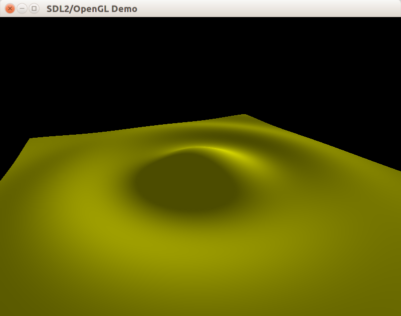
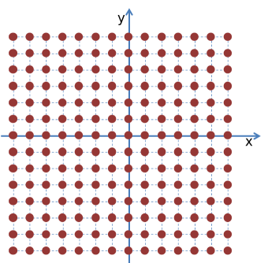
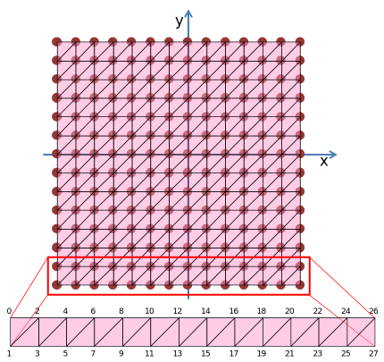
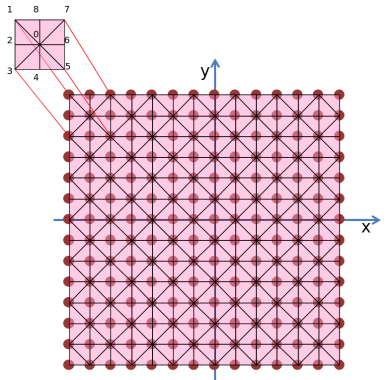
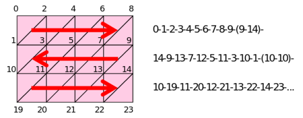

В этом примере мы научимся рисовать гладкие поверхности без объёма &mdash; графики функций от двух аргументов:



## Вспомогательный класс материала

Далее мы будем рисовать график функции новым способом, который не позволяет задать цвет вершины один раз вызовом `glColor*`. Это не мешает задавать цвет иным способом, но мы всё-таки прекратим использовать `GL_COLOR_MATERIAL` и применим функции-команды для явной установки свойств материала, который будет одинаковым для всей поверхности.

Материал в фиксированном конвейере OpenGL содержит 4 разных цвета (emission, ambient, diffuse, specular) и один параметр (shininess), влияющий размер пятна бликового (т.е. specular) компонета освещения:

#### Новый класс в Lights.h
```cpp
class CPhongModelMaterial
{
public:
    void Setup() const;

    glm::vec4 GetEmission() const;
    glm::vec4 GetAmbient() const;
    glm::vec4 GetDiffuse() const;
    glm::vec4 GetSpecular() const;
    float GetShininess() const;

    void SetAmbient(const glm::vec4 &GetAmbient);
    void SetEmission(const glm::vec4 &GetEmission);
    void SetDiffuse(const glm::vec4 &GetDiffuse);
    void SetSpecular(const glm::vec4 &GetSpecular);
    void SetShininess(float GetShininess);

private:
    glm::vec4 m_emission;
    glm::vec4 m_ambient;
    glm::vec4 m_diffuse;
    glm::vec4 m_specular;
    float m_shininess = 10.f;
};
```

Реализация геттеров и сеттеров тривиальна, интересен только метод Setup, который применяет параметры материала к состоянию OpenGL:

```cpp
void CPhongModelMaterial::Setup() const
{
    glMaterialfv(GL_FRONT_AND_BACK, GL_EMISSION, glm::value_ptr(m_emission));
    glMaterialfv(GL_FRONT_AND_BACK, GL_AMBIENT, glm::value_ptr(m_ambient));
    glMaterialfv(GL_FRONT_AND_BACK, GL_DIFFUSE, glm::value_ptr(m_diffuse));
    glMaterialfv(GL_FRONT_AND_BACK, GL_SPECULAR, glm::value_ptr(m_specular));
    glMaterialf(GL_FRONT_AND_BACK, GL_SHININESS, m_shininess);
}
```

Теперь мы добавим объект нового класса в CWindow:

```cpp
class CWindow
{
    // часть определения класса пропущена
private:
    CPhongModelMaterial m_material;
};

CWindow::CWindow()
// часть конструктора пропущена
{
    m_material.SetAmbient(YELLOW_RGBA);
    m_material.SetDiffuse(YELLOW_RGBA);
    m_material.SetSpecular(FADED_WHITE_RGBA);
    m_material.SetShininess(MATERIAL_SHININESS);
}

void CWindow::OnDrawWindow(const glm::ivec2 &size)
{
    SetupView(size);
    m_sunlight.Setup();
    m_material.Setup();
    // m_surface - график двумерной функции.
    m_surface.Draw();
}
```

## Аппроксимация графиков двумерных функций

С низкоуровневой визуализацией объектов, состоящих из плоских граней, мы познакомились. Теперь займёмся *аппроксимацией* (то есть приближением) криволинейных поверхностей. Поверхности будут заданы функциями от двух аргументов &mdash; `y=f(x, z)`.

Для начала, равномерно разобьем отображаемую область функции на сетку, состоящую из `SizeX*SizeZ` ячеек. Затем пройдём по узлам этой сетки в цикле по X, Z и вычислим Y, который будет равен значению функции в узле сетки.



## Новый класс CDottedFunctionSurface

Новый класс добавлен в файл `FunctionSurface.h`. Он реализует интерфейс IBody, заглушая метод Update (поверхность функции статична и не нуждается в обновлениях). Также добавлен вспомогательный синоним типа и структура данных SVertexP3N, описывающая вершину с трёхмерным вектором позиции и вектором нормали.

```cpp
#pragma once

#include "IBody.h"
#include <functional>
#include <vector>
#include <glm/fwd.hpp>
#include <glm/vec3.hpp>

using Function2D = std::function<float(float, float)>;

// Вершина с трёхмерной позицией и нормалью.
struct SVertexP3N
{
    glm::vec3 position;
    glm::vec3 normal;

    SVertexP3N() = default;
    SVertexP3N(const glm::vec3 &position)
        : position(position)
    {
    }
};

class CDottedFunctionSurface final : public IBody
{
public:
    CDottedFunctionSurface(const Function2D &fn);

    /// Инициализирует сетку треугольников
    /// @param rangeX - диапазон, где x - нижняя граница, y - верхняя граница
    /// @param rangeZ - диапазон, где x - нижняя граница, y - верхняя граница
    void Tesselate(const glm::vec2 &rangeX, const glm::vec2 &rangeZ, float step);

    // IBody interface.
    void Update(float) final {}
    void Draw() const final;

private:
    Function2D m_fn;
    std::vector<SVertexP3N> m_vertices;
};
```

Для инициализации объекта этого класса в CWindow мы раелизуем функцию GetSincFromXY, двумерный вариант тригонометрической функции sinc, также известной как [кардинальный синус](https://ru.wikipedia.org/wiki/Sinc) &mdash; то есть в итоге мы нарисуем график именно этой функции:

```cpp
//////////////////////////////////////////////
// Window.h

class CWindow
{
    // часть определения класса пропущена
private:
    CSolidFunctionSurface m_surface;
};

//////////////////////////////////////////////
// Window.cpp

namespace
{
float GetSincFromXY(float x, float y)
{
    const float radius = std::hypotf(x, y);
    if (radius < std::numeric_limits<float>::epsilon())
    {
        return 1;
    }
    return sinf(radius) / radius;
}
} // anonymous namespace

CWindow::CWindow()
    : m_surface(GetSincFromXY)
// часть конструктора пропущена
{
    // график будет рисоваться в квадрате 20x20 с шагом 0,5.
    m_surface.Tesselate({-10, 10}, {-10, 10}, 0.5f);
}

void CWindow::OnDrawWindow(const glm::ivec2 &size)
{
    SetupView(size);
    m_sunlight.Setup();
    m_material.Setup();
    m_surface.Draw();
}
```

## Заполнение массива вершин графика функции

Метод Tesselate заполняет массив несвязных вершин, используя вспомогательные функции GetPosition и CalculateNormals, а также вспомогательный конструктор структуры SVertexP3N, принимающий только позицию без нормали:

```cpp
namespace
{
glm::vec3 GetPosition(const Function2D &fn, float x, float z)
{
    const float y = fn(x, z);
    return {x, y, z};
}

// вычисляет нормали численным методом,
// с помощью векторного произведения.
void CalculateNormals(std::vector<SVertexP3N> &vertices,
                      const Function2D &fn, float step)
{
    for (SVertexP3N &v : vertices)
    {
        const glm::vec3 &position = v.position;
        glm::vec3 dir1 = GetPosition(fn, position.x, position.z + step) - position;
        glm::vec3 dir2 = GetPosition(fn, position.x + step, position.z) - position;
        v.normal = glm::normalize(glm::cross(dir1, dir2));
    }
}
} // anonymous namespace

CDottedFunctionSurface::CDottedFunctionSurface(const Function2D &fn)
    : m_fn(fn)
{
}

void CDottedFunctionSurface::Tesselate(const glm::vec2 &rangeX, const glm::vec2 &rangeZ, float step)
{
    m_vertices.clear();
    // вычисляем позиции вершин.
    for (float x = rangeX.x; x < rangeX.y; x += step)
    {
        for (float z = rangeZ.x; z < rangeZ.y; z += step)
        {
            m_vertices.push_back(SVertexP3N(GetPosition(m_fn, x, z)));
        }
    }
    CalculateNormals(m_vertices, m_fn, step);
}
```

## Применение glVertexPointer

В методе Draw мы наконец откажемся от рисования Immediate Mode (то есть от блоков glBegin/glEnd). Ранее мы отдельно задавали различные "текущие" атрибуты вершины, а функция glVertex кроме установки атрибута "позиция" ещё и порождала новую вершину.

Создатели OpenGL ещё в начали 1990-х годов поняли, что такой подход неэффективен: накладные расходы на постоянные проверки данных при каждом вызове `glNormal*/glColor*/glVertex*` слишком велики. Применение дисплейных списоков, показаное ранее в статье ["Тригонометрия и цветы"](lesson_4.html), частично решает проблему, но также имеется интерфейс для вывода целых массивов вершин несколькими вызовами функций-команд OpenGL: glVertexPointer и glDrawArrays.

У вывода целого массива вершин есть важное преимущество: такой метод работает во всех версиях и режимах OpenGL, включая

- OpenGL 3.0+ в режиме Core Profile,
- OpenGL ES для мобильных устройств
- WebGL, реализуемый барузерами и похожий на OpenGL ES

Структура данных SVertexP3N была описана с расчётом на glVertexPointer, потому что такой метод рисования приспособлен для массивов пользовательских структур и умеет гибко адаптироваться под разные способы описания вершины. В нашем случае структура содержит вектор позиции и вектор нормали, их привязка осуществляется функциями [glVertexPointer](https://www.opengl.org/sdk/docs/man2/xhtml/glVertexPointer.xml) и [glNormalPointer](https://www.opengl.org/sdk/docs/man2/xhtml/glNormalPointer.xml). Вместе с привязкой следует вызвать [glEnableClientState](https://www.opengl.org/sdk/docs/man2/xhtml/glEnableClientState.xml), чтобы сообщить видеодрайверу, что вы планируете использовать установленный указатель на массив данных для рисования примитивов. В нашем случае вершины и нормали упакованы вместе в один массив `std::vector<SVertexP3N> m_vertices`, но для OpenGL это будут два разных разреженных массива:

```cpp
// Включаем режим vertex array и normal array.
glEnableClientState(GL_VERTEX_ARRAY);
glEnableClientState(GL_NORMAL_ARRAY);

// Выполняем привязку vertex array и normal array
// Параметр stride задаёт число байт, прибавляемых к указателю
// для перехода к следующей вершине
// Если stride равен 0, OpenGL вычислит stride самостоятельно,
// исходя из предположения, что массив не содержит пропусков.
const size_t stride = sizeof(SVertexP3N);
// Разреженный массив нормалей получается из плотного массива вершин.
glNormalPointer(GL_FLOAT, stride, glm::value_ptr(vertices[0].normal));
// Разреженный массив позиций получается из плотного массива вершин.
glVertexPointer(3, GL_FLOAT, stride, glm::value_ptr(vertices[0].position));

// Рисуем группу примитивов, используя glDrawArrays или glDrawElements

// Выключаем режим vertex array и normal array,
// чтобы не нарушить работу legacy-кода.
glDisableClientState(GL_VERTEX_ARRAY);
glDisableClientState(GL_NORMAL_ARRAY);
```

## Рисование с помощью glDrawArrays

Функция [glDrawArrays](https://www.opengl.org/sdk/docs/man/html/glDrawArrays.xhtml) разбирает привязанный массив вершин последовательно, разбивая их на группы по количеству вершин в примитиве. Например, при рисовании отдельных треугольников массивом из 9 вершин будет собрано 3 треугольника (по 3 вершины на каждый). При рисовании веера треугольников из 9 вершин будет собрано 7 треугольников (одна вершина станет общим центром веера, остальные сформируют его границу). Значение каждого атрибута вершины берётся из привязанного массива атрибутов.

Сейчас мы хотим нарисовать группу примитивов GL_POINT размера `m_vertices.size()`, начиная с 0-го элемента массива:

```cpp
void CDottedFunctionSurface::Draw() const
{
    glPointSize(5.f);
    // Включаем режим vertex array и normal array.
    glEnableClientState(GL_VERTEX_ARRAY);
    glEnableClientState(GL_NORMAL_ARRAY);

    // Выполняем привязку vertex array и normal array
    const size_t stride = sizeof(SVertexP3N);
    glNormalPointer(GL_FLOAT, stride, glm::value_ptr(m_vertices[0].normal));
    glVertexPointer(3, GL_FLOAT, stride, glm::value_ptr(m_vertices[0].position));

    // Выполняем рисование массива вершин.
    glDrawArrays(GL_POINTS, 0, GLsizei(m_vertices.size()));

    // Выключаем режим vertex array и normal array.
    glDisableClientState(GL_VERTEX_ARRAY);
    glDisableClientState(GL_NORMAL_ARRAY);
}
```

Метод следует отрефакторить, поскольку сейчас он выполняет сразу две задачи: сначала привязывает массивы данных вершин, а затем рисует группу примитивов GL_POINT. Задачу привязки массива `std::vector<SVertexP3N> m_vertices` к OpenGL можно выделить в отдельную шаблонную функцию, которая в шаблонном параметре принимает ссылку на функтор, испольщующий привязанные массивы в своих целях. Функтором выступит лямбда-функция:

```cpp
namespace
{
const float DOT_SIZE = 5.f;

/// Привязывает вершины к состоянию OpenGL,
/// затем вызывает 'callback'.
template <class T>
void DoWithBindedArrays(const std::vector<SVertexP3N> &vertices, T && callback)
{
    // Включаем режим vertex array и normal array.
    glEnableClientState(GL_VERTEX_ARRAY);
    glEnableClientState(GL_NORMAL_ARRAY);

    // Выполняем привязку vertex array и normal array
    const size_t stride = sizeof(SVertexP3N);
    glNormalPointer(GL_FLOAT, stride, glm::value_ptr(vertices[0].normal));
    glVertexPointer(3, GL_FLOAT, stride, glm::value_ptr(vertices[0].position));

    // Выполняем внешнюю функцию.
    callback();

    // Выключаем режим vertex array и normal array.
    glDisableClientState(GL_VERTEX_ARRAY);
    glDisableClientState(GL_NORMAL_ARRAY);
}
} // anonymous namespace

void CDottedFunctionSurface::Draw() const
{
    glPointSize(DOT_SIZE);
    DoWithBindedArrays(m_vertices, [this] {
        glDrawArrays(GL_POINTS, 0, GLsizei(m_vertices.size()));
    });
}
```

Благодаря установке размера точек равным 5 на большом расстоянии от камеры точки формируют непрерывную поверхность. Однако, вблизи камеры поверхность рассыпается:


## Замощение поверхности лентой треугольников

Теперь мы соединим вершины при помощи лент из треугольников (GL_TRIANGLE_STRIP). На первый взгляд, нам необходимо SizeY лент длиной по `2*SizeX` треугольников каждая:



В качестве альтернативы можно было бы соединить вершины в виде набора вееров из треугольников (GL_TRIANGLE_FAN), но это потребовало бы большего количества  групп примитивов:



Для сокращения SizeY лент треугольников до единственной ленты мы будем «сшивать» соседние ленты треугольников, добавляя пару дополнительных вершин в конце каждой ленты &mdash; в результате вырожденный треугольник нулевой площади совершит переход к следующему ряду треугольников. Также потребуется постоянно менять направление обхода рядов ленты:



Такой прием позволит нарисовать всю сетку с помощью одной ленты из треугольников, что положительно скажется на эффективности ее обработки OpenGL.

>С использованием расширения [GL_NV_primitive_restart](https://www.opengl.org/registry/specs/NV/primitive_restart.txt) можно выполнять «перезапуск» группы примитивов и без добавления вырожденных граней и необходимости менять направление обхода рядов ленты.

## Новый класс CSolidFunctionSurface

Для решения проблем с рассыпанием добавим в `FunctionSurface.h` новый класс CSolidFunctionSurface. Этот класс будет, подобно классам CIdentityCube и CIdentityTetrahedron, использовать опосредованный доступ к вершинам через массив, содержащий лишь индексы в массиве вершин.

```cpp
class CSolidFunctionSurface final : public IBody
{
public:
    CSolidFunctionSurface(const Function2D &fn);

    /// Инициализирует индексированную сетку треугольников
    /// @param rangeX - диапазон, где x - нижняя граница, y - верхняя граница
    /// @param rangeZ - диапазон, где x - нижняя граница, y - верхняя граница
    void Tesselate(const glm::vec2 &rangeX, const glm::vec2 &rangeZ, float step);

    // IBody interface.
    void Update(float) final {}
    void Draw() const final;

private:
    Function2D m_fn;
    // содержит "палитру" вершин.
    std::vector<SVertexP3N> m_vertices;
    // содержит индексы в палитре вершин.
    std::vector<uint32_t> m_indicies;
};
```

Теперь функция Tesselate станет сложнее: в неё добавился код, который делит вершины по треугольникам, занося индексы в массив `m_indicies`. Благодаря описанному ранее трюку с переходом на новый ряд через вырожденный треугольник (с нулевой площадью) мы можем представить всю поверхность одной изогнутой сеткой треугольников:

```cpp
CSolidFunctionSurface::CSolidFunctionSurface(const Function2D &fn)
    : m_fn(fn)
{
}

void CSolidFunctionSurface::Tesselate(const glm::vec2 &rangeX, const glm::vec2 &rangeZ, float step)
{
    m_vertices.clear();
    const unsigned columnCount = unsigned((rangeX.y - rangeX.x) / step);
    const unsigned rowCount = unsigned((rangeZ.y - rangeZ.x) / step);

    // вычисляем позиции вершин.
    for (unsigned ci = 0; ci < columnCount; ++ci)
    {
        const float x = rangeX.x + step * float(ci);
        for (unsigned ri = 0; ri < rowCount; ++ri)
        {
            const float z = rangeZ.x + step * float(ri);
            m_vertices.push_back(SVertexP3N(GetPosition(m_fn, x, z)));
        }
    }
    CalculateNormals(m_vertices, m_fn, step);
    // вычисляем индексы вершин.
    for (unsigned ci = 0; ci < columnCount - 1; ++ci)
    {
        if (ci % 2 == 0)
        {
            for (unsigned ri = 0; ri < rowCount; ++ri)
            {
                unsigned index = ci * rowCount + ri;
                m_indicies.push_back(index + rowCount);
                m_indicies.push_back(index);
            }
        }
        else
        {
            for (unsigned ri = rowCount - 1; ri < rowCount; --ri)
            {
                unsigned index = ci * rowCount + ri;
                m_indicies.push_back(index);
                m_indicies.push_back(index + rowCount);
            }
        }
    }
}
```

## Рисование с помощью glDrawElements

Функция [glDrawElements](https://www.opengl.org/sdk/docs/man2/xhtml/glDrawElements.xml) является альтернативой для glDrawArrays, дающей косвенный доступ к вершинам через дополнительный массив индексов &mdash; именно такой метод рисования нам и нужен. Используя ранее описанную функцию DoWithBindedArrays, выполняем рисование группы примитивов GL_TRIANGLE_STRIP:

```cpp
void CSolidFunctionSurface::Draw() const
{
    DoWithBindedArrays(m_vertices, [this] {
        glDrawElements(GL_TRIANGLE_STRIP, GLsizei(m_indicies.size()),
                       GL_UNSIGNED_INT, m_indicies.data());
    });
}
```

В результате мы получаем поверхность, плотно замощённую треугольниками.

## Результат

Вы можете взять [полный пример к уроку на github](https://github.com/PS-Group/cg_course_examples/tree/master/chapter_2/lesson_10). А вот так выглядит окно после запуска:


