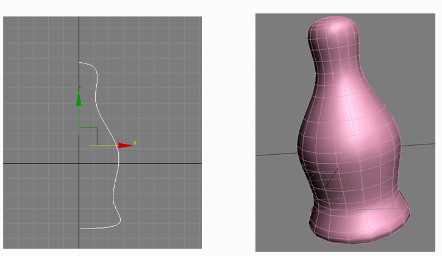
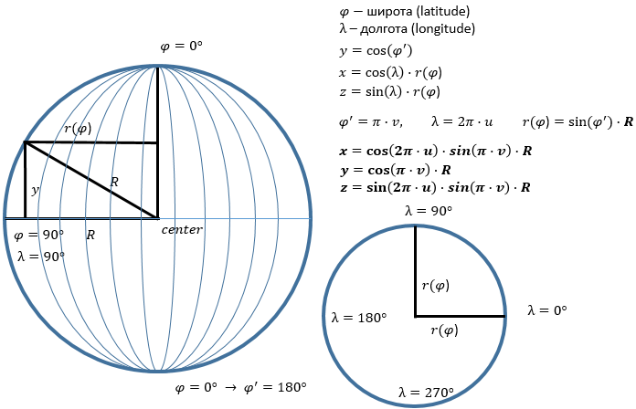
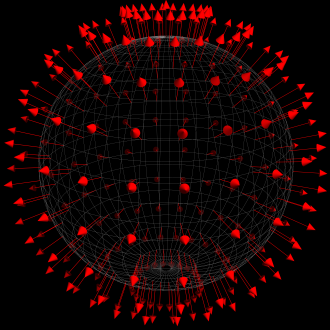
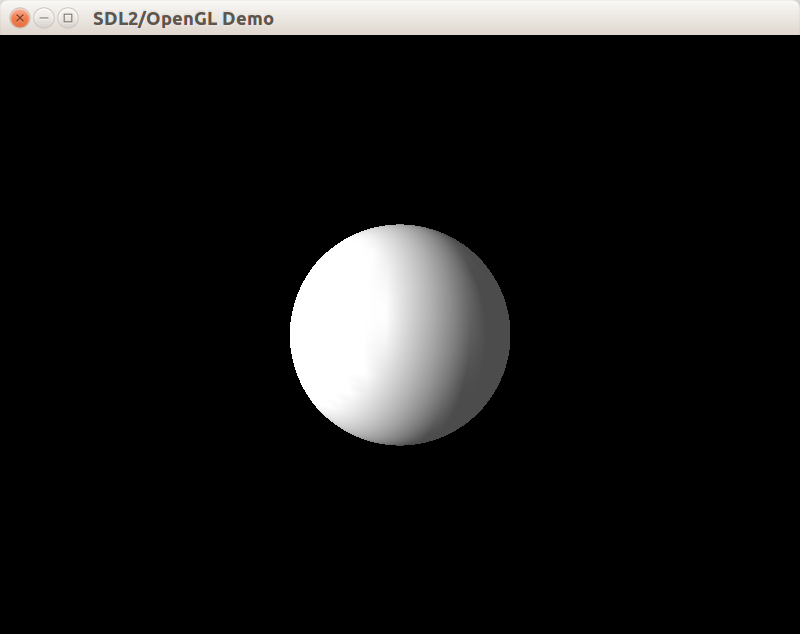
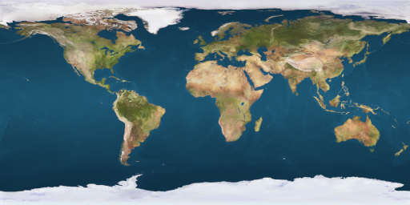
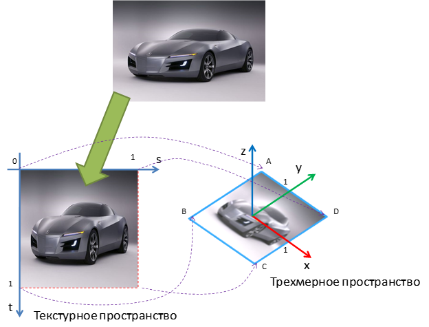
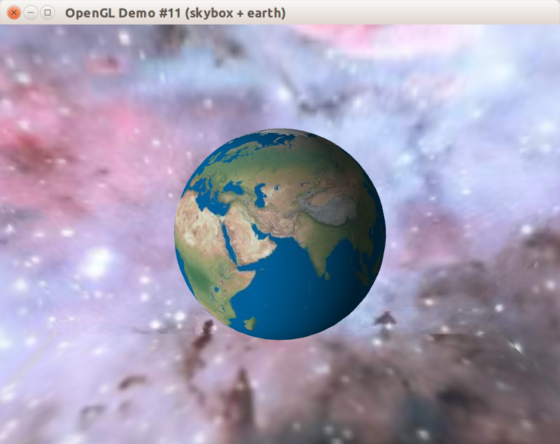

В этом примере мы научимся триангулировать и рисовать одно из простейших тел вращения &mdash; сферу. Также мы покроем сферу текстурой Земли.

## Способы рисования сферы

Чтобы нарисовать сферу, нужно:

- определиться со способом приближения сферы сеткой треугольников
- вычислить вершины треугольников
- проиндексировать вершины, составив из них полосу треугольников

Один из способов приближения сферы &mdash; детализация икосаэдра. Среди всех правильных Платоновых тел икосаэдр ближе всего к сфере, кроме того, его грани уже являются треугольниками. Каждая грань может быть разделена на 3 подграни: достаточно составить из этой грани и точки на поверхности сферы тетраэдр, а потом взять три других грани полученного тетраэдра, а изначальную грань отбросить.

Детализация икосаэдра &mdash; это работоспособный, но слишком сложный способ: нам придётся сначала решать задачу триангуляции икосаэдра, а потом её и задачу детализации граней. Кроме того, такой способ не подходит для любых других тел, кроме сферы. Однако, есть более совершенный метод UV-параметризации, с помощью которого можно нарисовать любое тело вращения.

[Тела вращения](https://ru.wikipedia.org/wiki/%D0%A2%D0%B5%D0%BB%D0%B0_%D0%B2%D1%80%D0%B0%D1%89%D0%B5%D0%BD%D0%B8%D1%8F) могут быть созданы путём вращения некоторой фигуры, состоящей из кривой и отрезка прямой, вокруг её прямой стороны:



UV параметризация вводит два дополнительных параметра, "u" и "v". Параметр "u" создаёт деления на "меридиане" тела вращения &mdash; то есть на линии, проходящей вдоль оси вращения тела. Параметр "v" создаёт деления на "параллели", то есть на линии, оборачивающей тело вращения подобно экватору или параллели глобуса.

## UV-параметризация сферы

В географии принято разделять глобус двумя типами линий &mdash; параллелями (параллель фиксирована определённой широтой) и меридианами (меридиан фиксирован определённой долготой).


Этот подход хорошо сочетается с UV-параметризацией: мы будем делить сферу так же, как параллели и меридианы делят глобус, и обозначим широту как "φ", а долготу как "λ". Сделав несколько построений и применив тригонометрические правила, можно получить формулы, выводящие трёхмерный вектор (x, y, z) из двумерного вектора (u, v):



Полученный нами способ триагуляции аналогичен построению графика двумерной функции из прошлого примера. Только теперь вместо прямого вычисления (x, z) и вывода из них координаты "y" мы вводим сетку параметров (u, v) и выводим из них (x, y, z)

## Класс CIdentitySphere

Определение класса в целом похоже на CSolidFunctionSurface из предыдущей статьи, но в конструктор CIdentitySphere предаётся число делений по параллелям и по меридианам сферы, что позволяет задать детализацию сферы при её конструировании.

```cpp
// Вершина с трёхмерной позицией и нормалью.
struct SVertexP3N
{
    glm::vec3 position;
    glm::vec3 normal;
};

class CIdentitySphere final : public IBody
{
public:
    CIdentitySphere(unsigned slices, unsigned stacks);

    void Update(float) final {}
    void Draw()const final;

private:
    void Tesselate(unsigned slices, unsigned stacks);ч

    std::vector<SVertexP3N> m_vertices;
    std::vector<uint32_t> m_indicies;
};
```

Вспомогательные функции CalculateTriangleStripIndicies (для распределения вершин по треугольникм) и DoWithBindedArrays (для привязк массивов данных к OpenGL) не изменились в сравнении с прошлым примером. Реализации конструктора и метода Draw просты:

```cpp
CIdentitySphere::CIdentitySphere(unsigned slices, unsigned stacks)
{
    Tesselate(slices, stacks);
}

void CIdentitySphere::Draw() const
{
    DoWithBindedArrays(m_vertices, [this] {
        glDrawElements(GL_TRIANGLE_STRIP, GLsizei(m_indicies.size()),
                       GL_UNSIGNED_INT, m_indicies.data());
    });
}
```

В методе Tesselate теперь вместо итерирования по `(x,z)` и вычисления `y` происходит итерирование по промежуточным параметрам `(u,v)` и вычисление ширины (latitude), долготы (longitude), а затем и позиции вершины `(x,y,z)`. Вычисление нормали выполняется легко, так как радиус, проведённый к точке сферы, уже перпендикулярен поверхности, а в единичной сфере радиус ещё и равен единице (т.е. не требует нормализации); это наблюдение проиллюстрировано на картинке:



```cpp
void CIdentitySphere::Tesselate(unsigned slices, unsigned stacks)
{
    assert((slices >= MIN_PRECISION) && (stacks >= MIN_PRECISION));
    m_vertices.reserve(slices * stacks);
    // вычисляем позиции вершин.
    for (unsigned ci = 0; ci < slices; ++ci)
    {
        const float u = float(ci) / float(slices - 1);
        for (unsigned ri = 0; ri < stacks; ++ri)
        {
            const float v = float(ri) / float(stacks - 1);

            SVertexP3N vertex;
            vertex.position = GetPositionOnSphere(u, v);

            // Нормаль к сфере - это нормализованный вектор радиуса к данной точке
            // Поскольку координаты центра равны 0, координаты вектора радиуса
            // будут равны координатам вершины.
            // Благодаря радиусу, равному 1, нормализация не требуется.
            vertex.normal = vertex.position;

            m_vertices.push_back(vertex);
        }
    }

    CalculateTriangleStripIndicies(m_indicies, slices, stacks);
}
```

Вспомогательная функция GetPositionOnSphere() по заданным `(u,v)` возвращает позицию вершины на единичной сфере, согласно ранее сделаному построению:

```cpp
glm::vec3 GetPositionOnSphere(float u, float v)
{
    const float radius = 1.f;
    const float latitude = float(M_PI) * (1.f - v); // 흅∙(ퟎ.ퟓ-풗)
    const float longitude = float(2.0 * M_PI) * u; // ퟐ흅∙풖
    const float latitudeRadius = radius * sinf(latitude);

    return { cosf(longitude) * latitudeRadius,
             cosf(latitude) * radius,
             sinf(longitude) * latitudeRadius };
}
```

После добавления сферы в класс сцены с белым материалом мы получаем:



## Загрузка BMP как текстуры

Настало время украсить поверхность сферы текстурой. Для примера мы возьмём текстуру Земли:



Двумерные текстуры в OpenGL хранятся в видеопамяти, и загружаются программистом как массивы пикселей с помощью [glTexImage2D](https://www.opengl.org/sdk/docs/man2/xhtml/glTexImage2D.xml). Массив пикселей из BMP-файла можно получить с помощью загрузки объекта [SDL_Surface](http://wiki.libsdl.org/SDL_Surface) функцией [SDL_LoadBMP](http://wiki.libsdl.org/SDL_LoadBMP). Но что делать, если текстуру загрузить не удалось? Благодаря следованию правилам современного C++ и применению умных указателей, мы можем использовать механизм исключений и не бояться утечек ресурсов. Добавим обработку фатальных исключений программы в main:

#### main.cpp
```cpp
#include "stdafx.h"
#include "Window.h"
#include <SDL2/SDL.h>

int main(int, char *[])
{
    glewInit();

    try
    {
        CWindow window;
        window.Show({800, 600});
        window.DoGameLoop();
    }
    catch (const std::exception &ex)
    {
        const char *title = "Fatal Error";
        const char *message = ex.what();
        SDL_ShowSimpleMessageBox(SDL_MESSAGEBOX_ERROR, title, message, nullptr);
    }

    return 0;
}
```

## Класс CTexture2D

Класс загузки и хранения для двумерной текстуры должен выполнять две задачи:

- предоставлять RAII интерфейс управления OpenGL-объектом "текстура", для которого драйвер выдаёт уникальный идентификатор типа unsigned
- выполнять как привязку текстуры к состоянию OpenGL, так и отмену привязки

Для привязки текстуры в OpenGL 1.x применяется функция [glBindTexture](https://msdn.microsoft.com/en-us/library/windows/desktop/dd318364%28v=vs.85%29.aspx). Заметим, что в более поздних версиях OpenGL были введены более удачные альтернативы, позволяющие использовать одновременно более одной текстуры; эти альтернативы имеют критическое значение для многих спецэффектов, но не интересуют нас в рамках данной статьи.

```cpp
// Привязка текстуры с индексом m_textureId к состоянию OpenGL
// Только одна текстура может быть привязана в один момент времени
// таким способом
glBindTexture(GL_TEXTURE_2D, m_textureId);

// Отвязка текстуры от состояния OpenGL, теперь в состоянии OpenGL
// нет привязанной текстуры
glBindTexture(GL_TEXTURE_2D, 0);
```

Последовательный вызов bind/unbind вполне приемлем для процедурного стиля программирования, но вызывает проблемы в программах, где возможен выброс исключений. Поэтому мы добавим к классу CTexture2D метод DoWhileBinded, принимающий функтор и выполняющий его в тот момент, когда текстура привязана к состоянию OpenGL.

#### Texture2D.h

```cpp
#pragma once
#include <boost/noncopyable.hpp>
#include <boost/scope_exit.hpp>
#include <string>
#include <memory>

class CTexture2D : private boost::noncopyable
{
public:
    CTexture2D();
    ~CTexture2D();

    void Bind()const;
    static void Unbind();

    template <class TFunction>
    void DoWhileBinded(TFunction && fn)
    {
        Bind();
        // При выходе из функции гарантированно выполняем Unbind.
        BOOST_SCOPE_EXIT_ALL(&) {
            Unbind();
        };
        fn();
    }

private:
    unsigned m_textureId = 0;
};

using CTexture2DUniquePtr = std::unique_ptr<CTexture2D>;

CTexture2DUniquePtr LoadTexture2DFromBMP(const std::string &path);

```

В этом примере мы использовали макрос [BOOST_SCOPE_EXIT_ALL](http://www.boost.org/doc/libs/1_52_0/libs/scope_exit/doc/html/BOOST_SCOPE_EXIT_ALL.html), который доступен в библиотеках Boost, но только для компиляторов с поддержкой C++11. Макрос служит хорошей альтернативой написанию небольших RAII-классов.

Свободная функция LoadTexture2DFromBMP будет выполнять загрузку текстурного объекта из файла `*.bmp`, и кидать исключение в случае неудачной загрузки. Но прежде разберёмся с созданием, удалением и привязкой текстуры:

```cpp
#include "stdafx.h"
#include "Texture2D.h"

CTexture2D::CTexture2D()
{
    glGenTextures(1, &m_textureId);
}

CTexture2D::~CTexture2D()
{
    glDeleteTextures(1, &m_textureId);
}

void CTexture2D::Bind() const
{
    glBindTexture(GL_TEXTURE_2D, m_textureId);
}

void CTexture2D::Unbind()
{
    glBindTexture(GL_TEXTURE_2D, 0);
}
```

Теперь введём вспомогательные специализации unique_ptr, которые принимают пользовательскую функцию удаления вместо обычного вызова delete &mdash; обычный delete не будет работать для объектов, созданных функциями SDL, т.к. они не имеют привычных деструкторов.

Также напишем вспомогательную функцию FlipSurfaceVertically, которая обращается к пикселям SDL_Surface и переворачивает их по вертикали &mdash; это необходимо, чтобы текстура после загрузки не оказалась перевёрнутой из-за различий в системах координат изображения и OpenGL:

```cpp
#include <cstdlib> // для std::memcpy

// Используем unique_ptr с явно заданной функцией удаления вместо delete.
using SDLSurfacePtr = std::unique_ptr<SDL_Surface, void(*)(SDL_Surface*)>;
using SDLPixelFormatPtr = std::unique_ptr<SDL_PixelFormat, void(*)(SDL_PixelFormat*)>;

static void FlipSurfaceVertically(SDL_Surface & surface)
{
    const auto rowSize = size_t(surface.w * surface.format->BytesPerPixel);
    std::vector<uint8_t> row(rowSize);

    for (size_t y = 0, height = size_t(surface.h); y < height / 2; ++y)
    {
        auto *pixels = reinterpret_cast<uint8_t*>(surface.pixels);
        auto *upperRow = pixels + rowSize * y;
        auto *lowerRow = pixels + rowSize * (height - y - 1);
        std::memcpy(row.data(), upperRow, rowSize);
        std::memcpy(upperRow, lowerRow, rowSize);
        std::memcpy(lowerRow, row.data(), rowSize);
    }
}
```

Теперь можно реализовать загрузку `*.bmp` сначала в оперативную память в виде матрицы пикселей, а затем и в видеопамять в виде текстуры OpenGL:

```cpp
CTexture2DUniquePtr LoadTexture2DFromBMP(const std::string &path)
{
    SDLSurfacePtr pSurface(SDL_LoadBMP(path.c_str()), SDL_FreeSurface);
    if (!pSurface)
    {
        throw std::runtime_error("Cannot find texture at " + path);
    }

    const GLenum pixelFormat = GL_RGB;
    switch (pSurface->format->format)
    {
    case SDL_PIXELFORMAT_RGB24:
        break;
    case SDL_PIXELFORMAT_BGR24:
        pSurface.reset(SDL_ConvertSurfaceFormat(pSurface.get(),
                                                SDL_PIXELFORMAT_RGB24, 0));
        break;
    default:
        throw std::runtime_error("Unsupported image pixel format at " + path);
    }

    FlipSurfaceVertically(*pSurface);

    auto pTexture = std::make_unique<CTexture2D>();
    pTexture->DoWhileBinded([&] {
        glTexImage2D(GL_TEXTURE_2D, 0, GLint(pixelFormat), pSurface->w, pSurface->h,
                     0, pixelFormat, GL_UNSIGNED_BYTE, pSurface->pixels);
        // параметры адаптации текстуры при её масштабировании
        glTexParameteri(GL_TEXTURE_2D, GL_TEXTURE_MIN_FILTER, GL_LINEAR);
        glTexParameteri(GL_TEXTURE_2D, GL_TEXTURE_MAG_FILTER, GL_LINEAR);
    });

    return pTexture;
}
```

## Наложение текстуры

Для того, чтобы нарисовать прямоугольник с наложенной на него текстурой необходимо включить режим наложения двухмерной текстуры при помощи вызова функции glEnable с параметром GL_TEXTURE_2D, выбрать нужный текстурный объект при помощи glBindTexure, а затем привязать массив, содержащий текстурные координаты каждой вершины примитива, с помощью [glTexCoordPointer](https://www.opengl.org/sdk/docs/man2/xhtml/glTexCoordPointer.xml).
Текстурные координаты задаются в текстурном пространстве, задающем отображение текстурного изображения на диапазон координат от 0 до 1.



Есть ряд параметров, влияющий на наложение текстуры

- оборачивание (wrapping), задающее поведение при выходе текстурных координат за границы [0;1]:

- параметры адаптации текстуры при её масштабировании (filtering)
- в OpenGL 1.x в рамках фиксированного конвейера к текстурным координатам применяется матрица GL_TEXTURE, с помощью которой можно применить аффинное преобразование к "окну", забирающему фрагмент текстуры

Подробнее о параметрах текстуры можно прочитать в статье на [open.gl/textures](https://open.gl/textures). В рамках данного примера мы не используем дополнительные параметры.

## Наложение текстуры на объемные объекты

Визуализация объемного объекта в OpenGL сводится в визуализации плоских граней, аппроксимирующих поверхность данного объекта, поэтому принципиальных различий от наложения текстуры на плоские объекты нет. Основная наша задача – задать текстурные координаты вершин граней, чтобы получить желаемый результат.
Рассмотрим в данном примере расчет текстурных координат для сферы и куба, поскольку для таких фигур расчет текстурных координат выполняется достаточно просто. При наложении текстуры на более сложные объекты автоматический расчет текстурных координат, как правило, слишком сложен или не дает желаемых результатов. Поэтому дизайнеры трехмерных моделей выполняют наложение текстуры вручную при помощи специальных программ. Данная технология получила название UV mapping (U и V – распространенное имя для координатных осей в двухмерном текстурном пространстве):

UV mapping напрямую сочетается с UV-параметризацией. Благодаря этому, внедрить текстурные координаты в класс сферы для нас будет очень легко:

- SVertexP3N нужно расширить (и переименовать в SVertexP3NT2)
- в функции DoWithBindedArrays надо добавить привязку GL_TEXTURE_COORD_ARRAY
- в методе Tesselate надо передать `(u,v)` как две текстурные координаты (в этом и заключается выгода UV-параметризации: нам не надо вычислять, как наложить текстуру на тело вращения)

```cpp
// Вершина с трёхмерной позицией, нормалью и 2D координатами текстуры.
struct SVertexP3NT2
{
    glm::vec3 position;
    glm::vec2 texCoord;
    glm::vec3 normal;
};

/// Привязывает вершины к состоянию OpenGL,
/// затем вызывает 'callback'.
template <class T>
void DoWithBindedArrays(const std::vector<SVertexP3NT2> &vertices, T && callback)
{
    // Включаем режим vertex array и normal array.
    glEnableClientState(GL_TEXTURE_COORD_ARRAY);
    glEnableClientState(GL_VERTEX_ARRAY);
    glEnableClientState(GL_NORMAL_ARRAY);

    // Выполняем привязку vertex array и normal array
    const size_t stride = sizeof(SVertexP3NT2);
    glNormalPointer(GL_FLOAT, stride, glm::value_ptr(vertices[0].normal));
    glVertexPointer(3, GL_FLOAT, stride, glm::value_ptr(vertices[0].position));
    glTexCoordPointer(2, GL_FLOAT, stride, glm::value_ptr(vertices[0].texCoord));

    // Выполняем внешнюю функцию.
    callback();

    // Выключаем режим vertex array и normal array.
    glDisableClientState(GL_TEXTURE_COORD_ARRAY);
    glDisableClientState(GL_VERTEX_ARRAY);
    glDisableClientState(GL_NORMAL_ARRAY);
}

void CIdentitySphere::Tesselate(unsigned slices, unsigned stacks)
{
    assert((slices >= MIN_PRECISION) && (stacks >= MIN_PRECISION));
    m_vertices.reserve(slices * stacks);
    // вычисляем позиции вершин.
    for (unsigned ci = 0; ci < slices; ++ci)
    {
        const float u = float(ci) / float(slices - 1);
        for (unsigned ri = 0; ri < stacks; ++ri)
        {
            const float v = float(ri) / float(stacks - 1);

            SVertexP3NT2 vertex;
            vertex.position = GetPositionOnSphere(u, v);

            // Нормаль к сфере - это нормализованный вектор радиуса к данной точке
            // Поскольку координаты центра равны 0, координаты вектора радиуса
            // будут равны координатам вершины.
            // Благодаря радиусу, равному 1, нормализация не требуется.
            vertex.normal = vertex.position;

            // Обе текстурные координаты должны плавно изменяться от 0 до 1,
            // натягивая прямоугольную картинку на тело вращения.
            // При UV-параметризации текстурными координатами будут u и v.
            vertex.texCoord = {1.f - u, v};

            m_vertices.push_back(vertex);
        }
    }

    CalculateTriangleStripIndicies(m_indicies, slices, stacks);
}
```

## Класс CWindow

Приведём полный листинг текущего кода CWindow:

#### CWindow.h
```cpp
#pragma once
#include "DispatchEvent.h"
#include "IBody.h"
#include "Camera.h"
#include "Lights.h"
#include "Decorators.h"
#include "Texture2D.h"
#include <vector>

class CWindow : public CAbstractInputControlWindow
{
public:
    CWindow();

protected:
    // CAbstractWindow interface
    void OnWindowInit(const glm::ivec2 &size) override;
    void OnUpdateWindow(float deltaSeconds) override;
    void OnDrawWindow(const glm::ivec2 &size) override;

    // IInputEventAcceptor interface
    void OnKeyDown(const SDL_KeyboardEvent &) override;
    void OnKeyUp(const SDL_KeyboardEvent &) override;

private:
    void SetupView(const glm::ivec2 &size);

    CPhongModelMaterial m_material;
    CTexture2DUniquePtr m_pEarthTexture;
    CAnimatedDecorator m_decoratedSphere;
    CCamera m_camera;
    CDirectedLightSource m_sunlight;
};
```

#### CWindow.cpp

```cpp
#include "stdafx.h"
#include "Window.h"
#include "Bodies.h"
#include "RevolutionBodies.h"
#include <boost/range/algorithm/find_if.hpp>
#include <boost/range/adaptor/reversed.hpp>
#include <glm/gtc/matrix_transform.hpp>

namespace
{
const char EARTH_TEX_PATH[] = "res/daily_earth.bmp";
const glm::vec4 BLACK = {0, 0, 0, 1};
const float MATERIAL_SHININESS = 30.f;
const glm::vec4 WHITE_RGBA = {1, 1, 1, 1};
const glm::vec4 FADED_WHITE_RGBA = {0.3f, 0.3f, 0.3f, 1.f};
const glm::vec3 SUNLIGHT_DIRECTION = {-1.f, 0.2f, 0.7f};
const float CAMERA_INITIAL_ROTATION = 0;
const float CAMERA_INITIAL_DISTANCE = 4.f;
const float EARTH_ROTATION_PERIOD_SEC = 12.f;
const unsigned SPHERE_PRECISION = 40;

void SetupOpenGLState()
{
    // включаем механизмы трёхмерного мира.
    glEnable(GL_DEPTH_TEST);
    glEnable(GL_CULL_FACE);
    glFrontFace(GL_CCW);
    glCullFace(GL_BACK);

    // включаем систему освещения
    glEnable(GL_LIGHTING);

    // включаем текстурирование в старом стиле (OpenGL 1.1)
    glEnable(GL_TEXTURE_2D);
}
}

CWindow::CWindow()
    : m_camera(CAMERA_INITIAL_ROTATION, CAMERA_INITIAL_DISTANCE)
    , m_sunlight(GL_LIGHT0)
{
    SetBackgroundColor(BLACK);

    m_decoratedSphere.SetChild(std::make_unique<CIdentitySphere>(SPHERE_PRECISION, SPHERE_PRECISION));
    m_decoratedSphere.SetPeriod(EARTH_ROTATION_PERIOD_SEC);

    const glm::vec4 WHITE_RGBA = {1, 1, 1, 1};
    m_material.SetAmbient(WHITE_RGBA);
    m_material.SetDiffuse(WHITE_RGBA);
    m_material.SetSpecular(FADED_WHITE_RGBA);
    m_material.SetShininess(MATERIAL_SHININESS);

    m_sunlight.SetDirection(SUNLIGHT_DIRECTION);
    m_sunlight.SetDiffuse(WHITE_RGBA);
    m_sunlight.SetAmbient(0.1f * WHITE_RGBA);
    m_sunlight.SetSpecular(WHITE_RGBA);
}

void CWindow::OnWindowInit(const glm::ivec2 &size)
{
    (void)size;
    SetupOpenGLState();

    m_pEarthTexture = LoadTexture2DFromBMP(EARTH_TEX_PATH);
}

void CWindow::OnUpdateWindow(float deltaSeconds)
{
    m_camera.Update(deltaSeconds);
    m_decoratedSphere.Update(deltaSeconds);
}

void CWindow::OnDrawWindow(const glm::ivec2 &size)
{
    SetupView(size);
    m_sunlight.Setup();
    m_material.Setup();
    m_pEarthTexture->DoWhileBinded([&] {
        m_decoratedSphere.Draw();
    });
}

void CWindow::SetupView(const glm::ivec2 &size)
{
    glViewport(0, 0, size.x, size.y);

    // Матрица вида возвращается камерой и составляет
    // начальное значение матрицы GL_MODELVIEW.
    glLoadMatrixf(glm::value_ptr(m_camera.GetViewTransform()));

    // Матрица перспективного преобразования вычисляется функцией
    // glm::perspective, принимающей угол обзора, соотношение ширины
    // и высоты окна, расстояния до ближней и дальней плоскостей отсечения.
    const float fieldOfView = glm::radians(70.f);
    const float aspect = float(size.x) / float(size.y);
    const float zNear = 0.01f;
    const float zFar = 100.f;
    const glm::mat4 proj = glm::perspective(fieldOfView, aspect, zNear, zFar);
    glMatrixMode(GL_PROJECTION);
    glLoadMatrixf(glm::value_ptr(proj));
    glMatrixMode(GL_MODELVIEW);
}

void CWindow::OnKeyDown(const SDL_KeyboardEvent &event)
{
    m_camera.OnKeyDown(event);
}

void CWindow::OnKeyUp(const SDL_KeyboardEvent &event)
{
    m_camera.OnKeyUp(event);
}
```

## Результат

Вы можете взять [полный пример к статье на github](https://github.com/PS-Group/cg_course_examples/tree/master/chapter_2/lesson_11). А вот так выглядит окно после запуска:


