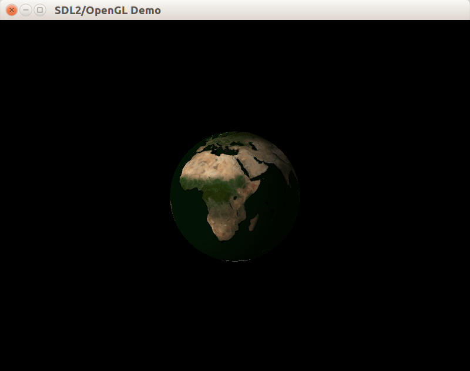
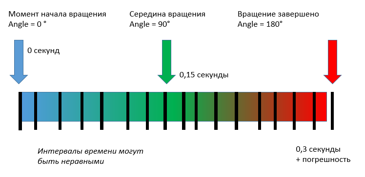
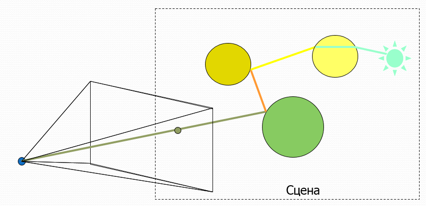
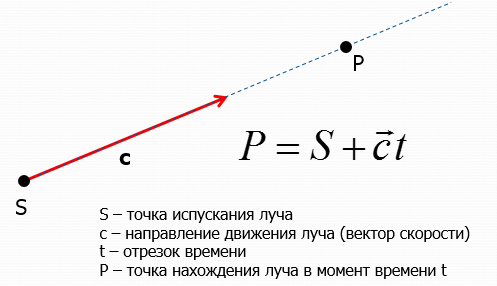
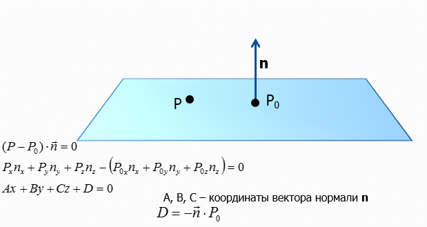
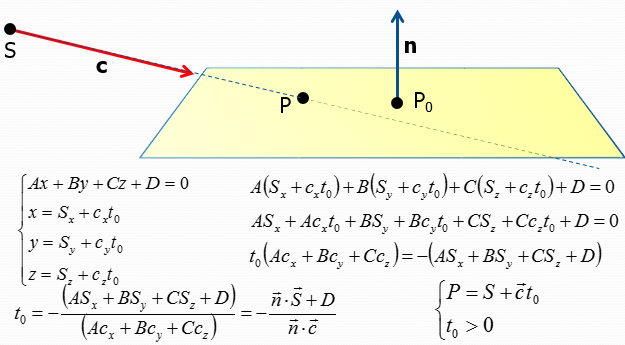
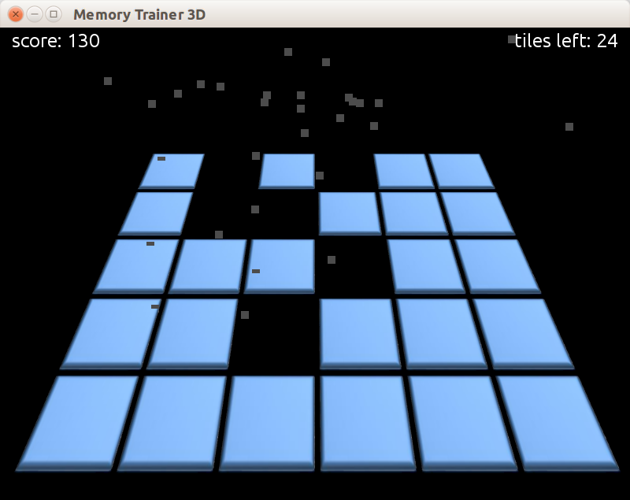
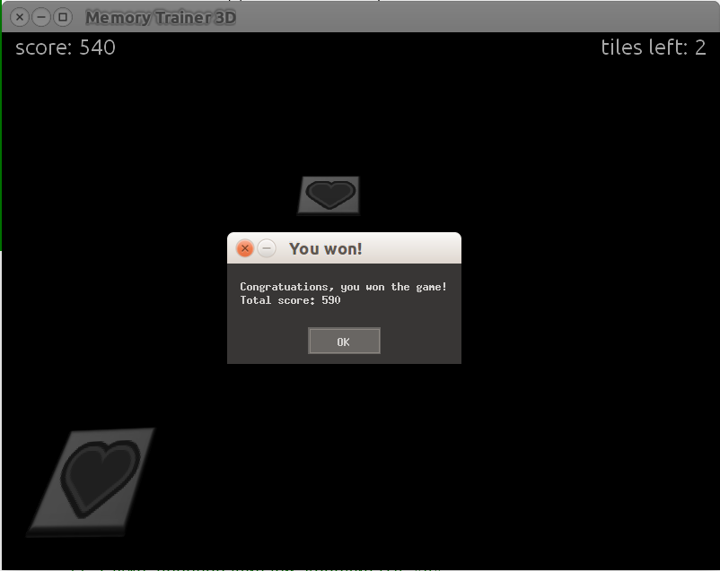

## Геймплей

Суть игры заключается в следующем:

- пользователю показывается игровое поле M * N табличек (всего табличек четное число)
- изначально таблички повёрнуты оборотной стороной (текстура оборотной стороны одинакова для всех табличек)
- при щелчке по плитке она плавно переворачивается лицевой стороной, на которой нарисована некоторая картинка
- если до этого была открыта плитка с тем же рисунком, то обе плитки удаляются с поля (игрок получает 50 очков)
- в противном случае обе плитки плавно поворачиваются обратно рубашкой вверх (игрок теряет 10 очков)
- повторный щелчок по ячейке, повернутой к нам картинкой, вызывает ее обратный поворот рубашкой вверх.

Цель игры – убрать все плитки с игрового поля.

## Класс CTwoSideQuad

Чтобы нарисовать плитку, имеющую разные изображения с двух сторон, вы создадим класс CTwoSideQuad, позволяющий задать разные текстурные координаты для передней и задней стороны. Также плитка будет иметь трёхмерные координаты и нормаль, при этом нормали передней и задней сторон отличаются.

```cpp
// Вершина с трёхмерной позицией, нормалью и 2D координатами текстуры.
struct SVertexP3NT2
{
    glm::vec3 position;
    glm::vec3 normal;
    glm::vec2 texCoord;
};

// Прямоугольный двусторонний спрайт, лежащий в плоскости Oxz.
// Передняя сторона имеет нормаль (0, +1, 0),
// Задняя сторона имеет нормаль (0, -1, 0).
class CTwoSideQuad : public ISceneObject
{
public:
    CTwoSideQuad(const glm::vec2 &leftTop, const glm::vec2 &size);

    void Update(float) override {}
    void Draw()const override;

    void SetFrontTextureRect(const CFloatRect &rect);
    void SetBackTextureRect(const CFloatRect &rect);

private:
    std::vector<SVertexP3NT2> m_vertices;
    std::vector<uint8_t> m_indicies;
};
```

В реализации класса мы применим явное задание вершин и индексов, поскольку их количество невелико:

```cpp
namespace
{
/// Привязывает вершины к состоянию OpenGL,
/// затем вызывает 'callback'.
template <class T>
void DoWithBindedArrays(const std::vector<SVertexP3NT2> &vertices, T && callback)
{
    // Включаем режимы привязки нужных данных.
    glEnableClientState(GL_VERTEX_ARRAY);
    glEnableClientState(GL_NORMAL_ARRAY);
    glEnableClientState(GL_TEXTURE_COORD_ARRAY);

    // Выполняем привязку vertex array, normal array, texture array.
    const size_t stride = sizeof(SVertexP3NT2);
    glVertexPointer(3, GL_FLOAT, stride, glm::value_ptr(vertices[0].position));
    glNormalPointer(GL_FLOAT, stride, glm::value_ptr(vertices[0].normal));
    glTexCoordPointer(2, GL_FLOAT, stride, glm::value_ptr(vertices[0].texCoord));

    // Выполняем внешнюю функцию.
    callback();

    // Выключаем режимы привязки данных.
    glDisableClientState(GL_TEXTURE_COORD_ARRAY);
    glDisableClientState(GL_NORMAL_ARRAY);
    glDisableClientState(GL_VERTEX_ARRAY);
}

// Тайлы лежат в плоскости Oxz, нормаль сонаправлена с осью Oy.
SVertexP3NT2 MakeVertex(const glm::vec2 &xz, float normalY)
{
    SVertexP3NT2 vertex;
    vertex.position = { xz.x, 0.f, xz.y };
    vertex.normal = { 0.f, normalY, 0.f };
    return vertex;
}
}

CTwoSideQuad::CTwoSideQuad(const glm::vec2 &leftTop, const glm::vec2 &size)
{
    SVertexP3NT2 vLeftTopFront = MakeVertex(leftTop, 1.f);
    SVertexP3NT2 vRightTopFront = MakeVertex(leftTop + glm::vec2{ size.x, 0.f }, 1.f);
    SVertexP3NT2 vLeftBottomFront = MakeVertex(leftTop + glm::vec2{ 0.f, size.y }, 1.f);
    SVertexP3NT2 vRightBottomFront = MakeVertex(leftTop + glm::vec2{ size.x, size.y }, 1.f);

    SVertexP3NT2 vLeftTopBack = MakeVertex(leftTop, -1.f);
    SVertexP3NT2 vRightTopBack = MakeVertex(leftTop + glm::vec2{ size.x, 0.f }, -1.f);
    SVertexP3NT2 vLeftBottomBack = MakeVertex(leftTop + glm::vec2{ 0.f, size.y }, -1.f);
    SVertexP3NT2 vRightBottomBack = MakeVertex(leftTop + glm::vec2{ size.x, size.y }, -1.f);

    m_vertices = { vLeftTopFront, vRightTopFront, vLeftBottomFront, vRightBottomFront,
                   vLeftTopBack, vRightTopBack, vLeftBottomBack, vRightBottomBack };
    m_indicies = { 0, 1, 2, 1, 3, 2,
                   6, 5, 4, 6, 7, 5 };
}

void CTwoSideQuad::Draw() const
{
    DoWithBindedArrays(m_vertices, [this] {
        glDrawElements(GL_TRIANGLES, GLsizei(m_indicies.size()),
                       GL_UNSIGNED_BYTE, m_indicies.data());
    });
}

void CTwoSideQuad::SetFrontTextureRect(const CFloatRect &rect)
{
    m_vertices[0].texCoord = rect.GetTopLeft();
    m_vertices[1].texCoord = rect.GetTopRight();
    m_vertices[2].texCoord = rect.GetBottomLeft();
    m_vertices[3].texCoord = rect.GetBottomRight();
}

void CTwoSideQuad::SetBackTextureRect(const CFloatRect &rect)
{
    m_vertices[4].texCoord = rect.GetTopLeft();
    m_vertices[5].texCoord = rect.GetTopRight();
    m_vertices[6].texCoord = rect.GetBottomLeft();
    m_vertices[7].texCoord = rect.GetBottomRight();
}
```

## Плавная анимация плиток

Согласно требованиям, анимация плитки должна быть плавной. Для создания плавной анимации мы создадим класс CAnimationCounter, который будет следить за фазой анимации (будем считать, что фаза изменяется от 0 до 1). Процесс изменения фазы будет выглядеть следующим образом:



Ниже приведено определение класса:

```cpp
class CAnimationCounter
{
public:
    CAnimationCounter(float changeSpeed);

    float GetPhase()const;
    bool IsActive()const;

    // Перезапускает изменение фазы анимации.
    void Restart();

    // Продолжает прирост фазы либо делает анимацию
    //  неактивной, если фаза достигла 1.
    void Update(float deltaSeconds);

private:
    bool m_isActive = false;
    float m_phase = 1.f;
    float m_changeSpeed = 0;
};
```

Начальная фаза анимации равна 1, как если бы она остановилась и ещё не была перезапущена.

В реализации основную сложность представляет метод Update, который должен передвинуть фазу ровно до конечного значения, если он достижимо за deltaSeconds или за меньшее время:

```cpp
CAnimationCounter::CAnimationCounter(float changeSpeed)
    : m_changeSpeed(changeSpeed)
{
}

float CAnimationCounter::GetPhase() const
{
    return m_phase;
}

bool CAnimationCounter::IsActive() const
{
    return m_isActive;
}

void CAnimationCounter::Restart()
{
    m_phase = 0;
    m_isActive = true;
}

void CAnimationCounter::Update(float deltaSeconds)
{
    if (!m_isActive)
    {
        return;
    }
    const float maxPhase = 1.f;
    const float delta = m_changeSpeed * deltaSeconds;
    if ((maxPhase - m_phase) < delta)
    {
        m_phase = maxPhase;
        m_isActive = false;
    }
    else
    {
        m_phase += delta;
    }
}
```

## Состояния плитки

Мы запрограммируем плитку таким образом, чтобы у неё было 4 дискретных состояния:

```cpp
enum class State
{
    FacedFront,
    Teasing,
    FacedBack,
    Dead,
};
```

Правила переключения состояний будут следующими:

- изначальное состояние будет равным FacedBack, но при этом в начале игры все плитки плавно перевернутся вокруг оси Oz вниз лицевой гранью, вместо того чтобы быть повёрнутыми изначально
- при нажатии на плитку, повёрнутую лицевой гранью вниз, она переключается в состояние FacedFront и плавно переворачивается вокруг оси Oz
- если две ранее перевёрнутые плитки имеют разные изображения, они переключаются в состояние Teasing и "дразнят" игрока, прежде чем перевернуться, путём поворота вокруг оси Oy
- если две ранее перевёрнутые плитки имеют одинаковые изображения, они исчезают, при этом проигрывается анимация уменьшения масштаба плитки от 1 до 0, и всё это время плитка повёрнута лицевой гранью вверх

Для реализации логики анимации в методе Draw формируется и применяется текущая анимация плитки. В методе Update происходит только обновление фазы анимации и переключение с состояния Teasing на состояние FacedBack после завершения шага анимации:

```cpp
void CMemoryTile::Update(float dt)
{
    m_animationCounter.Update(dt);

    // После завершения анимации переключаем состояние Teasing
    //  на FacedBack, перезапуская анимацию переворота.
    if (m_state == State::Teasing && !m_animationCounter.IsActive())
    {
        m_state = State::FacedBack;
        m_animationCounter.Restart();
    }
}

void CMemoryTile::Draw() const
{
    const glm::vec2 offset = m_bounds.GetTopLeft() + 0.5f * m_bounds.GetSize();
    const glm::vec3 zAxis = {0, 0, 1};
    const glm::vec3 yAxis = {0, 1, 0};
    glm::mat4 transform;
    transform = glm::translate(transform, {offset.x, 0.f, offset.y});

    const float phase = m_animationCounter.GetPhase();

    switch (m_state)
    {
    case State::FacedBack:
        transform = glm::rotate(transform, (phase + 1.f) * float(M_PI), zAxis);
        break;
    case State::FacedFront:
        transform = glm::rotate(transform, phase * float(M_PI), zAxis);
        break;
    case State::Teasing:
    {
        const float deviation = 0.1f - 0.2f * fabsf(0.5f - phase);
        transform = glm::rotate(transform, float(M_PI), zAxis);
        transform = glm::rotate(transform, deviation * float(M_PI), yAxis);
        break;
    }
    case State::Dead:
        transform = glm::scale(transform, glm::vec3(1.f - phase));
        break;
    }

    glPushMatrix();
    glMultMatrixf(glm::value_ptr(transform));
    CTwoSideQuad::Draw();
    glPopMatrix();
}
```

Ниже приведены конструктор и методы для доступа к свойствам, а методы Kill, Activate и Deactivate рассмотрим далее отдельно.

```cpp
CMemoryTile::CMemoryTile(TileImage tileImage,
                         const glm::vec2 &leftTop, const glm::vec2 &size)
    : CTwoSideQuad(-0.5f * size, size)
    , m_tileImage(tileImage)
    , m_bounds(leftTop, leftTop + size)
    , m_animationCounter(ANIMATION_SPEED)
{
    m_animationCounter.Restart();
}

TileImage CMemoryTile::GetTileImage() const
{
    return m_tileImage;
}

void CMemoryTile::SetTileImage(TileImage tileImage)
{
    m_tileImage = tileImage;
}

bool CMemoryTile::IsFrontFaced() const
{
    return (m_state == State::FacedFront) && !m_animationCounter.IsActive();
}

bool CMemoryTile::IsAlive() const
{
    return (m_state != State::Dead) || m_animationCounter.IsActive();
}
```

## Формируем луч для трассировки по сцене

Непосредственно отслеживать щелчок мыши мы будем с помощью перегрузки метода `IInputEventAcceptor::OnDragEnd`, который передаёт двумерные координаты курсора мыши в системе координат клиентской области окна. Однако, эти коодинаты надо применить для активации плитки, при этом попадание должно измеряться с точностью до пикселя. Добиться подобного эффекта можно с помощью обратной трассировки луча, исходящего из точки в координатах viewport, сквозь сцену. Общий принцип трассировки луча проиллюстрирован ниже:



Нас интересует именно луч, а не прямая либо отрезок, потому что у луча есть начало и нет конца, что удовлетворяет нашим потребностям. Программировать класс луча, трассируемого сквозь сцену, мы будем с помощью параметрического уравнения луча:



Определение класса CRay показано ниже:

```cpp
// ---- Файл Ray.h ----

#pragma once

#include <glm/fwd.hpp>
#include <glm/vec3.hpp>
#include <glm/vec4.hpp>

/*
Класс "Луч", характеризующийся точкой испускания и направлением.
  В момент времени t=0 луч находится в точке start.
  За промежуток времени t=1 луч проходит расстояние direction.
*/
class CRay
{
public:
    CRay() = default;
    explicit CRay(const glm::vec3 &start, const glm::vec3 &direction);

    glm::vec3 GetPointAtTime(float time)const;

    const glm::vec3 &GetStart()const;
    const glm::vec3 &GetDirection()const;

    CRay GetTransformedCopy(const glm::mat4 &transform)const;

private:
    glm::vec3 m_start;
    glm::vec3 m_direction;
};

// ---- Файл Ray.cpp ----

using namespace glm;

CRay::CRay(const vec3 &start, const vec3 &direction)
    : m_start(start)
    , m_direction(direction)
{
}

vec3 CRay::GetPointAtTime(float time) const
{
    return m_start + m_direction * time;
}

const vec3 &CRay::GetStart() const
{
    return m_start;
}

const vec3 &CRay::GetDirection() const
{
    return m_direction;
}
```

Отдельно рассмотрим метод GetTransformedCopy, который должен перевести начало луча и его направление в однородное представление векторов и точек, затем умножить матрицу 4x4, описывающую трансформацию, на полученный 4-х компонентный вектор, и в конце поделить все компоненты полученного вектора на его флаг "w", чтобы скомпенсировать эффект неаффинных преобразований:

```cpp
CRay CRay::GetTransformedCopy(const mat4 &transform) const
{
    const vec4 start = transform * vec4(m_start, 1.f);
    const vec4 direction = transform * vec4(m_direction, 0.f);

    // Проверяем, что флаг "w" у точки всегда остался равным 1.
    //  При умножении на матрицу перспективного преобразования
    //  флаг может измениться.
    assert(fabsf(start.w - 1.0f) <= std::numeric_limits<float>::epsilon());

    return CRay(vec3(start),
                vec3(direction));
}
```

Теперь мы можем реализовать метод OnDragEnd, в котором луч формируется, преобразуется с помощью матриц ModelView и Projection, а затем посылается игровому полю:

```cpp
void CWindow::OnDragEnd(const glm::vec2 &pos)
{
    // Вычисляем позицию точки в нормализованных координатах окна,
    //  то есть на диапазоне [-1; 1].
    // Также переворачиваем координату "y",
    //  т.к. OpenGL считает нулевым нижний левый угол окна,
    //  а все оконные системы - верхний левый угол.
    const glm::ivec2 winSize = GetWindowSize();
    const glm::vec2 halfWinSize = 0.5f * glm::vec2(winSize);
    const glm::vec2 invertedPos(pos.x, winSize.y - pos.y);
    const glm::vec2 normalizedPos = (invertedPos - halfWinSize) / halfWinSize;

    // Вычисляем матрицу обратного преобразования
    //  поскольку поле игры не имеет своей трансформации,
    //  мы берём матрицу камеры в качестве ModelView-матрицы
    const glm::mat4 mvMat = m_camera.GetViewTransform();
    const glm::mat4 projMat = GetProjectionMatrix(winSize);
    const glm::mat4 inverse = glm::inverse(projMat * mvMat);

    // В нормализованном пространстве глубина изменяется от -1 до +1.
    // Вычисляем начало и конец отрезка, проходящего через
    //  нормализованное пространство насквозь.
    const glm::vec3 start = TransformPoint(glm::vec3(normalizedPos, -1.f), inverse);
    const glm::vec3 end =   TransformPoint(glm::vec3(normalizedPos, +1.f), inverse);

    m_pField->Activate(CRay(start, end - start));
}
```

## Пересечение луча с плитками

Результат пересечения будет храниться в структуре SRayIntersection:

```cpp
struct SRayIntersection
{
    // Время пересечения с лучём (по временной шкале луча).
    float m_time;
    // Точка пересечения
    glm::vec3 m_point;
};
```

Чтобы определять пересечение с игровым полем, представляющим из себя плоскость, мы воспользуемся уравнением плоскости:



На основе данного уравнения напишем класс CPlane, формирующий плоскость:

```cpp
/*
Геометрический объект "бесконечная плоскость",
  который задаётся уравнением плоскости из 4-х коэффициентов.
*/
class CPlane
{
public:
    // Три точки определяют плоскость, из них могут быть восстановлены
    //  коэффициенты уравнения плоскости.
    explicit CPlane(const glm::vec3 &point0,
                    const glm::vec3 &point1,
                    const glm::vec3 &point2);

    explicit CPlane(const glm::vec4 &planeEquation);

    bool Hit(CRay const& ray, SRayIntersection &intersection)const;

private:
    // Четырехмерный вектор, хранящий коэффициенты уравнения плоскости
    glm::vec4 m_planeEquation;
};

// ---- реализация класса ----

CPlane::CPlane(const vec3 &point0, const vec3 &point1, const vec3 &point2)
{
    // Вычисляем два ребра треугольника
    const vec3 edge01 = point1 - point0;
    const vec3 edge20 = point0 - point2;

    // Нормаль к плоскости треугольника и уравнение его плоскости
    const vec3 normal = cross(edge20, edge01);
    m_planeEquation = vec4(normal, -dot(normal, point0));
}

CPlane::CPlane(const vec4 &planeEquation)
    : m_planeEquation(planeEquation)
{
}
```

Для определения пересечения луча и плоскости воспользуемся построением, приведённым на иллюстрации:



На основе данного построения реализуем метод Hit:

```cpp
bool CPlane::Hit(const CRay &ray, SRayIntersection &intersection) const
{
    // Величина, меньше которой модуль скалярного произведения вектора направления луча и
    // нормали плоскости означает параллельность луча и плоскости
    const float EPSILON = std::numeric_limits<float>::epsilon();

    // Нормаль к плоскости в системе координат объекта
    const glm::vec3 normalInObjectSpace(m_planeEquation);

    // Скалярное произведение направления луча и нормали к плоскости
    const float normalDotDirection = glm::dot(ray.GetDirection(), normalInObjectSpace);

    // Если скалярное произведение близко к нулю, луч параллелен плоскости
    if (fabs(normalDotDirection) < EPSILON)
    {
        return false;
    }

    /*
    Находим время пересечения луча с плоскостью, подставляя в уравнение плоскости точку испускания луча
    и деление результата на ранее вычисленное сканярное произведение направления луча и нормали к плоскости
    */
    const float hitTime = -glm::dot(glm::vec4(ray.GetStart(), 1), m_planeEquation) / normalDotDirection;

    // Нас интересует только пересечение луча с плоскостью в положительный момент времени,
    // поэтому находящуюся "позади" точки испускания луча точку пересечения мы за точку пересечения не считаем
    // Сравнение с величиной EPSILON, а не с 0 нужно для того, чтобы позволить
    // лучам, испущенным с плоскости, оторваться от нее.
    // Это необходимо при обработке вторичных лучей для построения теней и отражений и преломлений
    if (hitTime <= EPSILON)
    {
        return false;
    }

    // Вычисляем точку столкновения с лучом в системе координат сцены в момент столкновения
    const glm::vec3 hitPoint = ray.GetPointAtTime(hitTime);
    intersection.m_time = hitTime;
    intersection.m_point = hitPoint;

    return true;
}
```

## Класс CMemoryField

Класс занимается хранением всех плиток и контролем их жизненного цикла, обновлением состояния игры, определением попадания луча в плитку. Определение показано ниже:

```cpp
#pragma once

#include "MemoryTile.h"
#include "Lights.h"

#define ENABLE_DEBUG_MEMORY_FIELD_HITS 0

class CMemoryField : public ISceneObject
{
public:
    CMemoryField();

    // ISceneObject interface
    void Update(float dt) final;
    void Draw() const final;

    void Activate(const CRay &ray);
    unsigned GetTileCount()const;
    unsigned GetTotalScore()const;

private:
    void GenerateTiles();
    void CheckTilesPair(std::pair<size_t, size_t> indicies);
    CFloatRect GetImageFrameRect(TileImage image)const;

    CPhongModelMaterial m_material;
    CTexture2DAtlas m_atlas;
    std::vector<CMemoryTile> m_tiles;
    unsigned m_totalScore = 0;

#if ENABLE_DEBUG_MEMORY_FIELD_HITS
    std::vector<glm::vec3> m_hits;
#endif
};
```

Для генерации случайного изображения с учётом правила, по которому изображения должны быть парными, разработан вспомогательный класс CRandomTileImageGenerator:

```cpp

// Класс генерирует изображения для плиток
//  на основе линейного распределения вероятностей.
class CRandomTileImageGenerator
{
    using linear_random_int = std::uniform_int_distribution<int>;

public:
    CRandomTileImageGenerator()
    {
        std::random_device rd;
        m_random.seed(rd());

        const int max = static_cast<int>(TileImage::NUM_TILE_IMAGES) - 1;
        m_tileImageRange.param(linear_random_int::param_type(0, max));
    }


    // Генерирует массив изображений для плиток,
    //  при этом количество плиток разных типов всегда чётное.
    void GenerateRandomImagesRange(std::vector<TileImage> &range, size_t count)
    {
        // Проверяем, что число плиток чётное.
        assert(count % 2 == 0);
        range.resize(count);

        // Генерируем типы изображений, при этом обеспечиваем
        //  чётное количество изображений каждого типа
        //  за счёт зеркалирования значений
        for (size_t i = 0; i < count / 2; ++i)
        {
            TileImage image = GenerateTileImage();
            range.at(i) = image;
            range.at(count - i - 1) = image;
        }

        // Перемешиваем случайным образом, чтобы устранить
        //  последствия зеркалирования изображений.
        const int SHUFFLE_TIMES = 3;
        for (int i = 0; i < SHUFFLE_TIMES; ++i)
            std::shuffle(range.begin(), range.end(), m_random);
    }

private:
    TileImage GenerateTileImage()
    {
        return static_cast<TileImage>(m_tileImageRange(m_random));
    }

    linear_random_int m_tileImageRange;
    std::mt19937 m_random;
};
```

Генератор применяется следующим образом:

```cpp
CMemoryField::CMemoryField()
    : m_atlas(TILE_MAP_ATLAS)
{
    GenerateTiles();

    // Setup material.
    const float MATERIAL_SHININESS = 30.f;
    const glm::vec4 GRAY_RGBA = {0.3f, 0.3f, 0.3f, 1.f};
    const glm::vec4 WHITE_RGBA = {1, 1, 1, 1};
    m_material.SetAmbient(WHITE_RGBA);
    m_material.SetDiffuse(WHITE_RGBA);
    m_material.SetSpecular(GRAY_RGBA);
    m_material.SetShininess(MATERIAL_SHININESS);
}
```

```
void CMemoryField::GenerateTiles()
{
    std::vector<TileImage> images;
    CRandomTileImageGenerator generator;
    generator.GenerateRandomImagesRange(images, FIELD_WIDTH * FIELD_HEIGHT);

    const CFloatRect backTexRect = m_atlas.GetFrameRect("tile-back.png");

    const float step = TILE_SIZE + TILE_MARGIN;
    const float leftmostX = float(-0.5f * step * FIELD_WIDTH);
    const float topmostY = float(-0.5f * step * FIELD_HEIGHT);

    for (unsigned row = 0; row < FIELD_HEIGHT; ++row)
    {        const float top = float(topmostY + row * step);
        for (unsigned column = 0; column < FIELD_WIDTH; ++column)
        {
            size_t index = row * FIELD_WIDTH + column;
            const float left = float(leftmostX + column * step);
            m_tiles.emplace_back(images.at(index),
                                 glm::vec2{left, top},
                                 glm::vec2{TILE_SIZE, TILE_SIZE});

            CMemoryTile &tile = m_tiles.back();
            const CFloatRect frontTexRect = GetImageFrameRect(tile.GetTileImage());
            tile.SetFrontTextureRect(frontTexRect);
            tile.SetBackTextureRect(backTexRect);
        }
    }
}

CFloatRect CMemoryField::GetImageFrameRect(TileImage image) const
{
    switch (image)
    {
    case TileImage::EXIT_SIGN:
        return m_atlas.GetFrameRect("signExit.png");
    case TileImage::FISH:
        return m_atlas.GetFrameRect("fishSwim2.png");
    case TileImage::FLY:
        return m_atlas.GetFrameRect("flyFly2.png");
    case TileImage::HEART:
        return m_atlas.GetFrameRect("hud_heartFull.png");
    case TileImage::KEY:
        return m_atlas.GetFrameRect("hud_keyYellow.png");
    case TileImage::MUSHROOM:
        return m_atlas.GetFrameRect("mushroomRed.png");
    case TileImage::SNAIL:
        return m_atlas.GetFrameRect("snailWalk1.png");
    case TileImage::SPRINGBOARD:
        return m_atlas.GetFrameRect("springboardUp.png");
    default:
        throw std::runtime_error("Unexpected tile image");
    }
}
```

Метод Update обновляет анимацию плиток, затем проверяет перевёрнутые плитки на совпадение изображений, и в конце уничтожает отмершие плитки:

```cpp
void CMemoryField::Update(float dt)
{
    for (auto &tile : m_tiles)
    {
        tile.Update(dt);
    }

    // Ищем индексы плиток, повёрнутых лицевой частью.
    std::vector<size_t> indicies;
    indicies.reserve(2);
    for (size_t i = 0; i < m_tiles.size(); ++i)
    {
        if (m_tiles[i].IsFrontFaced())
        {
            indicies.push_back(i);
        }
    }

    // Если повернуты ровно две плитки,
    //  проверяем их по правилам игры.
    if (indicies.size() == 2)
    {
        CheckTilesPair({ indicies.front(), indicies.back() });
    }

    // Применяем идиому "remove-erase", чтобы удалить отмершие плитки.
    auto newEnd = std::remove_if(m_tiles.begin(), m_tiles.end(), [](const auto &tile) {
        return !tile.IsAlive();
    });
    m_tiles.erase(newEnd, m_tiles.end());
}
```

Метод Draw обладает возможностью отладочного рисования точек пересечения луча и плоскости. Эта возможность закрыта проверкой на макрос ENABLE_DEBUG_MEMORY_FIELD_HITS:

```cpp
void CMemoryField::Draw() const
{
    m_material.Setup();
    m_atlas.GetTexture().DoWhileBinded([&] {
        for (const auto &tile : m_tiles)
        {
            tile.Draw();
        }
    });

    // В целях отладки можно рисовать все точки, в которых было
    //  пересечение
#if ENABLE_DEBUG_MEMORY_FIELD_HITS
    glPointSize(10.f);
    glBegin(GL_POINTS);
    for (const glm::vec3 &point : m_hits)
    {
        glVertex3fv(glm::value_ptr(point));
    }
    glEnd();
#endif
}
```

Внешний вид окна в режиме отладки пересечений луча и плоскости показан на скриншоте:



Метод CheckTilesPair реализует логику проверки совпадения изображений на плитках:

```cpp
unsigned CMemoryField::GetTileCount() const
{
    return unsigned(m_tiles.size());
}

unsigned CMemoryField::GetTotalScore() const
{
    return m_totalScore;
}

void CMemoryField::CheckTilesPair(std::pair<size_t, size_t> indicies)
{
    const int KILL_SCORE_BONUS = 50;
    const int DEACTIVATE_SCORE_FANE = 10;
    CMemoryTile &first = m_tiles[indicies.first];
    CMemoryTile &second = m_tiles[indicies.second];

    if (first.GetTileImage() == second.GetTileImage())
    {
        first.Kill();
        second.Kill();
        m_totalScore += KILL_SCORE_BONUS;
    }
    else
    {
        first.Deactivate();
        second.Deactivate();
        if (m_totalScore <= DEACTIVATE_SCORE_FANE)
        {
            m_totalScore = 0;
        }
        else
        {
            m_totalScore -= DEACTIVATE_SCORE_FANE;
        }
    }
}
```

Наконец, метод Activate находит пересечение луча и плоскости, затем использует две координаты точки пересечения для поиска плитки, внутрь которой попадает точка пересечения. Эта плитка получает вызов метода MaybeActivate:

```cpp
void CMemoryField::Activate(const CRay &ray)
{
    // Опираемся на соглашение, по которому
    //  все спрайты лежат в плоскости Oxz.
    CPlane plane({1, 0, 1}, {1, 0, 0}, {0, 0, 1});
    SRayIntersection intersection;
    if (!plane.Hit(ray, intersection))
    {
        return;
    }

    const glm::vec3 hitPoint3D = intersection.m_point;
    const glm::vec2 hitPoint(hitPoint3D.x, hitPoint3D.z);

#if ENABLE_DEBUG_MEMORY_FIELD_HITS
    std::cerr << "Hit at point"
              << " (" << hitPoint3D.x
              << ", " << hitPoint3D.y
              << ", " << hitPoint3D.z
              << ")" << std::endl;
    m_hits.push_back(hitPoint3D);
#endif

    for (CMemoryTile &tile : m_tiles)
    {
        if (tile.MaybeActivate(hitPoint))
        {
#if ENABLE_DEBUG_MEMORY_FIELD_HITS
            std::cerr << "Tile activated!" << std::endl;
#endif
            break;
        }
    }
}
```

Метод MaybeActivate у плитки проверяет не только пересечение, но и состояние плитки в данный момент времени:

```cpp
bool CMemoryTile::MaybeActivate(const glm::vec2 &point)
{
    if (m_animationCounter.IsActive() || !m_bounds.Contains(point))
    {
        return false;
    }

    if (m_state == State::FacedBack)
    {
        m_state = State::FacedFront;
        m_animationCounter.Restart();
        return true;
    }
    return false;
}
```

## HUD-интерфейс в классе CHeadUpDisplay

Для вывода интерфейса мы воспользуемся принципом, известным как Head Up Display — то есть будем рисовать интерфейс поверх основной сцены, предварительно переключившись в режим 2D графики.

Чтобы рисовать изображение в пиксельных координатах клиентской области окна, нам потребуется знать размеры окна. Поскольку размеры окна меняются, в конструктор класса CHeadUpDisplay вместо значения размера будем передавать функцию, которая возвращает размер. Таким будет определение класса после его создания:

```cpp
class CHeadUpDisplay : public ISceneObject
{
public:
    using GetWindowSizeFn = std::function<glm::ivec2()>;

    CHeadUpDisplay(const GetWindowSizeFn &getWindowSize);

    void Update(float dt)final;
    void Draw()const final;

private:
    GetWindowSizeFn m_getWindowSize;
};
```

Метод Draw должен переключить режим 3D на 2D, и настроить матрицу ортографического проецирования, затем выполнить рисование и в конце восстановить состояние контекста OpenGL:

```cpp
template <class T>
void DrawWithOrthoView(const ivec2 winSize, T && callback)
{
    // Матрица ортографического проецирования изображения в трёхмерном пространстве
    // из параллелепипеда с размером, равным (size.X x size.Y x 2),
    // на плоскость viewport.
    const mat4 projection = glm::ortho<float>(0, float(winSize.x), float(winSize.y), 0);
    const mat4 identity;

    // Сохраняем и замещаем матрицу проецирования.
    glMatrixMode(GL_PROJECTION);
    glPushMatrix();
    glLoadMatrixf(glm::value_ptr(projection));
    glMatrixMode(GL_MODELVIEW);

    // Сохраняем и замещаем матрицу моделирования-вида.
    glPushMatrix();
    glLoadMatrixf(glm::value_ptr(identity));

    // Вызываем переданный функтор
    callback();

    // Возвращаем исходное состояние матриц
    glMatrixMode(GL_PROJECTION);
    glPopMatrix();
    glMatrixMode(GL_MODELVIEW);
    glPopMatrix();
}

void CHeadUpDisplay::Draw() const
{
    glDisable(GL_LIGHTING);
    glDisable(GL_DEPTH_TEST);
    glDisable(GL_CULL_FACE);
    DrawWithOrthoView(m_getWindowSize(), [this] {
        // Будем рисовать здесь.
    });
    glEnable(GL_DEPTH_TEST);
    glEnable(GL_CULL_FACE);
    glEnable(GL_LIGHTING);
}
```

## Вывод текста в текстуру средствами SDL_ttf

Для вывода текста средствами OpenGL мы сделаем следующее:

- каждая строка будет претерпевать *растеризацию* — процесс превращения в растровое изображение; выполнять этот этап мы будем средствами SDL2_ttf
- затем растровое изображение в виде объекта SDL_Surface будет копироваться в видеопамять в качестве текстуры
- наконец, мы будем накладывать текстуру на прямоугольник с размером, равным размеру текстуры, под действием ортогональной матрицы проецирования и единичной матрицы моделирования вида; это позволит вывести изображение на экран пиксель-в-пиксель

Для растеризации текста нам потребуется загрузить шрифт из файла с расширением `*.ttf` на диске в объект типа [TTF_Font](http://www.libsdl.org/projects/SDL_ttf/docs/SDL_ttf_56.html#SEC56). Чтобы избежать ручной работы с памятью, объявим умный указатель:

```cpp
namespace detail
{
struct TtfFontDeleter
{
    void operator ()(TTF_Font *font)
    {
        TTF_CloseFont(font);
    }
};
}

using TTFFontPtr = std::unique_ptr<TTF_Font, detail::TtfFontDeleter>;
```

Для загрузки шрифта мы напишем вспомогательный статический метод класса `CFilesystemUtils`:

```cpp
TTFFontPtr CFilesystemUtils::LoadFixedSizeFont(const boost::filesystem::path &path, int pointSize)
{
    const std::string pathUtf8 = ConvertPathToUtf8(GetResourceAbspath(path));
    TTFFontPtr pFont(TTF_OpenFont(pathUtf8.c_str(), pointSize));
    if (!pFont)
    {
        throw std::runtime_error("Cannot find font at " + path.generic_string());
    }

    return pFont;
}
```

Производить растеризацию текста в текстуру с выбранным шрифтом и цветом будет статический метод класса CUtils:

```cpp
SDLSurfacePtr CUtils::RenderUtf8Text(TTF_Font &font, const std::string &text, const glm::vec3 &color)
{
    using namespace glm;

    const vec3 scaledColor = 255.f * clamp(color, vec3(0.f), vec3(1.f));
    SDL_Color rgbaColor;
    rgbaColor.r = Uint8(scaledColor.r);
    rgbaColor.g = Uint8(scaledColor.g);
    rgbaColor.b = Uint8(scaledColor.b);
    rgbaColor.a = 255;

    return SDLSurfacePtr(TTF_RenderUTF8_Blended(&font, text.c_str(), rgbaColor));
}
```

Наконец, в классе CHeadUpDisplay появится поле m_pFont и приватный метод RasterizeText, непосредственно выполняющий растеризацию:

```cpp
const char FONT_RESOURCE_PATH[] = "res/memory-trainer/Ubuntu-R.ttf";

CHeadUpDisplay::CHeadUpDisplay(const CHeadUpDisplay::GetWindowSizeFn &getWindowSize)
    : m_getWindowSize(getWindowSize)
{
    m_pFont = CFilesystemUtils::LoadFixedSizeFont(FONT_RESOURCE_PATH, FONT_POINTS_SIZE);
}

CTexture2DUniquePtr CHeadUpDisplay::RasterizeText(const std::string &text)const
{
    SDLSurfacePtr pSurface = CUtils::RenderUtf8Text(*m_pFont, text, WHITE_RGB);
    const ivec2 surfaceSize = { pSurface->w, pSurface->h };

    const GLenum pixelFormat = GL_RGBA;
    const uint32_t requiredFormat = SDL_PIXELFORMAT_ABGR8888;
    if (pSurface->format->format != requiredFormat)
    {
        pSurface.reset(SDL_ConvertSurfaceFormat(pSurface.get(), requiredFormat, 0));
    }

    auto pTexture = std::make_unique<CTexture2D>(surfaceSize, true);
    pTexture->DoWhileBinded([&] {
        glTexImage2D(GL_TEXTURE_2D, 0, GLint(pixelFormat), pSurface->w, pSurface->h,
            0, pixelFormat, GL_UNSIGNED_BYTE, pSurface->pixels);
        glTexParameteri(GL_TEXTURE_2D, GL_TEXTURE_MIN_FILTER, GL_NEAREST);
        glTexParameteri(GL_TEXTURE_2D, GL_TEXTURE_MAG_FILTER, GL_NEAREST);
    });

    return pTexture;
}
```

## Класс CSprite

Для рисования надписи нам потребуется спрайт — прямоугольник, на который наложена текстура. Кроме того, одна надпись будет размещена в левом углу экрана, а другая — в правом углу:


Чтобы добиться подобного эффекта, нам пригодится принцип anchor point: позиция спрайта будет означать позицию некоторой "точки крепления" (*англ.* anchor point), к которой этот спрайт будет "прицеплен" на окно. В итоге спрайт будет иметь три свойства: position, size и anchorPoint.

```cpp
struct SVertexP2T2
{
    glm::vec2 position;
    glm::vec2 texCoord;
};

// Класс представляет двумерный текстурированный спрайт,
//  обладающий размером, положением и точкой крепления
//  спрайта к своему положению (она задаётся в диапазоне [0..1]).
// По умолчанию точка крепления - левый верхний угол,
//  то есть положение спрайта определяет положение
//  его левого верхнего угла.
class CSprite : public ISceneObject
{
public:
    void Update(float dt) final;
    void Draw() const final;

    glm::vec2 GetPosition()const;
    glm::vec2 GetSize() const;
    const CTexture2D &GetTexture() const;
    bool HasTexture()const;

    void SetPosition(const glm::vec2 &position);
    void SetSize(const glm::vec2 &size);
    void SetAnchorPoint(const glm::vec2 &point);
    void SetTexture(CTexture2DUniquePtr &&pTexture);

private:
    void Tesselate();

    std::vector<SVertexP2T2> m_vertices;
    std::vector<uint8_t> m_indicies;
    CTexture2DUniquePtr m_pTexture;
    glm::vec2 m_position;
    glm::vec2 m_size;
    glm::vec2 m_anchorPoint;
    bool m_didTesselate = false;
};
```

Чтобы не пересчитывать вершины спрайта после каждого изменения свойства, мы воспользуемся идиомой [Dirty Flag](http://gameprogrammingpatterns.com/dirty-flag.html), то есть будем хранить булеву переменную, которая обозначает необходимость обновления геометрии спрайта и проверяется в методе Update:

```cpp
// Сравнивать действительные числа, обозначающие
//  координаты на сетке пикселей, можно приближённо.
bool ArePixelCoordsCloseEqual(const vec2 &a, const vec2 &b)
{
    const float epsilon = 0.001f;
    return (fabsf(a.x - b.x) < epsilon)
            && (fabsf(a.y - b.y) < epsilon);
}

void CSprite::Update(float)
{
    if (!m_didTesselate)
    {
        Tesselate();
        m_didTesselate = true;
    }
}

const CTexture2D &CSprite::GetTexture() const
{
    return *m_pTexture;
}

bool CSprite::HasTexture() const
{
    return bool(m_pTexture);
}

void CSprite::SetTexture(CTexture2DUniquePtr &&pTexture)
{
    m_pTexture = std::move(pTexture);
}

vec2 CSprite::GetPosition() const
{
    return m_position;
}

void CSprite::SetPosition(const vec2 &position)
{
    if (!ArePixelCoordsCloseEqual(m_position, position))
    {
        m_position = position;
        m_didTesselate = false;
    }
}

vec2 CSprite::GetSize() const
{
    return m_size;
}

void CSprite::SetSize(const vec2 &size)
{
    if (!ArePixelCoordsCloseEqual(m_size, size))
    {
        m_size = size;
        m_didTesselate = false;
    }
}

void CSprite::SetAnchorPoint(const vec2 &point)
{
    if (!ArePixelCoordsCloseEqual(m_anchorPoint, point))
    {
        m_anchorPoint = glm::clamp(point, vec2(0.f), vec2(1.f));
        m_didTesselate = false;
    }
}

void CSprite::Tesselate()
{
    const float left = m_position.x - m_anchorPoint.x * m_size.x;
    const float top = m_position.y - m_anchorPoint.y * m_size.y;
    const float right = m_position.x + (1.f - m_anchorPoint.x) * m_size.x;
    const float bottom = m_position.y + (1.f - m_anchorPoint.y) * m_size.y;

    SVertexP2T2 vLeftTop{ vec2(left, top), vec2(0, 0) };
    SVertexP2T2 vRightTop{ vec2(right, top), vec2{1, 0} };
    SVertexP2T2 vLeftBottom{ vec2(left, bottom), vec2{0, 1} };
    SVertexP2T2 vRightBottom{ vec2(right, bottom), vec2{1, 1} };

    m_vertices = { vLeftTop, vRightTop, vLeftBottom, vRightBottom };
    m_indicies = { 0, 1, 2, 1, 3, 2 };
}
```

Рисование спрайта будет выполняться привычным способом. Единственным нюансом будет необходимость включения режима смешивания, т.к. задний фон текстовой надписи может быть и будет прозрачным.

```cpp
/// Привязывает вершины к состоянию OpenGL,
/// затем вызывает 'callback'.
template <class T>
void DoWithBindedArrays(const std::vector<SVertexP2T2> &vertices, T && callback)
{
    // Включаем режимы привязки нужных данных.
    glEnableClientState(GL_VERTEX_ARRAY);
    glEnableClientState(GL_TEXTURE_COORD_ARRAY);

    // Выполняем привязку vertex array, normal array, texture array.
    const size_t stride = sizeof(SVertexP2T2);
    glVertexPointer(2, GL_FLOAT, stride, glm::value_ptr(vertices[0].position));
    glTexCoordPointer(2, GL_FLOAT, stride, glm::value_ptr(vertices[0].texCoord));

    // Выполняем внешнюю функцию.
    callback();

    // Выключаем режимы привязки данных.
    glDisableClientState(GL_TEXTURE_COORD_ARRAY);
    glDisableClientState(GL_VERTEX_ARRAY);
}

void CSprite::Draw() const
{
    if (!m_pTexture)
    {
        return;
    }
    bool hasAlpha = m_pTexture->HasAlpha();
    m_pTexture->DoWhileBinded([&] {
        if (hasAlpha)
        {
            glEnable(GL_BLEND);
            glBlendFunc(GL_SRC_ALPHA, GL_ONE_MINUS_SRC_ALPHA);
        }
        DoWithBindedArrays(m_vertices, [&] {
            glDrawElements(GL_TRIANGLES, GLsizei(m_indicies.size()),
                           GL_UNSIGNED_BYTE, m_indicies.data());
        });
        if (hasAlpha)
        {
            glDisable(GL_BLEND);
        }
    });
}
```

## Обновление индикаторов

Для представления индикатора мы используем тот же приём Dirty Flag и опишем структуру SUnsignedIndicator, объявленную как вложенный символ класса CHeadUpDisplay:

```cpp

class CHeadUpDisplay
{
public:
    using GetWindowSizeFn = std::function<glm::ivec2()>;

    CHeadUpDisplay(const GetWindowSizeFn &getWindowSize);

    void SetScore(unsigned value);
    void SetTilesLeft(unsigned value);

    void Update(float dt)final;
    void Draw()const final;

private:
    struct SUnsignedIndicator
    {
        CSprite sprite;
        unsigned value = 0;
        bool didRasterize = false;
    };

    CTexture2DUniquePtr RasterizeText(const std::string &text) const;
    void UpdateIndicator(SUnsignedIndicator &indicator, const char *textPrefix)const;
    void SetIndicatorValue(SUnsignedIndicator &indicator, unsigned value)const;

    GetWindowSizeFn m_getWindowSize;
    TTFFontPtr m_pFont;
    SUnsignedIndicator m_score;
    SUnsignedIndicator m_tilesLeft;
};
```

Во вспомогательном методе UpdateIndicator будет происходить растеризация надписи на индикаторе по требованию. В методе SetIndicatorValue будет выполняться установка значения и булева флага о необходимости повторной растеризации надписи:

```cpp
void CHeadUpDisplay::UpdateIndicator(CHeadUpDisplay::SUnsignedIndicator &indicator,
                                     const char *textPrefix) const
{
    if (!indicator.didRasterize)
    {
        const std::string text = textPrefix + std::to_string(indicator.value);
        auto pTexture = RasterizeText(text);
        indicator.sprite.SetSize(vec2(pTexture->GetSize()));
        indicator.sprite.SetTexture(std::move(pTexture));
        indicator.didRasterize = true;
    }
}

void CHeadUpDisplay::SetIndicatorValue(CHeadUpDisplay::SUnsignedIndicator &indicator, unsigned value) const
{
    if (indicator.value != value)
    {
        indicator.value = value;
        indicator.didRasterize = false;
    }
}
```

Теперь рассмотрим реализации остальных методов класса:

```cpp
void CHeadUpDisplay::SetScore(unsigned value)
{
    SetIndicatorValue(m_score, value);
}

void CHeadUpDisplay::SetTilesLeft(unsigned value)
{
    SetIndicatorValue(m_tilesLeft, value);
}

void CHeadUpDisplay::Update(float dt)
{
    UpdateIndicator(m_score, "score: ");
    UpdateIndicator(m_tilesLeft, "tiles left: ");

    m_score.sprite.SetPosition(vec2(LABEL_MARGIN_X, LABEL_MARGIN_Y));
    m_score.sprite.Update(dt);

    const float windowWidth = float(m_getWindowSize().x);
    m_tilesLeft.sprite.SetAnchorPoint(vec2(1, 0));
    m_tilesLeft.sprite.SetPosition(vec2(windowWidth - LABEL_MARGIN_X, LABEL_MARGIN_Y));
    m_tilesLeft.sprite.Update(dt);
}

void CHeadUpDisplay::Draw() const
{
    glDisable(GL_LIGHTING);
    glDisable(GL_DEPTH_TEST);
    glDisable(GL_CULL_FACE);
    DrawWithOrthoView(m_getWindowSize(), [this] {
        m_score.sprite.Draw();
        m_tilesLeft.sprite.Draw();
    });
    glEnable(GL_DEPTH_TEST);
    glEnable(GL_CULL_FACE);
    glEnable(GL_LIGHTING);
}
```

## Победа игрока

Игрок побеждает, когда на карте больше не остаётся плиток. Проверку данной ситуации можно поместить в различных местах. Мы поместим её в `CWindow::Update`, чтобы отслеживать момент победы сразу после обновления состояния поля:

```cpp
void CWindow::OnUpdateWindow(float deltaSeconds)
{
    m_camera.Update(deltaSeconds);
    m_pField->Update(deltaSeconds);
    m_pHud->SetTilesLeft(m_pField->GetTileCount());
    m_pHud->SetScore(m_pField->GetTotalScore());
    m_pHud->Update(deltaSeconds);

    if (m_pField->GetTileCount() == 0)
    {
        ShowGameOverMessage();
    }
}
```

В случае победы программа должна дальше совершить какое-либо активное действие. Можно привести несколько примеров:

- переход на новый уровень игры
- предложение посмотреть свой рейтинг среди прошлых партий игры и выбрать из меню
- предложение запустить новую игру или завершить игру
- либо просто информативное сообщение, после которого программа завершается

Мы выберем последний способ как самый простой в реализации и вполне подходящий для нашего примера. В этом случае метод ShowGameOverMessage будет использовать API библиотеки SDL2, чтобы сначала показать Message Box, а затем поместить событие SDL_QUIT в очередь событий. Реализация показана ниже:

```cpp
void CWindow::ShowGameOverMessage()
{
    // Показываем диалог с поздравлением.
    const unsigned totalScore = m_pField->GetTotalScore();
    const char title[] = "You won!";
    const std::string message =
            "Congratuations, you won the game!"
            "\nTotal score: " + std::to_string(totalScore);
    SDL_ShowSimpleMessageBox(SDL_MESSAGEBOX_INFORMATION, title,
                             message.c_str(), nullptr);

    // Добавляем событие завершения программы.
    SDL_Event quitEvent;
    quitEvent.type = SDL_QUIT;
    quitEvent.quit.timestamp = SDL_GetTicks();
    SDL_PushEvent(&quitEvent);
}
```

Так выглядит окно после победы (после нажатия на OK программа завершается):



## Результат

Вы можете взять [полный пример к статье на github](https://github.com/PS-Group/cg_course_examples/tree/master/chapter_2/lesson_12). А вот так выглядит окно после запуска:


## Ссылки

- [Статья о растеризации текста с помощью SDL_ttf](http://www.sdltutorials.com/sdl-ttf)
