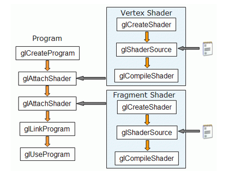
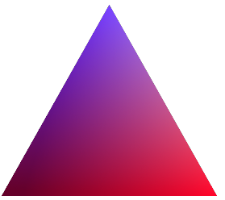
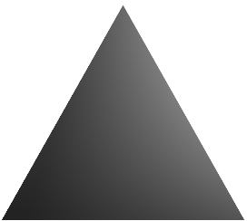
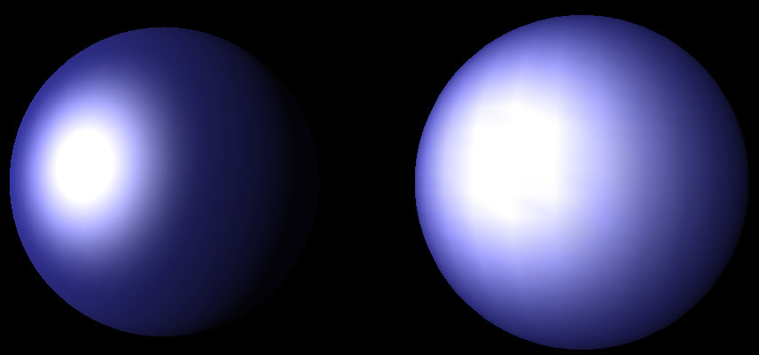
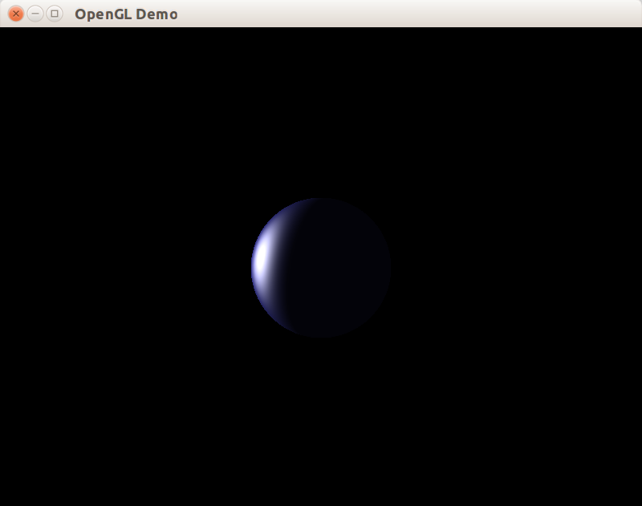

В предыдущей главе говорилось о ситуации, когда блик от фонарика или другого подобного источника света незаметен или размыт на освещаемой поверхности, состоящей из крупных граней. Сегодня мы обсудим, как исправить эту проблему. На иллюстрации к статье слева показана физически реалистичное изображение, полученное с помощью шейдеров, а справа &mdash; результат, который даст фиксированный конвейер OpenGL.

## Новая архитектура программируемого конвейера

В начале 2000-х в OpenGL 2.x и в DirectX появились языки написания шейдеров, позволяющие гибко запрограммировать весь конвейер растеризации графики. Эта возможность совершила революцию как в разработке игр, так и в научных, медицинских и других применениях трёхмерной визуализации.

Шейдер &mdash; целостный кусок кода, предназначенный для выполнения видеодрайвером на специализированных процессорах видеокарты. Написание шейдеров на языке GLSL, созданном специально для OpenGL, сначала стало доступным в виде расширения [GL_ARB_shader_objects](https://www.opengl.org/registry/specs/ARB/shader_objects.txt), а затем вошло в стандарт OpenGL 2.0.

В первом варианте программирования графического оборудования были доступны два типа шейдеров:

- Вершинные шейдеры, которые принимают на вход атрибуты вершин некоторых примитивов, и вычисляют новые значения тех же самых или других атрибутов вершин. Вершинный шейдер работает над каждой вершиной независимо от других вершин и от примитива, к которому он относится
- Фрагментные шейдеры, которые принимают на вход данные, которые когда-то были возвращены вершинным шейдером, а потом прошли дополнительные преобразования (интерполяцию между вершинами примитива по всему примитиву). Задача фрагментного шейдера &mdash; вычислить цвет фрагмента примитива (обычно треугольника) на основе ряда величин, характерных именно для этого фрагмента; каждый фрагмент обрабатывается фрагментным шейдером независимо от других фрагментов того же примитива

## Компиляция шейдеров

Программист пишет шейдеры на GLSL и оставляет их виде исходного кода; компиляцией шейдера в ассемблер процессора видеокарты будет заниматься видеодрайвер. В процессе сборки графической программы исходный код шейдеров передаётся из памяти программы компилятору в составе видеодрайвера, там собирается и превращается в ресурс типа `unsigned`, представляющий программу на стороне видеокарты:


Для управления процессом компиляции существует целый набор функций в API OpenGL. На схеме ниже показана последовательность вызова функций-команд OpenGL без учёта обработки ошибок:



## Класс CShaderProgram

Шейдерная программа &mdash; это ресурс на стороне видеодрайвера, время жизни которого следует контроллировать. Для удобства заведём класс CShaderProgram, отвечающий за время жизни графической программы. Прежде всего, объявим enum для типов шейдеров:

```cpp
enum class ShaderType
{
    Vertex,
    Fragment, // лишняя запятая помогает избегать конфликтов в Git
};
```

Класс должен иметь средства для компиляции шейдеров, линковки и валидации программы. Также должна быть возможность привязать программу к состоянию OpenGL, реализуемая вызовом [glUseProgram](https://www.opengl.org/sdk/docs/man/html/glUseProgram.xhtml). Эту возможность мы обеспечим методом `Use`. В отличии от ранее рассмотренного CTexture2D, у программы не будет метода отвязки от контекста по ряду причин:

- в OpenGL ES, WebGL и в OpenGL 3.0 и выше с Core Profile фиксированный конвейер OpenGL отсутствует, и для рисования чего-либо программист должен обязательно использовать шейдеры; таким образом, отвязка программы от контекста в таких режимах просто лишена смысла
- у класса CShaderProgram есть специальный конструктор, принимающий пустую структуру fixed_pipeline_t и формируюший в этом случае псевдо-программу фиксированного конвейера OpenGL (программа с индексом 0). Это избавляет от необходимости иметь метод для отвязки программы от контекста &mdash; мы можем просто привязать к контексту псевдо-программу с индексом 0

```cpp
class CShaderProgram : private boost::noncopyable
{
public:
    // Используется как тег для псевдо-программы,
    // переключающей на Fixed Pipeline.
    struct fixed_pipeline_t {};

    CShaderProgram();
    CShaderProgram(fixed_pipeline_t);
    ~CShaderProgram();

    void CompileShader(const std::string &source, ShaderType type)const;
    void Link()const;

    // Валидация - необязательный этап, который может сообщить
    // о проблемах производительности или предупреждениях компилятора GLSL
    boost::optional<std::string> Validate()const;

    void Use()const;

private:
    void FreeShaders();

    unsigned m_programId = 0;
    std::vector<unsigned> m_shaders;
};
```

Реализация конструкторов и метода `Use` достаточно проста:

```cpp
CShaderProgram::CShaderProgram()
    : m_programId(glCreateProgram())
{
}

// "0" означает "использовать фиксированный конвейер",
// функция glCreateProgram никогда не вернёт 0
CShaderProgram::CShaderProgram(fixed_pipeline_t)
    : m_programId(0)
{
}

CShaderProgram::~CShaderProgram()
{
    FreeShaders();
    glDeleteProgram(m_programId);
}

void CShaderProgram::Use() const
{
    glUseProgram(m_programId);
}
```

## Реализация сборки программы в CShaderProgram

Для надёжности и удобства заведём класс CShaderRaii, который выделяет и хранит ресурс-шейдер. Здесь мы не можем комфортно использовать специализацию unique_ptr, потому что ресурсы OpenGL представлены типом `unsigned`, который не является типом-указателем.

```cpp
class CShaderRaii : private boost::noncopyable
{
public:
    CShaderRaii(ShaderType shaderType)
    {
        m_id = glCreateShader(MapShaderType(shaderType));
    }

    ~CShaderRaii()
    {
        glDeleteShader(m_id);
    }

    operator GLuint()const
    {
        return m_id;
    }

    GLuint Release()
    {
        const GLuint id = m_id;
        m_id = 0;
        return id;
    }

private:
    GLenum MapShaderType(ShaderType shaderType)const
    {
        switch (shaderType)
        {
        case ShaderType::Vertex:
            return GL_VERTEX_SHADER;
        case ShaderType::Fragment:
            return GL_FRAGMENT_SHADER;
        }
        throw std::logic_error("Unknown shader type");
    }

    GLuint m_id;
};
```

Теперь можно представить реализации методов `CompileShader`, `Link` и `Validate`. Все они проверяют ошибку на своём шаге сборки и используют две дополнительные функции:

- функцию `GetInfoLog` для получения логов ошибки от компилятора GLSL на стороне видеодрайвера
- приватный метод `FreeShaders`, который после успешной компоновки программы освобождает память, занятую исходным кодом и ненужным объектным кодом шейдеров

```cpp
// Чтобы не делать различий между Shader/Program,
// передаём указатели на функции OpenGL.
std::string GetInfoLog(GLuint shaderId,
                       PFNGLGETSHADERIVPROC getShaderivProc,
                       PFNGLGETSHADERINFOLOGPROC getShaderInfoLogProc)
{
    GLsizei infoLogLength = 0;
    getShaderivProc(shaderId, GL_INFO_LOG_LENGTH, &infoLogLength);

    std::string infoLog(size_t(infoLogLength), '\0');
    getShaderInfoLogProc(shaderId, infoLogLength, &infoLogLength, &infoLog[0]);

    // Обрезаем лог до его реальной длины.
    if (size_t(infoLogLength) < infoLog.length())
    {
        infoLog.erase(infoLog.begin() + ptrdiff_t(infoLogLength), infoLog.end());
    }

    return infoLog;
}

void CShaderProgram::CompileShader(const std::string &source, ShaderType type)const
{
    const char *pSourceLines[] = { source.c_str() };
    const GLint pSourceLengths[] = { GLint(source.size()) };

    CShaderRaii shader(type);
    glShaderSource(shader, 1, pSourceLines, pSourceLengths);
    glCompileShader(shader);

    GLint compileStatus = 0;
    glGetShaderiv(shader, GL_COMPILE_STATUS, &compileStatus);
    if (compileStatus == GL_FALSE)
    {
        const auto log = GetInfoLog(shader, glGetShaderiv, glGetShaderInfoLog);
        throw std::runtime_error("Shader compiling failed: " + log);
    }

    m_shaders.emplace_back(shader.Release());
    glAttachShader(m_programId, m_shaders.back());
}

void CShaderProgram::Link()const
{
    glLinkProgram(m_programId);
    GLint linkStatus = 0;
    glGetProgramiv(m_programId, GL_LINK_STATUS, &linkStatus);
    if (linkStatus == GL_FALSE)
    {
        const auto log = GetInfoLog(m_programId, glGetProgramiv, glGetProgramInfoLog);
        throw std::runtime_error("Program linking failed: " + log);
    }
    // Выполняем detach и delete после полного формирования программы
    // http://gamedev.stackexchange.com/questions/47910
    FreeShaders();
}

boost::optional<std::string> CShaderProgram::Validate()const
{
    glValidateProgram(m_programId);
    GLint status = 0;
    glGetProgramiv(m_programId, GL_VALIDATE_STATUS, &status);
    if (status == GL_FALSE)
    {
        const auto log = GetInfoLog(m_programId, glGetProgramiv, glGetProgramInfoLog);
        return log;
    }
    return boost::none;
}

void CShaderProgram::FreeShaders()
{
    for (unsigned shaderId : m_shaders)
    {
        glDetachShader(m_programId, shaderId);
        glDeleteShader(shaderId);
    }
    m_shaders.clear();
}
```

## Вершинный шейдер

Все шейдеры в OpenGL пишутся на одном языке &mdash; GLSL. Язык GLSL:

- не имеет разделения на модули и заголовочные файлы
- не имеет указателей и средств прямой работы с памятью
- не имеет средств для работы со строками
- не может использовать API операционной системы или внешние библиотеки
- в остальном очень сильно похож на C/C++

Сразу перейдём к делу и покажем исходный код вершинного шейдера:

```glsl
varying vec3 n;
varying vec3 v;

void main(void)
{
    v = vec3(gl_ModelViewMatrix * gl_Vertex);
    n = normalize(gl_NormalMatrix * gl_Normal);
    gl_Position = ftransform();
}
```

Теперь разберём, что он делает:

- функция main описывает основную процедуру шейдера, которая будет применяться к каждой вершине каждого примитива, который был выведен во время активности программы (т.е. после вызова `glUseProgram` и до переключения на другую программу)
- переменные со спецификатором `varying` &mdash; это мост между вершинным и фрагментным шейдером. Объявления varying переменных в вершинном и фрагментном шейдерах должны совпадать в пределах одной программы. Данные, которые вершинный шейдер кладёт в varying-переменные, фрагментный шейдер обязан обработать
- тип данных `vec3` почти эквивалентен типу `glm::vec3` (это не удивительно, ведь библиотека GLM создавалась по образу и подобию языка GLSL)
- переменные с префиксом `gl_` объявлены видеодрайвером; набор таких предопределённых переменных описан в стандарте GLSL и может сильно отличаться в Core Profile и Compatibility Profile
- наш шейдер не будет работать в Core Profile, на мобильных устройствах и на WebGL, т.к. он использует устаревшие в OpenGL 3.2 функцию `ftransform`, переменные gl_ModelViewMatrix, gl_NormalMatrix и переменную-атрибут gl_Normal

## Связь вершинного и фрагментного шейдеров

Точно так же как и вершинный, фрагментный шейдер должен содержать функцию main. Задача функции в этом шейдере &mdash; вычислить абсолютный цвет фрагмента и записать его переменную `gl_FragColor`. Для вычислений доступен ряд неявных переменных, описывающих состояние OpenGL, а также все varying-переменные, значения которых определены вершинным шейдером и затем интерполированы.

Интерполяция заслуживает отдельного рассмотрения. Для начала представьте, что вы с помощью функции `glColorPointer` указали начало массива цветов для каждой вершины, и затем вывели какое-то число вершин. Вершинный шейдер просто взял цвет вершины и скопировал его в выходную varying-переменную. Перед передачей значения цвета фрагментному шейдеру сначала будет совершена интерполяция атрибута по всему треугольнику, а затем произойдёт разбиение треугольника на фрагменты (подпиксели). Каждый фрагмент будет иметь собственное значение цветового атрибута для фрагментного шейдера:



Такая интерполяция будет происходить с любой скалярной или векторной varying-переменной (для векторных величин интерполяция проводится покомпонентно). Для цвета, для позиции в пространстве, для нормали к поверхности и других общепринятых атрибутов это проблем не создаёт. Совсем другое дело, когда кто-то пытается проинтерполировать освещённость.

Давайте смоделируем интерполяцию освещённости по треугольнику по модели Гуро (той самой, что используется в фиксированном конвейере OpenGL без шейдеров). Допустим, что на трёхмерной сцене присутствует один треугольник и один источник света, подобный фонарику, направленный в центр треугольника. В этом случае вершинный шейдер должен вычислить результат уровень освещённости в вершине и записать конечный цвет в varying-переменную. После эта переменная будет проинтерполирована по всему треугольнику и даст следующую карту освещённости:



Но, постойте, а где же световой блик? Где пятно, которое фонарик, согласно физическим законам, должен оставить в центре треугольника? Интерполяция освещённости вершин по всему треугольнику уничтожит этот блик. Именно эта проблема проявляет себя на правой сфере на рисунке:

)

Решение проблемы очень простое: мы не вычисляем уровень освещённости в вершинном шейдере, оставляя эту задачу фрагментному шейдеру.

## Фрагментный шейдер модели Ламберта

В первую очередь мы реализуем внутри фрагментного шейдера более простую модель Ламберта. В модели Ламберта (также известной как Lambert's cosine law) имеют значение две составляющие:

- фоновая компонента (ambient), которая для одной поверхности обычно постоянна, если только не применяется режим color material
- рассеянная компонента (diffuse), которая меняется в зависимости от угла падения лучей света на поверхность по закону косинуса


При программировании модели Ламберта появляется нюанс: если в конкретной точке угол между нормалью к поверхности и направлением на источник света превышает 90°, это означает, что источник света закрыт другими участками поверхности. Чтобы не учитывать рассеянный свет в такой ситуации, мы воспользуемся функцией `max(a, b)`.

Также мы применим:

- свойство `gl_FrontLightProduct[i].ambient`, хранящее результат покомпонентного умножения фоновой компоненты материала на фоновую компоненту i-го источника света
- свойство `gl_FrontLightProduct[i].diffuse`, хранящее результат покомпонентного умножения рассеянной компоненты материала на рассеянную компоненту i-го источника света
- функцию `clamp(value, min, max)`, которая приводит значение `value` к отрезку `[min, max]`; это позволяет гарантировать, что интенсивность света не превысит 1 и не будет меньше 0 (оба случая физически нереалистичны)

```glsl
varying vec3 n;
varying vec3 v;

void main(void)
{
    vec4 result = vec4(0.0);
    for (int li = 0; li < gl_MaxLights; ++li)
    {
        vec3 lightDirection;
        if (gl_LightSource[li].position.w != 0.0)
        {
            // позиционный источник света
            lightDirection = normalize(gl_LightSource[li].position.xyz - v);
        }
        else
        {
            // направленный источник света
            lightDirection = normalize(gl_LightSource[li].position.xyz);
        }

        vec4 Iamb = gl_FrontLightProduct[li].ambient;

        float diffuseAngle = max(dot(n, lightDirection), 0.0);
        vec4 Idiff = gl_FrontLightProduct[li].diffuse * diffuseAngle;
        Idiff = clamp(Idiff, 0.0, 1.0);

        result += Iamb + Idiff;
    }

    gl_FragColor = gl_FrontLightModelProduct.sceneColor + result;
}
```

## Фрагметный шейдер модели Фонга

Модель освещения Фонга (также известная как Phong Model) является расширением модели Ламберта. Она добавляет бликовую (specular) компоненту освещения. Бликовая компонента похожа на рассеянную, но угол между углом падения и углом отражения для specular возводится в степень, равную shininess. Коэфициент shininess может быть задан для материала путём установки параметра GL_SHININESS.


Добавим к нашему шейдеру вычисление переменной `Ispec`. Для этого нам понадобится функция `pow(value, degree)`, возводящая `value` в степень `degree`. Также мы применим:

- свойство `gl_FrontLightProduct[i].specular`, хранящее результат покомпонентного умножения бликовой компоненты материала на бликовую компоненту i-го источника света
- свойство `gl_FrontMaterial.shininess`, хранящее коэффициент GL_SHININESS, установленный для материала

```glsl
varying vec3 n;
varying vec3 v;

void main(void)
{
    vec4 result = vec4(0.0);
    for (int li = 0; li < gl_MaxLights; ++li)
    {
        vec3 lightDirection;
        if (gl_LightSource[li].position.w != 0.0)
        {
            // позиционный источник света
            lightDirection = normalize(gl_LightSource[li].position.xyz - v);
        }
        else
        {
            // направленный источник света
            lightDirection = normalize(gl_LightSource[li].position.xyz);
        }
        vec3 viewDirection = normalize(-v);
        vec3 reflectDirection = normalize(-reflect(lightDirection, n));

        vec4 Iamb = gl_FrontLightProduct[li].ambient;

        float diffuseAngle = max(dot(n, lightDirection), 0.0);
        vec4 Idiff = gl_FrontLightProduct[li].diffuse * diffuseAngle;
        Idiff = clamp(Idiff, 0.0, 1.0);

        float specularAngle = max(dot(reflectDirection, viewDirection), 0.0);
        vec4 Ispec = gl_FrontLightProduct[li].specular
                    * pow(specularAngle, gl_FrontMaterial.shininess / 4.0);
        Ispec = clamp(Ispec, 0.0, 1.0);

        result += Iamb + Idiff + Ispec;
    }

    gl_FragColor = gl_FrontLightModelProduct.sceneColor + result;
}
```

## Ветвления и циклы в GLSL

Ветвления и циклы, столь привычные для программирования центрального процессора, в языке GLSL немного не в почёте. Дело в том, что вершинный шейдер применяется *к каждой вершине*, а фрагментный шейдер &mdash; *к каждому фрагменту каждого примитива*, и если мы используем `for (i : [0...10])`, мы автоматически умножаем и без того немалые затраты в 10 раз. Однако, это ещё не самые большие затраты.

Настоящей проблемой становится инструкция `if`. Современные видеокарты работают быстро за счёт огромного количества вычислительных ядер (свыше 1000 ядер в видеокартах NVIDIA), а также за счёт SIMD-параллелизма в пределах одного ядра. SIMD означает "single instruction, multiple data", то есть одну и ту же операцию сложения ядро графического процессора может одновременно применить к десяткам векторов, относящихся к разным вершинам или фрагментам. Кроме того, даже разные ядра зачастую работают синхронно, поскольку просчёт собственного алгоритма действия для каждого ядра был бы слишком дорогим.

Инструкция `if` нарушает как SIMD-параллелизм, так и синхронную работу разных ядер. Иначе говоря, чем лучше устроена видеокарта, тем больше могут быть потери производительности из-за ветвления. Давайте посмотрим, не можем ли мы избавиться от if?

```glsl
// Нежелательный способ: ветвление нарушает SIMD-параллелизм
vec3 lightDirection;
if (gl_LightSource[li].position.w != 0.0)
{
    // позиционный источник света
    lightDirection = normalize(gl_LightSource[li].position.xyz - v);
}
else
{
    // направленный источник света
    lightDirection = normalize(gl_LightSource[li].position.xyz);
}
```

Здесь мы делаем ветвление, потому что в направленном источнике света `position` хранит вектор направления, а в позиционном &mdash; позицию источника света; мы же хотим получить направление для любого источника. Заметим, что ветвления можно избежать за счёт свойств арифметических операций над действительными числами. Давайте предположим, что мы умножили `v` на компоненту `position.w` (которая равна 0 для направленного источника и 1 для позиционного). Тогда получается, что для направленного источника произведение обращается в 0, а для позиционного остаётся неизменным. Воспользуемся этим:

```glsl
// Улучшенная версия использует умножение v на 0 или 1
vec3 delta = gl_LightSource[li].position.w * v;
vec3 lightDirection = normalize(gl_LightSource[li].position.xyz - delta);
```

## Изменения в исходном коде примера

В третьем наборе примеров архитектура немного изменилась:

- выделена библиотека `libchapter3`, куда попали классы `CWindow`, `CCamera`, `CTexture2D`, `CShaderProgram`
- пользовательский класс теперь не расширяет класс `CAbstractWindow`, а всего лишь хранит ссылку на него и расширяет класс `CAbstractWindowClient`; в момент работы конструктора `CWindowClient` контекст OpenGL уже проинициализирован:

#### Листинг main.cpp

```cpp
#include "stdafx.h"
#include "WindowClient.h"
#include <SDL2/SDL.h>

int main(int, char *[])
{
    try
    {
        CWindow window;
        window.Show("OpenGL Demo", {800, 600});
        CWindowClient client(window);
        window.DoMainLoop();
    }
    catch (const std::exception &ex)
    {
        const char *title = "Fatal Error";
        const char *message = ex.what();
        SDL_ShowSimpleMessageBox(SDL_MESSAGEBOX_ERROR, title, message, nullptr);
    }

    return 0;
}
```

- в классе CWindow добавлена проверка наличия версии OpenGL 3.2. Если эта версия недоступна, изучите статью ["Как получить OpenGL 3.2"](/opengl/opengl_3_2.html). Следующий фрагмент кода проверяет версию:

```cpp
void CheckOpenglVersion()
{
    if (!GLEW_VERSION_3_2)
    {
        throw std::runtime_error("Sorry, but OpenGL 3.2 is not available");
    }
}
```

## Результат

В примере реализовано три типа освещения. Переключиться между ними можно по клавише "Пробел". Управлавление камерой выполняется клавишами "WASD" или клавишами-стрелками.



- по умолчанию включено попиксельное освещение по модели Фонга с помощью шейдеров
- вторым включается попиксельное освещение по модели Ламберта с помощью шейдеров
- третьим включается фиксированный конвейер с освещением по модели Блинна-Фонга (модификация модели Фонга) и интерполяцией по Гуро
