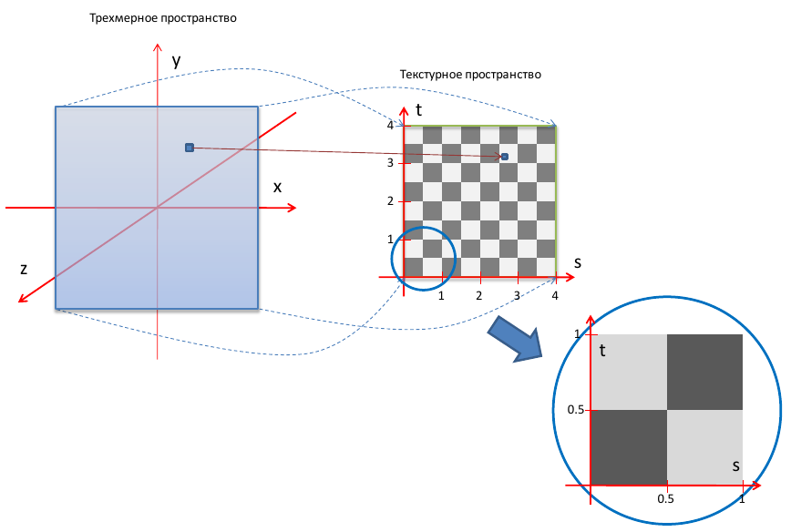
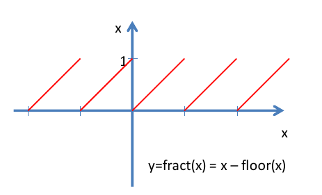
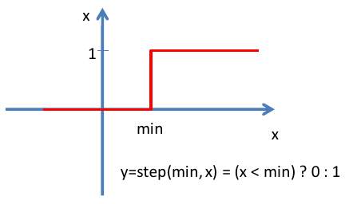
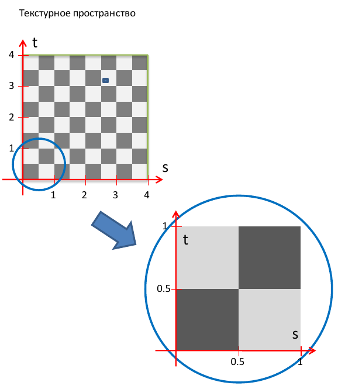
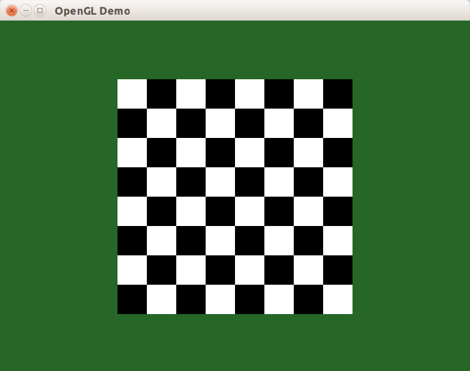
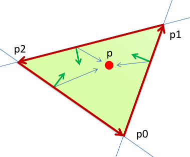
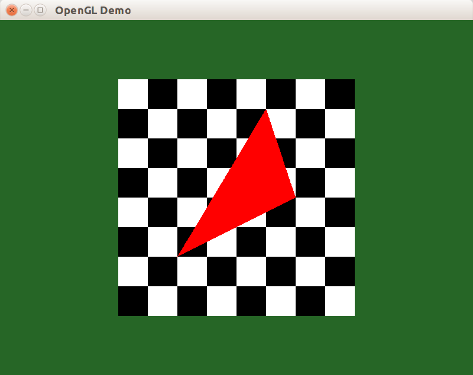

Фрагментные шейдеры позволяют заменить часть стандартного функционала обработки фрагментов собственным. Проиллюстрируем это на примере приложения, рисующего шахматную доску при помощи фрагментного шейдера.

## Подготовка холста

Прежде всего, подготовим окно с ортографической матрицей проецирования и без камеры. Окно будет отображать один квадрат с помощью класса CQuad:

#### Файл Quad.h

```cpp
#pragma once
#include <glm/vec2.hpp>
#include <vector>

// Вершина с двумерной позицией и 2D координатами текстуры.
struct SVertexP2T2
{
    glm::vec2 position;
    glm::vec2 texCoord;
};

class CQuad
{
public:
    CQuad(const glm::vec2 &leftTop, const glm::vec2 &size);

    void Draw()const;

private:
    std::vector<SVertexP2T2> m_vertices;
    std::vector<uint8_t> m_indicies;
};
```

#### Файл Quad.cpp

```cpp
#include "libchapter3.h"
#include "Quad.h"

// Шахматная доска 8x8, размер ячейки равен 0.5.
static const float MAX_TEX_COORD = 4.f;

namespace
{
/// Привязывает вершины к состоянию OpenGL,
/// затем вызывает 'callback'.
template <class T>
void DoWithBindedArrays(const std::vector<SVertexP2T2> &vertices, T && callback)
{
    // Включаем режим vertex array и normal array.
    glEnableClientState(GL_TEXTURE_COORD_ARRAY);
    glEnableClientState(GL_VERTEX_ARRAY);

    // Выполняем привязку vertex array и normal array
    const size_t stride = sizeof(SVertexP2T2);
    glVertexPointer(2, GL_FLOAT, stride, glm::value_ptr(vertices[0].position));
    glTexCoordPointer(2, GL_FLOAT, stride, glm::value_ptr(vertices[0].texCoord));

    // Выполняем внешнюю функцию.
    callback();

    // Выключаем режим vertex array и normal array.
    glDisableClientState(GL_TEXTURE_COORD_ARRAY);
    glDisableClientState(GL_VERTEX_ARRAY);
}
}

CQuad::CQuad(const glm::vec2 &leftTop, const glm::vec2 &size)
{
    SVertexP2T2 vLeftTop = { leftTop,
                             glm::vec2{0, 0} };
    SVertexP2T2 vRightTop = { leftTop + glm::vec2{ size.x, 0.f },
                              glm::vec2{MAX_TEX_COORD, 0} };
    SVertexP2T2 vLeftBottom = { leftTop + glm::vec2{ 0.f, size.y },
                                glm::vec2{0, MAX_TEX_COORD} };
    SVertexP2T2 vRightBottom = { leftTop + glm::vec2{ size.x, size.y },
                                 glm::vec2{MAX_TEX_COORD, MAX_TEX_COORD} };

    m_vertices = { vLeftTop, vRightTop, vLeftBottom, vRightBottom };
    m_indicies = { 0, 1, 2, 1, 3, 2 };
}

void CQuad::Draw() const
{
    DoWithBindedArrays(m_vertices, [this] {
        glDrawElements(GL_TRIANGLES, GLsizei(m_indicies.size()),
                       GL_UNSIGNED_BYTE, m_indicies.data());
    });
}
```

Настройка экземпляра CQuad, цвета фона и матрицы проецирования будут выглядеть так:

```cpp

const glm::vec2 QUAD_TOPLEFT = { -200, -200 };
const glm::vec2 QUAD_SIZE = { 400, 400 };

CWindowClient::CWindowClient(CWindow &window)
    : CAbstractWindowClient(window)
    , m_quadObj(QUAD_TOPLEFT, QUAD_SIZE)
{
    const glm::vec4 GREEN = { 0.15f, 0.4f, 0.15f, 1.f };
    GetWindow().SetBackgroundColor(GREEN);
    SetupOpenGLState();
    // инициализация шейдеров
}

void CWindowClient::SetupView(const glm::ivec2 &size)
{
    // Матрица ортографического проецирования изображения в трёхмерном пространстве
    // из параллелипипеда с размером, равным (size.X x size.Y x 2).
    const float halfWidth = float(size.x) * 0.5f;
    const float halfHeight = float(size.y) * 0.5f;
    const glm::mat4 matrix = glm::ortho<float>(-halfWidth, halfWidth, -halfHeight, halfHeight);
    glViewport(0, 0, size.x, size.y);
    glMatrixMode(GL_PROJECTION);
    glLoadMatrixf(glm::value_ptr(matrix));
    glMatrixMode(GL_MODELVIEW);
}
```

В результате получаем тёмно-зелёный фон с белым квадратом, состоящим из двух треугольников. Квадрат и будет холстом, на котором мы будем рисовать шахматную доску.


## Принцип работы шейдера шахматной доски

Для построения изображения шахматной доски мы должны нарисовать квадрат, предварительно
включив в состав графического конвейера программу, содержащую фрагментный шейдер,
вычисляющий цвет фрагмента шахматной доски.



Для каждой вершины квадрата нами будут заданы не только их координаты, но еще и текстурные координаты вершины. Текстурные координаты зададим таким образом, чтобы в квадрате размером 1x1 содержался блок 2x2 клетки (две черные и две белые). В процессе обработки фрагментов, OpenGL будет вызывать фрагментный шейдер для вычисления цвета фрагмента.

Шейдер на основе текстурных координат текущего фрагмента (а точнее, дробной части координат s и t) должен определить, черная или белая клетка шахматной доски находится по указанным координатам. Отметим, что вычисление цвета фрагмента будет вычисляться при помощи шейдера, без какого-либо использования текстур - текстурные координаты будут использованы шейдером лишь для определения координат фрагмента на шахматной поверхности.

## Вершинный шейдер

Вершинный шейдер выполняет стандартную трансформацию координат вершины, а также копирует значение атрибутивной переменной gl_MultiTexCoord0, хранящей текстурные координаты вершины для текстурного блока No0, во встроенную varying-переменную gl_TexCoord[0]. Исходный код шейдера будет находиться в файле checker.vsh.

```glsl
void main()
{
    // Transform the vertex:
    // gl_Position = gl_ModelViewProjectionMatrix * gl_Vertex
    gl_Position = ftransform();
    // Copy texture coordinates from gl_MultiTexCoord0 vertex attribute
    // to gl_TexCoord[0] varying variable
    gl_TexCoord[0] = gl_MultiTexCoord0;
}
```

## Фрагментный шейдер

Сначала при помощи функции fract получим двухмерный вектор, содержащий дробные части вектора текстурных координат. Рисунок шахматной доски повторяется с периодом, равным 1, поэтому целую часть можно смело отбросить.



Далее при помощи встроенной функции step мы определяем, в какой половине клетки находятся x и y компоненты дробной части текстурных координат.



Если x и y обе координаты x и y больше 0.5, либо меньше 0.5, то считаем, что фрагмент находится внутри черной клетки, иначе – внутри белой.



Исходный код фрагментного шейдера представлен ниже:

```glsl
void main()
{
    // determine whether fraction part of x and y
    // texture coordinate is greater than 0.5
    vec2 stepXY = step(vec2(0.5, 0.5), fract(gl_TexCoord[0].xy));
    // determine whether the texture coordinate
    // is within a black or white check
    gl_FragColor = vec4((stepXY.x != stepXY.y) ? 1.0 : 0.0);
}
```
Хочется подчеркнуть необходимость использования английского языка в комментариях в шейдерных программах. Дело в том, что некоторые реализации компилятора GLSL (в частности, от ATI) ошибочно воспринимают символ с кодом 255, соответствующий русское букве «я» в кодировке Windows-1251, как символ конца файла, в то время как в Спецификации языка GLSL сказано: «There is no end-of-file character» (Специального символа, задающего конец файла нет).

После включения шейдеры мы получим изображение шахматной доски на двух треугольниках, составляющих квадрат:



## Рисуем треугольник во фрагментном шейдере

Доработаем фрагментный шейдер таким образом, чтобы нарисовать на его поверхности
треугольник.

Для рисования треугольника нам необходимо определить, находится ли текущий фрагмент внутри заданного треугольника. Это проще всего сделать, если задать вершины треугольника против часовой стрелки. В таком случае точка будет находиться внутри треугольника, если она находится слева относительно каждой его стороны. Чтобы определить, с какой стороны от отрезка находится данная точка нужно вычислить знак скалярного произведения между *перп-вектором* отрезка прямой и вектором, соединяющим любую точку отрезка с данной точкой.

Перп-вектор – вектор на двухмерной плоскости, полученный путем поворота исходного вектора на 90 градусов против часовой стрелки. Если исходный вектор имеет координаты (x, y), то соответствующий ему перп-вектор будет иметь координаты (-y, x).



Теперь можно составить функцию, которая определяет, находится ли точка слева от отрезка:

```glsl
// Check if the point p is on the left side of the line p0p1
bool PointIsOnTheLeft(vec2 p0, vec2 p1, vec2 p)
{
    vec2 p0p1 = p1 - p0;
    // find the orthogonal vector to p0p1
    vec2 n = vec2(-p0p1.y, p0p1.x);
    // Find the dot product between n and (p - p0)
    return dot(p - p0, n) > 0.0;
}
```

На основе данной функции напишем функцию, определяющую нахождение точки внутри треугольника p0, p1, p2.

```glsl
bool PointIsInsideTriangle(vec2 p0, vec2 p1, vec2 p2, vec2 p)
{
    return PointIsOnTheLeft(p0, p1, p) &&
           PointIsOnTheLeft(p1, p2, p) &&
           PointIsOnTheLeft(p2, p0, p);
}
```

Доработаем фрагментный шейдер таким образом, чтобы нарисовать красный треугольник над шахматной доской. Для этого мы должны окрасить фрагмент в красный цвет, если он находится внутри треугольника (1; 1) - (3; 2) - (2.5; 3.5), и в цвет шахматной доски, если он находится снаружи.

```glsl
void main()
{
    vec2 pos = gl_TexCoord[0].xy;
    const vec2 p0 = vec2(1.0, 1.0);
    const vec2 p1 = vec2(3.0, 2.0);
    const vec2 p2 = vec2(2.5, 3.5);
    if (PointIsInsideTriangle(p0, p1, p2, pos))
    {
        gl_FragColor = vec4(1.0, 0.0, 0.0, 1.0);
    }
    else
    {
        // determine whether fraction part of x and y
        // texture coordinate is greater than 0.5
        vec2 stepXY = step(vec2(0.5, 0.5), fract(pos));
        // determine whether the texture coordinate
        // is within a black or white check
        gl_FragColor = vec4((stepXY.x != stepXY.y) ? 1.0 : 0.0);
    }
}
```

В результате, из двух треугольников мы получили целую сцену с шахматной доской и красным треугольником:



> Конечно, с точки зрения производительности гораздо быстрее нарисовать треугольник без помощи шейдеров, используя отдельные примитивы OpenGL. Здесь просто иллюстрируется принцип формирования изображения в шейдере – шейдер задает функцию вычисления цвета и других свойств фрагмента на основе входных данных (uniform и varying переменных).
